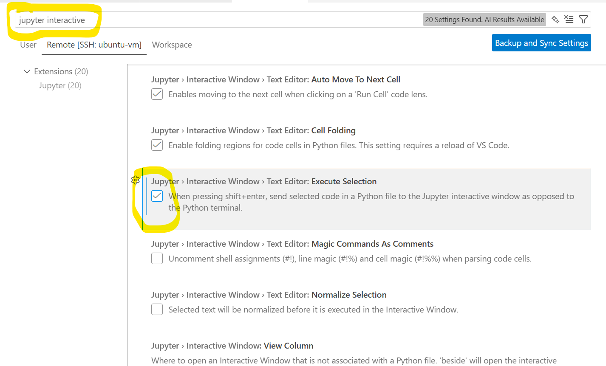

  
This repo contains tutorials, code, documentation that drives my opensearch INTERMEDIATE level course content. Throughout the course: `OS=opensearch` & `ES=elasticsearch`

# 👨‍💼 ABOUT ME
## 🎯 About Your Instructor

**Pradeep** brings **23+ years** of experience architecting and scaling high-performing teams across the globe—from Fortune 500 enterprises to innovative startups.

### 💼 Professional Background
- 🏢 Led enterprise digital transformations in **Data Engineering**, **AI/ML**, and **Modern Application Stacks**
- 🌍 Scaled international teams with laser focus on **external customer success**
- 🔍 Deep expertise in search technologies, distributed systems, and cloud infrastructure

### 📚 Teaching Philosophy
*Pradeep believes that **teaching is the best form of learning**.* This course reflects that philosophy—content designed not just to transfer knowledge, but to build genuine understanding. You'll benefit from real-world patterns, hard-earned lessons, and a practical approach to OpenSearch that comes from hands-on enterprise experience.

# 🎓 UDEMY
The previous course (BASIC level) is published [here](https://www.udemy.com/course/ai-ml-search-with-opensearch/)

# 📋 PREREQUISITES FOR THE COURSE
- ✅ **Prequel Course**: [BASIC level course](https://www.udemy.com/course/ai-ml-search-with-opensearch/) (recommended but not mandatory)
- 👤 **You should have**: 
  - 🔥 Eagerness to learn traditional vs. AI/ML-driven search
  - 🐧 Linux basics (`ls`, `rm`, `cd`)
  - 🐳 Docker/container fundamentals
  - 🐍 Basic Python coding
  - 🔌 Server/client architecture knowledge
- 💻 **Machine Resources**: See below

## 📊 Course Topics Overview

<sub>

| 🔍 TRADITIONAL_SEARCH | 📥 INGEST_AND_SEARCH_CONCEPTS | 🤖 AI_SEARCH | 🧠 AGENTIC_SEARCH | 🚀 REALTIME_PROJECTS |
|-------------------|---------------------------|-----------|----------------|------------------|
| 📚 Core Concepts (Tokenization, Normalization, Stop Words, Synonyms) | 🔀 Ingest Pipelines (Processors, Transformations, Configuration, Use Cases) | 🧠 Semantic Search (Dense Embeddings, Vector Similarity, Use Cases, Setup) | 📊 Vector Embeddings (Embedding Models, Text Embedding, Sparse Encoding, Cross-Encoders, Integration) | 🔍 Project 1: Search As You Type (Frontend, Backend, Communication, Features, Use Cases) |
| 🗂️ Analyzers (Standard, Simple, Whitespace, Custom) | 🔍 Search Pipelines (Query Processing, Result Processing, Aggregation) | 🎯 Hybrid Search (Score Combination, Fusion Methods, Advantages, Implementation) | 🔧 Custom Models (Model Building, Packaging, Integration, Use Cases) | 📊 Project 2: Performance (Benchmarking, Metrics, Analysis, Insights) |
| 📝 Index Configuration (Field Mappings, Analysis Chains, Inverted Index) | 📚 Bulk Ingestion (High Volume, Batch API, Memory Management, Performance) | ⚡ Neural Sparse (Sparse Vectors, SPLADE Model, Benefits, Learning) | 🌐 External LLMs (Providers, Configuration, Optimization, Connectors) | 🌍 Project 3: Geo-spatial (Features, Capabilities, Implementation, Use Cases) |
| 🔎 Query Types (Match, Phrase, Wildcard, Multi-Match, Range) | 🧮 Vector Basics (Vector Space, Similarity Metrics, KNN Algorithms, Vector Search) | 🚀 Specialized Techniques (Advanced Indexing, Quantization, Optimization, Scaling) | 🧠 Agent Systems (Agent Architecture, Tool Definition, Memory Management, Multi-step Reasoning) | 💼 Project 4: BI Agent Basic (Features, Database Support, Workflow, Learning) |
| ✨ Advanced Features (Edge N-Grams, Regular N-Grams, Shingles) | 🤖 Embeddings & ML (Embedding Models, ML Pipeline, Integration) | 🔄 Architecture Pattern (Input Processing, Storage Layer, Search Methods, Ranking, Results) | 📈 Result Reranking (Cross-Encoders, Reranking Pipeline, Performance, Use Cases) | 🎯 Project 5: Agentic App (Enhancements, Architecture, Features, Capability) |
| 🚀 Performance (Optimization, Refresh Rate, Caching) | ⚡ Streaming Data (Data Prepper, Real-time Processing, Use Cases) | 📊 Comparison Matrix (Dense vs BM25 vs Hybrid vs Neural Sparse) | 🔍 RAG Flows (Basic RAG, Conversational, Multi-KB, Hybrid, Advanced Features) | 💭 Project 6: With Memory (Memory System, Interaction, Storage, Experience) |
| 🏗️ Data Ingestion (Bulk Loading, Mapping, Document Structure) | 🚀 Production Optimization (Index Tuning, Configuration, Monitoring) | 🎓 Decision Framework (When to choose each method) | 🔀 Search Strategies (Semantic, Keyword, Hybrid, RRF) | 📚 Project 7: Long-Term Memory (LTM Storage, Knowledge Management, Integration, Capabilities) |
| 🎓 Use Cases (E-commerce, Enterprise, Directory, CMS) | 💾 Snapshots & Recovery (Backup Strategy, Restore Operations, Disaster Recovery) | 🏆 Best Practices (Model Selection, Index Config, Query Optimization, Monitoring) | 🛠️ Implementation Stack (Backend, Pipeline, Data Storage, Integration) | 🔗 Project 8: MCP Server (Protocol, Components, Integration, Ecosystem) |
| | | | 🏢 Production Patterns (Performance, Reliability, Monitoring, Deployment) | 🎓 Skill Progression (8 levels from UI to Standards) |
| | | | | 🎯 Selection Guide (For different roles) |
| | | | | 🏆 Application Domains (E-commerce, BI, Location, Enterprise) |

</sub>

[High Level Course Modules Details](./2.%20HIGH_LEVEL_MODULES.md)

# 🚀 MOTIVATION FOR THE COURSE
- 📊 ES is mature but OpenSearch is the open-source alternative gaining momentum
- 🔗 Fortune 500 companies (e.g., Oracle) migrating from ES → OS
- 💰 Cloud-native licensing: Why pay when open-source equivalents exist?
- 🔐 Own your data—reduce vendor lock-in on auth, UI, and commoditized features
- 📈 OpenSearch market disruption opportunity with minimal course competition
- 🎯 And many more (follow the course!)

# 🗂️ ORGANIZATION OF THE COURSE
- 📁 **Tutorial**: Main modules are top-level folders; sub-modules nested deeper
- 💻 **Code**: Python, shell, docker-compose files within each module
- 📊 **Data**: Subfolder **[0. DATA](./0.%20DATA/)** with downloadable datasets (NOT INCLUDED IN CODE REPOSITORY but downloadable from [here]((https://drive.google.com/drive/folders/1nRRvctDhKB_cC0DicET3XgxUHxml7clz?usp=sharing)))
- 📽️ **Presentations**: Folder **[PDFS](./PDFS/)** contains all presentation assets (NOT INCLUDED IN CODE REPOSITORY)

# 📖 PRESENTATIONS
- ✅ PDFs and markdown (over .ppt or .pptx format)
- All presentations can be downloaded from [here](https://drive.google.com/drive/folders/1nRRvctDhKB_cC0DicET3XgxUHxml7clz?usp=sharing)
- ✨ **Markdown-first approach**: All content co-located with code
  - 🎥 Watch videos + read .md files = complete learning (no context switching!)
  - 📄 Export to PDF/HTML using Markdown Preview Enhanced (while it is possible to convert markdown to .pptx, there are nuances of how rendering can get messed up)
  - 🤖 AI-friendly format—markdown is how agents exchange context
  - 🛠️ Alternatives: pandoc, marp (though marp lacks mermaid support at this point)
- **I  want instruction material outside of code**. All presentations can be downloaded from [here](https://drive.google.com/drive/folders/1nRRvctDhKB_cC0DicET3XgxUHxml7clz?usp=sharing) 
# 💾 DATA
- The file [0. DATA.zip](https://drive.google.com/drive/folders/1nRRvctDhKB_cC0DicET3XgxUHxml7clz?usp=sharing) contains all datasets required for this course and has to be exploded in `0. DATA` folder in the root of the repo (notice there is a space after 0 before DATA in the folder name)

# ⚙️ HARDWARE, TOOLS & SOFTWARE
- 🖥️ **HARDWARE**: 16GB+ RAM, 4+ CPUs, 50GB storage (bare metal or VM)
- 🔍 **OPENSEARCH**: v3.3.0
- 🐧 **SERVER OS**: Ubuntu 20.04/22.04
- 💻 **CLIENT OS**: Windows/macOS/*nix (your choice for IDE)
- 🐳 **DOCKER**: v28.4.0+ 
- 🐍 **PROGRAMMING**: Python >=3.12.11+, Shell, SQL/DQL
- 🎨 **IDE**: VS CODE 1.105.1+ with extensions, Jupyter

# 🌐 STUDENT ENVIRONMENT
Conform to this infrastructure setup:  


# ❓ WHY NOT WINDOWS SERVER
Most execution happens in Docker, so Windows works too. I recommend *nix if pressed. 💬 Email if you run into issues at  [pradeep@automationpractice.com](pradeep@automationpractice.com)

> **Note**: Your client OS can be Windows/macOS/*nix—wherever your IDE runs!

# 🔧 VS CODE EXTENSIONS
All extensions are in [vscode-extensions.txt](./vscode-extensions.txt):
- 🐧 *nix: `cat vscode-extensions.txt | xargs -n 1 code --install-extension`
- 💻 PowerShell: `Get-Content vscode-extensions.txt | ForEach-Object { code --install-extension $_ }`
- 🪟 CMD: `for /F "delims=" %i in (vscode-extensions.txt) do code --install-extension %i`
- 🔍 Or install manually one-by-one

# ⚠️ GOTCHAS
- 🔐 **Docker permission denied**: `sudo chmod 666 /var/run/docker.sock`
- 📓 **Notebook first run**: Install ipykernel when prompted 
- ▶️ **Python in interactive window**: Install Python + Jupyter extensions; enable in Settings 
- 🌐 **Markdown export to PDF**: Set Chrome path in Markdown Enhanced settings 

### HyperV ubuntu 22.04 disk expansion
- By default ubuntu vm on hyper-v shows only ~12G on / partition (even though you expand the disk from GUI)
- Follow the below steps to expand space
- Assuming you have the below layout (`df -h`)

```
sda       8:0    0    60G  0 disk 

├─sda1    8:1    0  11.9G  0 part /

├─sda14   8:14   0     4M  0 part 

└─sda15   8:15   0   106M  0 part /boot/efi
```


##### ⚠️ Prerequisite: Backup Your Data

While resizing partitions is generally safe, it involves modifying the partition table. Always ensure you have a backup of critical data before proceeding.

---

##### Step 1: Install the necessary tools

Ubuntu usually comes with these, but ensure `cloud-guest-utils` is installed, as it contains the `growpart` tool.

```bash
sudo apt update
sudo apt install cloud-guest-utils -y

```

##### Step 2: Expand the Partition

You need to tell the system to expand the first partition (`1`) on the disk (`/dev/sda`).

> **Note:** In the command below, there is a **space** between the disk name and the partition number.

```bash
sudo growpart /dev/sda 1

```

*If successful, you will see a message saying: `CHANGED: partition=1...*`

##### Step 3: Expand the Filesystem

Now that the "container" (the partition) is larger, you need to tell the filesystem (likely ext4) to grow and fill that new space.

```bash
sudo resize2fs /dev/sda1

```

##### Step 4: Verify the changes

Run `lsblk` again to see the new partition size, and use `df -h` to verify that the OS sees the extra space.

```bash
lsblk
df -h /

```