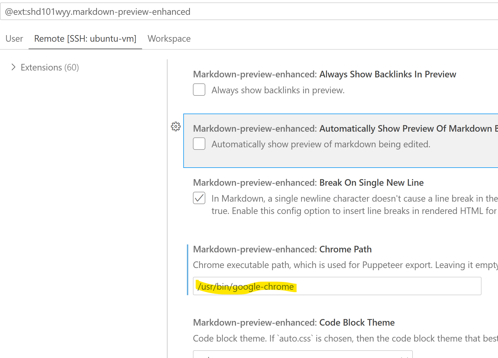

  
This repo contains tutorials, code, documentation that drives my opensearch INTERMEDIATE level course content. Throughout the course: `OS=opensearch` & `ES=elasticsearch`

# 👨‍💼 ABOUT ME
## 🎯 About Your Instructor

**Pradeep** brings **23+ years** of experience architecting and scaling high-performing teams across the globe—from Fortune 500 enterprises to innovative startups.

### 💼 Professional Background
- 🏢 Led enterprise digital transformations in **Data Engineering**, **AI/ML**, and **Modern Application Stacks**
- 🌍 Scaled international teams with laser focus on **external customer success**
- 🔍 Deep expertise in search technologies, distributed systems, and cloud infrastructure

### 📚 Teaching Philosophy
*Pradeep believes that **teaching is the best form of learning**.* This course reflects that philosophy—content designed not just to transfer knowledge, but to build genuine understanding. You'll benefit from real-world patterns, hard-earned lessons, and a practical approach to OpenSearch that comes from hands-on enterprise experience.

# 🎓 UDEMY
The previous course (BASIC level) is published here:

# 📋 PREREQUISITES FOR THE COURSE
- ✅ **Prequel Course**: [BASIC level course](https://www.udemy.com/course/ai-ml-search-with-opensearch/) (recommended but not mandatory)
- 👤 **You should have**: 
  - 🔥 Eagerness to learn traditional vs. AI/ML-driven search
  - 🐧 Linux basics (`ls`, `rm`, `cd`)
  - 🐳 Docker/container fundamentals
  - 🐍 Basic Python coding
  - 🔌 Server/client architecture knowledge
- 💻 **Machine Resources**: See below

# 🚀 MOTIVATION FOR THE COURSE
- 📊 ES is mature but OpenSearch is the open-source alternative gaining momentum
- 🔗 Fortune 500 companies (e.g., Oracle) migrating from ES → OS
- 💰 Cloud-native licensing: Why pay when open-source equivalents exist?
- 🔐 Own your data—reduce vendor lock-in on auth, UI, and commoditized features
- 📈 OpenSearch market disruption opportunity with minimal course competition
- 🎯 And many more (follow the course!)

# 🗂️ ORGANIZATION OF THE COURSE
- 📁 **Tutorial**: Main modules are top-level folders; sub-modules nested deeper
- 💻 **Code**: Python, shell, docker-compose files within each module
- 📊 **Data**: Subfolder **[0. DATA](./0.%20DATA/)** with downloadable datasets (NOT INCLUDED IN CODE REPOSITORY)

# 📖 PRESENTATIONS
- ✅ PDFs and markdown (over .ppt or .pptx format)
- All presentations can be downloaded from [here](https://drive.google.com/drive/folders/1nRRvctDhKB_cC0DicET3XgxUHxml7clz?usp=sharing)
- ✨ **Markdown-first approach**: All content co-located with code
  - 🎥 Watch videos + read .md files = complete learning (no context switching!)
  - 📄 Export to PDF/HTML using Markdown Preview Enhanced (while it is possible to convert markdown to .pptx, there are nuances of how rendering can get messed up)
  - 🤖 AI-friendly format—markdown is how agents exchange context
  - 🛠️ Alternatives: pandoc, marp (though marp lacks mermaid support at this point)
- **I  want instruction material outside of code** 
# 💾 DATA
- The file [0.DATA.zip](https://drive.google.com/drive/folders/1nRRvctDhKB_cC0DicET3XgxUHxml7clz?usp=sharing) contains all datasets required for this course and has to be exploded in `0. DATA` folder in the root of the repo (notice there is a space after 0 before DATA in the folder name)

# ⚙️ HARDWARE, TOOLS & SOFTWARE
- 🖥️ **HARDWARE**: 16GB+ RAM, 4+ CPUs, 50GB storage (bare metal or VM)
- 🔍 **OPENSEARCH**: v3.3.3
- 🐧 **SERVER OS**: Ubuntu 20.04/22.04
- 💻 **CLIENT OS**: Windows/macOS/*nix (your choice for IDE)
- 🐳 **DOCKER**: v28.4.0+ 
- 🐍 **PROGRAMMING**: Python 3.12.11+, Shell, SQL/DQL
- 🎨 **IDE**: VS CODE 1.105.1+ with extensions, Jupyter

# 🌐 STUDENT ENVIRONMENT
Conform to this infrastructure setup:  

# ❓ WHY NOT WINDOWS SERVER
Most execution happens in Docker, so Windows works too. I recommend *nix if pressed. 💬 Email if you run into issues at  [pradeep@automationpractice.com](pradeep@automationpractice.com)

> **Note**: Your client OS can be Windows/macOS/*nix—wherever your IDE runs!

# 🔧 VS CODE EXTENSIONS
All extensions are in [vscode-extensions.txt](./vscode-extensions.txt):
- 🐧 *nix: `cat vscode-extensions.txt | xargs -n 1 code --install-extension`
- 💻 PowerShell: `Get-Content vscode-extensions.txt | ForEach-Object { code --install-extension $_ }`
- 🪟 CMD: `for /F "delims=" %i in (vscode-extensions.txt) do code --install-extension %i`
- 🔍 Or install manually one-by-one

# ⚠️ GOTCHAS
- 🔐 **Docker permission denied**: `sudo chmod 666 /var/run/docker.sock`
- 📓 **Notebook first run**: Install ipykernel when prompted 
- ▶️ **Python in interactive window**: Install Python + Jupyter extensions; enable in Settings
- 🌐 **Markdown export to PDF**: Set Chrome path in Markdown Enhanced settings 
