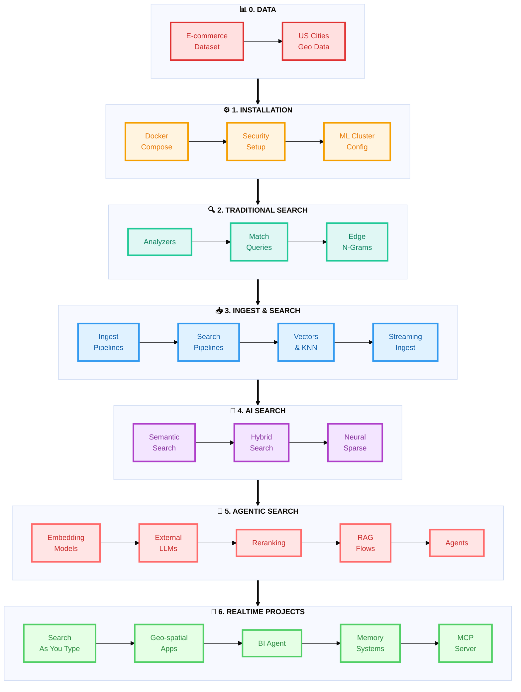
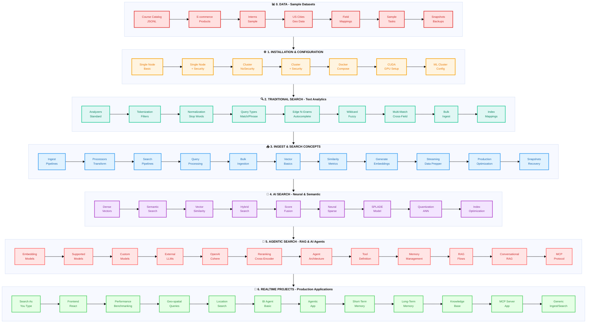

# 🎨 Modules - Birds View

This document summarizes the colorful mindmaps that have been added to the bottom of each documentation file.

## ✨ Overview

Comprehensive, colorful Mermaid mindmaps have been added to the end of all 5 major documentation files in this repository. Each mindmap visually represents the complete ecosystem of knowledge for that section, with multiple levels of detail and colorful styling.

---

## 📋 Mindmaps Added

### 1. 🔍 TRADITIONAL_SEARCH/DOCUMENTATION_INDEX.md

**Mindmap Title:** Traditional Text Search Ecosystem

**Location:** Bottom of file

**Topics Covered (8 major branches):**
- 📚 Core Concepts (Tokenization, Normalization, Stop Words, Synonyms)
- 🗂️ Analyzers (Standard, Simple, Whitespace, Custom)
- 📝 Index Configuration (Field Mappings, Analysis Chains, Inverted Index)
- 🔎 Query Types (Match, Phrase, Wildcard, Multi-Match, Range)
- ✨ Advanced Features (Edge N-Grams, Regular N-Grams, Shingles)
- 🚀 Performance (Optimization, Refresh Rate, Caching)
- 🏗️ Data Ingestion (Bulk Loading, Mapping, Document Structure)
- 🎓 Use Cases (E-commerce, Enterprise, Directory, CMS)

**Visual Elements:** 🎯 Rich emoji indicators for each branch

---

### 2. 📥 INGEST_AND_SEARCH_CONCEPTS/DOCUMENTATION_INDEX.md

**Mindmap Title:** Ingest and Search Concepts Ecosystem

**Location:** Bottom of file

**Topics Covered (8 major branches):**
- 🔀 Ingest Pipelines (Processors, Transformations, Configuration, Use Cases)
- 🔍 Search Pipelines (Query Processing, Result Processing, Aggregation)
- 📚 Bulk Ingestion (High Volume, Batch API, Memory Management, Performance)
- 🧮 Vector Basics (Vector Space, Similarity Metrics, KNN Algorithms, Vector Search)
- 🤖 Embeddings & ML (Embedding Models, ML Pipeline, Integration)
- ⚡ Streaming Data (Data Prepper, Real-time Processing, Use Cases)
- 🚀 Production Optimization (Index Tuning, Configuration, Monitoring)
- 💾 Snapshots & Recovery (Backup Strategy, Restore Operations, Disaster Recovery)

**Visual Elements:** 📊 Comprehensive coverage of modern data infrastructure

---

### 3. 🤖 AI_SEARCH/DOCUMENTATION_INDEX.md

**Mindmap Title:** AI Search Ecosystem

**Location:** Bottom of file

**Topics Covered (5 major branches + Comparison Matrix):**
- 🧠 Semantic Search (Dense Embeddings, Vector Similarity, Use Cases, Setup)
- 🎯 Hybrid Search (Score Combination, Fusion Methods, Advantages, Implementation)
- ⚡ Neural Sparse (Sparse Vectors, SPLADE Model, Benefits, Learning)
- 🚀 Specialized Techniques (Advanced Indexing, Quantization, Optimization, Scaling)
- 🔄 Architecture Pattern (Input Processing, Storage Layer, Search Methods, Ranking, Results)
- 📊 Comparison Matrix (Dense vs BM25 vs Hybrid vs Neural Sparse)
- 🎓 Decision Framework (When to choose each method)
- 🏆 Best Practices (Model Selection, Index Config, Query Optimization, Monitoring)

**Visual Elements:** 🎯 Decision tree and comparison matrix for different search approaches

---

### 4. 🧠 AGENTIC_SEARCH/DOCUMENTATION_INDEX.md

**Mindmap Title:** Agentic Search & RAG Ecosystem

**Location:** Bottom of file

**Topics Covered (9 major branches):**
- 📊 Vector Embeddings (Embedding Models, Text Embedding, Sparse Encoding, Cross-Encoders, Integration)
- 🔧 Custom Models (Model Building, Packaging, Integration, Use Cases)
- 🌐 External LLMs (Providers, Configuration, Optimization, Connectors)
- 🧠 Agent Systems (Agent Architecture, Tool Definition, Memory Management, Multi-step Reasoning)
- 📈 Result Reranking (Cross-Encoders, Reranking Pipeline, Performance, Use Cases)
- 🔍 RAG Flows (Basic RAG, Conversational, Multi-KB, Hybrid, Advanced Features)
- 🔀 Search Strategies (Semantic, Keyword, Hybrid, RRF)
- 🛠️ Implementation Stack (Backend, Pipeline, Data Storage, Integration)
- 🏢 Production Patterns (Performance, Reliability, Monitoring, Deployment)

**Visual Elements:** 🎓 Learning paths for different specializations (RAG Basics, Advanced, LLM Expert, Search Pro)

---

### 5. 🚀 REALTIME_PROJECTS/DOCUMENTATION_INDEX.md

**Mindmap Title:** Realtime Projects Ecosystem

**Location:** Bottom of file

**Topics Covered (8 project branches + Skill Progression + Selection Guide):**
- 🔍 Project 1: Search As You Type (Frontend, Backend, Communication, Features, Use Cases)
- 📊 Project 2: Performance (Benchmarking, Metrics, Analysis, Insights)
- 🌍 Project 3: Geo-spatial (Features, Capabilities, Implementation, Use Cases)
- 💼 Project 4: BI Agent Basic (Features, Database Support, Workflow, Learning)
- 🎯 Project 5: Agentic App (Enhancements, Architecture, Features, Capability)
- 💭 Project 6: With Memory (Memory System, Interaction, Storage, Experience)
- 📚 Project 7: Long-Term Memory (LTM Storage, Knowledge Management, Integration, Capabilities)
- 🔗 Project 8: MCP Server (Protocol, Components, Integration, Ecosystem)
- 🎓 Skill Progression (8 levels from UI to Standards)
- 🎯 Selection Guide (For different roles)
- 🏆 Application Domains (E-commerce, BI, Location, Enterprise)

**Visual Elements:** 🎯 Career progression path from beginner to enterprise architect

---

## 🚀 How to View

Each mindmap is rendered directly in:
- **GitHub** (native Mermaid support)
- **GitLab** (native Mermaid support)
- **Markdown editors** with Mermaid plugin
- **VS Code** with Markdown preview

Simply navigate to the bottom of each documentation file to see the mindmap in action!

---

## 💡 Usage Tips

1. **Expand Your Understanding**: Use the mindmaps to see the complete scope of each topic
2. **Quick Reference**: Bookmark these pages for quick visual lookups
3. **Learning Tool**: Share mindmaps when explaining concepts to others
4. **Study Guide**: Use as a basis for creating your own notes
5. **Architecture Planning**: Reference when designing systems using these technologies

---

## ⚡ Course Highlights - Essential Topics Only

A minimalist view showing only the most critical topics you must know. Perfect for quick review and sharing.



### ✨ Highlight Summary

**30 Essential Topics** - The absolute must-knows:

| Module | Key Highlights | Why Important |
|--------|---------------|---------------|
| **📊 Data** | E-commerce, Geo Data | Most common use cases |
| **⚙️ Installation** | Docker, Security, ML | Production essentials |
| **🔍 Traditional** | Analyzers, Match, N-Grams | Search fundamentals |
| **📥 Ingest** | Pipelines, Vectors, Streaming | Modern data flow |
| **🤖 AI Search** | Semantic, Hybrid, Neural | AI-powered search |
| **🧠 Agentic** | Models, LLMs, RAG, Agents | Intelligent systems |
| **🚀 Projects** | UI, Geo, BI, Memory, MCP | Real-world apps |

---

## 🗺️ Course Structure - Pocket Card Reference

A horizontal flow diagram showing the complete course organization. Each module flows left to right with key topics.



### 📸 How to Export as Pocket Card

**Quick Export Methods:**

1. **Screenshot Method (Easiest)**
   - View this file on GitHub/GitLab or VS Code preview
   - Take a screenshot of the diagram
   - Crop and save

2. **VS Code Extension**
   - Install "Markdown Preview Mermaid Support"
   - Open preview (Ctrl+Shift+V / Cmd+Shift+V)
   - Right-click diagram → Copy/Save image

3. **Mermaid Live Editor**
   - Visit [mermaid.live](https://mermaid.live)
   - Copy the mermaid code block above
   - Export as PNG or SVG (high quality)

4. **CLI Export (Professional)**
   ```bash
   npm install -g @mermaid-js/mermaid-cli
   mmdc -i "2. HIGH_LEVEL_MODULES.md" -o opensearch-course-map.png -w 2400 -H 1200
   ```

---

## 🔬 Detailed Course Structure - Complete Reference Map

An ultra-detailed view of every major topic, sub-topic, and implementation across all modules. Perfect for comprehensive reference.

```mermaid
%%{init: {'theme':'base', 'themeVariables': {'fontSize':'10px'}}}%%
graph TB
    subgraph M1["<b>📊 MODULE 0: DATA - Sample Datasets & Test Data</b>"]
        direction LR
        D1["Course Catalog<br/>OpenSearch JSONL<br/>Full Text Search"]:::data --> D2["E-commerce<br/>Products/Orders<br/>Field Mappings"]:::data --> D3["E-commerce Lite<br/>Compact Dataset<br/>Quick Testing"]:::data --> D4["Interns Sample<br/>Employee Data<br/>Relational Queries"]:::data --> D5["US Cities<br/>Geo Coordinates<br/>Spatial Search"]:::data --> D6["Sample Tasks<br/>ML Examples<br/>Vector Data"]:::data --> D7["Field Mappings<br/>Schema Definitions<br/>Type Config"]:::data --> D8["Snapshots<br/>Backup Data<br/>Recovery Sets"]:::data
    end
    
    subgraph M2["<b>⚙️ MODULE 1: INSTALLATION & CONFIGURATION - Setup & Infrastructure</b>"]
        direction LR
        I1["Docker Compose<br/>Single Node<br/>Basic Setup"]:::install --> I2["Single + Security<br/>Authentication<br/>SSL/TLS"]:::install --> I3["Cluster NoSec<br/>Multi-Node<br/>Development"]:::install --> I4["Cluster + Security<br/>Production Setup<br/>Role-Based Access"]:::install --> I5["CUDA Support<br/>GPU Acceleration<br/>Vector Processing"]:::install --> I6["ML Cluster<br/>Neural Search<br/>Model Hosting"]:::install --> I7["Ollama Integration<br/>Local LLMs<br/>Embedding Models"]:::install
    end
    
    subgraph M3["<b>🔍 MODULE 2: TRADITIONAL SEARCH - Full-Text Search & Analysis</b>"]
        direction LR
        T1["Standard Analyzer<br/>Tokenization<br/>Lowercase Filter"]:::search --> T2["Custom Analyzer<br/>Char Filters<br/>Token Filters"]:::search --> T3["Stop Words<br/>Stemming<br/>Synonyms"]:::search --> T4["Match Query<br/>Full-Text Search<br/>Relevance Scoring"]:::search --> T5["Phrase Query<br/>Proximity Search<br/>Position Aware"]:::search --> T6["Multi-Match<br/>Cross-Field<br/>Best Fields"]:::search --> T7["Wildcard & Fuzzy<br/>Pattern Matching<br/>Typo Tolerance"]:::search --> T8["Edge N-Grams<br/>Autocomplete<br/>Prefix Search"]:::search --> T9["Regular N-Grams<br/>Substring Match<br/>Partial Text"]:::search --> T10["Shingles<br/>Multi-Word Tokens<br/>Phrase Detection"]:::search --> T11["Bulk API<br/>Batch Ingest<br/>Performance"]:::search --> T12["Index Mappings<br/>Dynamic/Explicit<br/>Field Types"]:::search
    end
    
    subgraph M4["<b>📥 MODULE 3: INGEST & SEARCH CONCEPTS - Pipeline Processing & Data Flow</b>"]
        direction LR
        IS1["Ingest Pipeline<br/>Pre-Processing<br/>Document Transform"]:::ingest --> IS2["Set Processor<br/>Add Fields<br/>Default Values"]:::ingest --> IS3["Script Processor<br/>Custom Logic<br/>Field Manipulation"]:::ingest --> IS4["Date Processor<br/>Timestamp Parse<br/>Format Convert"]:::ingest --> IS5["Grok Processor<br/>Pattern Extract<br/>Log Parsing"]:::ingest --> IS6["Search Pipeline<br/>Query Processing<br/>Result Transform"]:::ingest --> IS7["Query Phase<br/>Pre-Processing<br/>Request Rewrite"]:::ingest --> IS8["Response Phase<br/>Post-Processing<br/>Result Enrichment"]:::ingest --> IS9["Bulk Ingestion<br/>High Volume<br/>Batch Processing"]:::ingest --> IS10["Memory Mgmt<br/>Buffer Size<br/>Thread Pools"]:::ingest --> IS11["Vector Basics<br/>Dense Vectors<br/>KNN Search"]:::ingest --> IS12["Similarity Metrics<br/>Cosine/Euclidean<br/>Dot Product"]:::ingest --> IS13["Generate Vectors<br/>Embedding Models<br/>Text-to-Vector"]:::ingest --> IS14["Data Prepper<br/>Streaming ETL<br/>Real-time Ingest"]:::ingest --> IS15["Production Tuning<br/>Refresh Interval<br/>Replica Shards"]:::ingest --> IS16["Snapshots<br/>Backup Strategy<br/>Point-in-Time"]:::ingest
    end
    
    subgraph M5["<b>🤖 MODULE 4: AI SEARCH - Neural Search & Vector Techniques</b>"]
        direction LR
        AI1["Dense Vectors<br/>Embeddings<br/>High-Dimensional"]:::ai --> AI2["Semantic Search<br/>Meaning-Based<br/>Context Aware"]:::ai --> AI3["Vector Similarity<br/>KNN Algorithm<br/>Approximate NN"]:::ai --> AI4["HNSW Index<br/>Hierarchical NSW<br/>Fast Retrieval"]:::ai --> AI5["Hybrid Search<br/>Vector + Text<br/>Best of Both"]:::ai --> AI6["Score Fusion<br/>Normalization<br/>Weight Tuning"]:::ai --> AI7["RRF Algorithm<br/>Reciprocal Rank<br/>Fusion Method"]:::ai --> AI8["Neural Sparse<br/>Learned Sparse<br/>SPLADE Model"]:::ai --> AI9["Sparse Vectors<br/>Interpretable<br/>Efficient Storage"]:::ai --> AI10["Quantization<br/>Compression<br/>Memory Optimization"]:::ai --> AI11["Product Quant<br/>Scalar Quant<br/>Accuracy Trade-off"]:::ai --> AI12["Index Optimization<br/>Segment Merge<br/>Cache Warming"]:::ai
    end
    
    subgraph M6["<b>🧠 MODULE 5: AGENTIC SEARCH - RAG, Agents & Advanced AI</b>"]
        direction LR
        AG1["Embedding Models<br/>Sentence Transform<br/>Multi-lingual"]:::agentic --> AG2["Text Embedding<br/>Dense Represent<br/>768/1536-dim"]:::agentic --> AG3["Supported Models<br/>Pre-trained<br/>OpenSearch ML"]:::agentic --> AG4["Custom Models<br/>Fine-tuned<br/>Domain-Specific"]:::agentic --> AG5["Model Upload<br/>ONNX Format<br/>TorchScript"]:::agentic --> AG6["External LLMs<br/>API Integration<br/>Connectors"]:::agentic --> AG7["OpenAI<br/>GPT-4/3.5<br/>Embeddings API"]:::agentic --> AG8["Cohere<br/>Command/Embed<br/>Rerank API"]:::agentic --> AG9["Bedrock<br/>AWS Managed<br/>Claude/Titan"]:::agentic --> AG10["Reranking<br/>Cross-Encoder<br/>Precision Boost"]:::agentic --> AG11["Two-Stage<br/>Retrieve + Rerank<br/>Top-K Selection"]:::agentic --> AG12["Agent Systems<br/>LangChain<br/>Tool Calling"]:::agentic --> AG13["Agent Memory<br/>Conversation<br/>Context Window"]:::agentic --> AG14["Tool Definition<br/>Function Schema<br/>Parameter Spec"]:::agentic --> AG15["RAG Basic<br/>Retrieve-Generate<br/>Grounded Answers"]:::agentic --> AG16["RAG Advanced<br/>Multi-Query<br/>Self-Query"]:::agentic --> AG17["Conversational<br/>Chat History<br/>Follow-ups"]:::agentic --> AG18["MCP Protocol<br/>Model Context<br/>Standard Interface"]:::agentic
    end
    
    subgraph M7["<b>🚀 MODULE 6: REALTIME PROJECTS - Production Applications & Use Cases</b>"]
        direction LR
        P1["Search UI<br/>React Frontend<br/>Autocomplete"]:::projects --> P2["As-You-Type<br/>Real-time Query<br/>Instant Results"]:::projects --> P3["Debouncing<br/>Request Throttle<br/>UX Optimization"]:::projects --> P4["Performance Test<br/>Benchmarking<br/>Load Testing"]:::projects --> P5["Query Metrics<br/>Latency P95/P99<br/>Throughput"]:::projects --> P6["Index Metrics<br/>Ingestion Rate<br/>Resource Usage"]:::projects --> P7["Geo-spatial<br/>Location Search<br/>Distance Queries"]:::projects --> P8["Geo Bounding<br/>Circle/Polygon<br/>Shape Queries"]:::projects --> P9["Geo Distance<br/>Sort by Proximity<br/>Radius Search"]:::projects --> P10["BI Agent Basic<br/>Natural Language<br/>SQL Generation"]:::projects --> P11["Database Query<br/>Text-to-SQL<br/>Result Format"]:::projects --> P12["Agentic App<br/>Multi-step Logic<br/>Tool Integration"]:::projects --> P13["Agent Reasoning<br/>Chain-of-Thought<br/>Decision Making"]:::projects --> P14["Short Memory<br/>Session Context<br/>Recent History"]:::projects --> P15["Long Memory<br/>Persistent Store<br/>Knowledge Base"]:::projects --> P16["Vector Store<br/>Embedding Index<br/>Semantic Recall"]:::projects --> P17["MCP Server<br/>Protocol Impl<br/>Context Provider"]:::projects --> P18["Generic App<br/>Configurable<br/>Template-Based"]:::projects
    end
    
    M1 --> M2 --> M3 --> M4 --> M5 --> M6 --> M7
    
    classDef data fill:#ffe0e0,stroke:#e03131,stroke-width:2px,color:#c92a2a,font-size:9px
    classDef install fill:#fff4e0,stroke:#f59f00,stroke-width:2px,color:#e67700,font-size:9px
    classDef search fill:#e0f7f4,stroke:#20c997,stroke-width:2px,color:#087f5b,font-size:9px
    classDef ingest fill:#e0f2ff,stroke:#339af0,stroke-width:2px,color:#1864ab,font-size:9px
    classDef ai fill:#f3e5ff,stroke:#ae3ec9,stroke-width:2px,color:#862e9c,font-size:9px
    classDef agentic fill:#ffe5e5,stroke:#ff6b6b,stroke-width:2px,color:#c92a2a,font-size:9px
    classDef projects fill:#e5ffe5,stroke:#51cf66,stroke-width:2px,color:#2b8a3e,font-size:9px
```



### 📊 Detailed Diagram Statistics

| Module | Topics | Key Focus Areas |
|--------|--------|-----------------|
| **0. Data** | 8 | Datasets, schemas, geo data, backups |
| **1. Installation** | 7 | Docker, clusters, security, ML setup |
| **2. Traditional Search** | 12 | Analyzers, queries, n-grams, mappings |
| **3. Ingest & Search** | 16 | Pipelines, processors, vectors, streaming |
| **4. AI Search** | 12 | Embeddings, hybrid, neural sparse, optimization |
| **5. Agentic Search** | 18 | Models, LLMs, RAG, agents, MCP |
| **6. Realtime Projects** | 18 | UI, performance, geo, BI, memory, MCP apps |
| **TOTAL** | **91** | **Complete course coverage** |

### 🎯 Diagram Usage Guide

**Compact Diagram (Above)**: 
- Quick reference with 67 core topics
- Best for overview and presentation
- Fits on single page/slide

**Detailed Diagram (This Section)**:
- Comprehensive 91-topic coverage
- Three-line descriptions per topic
- Best for deep study and implementation reference
- Export as large format (A3/A2) for wall poster


### 🎨 Module Color Guide

| Color | Module | Focus Area |
|-------|--------|------------|
| 🔴 Red | Data | Sample datasets and test data |
| 🟠 Orange | Installation | Setup and configuration |
| 🟢 Teal | Traditional Search | Text analysis and queries |
| 🔵 Blue | Ingest & Search | Pipelines and data flow |
| 🟣 Purple | AI Search | Neural and semantic search |
| 🔴 Pink | Agentic Search | RAG and AI agents |
| 🟢 Green | Projects | Production applications |

### 📊 Learning Path Flow

```
Foundation → Configuration → Traditional → Modern Ingest → AI-Powered → Intelligent Agents → Production Apps
(Module 0-1)  (Module 2)     (Module 3)     (Module 4)     (Module 5)        (Module 6)
```

---
