# 📖 Traditional Search - Complete Learning Guide


## 🎯 Quick Navigation

### For Students - Where to Start?

**I'm new to OpenSearch search** → Start here:
1. Read `shell_commands/1. text_search_concepts.md` - Foundational concepts
2. Review `shell_commands/text_search.md` - Practical guide
3. Run the examples and shell scripts

**I want to learn text search** → Follow this path:
```
1. Core Concepts (text_search_concepts.md)
   ↓
2. Implementation (text_search.md)
   ↓
3. Data Ingestion (create-ingest-*.py)
   ↓
4. Search Execution (text_search.sh)
```

**I want to work with pre-built examples** → Check:
- `create-ingest-ecommerce.py` - E-commerce data ingestion
- `create-ingest-interns.py` - Interns dataset ingestion
- `create_ecommerce_original_edge_ngrams.py` - Advanced edge ngrams

---

## 🏗️ Learning Path Overview

```mermaid
graph TD
    Start["🚀 START HERE<br/>Traditional Search Basics"] --> Concepts["Module 1<br/>Search Concepts<br/>& Fundamentals"]
    
    Concepts --> Text["Understanding<br/>Text Analysis<br/>& Tokenization"]
    
    Text --> Impl["Module 2<br/>Implementation<br/>Guide"]
    
    Impl --> Ingest["Module 3<br/>Data Ingestion<br/>& Indexing"]
    
    Ingest --> Execute["Module 4<br/>Search Execution<br/>& Query DSL"]
    
    Execute --> Advanced["Module 5<br/>Advanced Techniques<br/>Edge N-grams"]
    
    Advanced --> Production["🏆 PRODUCTION<br/>Ready Search Systems"]
    
    classDef start fill:#e1f5fe,stroke:#01579b,stroke-width:3px,color:#000
    classDef module fill:#c8e6c9,stroke:#2e7d32,stroke-width:2px,color:#000
    classDef concept fill:#fff9c4,stroke:#f57f17,stroke-width:2px,color:#000
    classDef prod fill:#f8bbd0,stroke:#c2185b,stroke-width:3px,color:#000
    
    class Start start
    class Concepts,Impl,Ingest,Execute,Advanced module
    class Text concept
    class Production prod
```



---

## 📁 Folder Structure

### Core Documentation Files

**1. shell_commands/1. text_search_concepts.md**
- Foundational concepts of text search
- How tokenization works
- Analysis chains and filters
- Token types and processing

**2. shell_commands/text_search.md**
- Practical implementation guide
- Step-by-step examples
- Best practices
- Common patterns

**3. shell_commands/text_search.sh**
- Executable shell script
- Automated search workflows
- Command-line examples
- Testing utilities

### Data Ingestion Scripts

**1. create-ingest-ecommerce.py**
- E-commerce dataset ingestion
- Index creation
- Mapping configuration
- Bulk loading

**2. create-ingest-interns.py**
- Interns/employee dataset
- Sample data preparation
- Index setup

**3. create-ingest-my-index.py**
- Generic index creation template
- Customizable mappings
- Reusable patterns

**4. create_ecommerce_original_edge_ngrams.py**
- Advanced technique: edge n-grams
- Prefix search implementation
- Search-as-you-type foundation

### Configuration

**docker-compose-opensearch-single.yml**
- Single-node OpenSearch setup
- Development environment
- Quick startup configuration

---

## 🎓 What You Can Build

```mermaid
graph LR
    A["After Learning<br/>Text Concepts"] --> A1["🔍 Basic Text Search<br/>Exact & partial matching"]
    
    B["After Implementation<br/>Guide"] --> B1["📚 Structured Queries<br/>Query DSL mastery"]
    
    C["After Data Ingestion"] --> C1["📦 Indexed Systems<br/>Real data at scale"]
    
    D["After Search Execution"] --> D1["⚡ Production Search<br/>Optimized queries"]
    
    E["After Edge N-grams"] --> E1["🎯 Autocomplete<br/>Search-as-you-type"]
    
    A1 --> Master["🏆 Complete Search Systems"]
    B1 --> Master
    C1 --> Master
    D1 --> Master
    E1 --> Master
    
    classDef m1 fill:#e3f2fd,stroke:#1976d2,stroke-width:2px,color:#000
    classDef m2 fill:#e8f5e9,stroke:#388e3c,stroke-width:2px,color:#000
    classDef m3 fill:#fff3e0,stroke:#d84315,stroke-width:2px,color:#000
    classDef m4 fill:#fce4ec,stroke:#c2185b,stroke-width:2px,color:#000
    classDef m5 fill:#f3e5f5,stroke:#6a1b9a,stroke-width:2px,color:#000
    classDef master fill:#f1f8e9,stroke:#558b2f,stroke-width:3px,color:#000
    
    class A1 m1
    class B1 m2
    class C1 m3
    class D1 m4
    class E1 m5
    class Master master
```



---

## 🔄 Text Search Architecture


---

## 📚 Key Concepts

### Text Analysis
- **Tokenization**: Breaking text into individual tokens
- **Stemming**: Reducing words to root form
- **Stop words**: Filtering common, low-value words
- **Lowercasing**: Normalizing text case
- **Synonyms**: Expanding query scope

### Query Types
- **Match Query**: Basic full-text search
- **Multi Match**: Search across multiple fields
- **Match Phrase**: Exact phrase matching
- **Wildcard**: Pattern-based search
- **Range**: Numeric range queries

### Analyzers
- **Standard Analyzer**: Default text processing
- **Simple Analyzer**: Basic lowercasing and tokenization
- **Whitespace Analyzer**: Split on whitespace
- **Custom Analyzer**: User-defined combinations

### Edge N-Grams
- **Prefix matching**: Autocomplete capability
- **Search-as-you-type**: Real-time suggestions
- **Partial matching**: Flexible search

---

## 🎯 Learning Progression

```mermaid
graph TD
    A["Foundation<br/>Text Search Concepts"] --> B["Implementation<br/>Practical guide"]
    
    B --> C["Ingestion<br/>Load data"]
    
    C --> D["Execution<br/>Build queries"]
    
    D --> E["Advanced<br/>Edge N-grams"]
    
    E --> F["Mastery<br/>🏆 Production Search"]
    
    classDef f fill:#bbdefb,stroke:#1565c0,stroke-width:2px,color:#000
    classDef i fill:#c8e6c9,stroke:#2e7d32,stroke-width:2px,color:#000
    classDef ing fill:#fff9c4,stroke:#f57f17,stroke-width:2px,color:#000
    classDef ex fill:#ffe0b2,stroke:#e65100,stroke-width:2px,color:#000
    classDef adv fill:#f8bbd0,stroke:#c2185b,stroke-width:2px,color:#000
    classDef m fill:#ce93d8,stroke:#6a1b9a,stroke-width:3px,color:#fff
    
    class A f
    class B i
    class C ing
    class D ex
    class E adv
    class F m
```



---

## 💡 Quick Reference Guide

### By Learning Style

**Prefer Concepts & Theory?**
- Start with: `1. text_search_concepts.md`
- Understand the "why" before the "how"

**Prefer Practical Examples?**
- Start with: `text_search.md`
- Learn by doing with concrete examples

**Prefer Automation?**
- Use: `text_search.sh` - Ready-to-run scripts
- Check: `create-ingest-*.py` - Turnkey solutions

### By Use Case

**Building Autocomplete?**
- Focus on: `create_ecommerce_original_edge_ngrams.py`
- Study: Edge n-gram analyzer configuration
- Result: Search-as-you-type functionality

**Ingesting Large Datasets?**
- Use: `create-ingest-ecommerce.py` or `create-ingest-interns.py`
- Adapt: `create-ingest-my-index.py` for your data
- Run: Bulk indexing patterns

**Building Production Search?**
- Master: Query DSL from `text_search.md`
- Implement: Analysis chains properly
- Test: With diverse datasets

---

## 🚀 Getting Started

### Step 1: Understand Concepts
1. Read `shell_commands/1. text_search_concepts.md`
2. Understand tokenization and analysis
3. Learn about different analyzer types

### Step 2: Set Up Environment
1. Start OpenSearch with docker-compose:
   ```bash
   docker-compose -f docker-compose-opensearch-single.yml up
   ```
2. Wait for cluster to be ready

### Step 3: Ingest Data
1. Choose a dataset:
   - E-commerce: `create-ingest-ecommerce.py`
   - Interns: `create-ingest-interns.py`
2. Run the ingestion script
3. Verify data in OpenSearch

### Step 4: Build Searches
1. Review query examples in `text_search.md`
2. Build queries using Query DSL
3. Test with your data

### Step 5: Explore Advanced Features
1. Study edge n-grams
2. Implement autocomplete
3. Optimize performance

---

## 📊 Dataset Overview

### E-commerce Dataset
- Product catalogs
- Descriptions
- Pricing information
- Text-rich content
- Good for search demonstrations

### Interns Dataset
- Employee/intern records
- Structured data with text fields
- Resume/bio information
- Directory search use case

### Custom Index
- Template-based approach
- Customize for your data
- Reusable mappings

---

## 🔍 Common Search Patterns

### Simple Text Search
```
Match any word in a field
Uses tokenization and analysis
```

### Phrase Search
```
Exact word sequence
Maintains order and proximity
```

### Wildcard Search
```
Pattern matching
* for multiple characters
? for single character
```

### Multi-field Search
```
Search across multiple fields
Weighted results possible
```

---

## ✨ Tips for Success

1. **Start Simple**: Begin with basic match queries
2. **Understand Analysis**: Know what your analyzer does
3. **Use Test Data**: Start with provided datasets
4. **Iterate**: Modify queries and observe changes
5. **Check Mappings**: Verify field analysis chains
6. **Monitor Performance**: Watch query execution time
7. **Test Edge Cases**: Try empty queries, special characters
8. **Have Fun**: Search is a core skill!

---

## 📁 File Organization

```
2. TRADITIONAL_SEARCH/
├── docker-compose-opensearch-single.yml    # Environment setup
├── create-ingest-ecommerce.py              # E-commerce ingestion
├── create-ingest-interns.py                # Interns data ingestion
├── create-ingest-my-index.py               # Generic template
├── create_ecommerce_original_edge_ngrams.py # Advanced technique
└── shell_commands/
    ├── 1. text_search_concepts.md          # Foundational concepts
    ├── text_search.md                      # Implementation guide
    ├── text_search.sh                      # Executable scripts
    └── README.md                           # Quick reference
```

---

## 🔗 Key Concepts Map


---

## 🎯 Success Path

```mermaid
graph TD
    A["📖 Read Concepts<br/>text_search_concepts.md"] --> B["📊 Study Examples<br/>text_search.md"]
    B --> C["🔧 Setup Environment<br/>Docker compose"]
    C --> D["📥 Load Data<br/>Ingestion scripts"]
    D --> E["🔍 Build Queries<br/>Query DSL"]
    E --> F["⚡ Optimize<br/>Performance tuning"]
    F --> G["✨ Advanced<br/>Edge N-grams"]
    G --> H["🏆 Production<br/>Ready search"]
    
    classDef step1 fill:#e3f2fd,stroke:#1976d2,stroke-width:2px,color:#000
    classDef step2 fill:#e8f5e9,stroke:#388e3c,stroke-width:2px,color:#000
    classDef step3 fill:#fff3e0,stroke:#d84315,stroke-width:2px,color:#000
    classDef step4 fill:#fce4ec,stroke:#c2185b,stroke-width:2px,color:#000
    classDef step5 fill:#f3e5f5,stroke:#6a1b9a,stroke-width:2px,color:#000
    classDef step6 fill:#e0f2f1,stroke:#00796b,stroke-width:2px,color:#000
    classDef step7 fill:#fff9c4,stroke:#f57f17,stroke-width:2px,color:#000
    classDef step8 fill:#f1f8e9,stroke:#558b2f,stroke-width:2px,color:#000
    
    class A step1
    class B step2
    class C step3
    class D step4
    class E step5
    class F step6
    class G step7
    class H step8
```



---

## ❓ FAQ

**Q: Where should I start?**
A: Begin with `1. text_search_concepts.md` in shell_commands folder

**Q: Can I run the examples?**
A: Yes! Use the ingestion scripts and shell commands with a running OpenSearch instance

**Q: What datasets are available?**
A: E-commerce products and interns directory - both pre-configured

**Q: How do I add my own data?**
A: Use `create-ingest-my-index.py` as a template, adapt for your data

**Q: What is edge n-grams?**
A: Advanced technique for prefix-based search and autocomplete functionality

**Q: Do I need ML knowledge?**
A: No, traditional search is foundational and explained from basics

---

## 📞 Document Types

### Markdown Documentation (.md)
- Conceptual explanations
- Code examples
- Best practices
- Tutorial walkthroughs

### Python Scripts (.py)
- Data ingestion automation
- Index creation
- Bulk loading
- Customizable templates

### Shell Scripts (.sh)
- Command-line execution
- Workflow automation
- Quick testing
- DevOps integration

### Docker Compose
- Environment setup
- Container orchestration
- Single-node clusters
- Development configuration

---

## 🎓 Core Competencies Developed

After completing this module, you'll understand:

1. **Text Analysis**: How search engines process text
2. **Tokenization**: Breaking text into searchable units
3. **Analyzers**: Different analysis strategies
4. **Query DSL**: Building search queries
5. **Indexing**: Creating searchable indices
6. **Ranking**: Relevance scoring
7. **Performance**: Query optimization
8. **Advanced Features**: Edge n-grams and autocomplete

---

## ✨ Your Learning Journey

This folder contains everything you need to master traditional text search with OpenSearch.

**Start with concepts, practice with examples, build with confidence!**

**Let your search journey begin! 🚀**

---

