# OpenSearch Text Search Queries

## Level 0 Overview - Main Query Categories

```mermaid
graph TD
    A[OpenSearch Text Search Queries] --> B[Basic Search Operations]
    A --> C[Text Matching Queries]
    A --> D[Term-Level Queries]
    A --> E[Boolean & Compound Queries]
    A --> F[Search Enhancement Features]
    A --> G[Autocomplete & Suggestions]
    A --> H[Advanced Text Analysis]
    A --> I[Performance & Sorting]
    A --> J[Business Query Patterns]
    
    classDef basicOps fill:#e1f5fe,stroke:#01579b,stroke-width:2px,color:#000
    classDef textMatch fill:#f3e5f5,stroke:#4a148c,stroke-width:2px,color:#000
    classDef termLevel fill:#e8f5e8,stroke:#1b5e20,stroke-width:2px,color:#000
    classDef boolCompound fill:#fff3e0,stroke:#e65100,stroke-width:2px,color:#000
    classDef searchEnhance fill:#fce4ec,stroke:#880e4f,stroke-width:2px,color:#000
    classDef autocomplete fill:#f1f8e9,stroke:#33691e,stroke-width:2px,color:#000
    classDef advanced fill:#e3f2fd,stroke:#0d47a1,stroke-width:2px,color:#000
    classDef performance fill:#fff8e1,stroke:#ff6f00,stroke-width:2px,color:#000
    classDef business fill:#fafafa,stroke:#424242,stroke-width:2px,color:#000
    
    class B basicOps
    class C textMatch
    class D termLevel
    class E boolCompound
    class F searchEnhance
    class G autocomplete
    class H advanced
    class I performance
    class J business
```

## Level 1 Detailed - Specific Query Types

This document explains various OpenSearch text search queries in business-friendly terms, showing both technical explanations and real-world use cases.

## 1. Basic Search Operations

### Match All Query
**Explanation:** Retrieves all documents in an index without any filtering criteria.

**Business Use Case:** Perfect for getting an overview of your entire dataset, such as viewing all products in your e-commerce catalog or all customer records for reporting purposes.

### Pagination
**Explanation:** Controls how many results are returned and allows navigation through large result sets using `from` and `size` parameters.

**Business Use Case:** Essential for user interfaces where you need to display search results in manageable chunks, like showing 10 products per page on an e-commerce website or dividing customer lists into pages for better user experience.

### Scroll Search
**Explanation:** Efficiently retrieves large datasets by maintaining a search context and returning results in batches.

**Business Use Case:** Ideal for data exports, bulk operations, or analytics where you need to process thousands or millions of records without overwhelming system resources. Perfect for generating comprehensive reports or data migrations.

### Search After
**Explanation:** Provides efficient pagination for large datasets by using sort values from the last document as a starting point for the next batch.

**Business Use Case:** Superior alternative to traditional pagination for real-time applications like live dashboards, social media feeds, or financial transaction monitoring where new data is constantly being added.

### Point in Time (PIT)
**Explanation:** Creates a consistent snapshot of the index at a specific moment, ensuring search results remain stable even as the underlying data changes.

**Business Use Case:** Critical for financial reporting, audit trails, or legal compliance where you need to ensure data consistency during long-running queries or multi-step analysis processes.

## 2. Text Matching Queries

### Match Query
**Explanation:** Searches for documents containing specified terms, analyzing the query text and matching against analyzed field content.

**Business Use Case:** The foundation of most search features - finding products by name, searching customer support tickets by keywords, or locating documents containing specific business terms.

### Match Phrase Query
**Explanation:** Searches for exact phrase matches, ensuring all terms appear in the specified order and proximity.

**Business Use Case:** Perfect for finding exact quotes in legal documents, specific product names, company slogans, or when users search for precise phrases like "project management software."

### Match Phrase Prefix
**Explanation:** Similar to match phrase but treats the last term as a prefix, useful for autocomplete functionality.

**Business Use Case:** Powers search-as-you-type features in applications, helping users find products, customers, or content as they type, improving user experience and search efficiency.

### Proximity Search with Slop
**Explanation:** Finds documents where specified terms appear within a certain distance of each other, even if other words appear between them.

**Business Use Case:** Useful for finding related concepts that might be expressed differently, such as finding documents mentioning "customer satisfaction" even when written as "customer service satisfaction" or "satisfaction of customers."

## 3. Term-Level Queries

### Term Query
**Explanation:** Searches for exact matches of a specific term without analyzing the search text.

**Business Use Case:** Perfect for filtering by specific categories, status codes, product IDs, or any structured data where you need exact matches. Essential for faceted search and filtering systems.

### Terms Query
**Explanation:** Searches for documents containing any of the specified exact terms.

**Business Use Case:** Allows users to filter by multiple categories simultaneously, such as finding products that are either "electronics" OR "home appliances," or searching for orders from multiple specific regions.

### Fuzzy Query
**Explanation:** Finds documents containing terms similar to the search term, accounting for misspellings and typos using edit distance calculations.

**Business Use Case:** Improves search experience by handling user typos and variations in spelling, ensuring customers can still find "iPhone" even if they type "iPhon" or find "restaurant" when they search for "restarant."

## 4. Boolean and Compound Queries

### Boolean Query (Must, Should, Must Not)
**Explanation:** Combines multiple query conditions with logical operators to create complex search criteria.

**Business Use Case:** Powers advanced search filters allowing users to specify multiple criteria, such as finding "electronics products under $500 that are in stock and have good ratings but exclude refurbished items."

### Filter Context
**Explanation:** Applies query conditions without affecting the relevance score, focusing purely on yes/no matching.

**Business Use Case:** Perfect for applying business rules and constraints, such as showing only active products, filtering by date ranges, or applying security permissions without impacting search ranking.

## 5. Search Enhancement Features

### Highlighting
**Explanation:** Marks matched terms in search results with HTML tags or custom formatting.

**Business Use Case:** Improves user experience by showing why a result matched their search, commonly seen in search engines where matched terms are bolded in snippets, helping users quickly identify relevant content.

### Source Filtering
**Explanation:** Controls which fields are returned in search results, reducing bandwidth and improving performance.

**Business Use Case:** Optimizes API responses and user interfaces by returning only necessary data, such as showing only product names and prices in search results rather than full product descriptions and technical specifications.

## 6. Autocomplete and Suggestions

### Edge N-grams for Autocomplete
**Explanation:** Analyzes text into partial word fragments to enable fast prefix matching for autocomplete features.

**Business Use Case:** Powers instant search suggestions as users type, helping customers quickly find products, improving search speed and user satisfaction in e-commerce and content platforms.

### Search-as-You-Type
**Explanation:** Specialized field type that creates multiple sub-fields optimized for different types of prefix matching.

**Business Use Case:** Provides sophisticated autocomplete functionality that can handle multi-word queries and partial matches, perfect for modern search interfaces that need to respond instantly to user input.

### Completion Suggester
**Explanation:** Provides fast, typo-tolerant autocomplete suggestions using pre-built completion data structures.

**Business Use Case:** Ideal for search boxes that need to suggest complete phrases or popular searches, such as suggesting "MacBook Pro 14 inch" when users type "mac," improving conversion rates and user experience.

### Term and Phrase Suggesters (Did You Mean?)
**Explanation:** Offers spelling corrections and alternative suggestions when searches return few or no results.

**Business Use Case:** Reduces abandoned searches by suggesting corrections like "Did you mean 'iPhone'?" when users search for "iPone," helping maintain user engagement and improving search success rates.

## 7. Advanced Text Analysis

### Intervals Query
**Explanation:** Searches for documents where terms appear in specific positions relative to each other, providing precise control over term proximity and ordering.

**Business Use Case:** Useful for legal document search where term order matters, finding specific patterns in contracts, or ensuring precise matching in technical documentation where word order affects meaning.

### Query String Query
**Explanation:** Supports advanced search syntax with operators like AND, OR, NOT, allowing power users to construct complex queries.

**Business Use Case:** Perfect for expert users, administrators, or advanced search interfaces where users need full control over search logic, such as business intelligence tools or technical documentation systems.

## 8. Performance and Sorting

### Sorting
**Explanation:** Orders search results by field values, relevance scores, or custom criteria.

**Business Use Case:** Allows users to organize results by price, date, popularity, or relevance, helping them find the most suitable products or information based on their priorities.

### Named Queries
**Explanation:** Assigns names to query clauses to understand how each part contributes to the final relevance score.

**Business Use Case:** Helpful for fine-tuning search algorithms and understanding why certain results rank higher, enabling data scientists and search engineers to optimize search relevance for better business outcomes.

## 9. Common Query Patterns for Business Applications

### E-commerce Product Search
- Use **match** queries for product names and descriptions
- Apply **term** filters for categories, brands, and availability
- Implement **range** queries for price and rating filters
- Add **highlighting** to show matched terms
- Use **sorting** for price, popularity, and relevance ordering

### Customer Support Ticket Search
- **Match phrase** for finding exact error messages
- **Fuzzy** queries to handle typos in problem descriptions
- **Boolean** queries to combine multiple search criteria
- **Date range** filters for ticket creation times
- **Term** filters for ticket status and priority

### Content Management Systems
- **Full-text match** for document content
- **Term** filters for document types and categories
- **Autocomplete** for quick content discovery
- **Highlighting** to show matched content snippets
- **Boolean** queries for complex content filtering

### Business Intelligence and Analytics
- **Aggregations** combined with **filtered** queries for data analysis
- **Range** queries for time-based analysis
- **Terms** queries for categorical data exploration
- **Boolean** combinations for complex business rules
- **Sorting** and **pagination** for report generation

This comprehensive guide demonstrates how OpenSearch's powerful text search capabilities can be applied to solve real business problems, from simple product searches to complex analytical queries, always prioritizing user experience and business outcomes.