# 📖 Ingest and Search Concepts - Complete Learning Guide

## 🎯 Quick Navigation

### For Students - Where to Start?

**I'm new to data ingestion** → Start here:
1. Review folder 1: Ingest Pipelines - Data processing
2. Review folder 2: Search Pipelines - Query processing
3. Review folder 3: Bulk Ingestion - Large-scale loading

**I want to learn vector search** → Follow this path:
```
1. Ingest Pipelines (1. ingest_pipelines_processors/)
   ↓
2. Vector Basics (4. vector_basics/)
   ↓
3. Generate Embeddings (5. generate_vectors_or_embeddings/)
```

**I want production-grade systems** → Check:
- Folder 7: Improving Ingestion Techniques
- Folder 8: Production Use Cases
- Real-world implementations

---

## 🏗️ Complete Learning Path


---

## 📁 Folder Structure

### 1. ingest_pipelines_processors/
**Purpose:** Learn how to process and transform data during ingestion

**Files:**
- `1. ingest_pipelines.py` - Pipeline setup and configuration
- `1. ingest_pipelines.sh` - Executable shell commands
- `2. ingest_processors_demo.ipynb` - Interactive notebook demonstrations
- `2. ingest_processors_full_demo.py` - Complete working examples
- `3. create-ingest-interns.py` - Real dataset ingestion
- `docs/` - Additional documentation

**Key Topics:**
- Pipeline processors and stages
- Data transformation
- Conditional processing
- Error handling
- Field enrichment

---

### 2. search_pipelines_processors/
**Purpose:** Optimize query processing and result enhancement

**Files:**
- `search_pipelines.md` - Documentation and examples
- `search_pipelines.py` - Implementation code
- `search_pipelines.sh` - Executable workflows
- `search_pipelines.png` - Architecture diagram

**Key Topics:**
- Query preprocessing
- Result filtering
- Field scoring
- Result aggregation
- Custom processors

---

### 3. bulk_ingestion/
**Purpose:** Large-scale data loading and performance

**Files:**
- `bulk_ingestion_and_search.ipynb` - Interactive examples
- Notebook demonstrations
- Performance comparisons

**Key Topics:**
- Bulk API
- Batch sizing
- Performance optimization
- Memory management

---

### 4. vector_basics/
**Purpose:** Foundation of vector search and embeddings

**Files:**
- `1. semantic_search/` - Semantic search examples
- `2. concepts.md` - Core vector concepts
- `3. vector_basics.sh` - Shell command examples
- `3. vector_basics_engines_space_types.ipynb` - Engine comparisons
- `4. KNN_METHODS_ENGINES_README.md` - Detailed KNN guide
- `4. knn_methods_engines.ipynb` - KNN implementations
- `5. QUICK_REFERENCE.md` - Quick lookup guide

**Key Topics:**
- Vector representations
- Distance metrics
- KNN algorithms
- Engine types
- Similarity search

---

### 5. generate_vectors_or_embeddings/
**Purpose:** Create embeddings and vectors for semantic search

**Files:**
- `manual_ingest.py` - Manual embedding generation
- `manual_ingest.sh` - Shell scripts
- `manual_ingest_workflow.md` - Step-by-step workflows
- `setup_ml.sh` - ML setup and configuration
- `docker-compose-opensearch-ingest.yml` - ML-enabled environment

**Key Topics:**
- Embedding model selection
- Vector generation
- ML integration
- Pipeline configuration
- Performance tuning

---

### 6. streaming_ingestion_data_prepper/
**Purpose:** Real-time data ingestion with OpenSearch Data Prepper

**Subfolders:**
- `log-ingestion-apache/` - Apache log processing
- `log-ingestion-otel/` - OpenTelemetry data pipeline

**Key Topics:**
- Real-time streaming
- Data Prepper configuration
- Log processing
- Observability data
- Cloud-native ingestion

---

### 7. improving_ingestion_techniques/
**Purpose:** Advanced optimization and best practices

**Files:**
- `README.md` - Overview and quick start
- `improving_ingestion.md` - Detailed optimization guide
- `docker-compose-optimized.yml` - Performance-tuned setup
- `docker-compose-fully-optimized.yml` - Full optimization
- `notebooks/` - Demonstration notebooks

**Key Topics:**
- Index optimization
- Refresh rate tuning
- Buffer pool sizing
- Throughput maximization
- Latency reduction

---

### 8. production_use_cases/
**Purpose:** Real-world production implementations

**Files:**
- `1. docker-compose-opensearch-single-snapshots_interns_all.yml` - Snapshot setup
- `2. create_interns_vectors.py` - Create embeddings
- `3. create_interns_snapshot.py` - Backup management
- `4. restore_interns_snapshot.py` - Restore operations
- `5. create_ecommerce_original.py` - E-commerce setup
- `create_interns_vectors.ipynb` - Notebook examples
- `ecommerce_load_script.sh` - Production loader
- `docker-compose-opensearch-single.yml` - Base configuration

**Key Topics:**
- Snapshot and restore
- Backup strategies
- Data recovery
- Production workflows
- Scale considerations

---

## 🎓 What You Can Build

```mermaid
graph LR
    A["After Module 1"] --> A1["📥 Data Pipeline<br/>Process and enrich"]
    B["After Module 2"] --> B1["🔍 Query Pipeline<br/>Optimize searches"]
    C["After Module 3"] --> C1["📦 Bulk Systems<br/>Scale ingestion"]
    D["After Module 4"] --> D1["🧮 Vector Search<br/>Semantic matching"]
    E["After Module 5"] --> E1["🤖 ML Embeddings<br/>Automated vectors"]
    F["After Module 6"] --> F1["⚡ Streaming<br/>Real-time data"]
    G["After Module 7"] --> G1["🚀 Optimized<br/>High performance"]
    H["After Module 8"] --> H1["🏢 Production<br/>Enterprise ready"]
    
    A1 --> Master["🏆 Enterprise Ingest Systems"]
    B1 --> Master
    C1 --> Master
    D1 --> Master
    E1 --> Master
    F1 --> Master
    G1 --> Master
    H1 --> Master
    
    classDef m1 fill:#e3f2fd,stroke:#1976d2,stroke-width:2px,color:#000
    classDef m2 fill:#e8f5e9,stroke:#388e3c,stroke-width:2px,color:#000
    classDef m3 fill:#fff3e0,stroke:#d84315,stroke-width:2px,color:#000
    classDef m4 fill:#fce4ec,stroke:#c2185b,stroke-width:2px,color:#000
    classDef m5 fill:#f3e5f5,stroke:#6a1b9a,stroke-width:2px,color:#000
    classDef m6 fill:#e0f2f1,stroke:#00796b,stroke-width:2px,color:#000
    classDef m7 fill:#fff9c4,stroke:#f57f17,stroke-width:2px,color:#000
    classDef m8 fill:#ffe0b2,stroke:#e65100,stroke-width:2px,color:#000
    classDef master fill:#f1f8e9,stroke:#558b2f,stroke-width:3px,color:#000
    
    class A1 m1
    class B1 m2
    class C1 m3
    class D1 m4
    class E1 m5
    class F1 m6
    class G1 m7
    class H1 m8
    class Master master
```



---

## 🏛️ Complete Architecture


---

## 🎯 Learning Progression

```mermaid
graph TD
    A["Foundation<br/>Ingest Pipelines"] --> B["Enhancement<br/>Search Pipelines"]
    
    B --> C["Scale<br/>Bulk Ingestion"]
    
    A --> D["Vectors<br/>Basic concepts"]
    
    D --> E["Embeddings<br/>ML generation"]
    
    C --> F["Streaming<br/>Real-time"]
    
    E --> F
    
    F --> G["Optimization<br/>Performance"]
    
    G --> H["Production<br/>🏆 Enterprise ready"]
    
    classDef f fill:#bbdefb,stroke:#1565c0,stroke-width:2px,color:#000
    classDef i fill:#c8e6c9,stroke:#2e7d32,stroke-width:2px,color:#000
    classDef b fill:#fff9c4,stroke:#f57f17,stroke-width:2px,color:#000
    classDef v fill:#fce4ec,stroke:#c2185b,stroke-width:2px,color:#000
    classDef e fill:#f3e5f5,stroke:#6a1b9a,stroke-width:2px,color:#000
    classDef s fill:#e0f2f1,stroke:#00796b,stroke-width:2px,color:#000
    classDef o fill:#ffe0b2,stroke:#e65100,stroke-width:2px,color:#000
    classDef m fill:#ce93d8,stroke:#6a1b9a,stroke-width:3px,color:#fff
    
    class A f
    class B i
    class C b
    class D,E v
    class F s
    class G o
    class H m
```



---

## 💡 Quick Reference by Module

### Module 1: Ingest Pipelines
- Data transformation during ingestion
- Processor types and chaining
- Conditional logic
- Error handling

### Module 2: Search Pipelines
- Query pre-processing
- Result post-processing
- Custom scoring
- Aggregations

### Module 3: Bulk Ingestion
- High-volume data loading
- Batch API usage
- Performance optimization
- Resource management

### Module 4: Vector Basics
- Vector representations
- Distance metrics (L2, cosine, inner product)
- KNN algorithms
- Index types (flat, hierarchical)

### Module 5: Generate Embeddings
- ML model integration
- Embedding generation
- Pipeline configuration
- Cost optimization

### Module 6: Streaming
- Real-time data ingestion
- Data Prepper workflows
- Log and metrics processing
- Cloud-native patterns

### Module 7: Optimization
- Index tuning
- Refresh rate configuration
- Memory management
- Query optimization

### Module 8: Production
- Snapshot and restore
- Backup strategies
- Disaster recovery
- Scaling considerations

---

## 🔍 Find Resources by Topic

### Text Search
- Module 1: Ingest Pipelines - Text enrichment
- Module 2: Search Pipelines - Text processing

### Vector Search & Embeddings
- Module 4: Vector Basics - Foundations
- Module 5: Generate Embeddings - ML integration

### Performance & Scale
- Module 3: Bulk Ingestion - High volume
- Module 7: Optimization - Performance tuning

### Real-time Systems
- Module 6: Streaming - Data Prepper
- Module 8: Production - Scale patterns

### Backup & Recovery
- Module 8: Production - Snapshots and restore

---

## 🚀 Getting Started

### Step 1: Understand Ingest Pipelines
1. Read `1. ingest_pipelines_processors/1. ingest_pipelines.sh`
2. Study processor types
3. Learn data transformation

### Step 2: Set Up Environment
```bash
docker-compose -f docker-compose-opensearch-single.yml up
```

### Step 3: Learn Vector Basics
1. Review `4. vector_basics/2. concepts.md`
2. Understand KNN methods
3. Study similarity metrics

### Step 4: Generate Embeddings
1. Review `5. generate_vectors_or_embeddings/setup_ml.sh`
2. Configure ML models
3. Generate vectors

### Step 5: Production Optimization
1. Study `7. improving_ingestion_techniques/`
2. Apply optimization techniques
3. Monitor performance

---

## 📊 Concept Relationships


---

## ✨ Tips for Success

1. **Start Simple**: Begin with basic ingest pipelines
2. **Understand Concepts**: Read the `.md` files before running code
3. **Use Examples**: Start with provided notebooks and scripts
4. **Iterate**: Modify examples for your data
5. **Monitor Performance**: Watch ingestion rates and search latency
6. **Test at Scale**: Try bulk operations with larger datasets
7. **Study Notebooks**: Interactive demonstrations show concepts clearly
8. **Have Fun**: Data ingestion and search are powerful skills!

---

## 🎯 Success Path

```mermaid
graph TD
    A["📖 Read Overview<br/>Module docs"] --> B["📊 Study Examples<br/>Notebooks"]
    B --> C["🔧 Setup Environment<br/>Docker compose"]
    C --> D["📥 Ingest Data<br/>Try pipelines"]
    D --> E["🔍 Build Searches<br/>Query pipelines"]
    E --> F["🧮 Add Vectors<br/>Embeddings"]
    F --> G["⚡ Optimize<br/>Performance"]
    G --> H["🏆 Production<br/>Ready systems"]
    
    classDef step1 fill:#e3f2fd,stroke:#1976d2,stroke-width:2px,color:#000
    classDef step2 fill:#e8f5e9,stroke:#388e3c,stroke-width:2px,color:#000
    classDef step3 fill:#fff3e0,stroke:#d84315,stroke-width:2px,color:#000
    classDef step4 fill:#fce4ec,stroke:#c2185b,stroke-width:2px,color:#000
    classDef step5 fill:#f3e5f5,stroke:#6a1b9a,stroke-width:2px,color:#000
    classDef step6 fill:#e0f2f1,stroke:#00796b,stroke-width:2px,color:#000
    classDef step7 fill:#fff9c4,stroke:#f57f17,stroke-width:2px,color:#000
    classDef step8 fill:#f1f8e9,stroke:#558b2f,stroke-width:2px,color:#000
    
    class A step1
    class B step2
    class C step3
    class D step4
    class E step5
    class F step6
    class G step7
    class H step8
```



---

## ❓ FAQ

**Q: Where should I start?**
A: Begin with Module 1 (Ingest Pipelines) or Module 4 (Vector Basics) depending on your interest

**Q: What's the difference between ingest and search pipelines?**
A: Ingest pipelines process data going in; search pipelines process queries and results going through search

**Q: Can I use these with my own data?**
A: Yes! Adapt the provided examples using `manual_ingest.py` as a template

**Q: What are embeddings?**
A: Vector representations of text or data that capture semantic meaning, used for similarity search

**Q: Do I need ML knowledge?**
A: No, but understanding vectors and embeddings helps. Start with Module 4 basics

**Q: How do I optimize ingestion performance?**
A: Study Module 7 for tuning, buffer pool, refresh rates, and batch sizes

---

## 📞 Document Types

### Markdown Documentation
- Conceptual explanations
- Step-by-step guides
- Best practices
- Architecture diagrams

### Jupyter Notebooks
- Interactive demonstrations
- Code examples with output
- Visual explanations
- Explorable content

### Python Scripts
- Automation tools
- Reusable templates
- Production workflows
- ML integration

### Shell Scripts
- Command-line automation
- Quick testing
- DevOps integration
- Environment setup

---

## 🎓 Core Competencies

After completing this module, you'll understand:

1. **Data Pipelines**: Processing data during ingestion
2. **Transformations**: Enriching and enhancing data
3. **Vector Search**: Semantic similarity matching
4. **Embeddings**: AI-generated vector representations
5. **Bulk Operations**: Large-scale data loading
6. **Streaming**: Real-time data ingestion
7. **Optimization**: Performance tuning
8. **Production Patterns**: Enterprise-ready systems

---

## 📁 File Organization

All 8 modules are organized in sequential folders with supporting documentation, notebooks, and scripts. Each module builds on prior knowledge while remaining independently useful.

---

## ✨ Your Learning Journey

This folder contains everything needed to master modern data ingestion and search concepts.

**Start with fundamentals, practice with real data, build production systems!**

**Your ingest and search mastery awaits! 🚀**

---

## 🎨 Complete Mindmap: Ingest and Search Concepts Ecosystem

```mermaid
mindmap
  root((📥 Ingest &<br/>Search Concepts))
    🔀 Ingest Pipelines
      📊 Processors
        Text processors
        Numeric processors
        Date processors
        Custom processors
      🔧 Transformations
        Field enrichment
        Data mapping
        Value conversion
        Conditional processing
      ⚙️ Configuration
        Processor chaining
        Error handling
        Failure policies
        Performance tuning
      📍 Use Cases
        Log parsing
        Data enrichment
        Schema transformation
        Data quality checks
    🔍 Search Pipelines
      🎯 Query Processing
        Query analysis
        Term expansion
        Filter application
        Rewriting rules
      📈 Result Processing
        Score normalization
        Ranking adjustments
        Field boosting
        Custom scoring
      📦 Aggregation
        Bucket aggregation
        Metric calculation
        Result combining
        Data summarization
    📚 Bulk Ingestion
      ⚡ High Volume
        Batch processing
        Parallel loading
        Resource optimization
        Throughput maximization
      🔄 Batch API
        Bulk endpoint
        Request batching
        Error handling
        Retry logic
      💾 Memory Management
        Buffer sizing
        Heap optimization
        GC tuning
        Peak management
      📊 Performance
        Latency optimization
        Throughput metrics
        Resource utilization
        Bottleneck analysis
    🧮 Vector Basics
      📍 Vector Space
        Dimensions & magnitude
        Similarity metrics
        Distance calculations
        Space types
      🔑 Similarity Metrics
        Cosine similarity
        L2 Euclidean distance
        Inner product
        Hamming distance
      🎯 KNN Algorithms
        Exact KNN
        Approximate KNN - ANN
        HNSW graphs
        Flat indices
      🔎 Vector Search
        Query vector generation
        Similarity search
        Radius search
        Hybrid with text search
    🤖 Embeddings & ML
      🧠 Embedding Models
        Sentence Transformers
        ONNX models
        TorchScript models
        Custom models
      ⚙️ ML Pipeline
        Vector generation
        Embedding indexing
        Model management
        Performance optimization
      🔄 Integration
        Ingest pipelines
        Search pipelines
        Real-time generation
        Batch processing
    ⚡ Streaming Data
      🔌 Data Prepper
        Data ingestion
        Buffering
        Processing
        Transformation
      📊 Real-time Processing
        Log ingestion
        Metrics collection
        Event processing
        Stream aggregation
      🏗️ Use Cases
        Apache log processing
        OpenTelemetry data
        Cloud-native ingestion
        Observability pipeline
    🚀 Production Optimization
      ⚡ Index Tuning
        Refresh rate configuration
        Merge optimization
        Buffer sizing
        Segment strategy
      🔧 Configuration
        Thread pools
        Memory allocation
        Query limits
        Timeout settings
      📈 Monitoring
        Performance metrics
        Query latency
        Indexing speed
        Resource usage
    💾 Snapshots & Recovery
      📸 Backup Strategy
        Snapshot creation
        Incremental backups
        Repository management
        Versioning
      🔄 Restore Operations
        Full restoration
        Selective recovery
        Alias management
        Data migration
      🛡️ Disaster Recovery
        RTO optimization
        RPO planning
        Testing procedures
        Documentation
    🏢 Enterprise Scale
      🌍 Multi-region
        Geo-replication
        Cross-cluster replication
        Load balancing
        Disaster recovery
      📊 Large Scale
        Index partitioning
        Shard allocation
        Node scaling
        Performance scaling
      🔒 Data Management
        Access control
        Retention policies
        Data lifecycle
        Compliance
```



---

