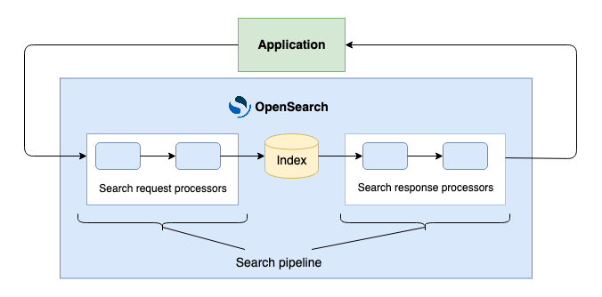

# Search pipelines

You can use search pipelines to build new or reuse existing result rerankers, query rewriters, and other components that operate on queries or results. Search pipelines make it easier for you to process search queries and search results within OpenSearch.

## Ignoring processor failures
By default, a search pipeline stops if one of its processors fails. If you want the pipeline to continue running when a processor fails, you can set the ignore_failure parameter for that processor to true when creating the pipeline

## Terminology

The following is a list of search pipeline terminology:

- **Search request processor**: A component that intercepts a search request (the query and the metadata passed in the request), performs an operation with or on the search request, and returns the search request.
- **Search response processor**: A component that intercepts a search response and search request (the query, results, and metadata passed in the request), performs an operation with or on the search response, and returns the search response.
- **Search phase results processor**: A component that runs between search phases at the coordinating node level. A search phase results processor intercepts the results retrieved from one search phase and transforms them before passing them to the next search phase.
- **Processor**: Either a search request processor or a search response processor.
- **Search pipeline**: An ordered list of processors that is integrated into OpenSearch. The pipeline intercepts a query, performs processing on the query, sends it to OpenSearch, intercepts the results, performs processing on the results, and returns them to the calling application, as shown in the following diagram.

## Search processors

Search processors can be of the following types:

- Search request processors
- Search response processors
- Search phase results processors

### Search request processors

A search request processor intercepts a search request (the query and the metadata passed in the request), performs an operation with or on the search request, and submits the search request to the index.

The following table lists all supported search request processors.

| Processor | Description | Earliest available version |
|-----------|-------------|----------------------------|
| agentic_query_translator | Translates agentic queries into OpenSearch query domain-specific language (DSL) and executes an agent to process the query. | 3.2 |
| filter_query | Adds a filtering query that is used to filter requests. | 2.8 |
| ml_inference | Invokes registered machine learning (ML) models in order to rewrite queries. | 2.16 |
| neural_query_enricher | Sets a default model for neural search and neural sparse search at the index or field level. | 2.11 (neural), 2.13 (neural sparse) |
| neural_sparse_two_phase_processor | Accelerates the neural sparse query. | 2.15 |
| oversample | Increases the search request size parameter, storing the original value in the pipeline state. | 2.12 |
| script | Adds a script that is run on newly indexed documents. | 2.8 |

### Search response processors

A search response processor intercepts a search response and search request (the query, results, and metadata passed in the request), performs an operation with or on the search response, and returns the search response.

The following table lists all supported search response processors.

| Processor | Description | Earliest available version |
|-----------|-------------|----------------------------|
| agentic_context | Returns the agent summary, generated query, and memory ID for an agentic query. | 3.3 |
| collapse | Deduplicates search hits based on a field value, similarly to collapse in a search request. | 2.12 |
| hybrid_score_explanation | Adds detailed scoring information to search results when the explain parameter is enabled, providing information about score normalization, combination techniques, and individual score calculations in hybrid queries. | 2.19 |
| ml_inference | Invokes registered machine learning (ML) models in order to incorporate model output as additional search response fields. | 2.16 |
| personalize_search_ranking | Uses Amazon Personalize to rerank search results (requires setting up the Amazon Personalize service). | 2.9 |
| rename_field | Renames an existing field. | 2.8 |
| rerank | Reranks search results using a cross-encoder model. | 2.12 |
| retrieval_augmented_generation | Used for retrieval-augmented generation (RAG) in conversational search. | 2.10 (generally available in 2.12) |
| sort | Sorts an array of items in either ascending or descending order. | 2.16 |
| split | Splits a string field into an array of substrings based on a specified delimiter. | 2.17 |
| truncate_hits | Discards search hits after a specified target count is reached. Can undo the effect of the oversample request processor. | 2.12 |

### Search phase results processors

A search phase results processor runs between search phases at the coordinating node level. It intercepts the results retrieved from one search phase and transforms them before passing them to the next search phase.

The following table lists all supported search phase results processors.

| Processor | Description | Earliest available version |
|-----------|-------------|----------------------------|
| normalization-processor | Intercepts the query phase results and normalizes and combines the document scores before passing the documents to the fetch phase. | 2.10 |