# Manual Ingest Workflow - Mermaid Diagram

This diagram shows the complete workflow for manually ingesting data with embeddings into OpenSearch.

```mermaid
flowchart TD
    Start([🚀 Start Manual Ingest]) --> Auth{🔐 Authentication Required?}
    
    Auth -->|Yes| AuthClient["🔑 Initialize OpenSearch Client
    with SSL & Credentials"]
    Auth -->|No| NoAuthClient["🌐 Initialize OpenSearch Client
    without Authentication"]
    
    AuthClient --> MLClient[🤖 Initialize ML Commons Client]
    NoAuthClient --> MLClient
    
    MLClient --> RegisterModel["📦 Register Pre-trained Model
    huggingface/sentence-transformers/
    msmarco-distilbert-base-tas-b"]
    
    RegisterModel --> WaitDeploy{⏳ Model Deployed?}
    WaitDeploy -->|No| Sleep[😴 Sleep 5 seconds]
    Sleep --> WaitDeploy
    WaitDeploy -->|Yes| ModelReady["✅ Model Ready
    Get Model ID"]
    
    ModelReady --> CreatePipeline["🔧 Create Ingest Pipeline
    'interns_embedding_pipeline'"]
    
    CreatePipeline --> PipelineConfig["⚙️ Configure Pipeline Processors:
    • COMPANY → company_embedding_vector
    • JOB_TITLE → job_title_embedding_vector
    • JOB_CONTENT_TEXT → job_content_text_embedding_vector"]
    
    PipelineConfig --> CreateIndex[🗃️ Create Index 'interns']
    
    CreateIndex --> IndexConfig["📋 Configure Index:
    • Enable KNN: true
    • Set default pipeline
    • Map text fields
    • Map vector fields (768 dimensions)
    • HNSW algorithm with L2 distance"]
    
    IndexConfig --> LoadData["📊 Load Sample Data
    from interns_sample.parquet"]
    
    LoadData --> ProcessData["🔄 Process First 10 Records
    Convert DataFrame to Actions"]
    
    ProcessData --> BulkIndex["⚡ Bulk Index Documents
    with Auto-Generated Embeddings"]
    
    BulkIndex --> Success["🎉 Success!
    Documents Indexed with Embeddings"]
    
    %% Styling
    classDef startEnd fill:#4CAF50,stroke:#2E7D32,stroke-width:3px,color:white
    classDef process fill:#2196F3,stroke:#1565C0,stroke-width:2px,color:white
    classDef decision fill:#FF9800,stroke:#F57C00,stroke-width:2px,color:white
    classDef config fill:#9C27B0,stroke:#6A1B9A,stroke-width:2px,color:white
    classDef data fill:#607D8B,stroke:#37474F,stroke-width:2px,color:white
    classDef wait fill:#FFC107,stroke:#F57F17,stroke-width:2px,color:black
    
    class Start,Success startEnd
    class AuthClient,NoAuthClient,MLClient,RegisterModel,ModelReady,CreatePipeline,CreateIndex,BulkIndex process
    class Auth,WaitDeploy decision
    class PipelineConfig,IndexConfig config
    class LoadData,ProcessData data
    class Sleep wait
```

## Workflow Steps Explanation

### 1. **Initialization Phase** 🚀
- Start the manual ingest process
- Configure OpenSearch client based on authentication requirements
- Initialize ML Commons client for model management

### 2. **Model Setup Phase** 🤖
- Register the pre-trained sentence transformer model from HuggingFace
- Wait for model deployment to complete
- Retrieve the model ID for pipeline configuration

### 3. **Pipeline Creation Phase** 🔧
- Create an ingest pipeline named `interns_embedding_pipeline`
- Configure text embedding processors to transform:
  - `COMPANY` → `company_embedding_vector`
  - `JOB_TITLE` → `job_title_embedding_vector` 
  - `JOB_CONTENT_TEXT` → `job_content_text_embedding_vector`

### 4. **Index Configuration Phase** 🗃️
- Create the `interns` index with KNN enabled
- Set the ingest pipeline as default
- Configure mappings for both text fields and 768-dimensional vector fields
- Use HNSW algorithm with L2 distance for vector search

### 5. **Data Ingestion Phase** 📊
- Load sample data from `interns_sample.parquet`
- Process the first 10 records
- Convert DataFrame to bulk action format
- Index documents with automatic embedding generation

### 6. **Completion** 🎉
- Verify successful indexing
- Documents are now searchable with both text and vector queries