# OpenTelemetry (OTel) Log Ingestion Demo Guide

```mermaid
graph LR
    A["🎲 Flask Application<br/><br/>generate_otel_logs.py<br/>Generates OTel logs<br/>via OpenTelemetry SDK"] -->|Writes logs| B["📄 Log File<br/><br/>test.log<br/>Mounted as volume"]
    
    B -->|Tails logs| C["🔄 Fluent Bit<br/><br/>fluent-bit.conf<br/>Reads & forwards logs"]
    
    C -->|HTTP POST to /log/ingest<br/>Port 2021| D["⚙️ Data Prepper<br/><br/>log_pipeline.yaml<br/>HTTP Source"]
    
    D -->|Grok Parsing<br/>Custom Pattern| E["🔧 Grok Processor<br/><br/>Parses OTel logs<br/>Extracts timestamp, level, message"]
    
    E -->|Sends logs| F["🔐 OpenSearch Sink<br/><br/>opensearch:9200<br/>Index: apache_logs"]
    
    F -->|Visualized in| G["📊 OpenSearch Dashboards<br/><br/>http://localhost:5601<br/>Query & analyze OTel logs"]
    
    style A fill:#FF6B6B,stroke:#C92A2A,color:#fff,stroke-width:3px
    style B fill:#4ECDC4,stroke:#0B7285,color:#fff,stroke-width:2px
    style C fill:#45B7D1,stroke:#0C3B66,color:#fff,stroke-width:3px
    style D fill:#FFA502,stroke:#D97706,color:#fff,stroke-width:3px
    style E fill:#95E1D3,stroke:#38B000,color:#000,stroke-width:2px
    style F fill:#667BC6,stroke:#2D3561,color:#fff,stroke-width:3px
    style G fill:#DA70D6,stroke:#9D1EA8,color:#fff,stroke-width:3px
```



This guide demonstrates a modern observability setup using **OpenTelemetry (OTel)** for structured logging and tracing. This example shows how to ingest application logs that are generated with OpenTelemetry instrumentation through the pipeline: 
**Flask Application (OTel) → Log File → Fluent Bit → Data Prepper → OpenSearch**

## Understanding the Components in the OpenSearch Ecosystem

### 1. OpenTelemetry (OTel): Unified Observability Standard

#### What is OpenTelemetry?

OpenTelemetry is a vendor-neutral, open-source observability framework that provides APIs, SDKs, and tools for collecting telemetry data (logs, traces, and metrics) from applications. It's designed to make applications observable by default with standardized instrumentation.

#### Key Capabilities

- **Structured Logging**: Generate logs with built-in context, trace IDs, and span IDs for correlation
- **Distributed Tracing**: Track requests across microservices with automatic trace context propagation
- **Metrics Collection**: Collect application performance metrics (latency, throughput, errors)
- **Unified Instrumentation**: Single API for logs, traces, and metrics across all languages
- **Exporter Architecture**: Send telemetry to multiple backends (Jaeger, Zipkin, Data Prepper, etc.)
- **Context Propagation**: Automatically include trace context in every log entry for correlation
- **Language Support**: Available for Python, Java, Go, Node.js, .NET, Ruby, PHP, and more

#### When to Use OpenTelemetry

- **Microservices Architecture**: Need to correlate logs across multiple services with trace IDs
- **Distributed Tracing**: Debugging complex request flows through multiple systems
- **Application Observability**: Need logs, metrics, and traces from the same instrumentation
- **Vendor Independence**: Don't want to be locked into one observability vendor
- **Full Stack Visibility**: Want to track requests from frontend to backend to database
- **Production Debugging**: Need detailed context for troubleshooting production issues

#### Use Case in This Project

In our OTel log ingestion example:

```python
from opentelemetry import trace
from opentelemetry.exporter.otlp.proto.grpc._log_exporter import OTLPLogExporter
from opentelemetry.sdk.resources import Resource
from opentelemetry.sdk._logs import LoggerProvider

# Create a service resource with OTel
resource = Resource.create({"service.name": "demo-dice"})
logger_provider = LoggerProvider(resource=resource)
otlp_exporter = OTLPLogExporter()

# Get a tracer for distributed tracing
tracer = trace.get_tracer("dice-roller")

@app.route("/rolldice")
def roll_dice():
    with tracer.start_as_current_span("roll"):
        result = randint(1, 6)
        logging.info(f"Rolled: {result}")  # Log includes trace context
```

Benefits:
- Each log entry includes the `service.name` attribute
- Spans are created for each operation (roll)
- Logs can be correlated to traces via trace IDs
- Structured format enables better querying in OpenSearch

---

### 2. Fluent Bit: Lightweight Data Collection Agent

*(Refer to the Apache log ingestion README for detailed Fluent Bit documentation)*

#### Specific OTel Use Case

In this OTel example, Fluent Bit:
1. **Tails** the `test.log` file containing OTel-instrumented application logs
2. **Preserves** the structured format of OTel logs (they're already JSON-like)
3. **Forwards** logs to Data Prepper at port 2021

The key difference from Apache logs: OTel logs are typically already structured with fields like:
```
2025-11-03 10:45:23 - INFO - User: anonymous rolled: 4
```

Instead of raw unstructured text:
```
63.173.168.120 - - [04/Nov/2021:15:07:25 -0500] "GET /search/tag/list HTTP/1.0" 200 5003
```

---

### 3. Data Prepper: Processing OTel Data

#### OTel-Specific Capabilities

While Data Prepper works with any log format, it has special support for OTel:

- **OTel Proto Source**: Native support for OpenTelemetry Protocol (OTLP) for direct ingestion
- **Trace Processing**: Can receive and process distributed traces, not just logs
- **Span Processors**: Extract and transform trace spans before indexing
- **Service Map**: Automatically generate service dependency maps from trace data
- **Correlation**: Link logs to traces using trace IDs and span IDs

#### When to Use Data Prepper for OTel

- **Full Observability Stack**: Processing logs AND traces together
- **OpenSearch Integration**: Want native OpenSearch support for trace analysis
- **Service Maps**: Need automatic service dependency visualization
- **Complex OTel Pipelines**: Multiple sources (logs, traces, metrics) being processed

---

### 4. Grok Processor: Parsing OTel Logs

#### OTel Parsing Example

In this project, the Grok processor uses a **custom pattern** to parse OTel logs:

```yaml
processor:
  - grok:
      match:
        message: ['%{TIMESTAMP_ISO8601:timestamp} - %{LOGLEVEL:loglevel} - %{GREEDYDATA:log_message}']
```

**Raw OTel Log:**
```
2025-11-03 10:45:23 - INFO - User: anonymous rolled: 4
```

**After Grok Processing (Structured Fields):**
```json
{
  "timestamp": "2025-11-03T10:45:23",
  "loglevel": "INFO",
  "log_message": "User: anonymous rolled: 4"
}
```

#### Advantages of OTel Logs Over Apache Logs

- **Standardized Fields**: Consistent structure across all logs
- **Context Inclusion**: Service name, trace ID, span ID built-in
- **Queryable**: Each field is independently searchable and aggregatable
- **Less Parsing**: OTel logs are semi-structured; Grok processing is simpler

---

### 5. OpenTelemetry Protocol (OTLP) - Alternative to Log Files

#### What is OTLP?

OTLP is the native protocol for OpenTelemetry. Instead of writing logs to files (which then need to be collected by Fluent Bit), applications can send telemetry directly to Data Prepper via OTLP.

#### When to Use OTLP vs. File Logging

| Aspect | File Logging + Fluent Bit | OTLP Direct |
|--------|--------------------------|-------------|
| Setup Complexity | Medium (need log files) | Low (direct network) |
| Latency | 5-10 seconds (file tailing) | <100ms (network) |
| Resource Usage | Low (minimal overhead) | Low (optimized protocol) |
| Batch Processing | Efficient (file batches) | Efficient (OTLP batching) |
| Log Shipping Duration | Tailed by interval | Immediate |
| Requires Log Files | ✅ Yes | ❌ No |
| Container-Native | Not ideal | ✅ Ideal |
| Multiple Destinations | ✅ Easy | ⚠️ Requires agent |

#### OTLP Configuration Example

Instead of logging to a file, applications can send directly to Data Prepper:

```python
from opentelemetry.exporter.otlp.proto.grpc.log_exporter import OTLPLogExporter
from opentelemetry.sdk.resources import Resource
from opentelemetry.sdk._logs import LoggerProvider

# Configure OTLP exporter to send directly to Data Prepper
resource = Resource.create({"service.name": "my-app"})
otlp_exporter = OTLPLogExporter(
    endpoint="http://data-prepper:4317"  # OTLP gRPC endpoint
)
logger_provider = LoggerProvider(resource=resource)
logger_provider.add_log_record_processor(BatchLogRecordProcessor(otlp_exporter))
```

Data Prepper's `otel_trace_source` and `otel_logs_source` can receive this data natively.

---

## Choosing Your Observability Approach

### Option 1: Traditional File-Based Logging (This Project)

```
Application → Log File → Fluent Bit → Data Prepper → OpenSearch
```

**Pros:**
- Works with any application (no instrumentation needed)
- Reliable (logs persisted to disk)
- Can use existing logging frameworks
- Fluent Bit provides buffering and retries

**Cons:**
- Higher latency (file I/O + tailing)
- Requires file system access
- Log files need cleanup

**Best For:** Legacy applications, traditional logging, when you need reliability

### Option 2: Direct OTLP (More Modern)

```
Application → Data Prepper (OTLP Source) → OpenSearch
```

**Pros:**
- Low latency (<100ms)
- Built-in distributed tracing
- No file system needed
- Logs include trace context automatically
- Better for microservices

**Cons:**
- Requires application instrumentation with OTel SDK
- Network dependency
- No local persistence

**Best For:** New microservices, cloud-native apps, distributed systems

### Option 3: Hybrid (Best of Both Worlds)

```
Application → Log File → Fluent Bit → Data Prepper ← Direct OTLP from other services
                                     → OpenSearch
```

**Use Case:** Mix of legacy and modern services in the same infrastructure

---

## List of Components

- An OpenSearch domain running through Docker.
- A FluentBit agent running through Docker using `fluent-bit.conf`.
- Data Prepper, which includes a `log_pipeline.yaml` and `data-prepper-config.yaml` for data-prepper server configuration running through Docker.
- An OpenTelemetry-instrumented Flask application in the form of a Python script.

### Fluent Bit and OpenSearch Setup

1. Take a look at the [docker-compose.yaml](docker-compose.yaml). This `docker-compose.yaml` will pull the FluentBit and OpenSearch Docker images and run them in the `opensearch-net` Docker network.

2. Now take a look at the [fluent-bit.conf](fluent-bit.conf). This config will tell FluentBit to tail the `/var/log/test.log` file for logs, and uses the FluentBit http output plugin to forward these logs to the http source of Data Prepper, which runs by default on port 2021. The `fluent-bit.conf` file is mounted as a Docker volume through the `docker-compose.yaml`.

3. An empty file named `test.log` has been created. This file is also mounted through the `docker-compose.yaml`, and will be the file FluentBit is tailing to collect logs from.

4. Now that you understand a bit more about how FluentBit and OpenSearch are set up, run them with:

```bash
docker compose --project-name data-prepper up
```

This can be verified using http://127.0.0.1:5601/

Once you are able to access the OpenSearch Dashboard, you can run Data Prepper.

### Data Prepper Setup

1. Take a look at [log_pipeline.yaml](log_pipeline.yaml). This configuration will:
   - Take logs sent to the HTTP source on port 2021
   - Process them with the Grok Processor to extract timestamp, log level, and message
   - Send the processed logs to OpenSearch to an index named `apache_logs`

2. The [data-prepper-config.yaml](data-prepper-config.yaml) is mounted in `docker-compose.yaml` and configures the Data Prepper server authentication.

3. Data Prepper should start automatically with the docker compose command above. If running separately:

```bash
docker compose -f docker-compose.yaml up data-prepper
```

### OpenTelemetry Application (Flask)

1. Take a look at [generate_otel_logs.py](generate_otel_logs.py). This Flask application:
   - Is instrumented with OpenTelemetry for structured logging
   - Creates a service resource named "demo-dice"
   - Generates distributed traces for each operation
   - Writes logs to `test.log` where Fluent Bit can tail them

2. To run the application:

```bash
# Install dependencies
pip install flask opentelemetry-api opentelemetry-sdk opentelemetry-exporter-otlp

# Run the Flask app
python generate_otel_logs.py
```

3. The Flask app will run on http://localhost:5002. To generate logs:

```bash
# Roll the dice 100 times and generate logs
curl "http://localhost:5002/rolldice?user=test-user"
```

Each request will:
- Create 100 dice rolls
- Log each roll with OpenTelemetry context
- Write logs to `test.log`
- Fluent Bit will tail these logs
- Data Prepper will process and parse them
- OpenSearch will index them
- You can view them in OpenSearch Dashboards at http://localhost:5601

### Verifying the Data Flow

1. Check that logs are being written to `test.log`:
   ```bash
   tail -f test.log
   ```

2. Check Data Prepper logs to confirm it's receiving and processing data:
   ```bash
   docker logs data-prepper
   ```

3. Check OpenSearch for indexed logs:
   ```bash
   curl -u admin:Developer@123 -k https://localhost:9200/apache_logs/_search?pretty
   ```

4. View the logs in OpenSearch Dashboards:
   - Navigate to http://localhost:5601
   - Create an index pattern for `apache_logs`
   - View the logs in the Discover tab

---

## OTel vs Apache Logs: Key Differences

| Aspect | Apache Logs (Apache Example) | OTel Logs (This Example) |
|--------|------------------------------|--------------------------|
| Format | Apache Common Log Format | Structured (OTel) |
| Fields | IP, Method, Path, Status | Timestamp, Level, Message + OTel Context |
| Parsing Needed | ✅ Yes (Grok) | Minimal (semi-structured) |
| Trace Correlation | ❌ No | ✅ Yes (trace IDs) |
| Service Context | ❌ No | ✅ Yes (service name) |
| Application Integration | Not usually instrumented | ✅ Instrumented with OTel SDK |
| Latency | Medium (file-based) | Can be low (OTLP option) |
| Best For | Web servers, traditional apps | Modern apps, microservices |

---

## Next Steps

1. **Explore OTel Capabilities**: Modify `generate_otel_logs.py` to add custom attributes and metrics
2. **Add More Services**: Create multiple OTel-instrumented services to see trace correlation
3. **Set Up OTLP Direct**: Replace file-based logging with direct OTLP protocol
4. **Service Maps**: Enable service map generation in Data Prepper to visualize service dependencies
5. **Alerting**: Set up OpenSearch alerting based on OTel log patterns
