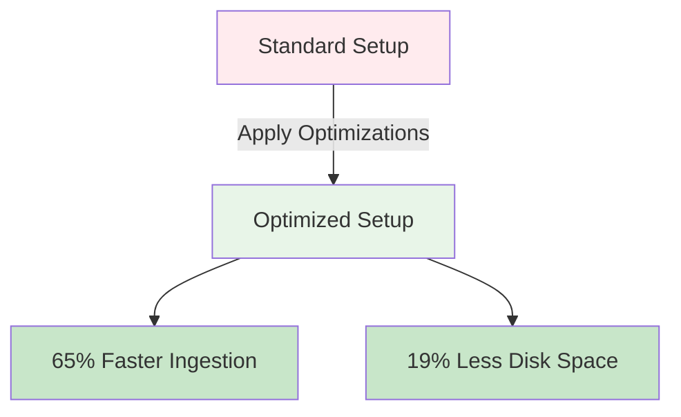
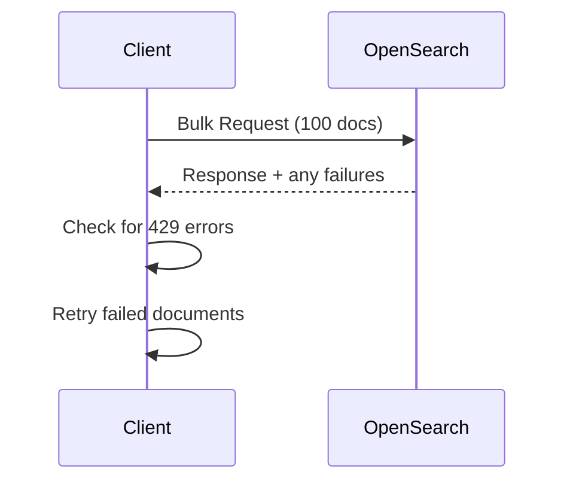
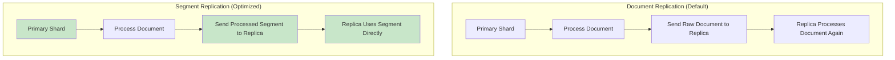

# OpenSearch Ingestion Optimization Guide


> **Performance Results**: These techniques can improve ingestion speed by **65%** and reduce disk storage by **19%**.

## 📊 Performance Overview



## 🚀 1. Client-Side Optimization

### Use Bulk API
Always use the `_bulk` endpoint for multiple documents:

```json
POST _bulk
{"index": {"_index": "my-index", "_id": "1"}}
{"title": "Document 1", "content": "Sample content"}
{"index": {"_index": "my-index", "_id": "2"}}
{"title": "Document 2", "content": "More content"}
```

### Key Strategies:
- **Batch Size**: Start with 100 documents, increase until performance plateaus
- **Multi-threading**: Use async clients for parallel requests
- **Error Handling**: Check for 429 status codes, implement exponential backoff



## ⚙️ 2. JVM Configuration

Set JVM heap to **50% of available memory**:

```bash
# For 32GB server, use 16GB heap
# Tarball install: /config/jvm.options
-Xms16g
-Xmx16g

# Container install:
OPENSEARCH_JAVA_OPTS="-Xms16g -Xmx16g"
```

## 💾 3. Translog Optimization

Increase translog flush threshold to **25% of JVM heap**:

```json
POST my-index/_settings
{
  "index": {
    "translog.flush_threshold_size": "4GB"
  }
}
```


## 🔄 4. Replication Strategy

### Enable Segment Replication
More efficient than document replication:

```json
POST my-index/_settings
{
  "index": {
    "replication.type": "SEGMENT"
  }
}
```

### Document vs Segment Replication:



## ⏱️ 5. Refresh Interval

Increase refresh interval for better performance:

```json
POST my-index/_settings
{
  "index": {
    "refresh_interval": "30s"
  }
}
```

## 🗜️ 6. Compression

Enable ZSTD compression to save disk space:

```json
POST my-index/_settings
{
  "index": {
    "codec": "zstd_no_dict",
    "codec.compression_level": 3
  }
}
```

## 🎯 7. Complete Configuration

### Cluster Settings:
```json
PUT _cluster/settings
{
  "persistent": {
    "cluster.routing.allocation.balance.prefer_primary": true,
    "segrep.pressure.enabled": true
  }
}
```

### Index Settings:
```json
PUT my-optimized-index
{
  "settings": {
    "number_of_shards": 3,
    "number_of_replicas": 1,
    "codec": "zstd_no_dict",
    "replication.type": "SEGMENT",
    "refresh_interval": "30s",
    "translog.flush_threshold_size": "2GB"
  }
}
```

## 📈 Optimization Checklist

- [ ] Use bulk API with optimal batch size
- [ ] Configure JVM heap (50% of RAM)
- [ ] Set translog threshold (25% of heap)
- [ ] Enable segment replication
- [ ] Increase refresh interval
- [ ] Enable ZSTD compression
- [ ] Balance primary shards across nodes

## 🎓 Student Exercise

Try implementing these optimizations on a test index and measure the performance difference using the `_stats` API:

```bash
curl -X GET "localhost:9200/my-index/_stats/indexing,store"
```

**Next Steps**: Practice with different batch sizes and monitor your cluster's performance metrics.s