# 📖 AI Search - Complete Learning Guide

## 🎯 Quick Navigation

### For Students - Where to Start?

**I'm new to AI-powered search** → Start here:
1. Read Module 1: Semantic Search - Understanding vector-based retrieval
2. Then Module 2: Hybrid Search - Combining keyword and semantic
3. Practice with the provided notebooks

**I want to build semantic search** → Follow this path:
```
1. Semantic Search (1. semantic_search/)
   ↓
2. Hybrid Search (2. hybrid_search/)
   ↓
3. Neural Sparse Search (3. neural_sparse_search/)
   ↓
4. Specialized Techniques (4. specialized_vector_search/)
```

**I want to understand different search types** → Check:
- Semantic Search: Dense vector embeddings
- Hybrid Search: BM25 + Vector combined
- Neural Sparse: Learned sparse representations
- Specialized: Advanced vector techniques

---

## 🏗️ Learning Path Overview

```mermaid
graph TD
    Start["🚀 START HERE<br/>AI Search Basics"] --> M1["Module 1<br/>Semantic Search<br/>Dense Vectors"]
    
    M1 --> M2["Module 2<br/>Hybrid Search<br/>Best of Both Worlds"]
    
    M2 --> M3["Module 3<br/>Neural Sparse<br/>Learned Sparse"]
    
    M3 --> M4["Module 4<br/>Specialized<br/>Advanced Techniques"]
    
    M4 --> Production["🏆 PRODUCTION<br/>AI-Powered Search"]
    
    classDef start fill:#e1f5fe,stroke:#01579b,stroke-width:3px,color:#000
    classDef module fill:#c8e6c9,stroke:#2e7d32,stroke-width:2px,color:#000
    classDef prod fill:#f8bbd0,stroke:#c2185b,stroke-width:3px,color:#000
    
    class Start start
    class M1,M2,M3,M4 module
    class Production prod
```



---

## 📁 Folder Structure

### 1. semantic_search/
**Purpose:** Learn dense vector embeddings for semantic understanding

**Files:**
- `semantic_search_tutorial.ipynb` - Complete interactive tutorial

**Key Topics:**
- Dense vector embeddings
- Cosine similarity
- Semantic understanding
- Context-aware search
- Embedding models (Sentence Transformers, OpenSearch ML)
- KNN search configuration
- Vector index optimization

**What You'll Learn:**
- How to generate dense embeddings
- Building semantic search indices
- Querying with vector similarity
- Understanding semantic vs keyword search
- Performance optimization for vector search

**Use Cases:**
- Find documents by meaning, not just keywords
- Question-answering systems
- Document similarity
- Recommendation systems
- Cross-lingual search

---

### 2. hybrid_search/
**Purpose:** Combine keyword (BM25) and semantic (vector) search for best results

**Files:**
- `hybrid_search_use_cases.ipynb` - Real-world hybrid search patterns

**Key Topics:**
- BM25 scoring (traditional keyword)
- Dense vector scoring (semantic)
- Score normalization
- Weighted combination
- Reciprocal Rank Fusion (RRF)
- Query-time boosting
- Field-level hybrid strategies

**What You'll Learn:**
- When to use hybrid vs pure semantic
- Balancing keyword and semantic signals
- Implementing RRF and other fusion methods
- Tuning weight parameters
- Handling diverse query types

**Use Cases:**
- E-commerce product search (exact match + semantic)
- Enterprise search (precision + recall)
- Content discovery (keyword fallback)
- Multi-language search
- Domain-specific search with terminology

**Why Hybrid?**
- Better than keyword-only search
- More robust than semantic-only search
- Handles both specific and conceptual queries
- Production-proven approach

---

### 3. neural_sparse_search/
**Purpose:** Learned sparse representations for efficient semantic search

**Files:**
- `neural_sparse_search_tutorial.ipynb` - Neural sparse techniques

**Key Topics:**
- SPLADE (Sparse Lexical and Expansion)
- Learned term expansion
- Efficient sparse vectors
- Inverted index compatibility
- Query expansion
- Model fine-tuning

**What You'll Learn:**
- Neural sparse vs dense vectors
- Advantages of sparse representations
- Building neural sparse indices
- Training sparse models
- Performance vs accuracy tradeoffs

**Use Cases:**
- Large-scale semantic search
- Low-latency requirements
- Resource-constrained environments
- Explainable AI search
- Hybrid sparse-dense systems

**Benefits:**
- More efficient than dense vectors
- Better than traditional sparse methods
- Interpretable term weights
- Fast inverted index lookups

---

### 4. specialized_vector_search/
**Purpose:** Advanced vector search techniques and optimizations

**Files:**
- `specialized_vector_search_demo.ipynb` - Advanced techniques

**Key Topics:**
- Multi-vector search
- Colbert-style late interaction
- Approximate nearest neighbors (ANN)
- HNSW graph optimization
- Product quantization
- Scalar quantization
- Binary quantization
- Index compression
- Multi-stage retrieval

**What You'll Learn:**
- Advanced indexing strategies
- Memory optimization techniques
- Speed vs accuracy tradeoffs
- Production scaling patterns
- Domain-specific adaptations

**Use Cases:**
- Billion-scale vector search
- Low-latency production systems
- Memory-constrained deployments
- Multi-modal search (text + images)
- Fine-grained semantic matching

**Advanced Techniques:**
- Vector compression methods
- Hierarchical indexing
- GPU acceleration
- Distributed vector search

---

## 🎓 What You Can Build

```mermaid
graph LR
    A["After Semantic<br/>Search"] --> A1["🧠 Semantic Search<br/>Meaning-based retrieval"]
    
    B["After Hybrid<br/>Search"] --> B1["🎯 Best of Both<br/>Keyword + Semantic"]
    
    C["After Neural<br/>Sparse"] --> C1["⚡ Efficient Semantic<br/>Sparse vectors"]
    
    D["After Specialized<br/>Techniques"] --> D1["🚀 Production Scale<br/>Optimized systems"]
    
    A1 --> Master["🏆 AI-Powered Search Systems"]
    B1 --> Master
    C1 --> Master
    D1 --> Master
    
    classDef m1 fill:#e3f2fd,stroke:#1976d2,stroke-width:2px,color:#000
    classDef m2 fill:#e8f5e9,stroke:#388e3c,stroke-width:2px,color:#000
    classDef m3 fill:#fff3e0,stroke:#d84315,stroke-width:2px,color:#000
    classDef m4 fill:#fce4ec,stroke:#c2185b,stroke-width:2px,color:#000
    classDef master fill:#f1f8e9,stroke:#558b2f,stroke-width:3px,color:#000
    
    class A1 m1
    class B1 m2
    class C1 m3
    class D1 m4
    class Master master
```



---

## 🔄 AI Search Architecture


---

## 📚 Key Concepts

### Semantic Search (Dense Vectors)
- **Embeddings**: Neural network-generated vector representations
- **Similarity**: Cosine distance, L2 distance, inner product
- **Context**: Understanding meaning beyond keywords
- **Models**: BERT, Sentence Transformers, domain-specific

### Hybrid Search
- **Combination**: BM25 + Vector search
- **Normalization**: Making scores comparable
- **Fusion**: RRF, weighted sum, learned combination
- **Fallback**: Keyword when semantic fails

### Neural Sparse Search
- **Learned Sparse**: Neural networks generate sparse vectors
- **Term Expansion**: Automatic synonym generation
- **Efficiency**: Sparse storage, fast lookup
- **Interpretability**: See which terms matter

### Specialized Techniques
- **Quantization**: Compress vectors for efficiency
- **ANN**: Approximate nearest neighbors
- **HNSW**: Hierarchical navigable small world graphs
- **Multi-vector**: Multiple embeddings per document

---

## 🎯 Learning Progression

```mermaid
graph TD
    A["Foundation<br/>Semantic Search"] --> B["Enhancement<br/>Hybrid Search"]
    
    B --> C["Efficiency<br/>Neural Sparse"]
    
    C --> D["Optimization<br/>Specialized Techniques"]
    
    D --> E["Mastery<br/>🏆 Production AI Search"]
    
    classDef f fill:#bbdefb,stroke:#1565c0,stroke-width:2px,color:#000
    classDef e fill:#c8e6c9,stroke:#2e7d32,stroke-width:2px,color:#000
    classDef eff fill:#fff9c4,stroke:#f57f17,stroke-width:2px,color:#000
    classDef o fill:#ffe0b2,stroke:#e65100,stroke-width:2px,color:#000
    classDef m fill:#ce93d8,stroke:#6a1b9a,stroke-width:3px,color:#fff
    
    class A f
    class B e
    class C eff
    class D o
    class E m
```



---

## 💡 Quick Reference Guide

### By Learning Style

**Prefer Interactive Notebooks?**
- All modules have comprehensive Jupyter notebooks
- Run code, see results immediately
- Modify parameters and experiment

**Prefer Step-by-Step Tutorials?**
- Start with `semantic_search_tutorial.ipynb`
- Progress through modules sequentially
- Build on previous knowledge

### By Use Case

**Building Semantic Search?**
- Focus on: Module 1 (Semantic Search)
- Understand: Dense embeddings and KNN
- Result: Meaning-based retrieval

**Need Production Performance?**
- Study: Module 2 (Hybrid) for robustness
- Explore: Module 4 (Specialized) for optimization
- Result: Fast, accurate, scalable search

**Resource Constrained?**
- Focus on: Module 3 (Neural Sparse)
- Benefit: Efficient sparse representations
- Result: Semantic search with less memory

**Building E-commerce/Enterprise Search?**
- Essential: Module 2 (Hybrid Search)
- Combine: Exact match + semantic understanding
- Result: Best search experience

---

## 🚀 Getting Started

### Step 1: Set Up Environment
1. Start OpenSearch with ML support:
   ```bash
   docker-compose -f docker-compose-fully-optimized.yml up
   ```
2. Wait for cluster to be ready
3. Verify ML plugin is loaded

### Step 2: Learn Semantic Search
1. Open `1. semantic_search/semantic_search_tutorial.ipynb`
2. Follow the tutorial step by step
3. Understand embeddings and vector similarity
4. Run sample queries

### Step 3: Explore Hybrid Search
1. Open `2. hybrid_search/hybrid_search_use_cases.ipynb`
2. Compare semantic vs keyword results
3. Implement hybrid strategies
4. Tune weighting parameters

### Step 4: Try Neural Sparse
1. Open `3. neural_sparse_search/neural_sparse_search_tutorial.ipynb`
2. Learn sparse representation advantages
3. Build efficient semantic search
4. Compare with dense vectors

### Step 5: Advanced Techniques
1. Open `4. specialized_vector_search/specialized_vector_search_demo.ipynb`
2. Explore optimization techniques
3. Learn production scaling patterns
4. Implement advanced features

---

## 📊 Search Method Comparison

```mermaid
graph TD
    ROOT["AI Search Methods"]
    
    ROOT --> SEMANTIC["Semantic Search<br/>(Dense Vectors)"]
    SEMANTIC --> S1["✅ Best semantic understanding"]
    SEMANTIC --> S2["✅ Context-aware"]
    SEMANTIC --> S3["❌ Higher memory"]
    SEMANTIC --> S4["❌ Slower at scale"]
    
    ROOT --> HYBRID["Hybrid Search<br/>(BM25 + Vector)"]
    HYBRID --> H1["✅ Best overall results"]
    HYBRID --> H2["✅ Robust to query types"]
    HYBRID --> H3["✅ Production-proven"]
    HYBRID --> H4["⚠️ More complex setup"]
    
    ROOT --> SPARSE["Neural Sparse<br/>(Learned Sparse)"]
    SPARSE --> N1["✅ Efficient storage"]
    SPARSE --> N2["✅ Fast lookup"]
    SPARSE --> N3["✅ Interpretable"]
    SPARSE --> N4["⚠️ Needs training"]
    
    ROOT --> SPECIAL["Specialized<br/>(Optimized)"]
    SPECIAL --> SP1["✅ Production scale"]
    SPECIAL --> SP2["✅ Low latency"]
    SPECIAL --> SP3["✅ Memory efficient"]
    SPECIAL --> SP4["⚠️ Complex tuning"]
    
    classDef root fill:#ffebee,stroke:#b71c1c,stroke-width:3px,color:#000
    classDef method fill:#c8e6c9,stroke:#2e7d32,stroke-width:2px,color:#000
    classDef pro fill:#e8f5e9,stroke:#388e3c,stroke-width:1px,color:#000
    classDef con fill:#ffebee,stroke:#c62828,stroke-width:1px,color:#000
    classDef warn fill:#fff3e0,stroke:#e65100,stroke-width:1px,color:#000
    
    class ROOT root
    class SEMANTIC,HYBRID,SPARSE,SPECIAL method
    class S1,S2,H1,H2,H3,N1,N2,N3,SP1,SP2,SP3 pro
    class S3,S4 con
    class H4,N4,SP4 warn
```



---

## 🔍 Decision Guide: Which Search Method?

### Choose Semantic Search When:
- Understanding meaning is critical
- Context matters more than exact matches
- Building Q&A or recommendation systems
- Working with well-formed queries
- Memory and speed are not constraints

### Choose Hybrid Search When:
- Building production search systems
- Need both precision and recall
- Handling diverse query types
- Users expect both exact and semantic matches
- **This is the recommended default for most applications**

### Choose Neural Sparse When:
- Need semantic search with less memory
- Require explainability
- Working with inverted index infrastructure
- Speed is important
- Can invest in model training

### Choose Specialized Techniques When:
- Scaling to billions of vectors
- Millisecond latency requirements
- Memory is constrained
- Need maximum throughput
- Building production systems

---

## ✨ Tips for Success

1. **Start with Notebooks**: All concepts are demonstrated interactively
2. **Understand Trade-offs**: Each method has strengths and weaknesses
3. **Test with Your Data**: Use your own documents and queries
4. **Measure Performance**: Track latency, throughput, and memory
5. **Start Simple**: Begin with semantic, add hybrid, then optimize
6. **Monitor Quality**: Measure search relevance, not just speed
7. **Iterate**: Tuning is essential for production quality
8. **Consider Hybrid First**: Usually the best choice for production

---

## 🎯 Success Path

```mermaid
graph TD
    A["📖 Read Concepts<br/>Understand embeddings"] --> B["📊 Run Notebooks<br/>Interactive learning"]
    B --> C["🔧 Setup OpenSearch<br/>ML-enabled cluster"]
    C --> D["🧠 Build Semantic<br/>Dense vectors"]
    D --> E["🎯 Add Hybrid<br/>Combine methods"]
    E --> F["⚡ Optimize<br/>Specialized techniques"]
    F --> G["🏆 Production<br/>AI-powered search"]
    
    classDef step1 fill:#e3f2fd,stroke:#1976d2,stroke-width:2px,color:#000
    classDef step2 fill:#e8f5e9,stroke:#388e3c,stroke-width:2px,color:#000
    classDef step3 fill:#fff3e0,stroke:#d84315,stroke-width:2px,color:#000
    classDef step4 fill:#fce4ec,stroke:#c2185b,stroke-width:2px,color:#000
    classDef step5 fill:#f3e5f5,stroke:#6a1b9a,stroke-width:2px,color:#000
    classDef step6 fill:#fff9c4,stroke:#f57f17,stroke-width:2px,color:#000
    classDef step7 fill:#f1f8e9,stroke:#558b2f,stroke-width:2px,color:#000
    
    class A step1
    class B step2
    class C step3
    class D step4
    class E step5
    class F step6
    class G step7
```



---

## ❓ FAQ

**Q: What's the difference between semantic and keyword search?**
A: Keyword matches exact terms; semantic understands meaning and context

**Q: Should I use semantic or hybrid search?**
A: Hybrid is recommended for most production applications - combines both strengths

**Q: What are embeddings?**
A: Vector representations that capture semantic meaning of text

**Q: How much memory do vectors need?**
A: Dense vectors typically use 768-1536 dimensions × 4 bytes per document

**Q: Can I use pre-trained models?**
A: Yes! OpenSearch supports many pre-trained models from HuggingFace

**Q: What's the best embedding model?**
A: Depends on your domain. Start with `all-MiniLM-L6-v2` for general use

**Q: How do I evaluate search quality?**
A: Use metrics like MRR, NDCG, precision@k, and manual relevance judgments

**Q: Is neural sparse better than dense?**
A: Different tradeoffs - sparse is more efficient, dense often more accurate

---

## 📞 Document Types

### Jupyter Notebooks (.ipynb)
- Interactive demonstrations
- Code with explanations
- Visual outputs
- Explorable examples
- Best for learning

---

## 🎓 Core Competencies Developed

After completing this module, you'll understand:

1. **Semantic Search**: Dense vector embeddings and similarity
2. **Hybrid Search**: Combining keyword and semantic signals
3. **Neural Sparse**: Efficient learned sparse representations
4. **Vector Optimization**: Production-ready performance tuning
5. **Embedding Models**: Pre-trained and custom models
6. **Score Fusion**: Combining multiple search signals
7. **Performance**: Memory, speed, and accuracy tradeoffs
8. **Production Patterns**: Scalable AI search systems

---

## 📁 File Organization

```
4. AI_SEARCH/
├── docker-compose-fully-optimized.yml      # ML-enabled OpenSearch
├── 1. semantic_search/
│   └── semantic_search_tutorial.ipynb      # Dense vector search
├── 2. hybrid_search/
│   └── hybrid_search_use_cases.ipynb       # BM25 + Vector
├── 3. neural_sparse_search/
│   └── neural_sparse_search_tutorial.ipynb # Learned sparse
└── 4. specialized_vector_search/
    └── specialized_vector_search_demo.ipynb # Advanced techniques
```

---

## 🔗 Related Modules

**Prerequisites:**
- `2. TRADITIONAL_SEARCH` - Text search fundamentals
- `3. INGEST_AND_SEARCH_CONCEPTS` - Vector basics and embeddings

**Next Steps:**
- `5. AGENTIC_SEARCH` - LLMs, agents, and RAG
- `6. REALTIME_PROJECTS` - Production applications

---

## ✨ Your Learning Journey

This folder contains everything you need to master AI-powered search with OpenSearch.

**From semantic understanding to production optimization!**

**Your AI search expertise starts here! 🚀**

---

## 🎨 Complete Mindmap: AI Search Ecosystem

```mermaid
mindmap
  root((🤖 AI Search<br/>Ecosystem))
    🧠 Semantic Search
      🔢 Dense Embeddings
        Sentence Transformers
        BERT-based models
        Context understanding
        Meaning-based matching
      📍 Vector Similarity
        Cosine similarity
        L2 distance
        Inner product
        Similarity scoring
      🎯 Use Cases
        Meaning-based retrieval
        Question-answering
        Document similarity
        Recommendation systems
      ⚙️ Setup
        Embedding model selection
        Index configuration
        KNN parameters
        Search queries
    🎯 Hybrid Search
      ➕ Score Combination
        BM25 + Vector scoring
        Weighted normalization
        Score fusion methods
        Result aggregation
      🔀 Fusion Methods
        Reciprocal Rank Fusion (RRF)
        Weighted sum scoring
        Min-Max normalization
        Z-score normalization
      ✅ Advantages
        Better than keyword-only
        More robust than semantic-only
        Handles diverse queries
        Production-proven approach
      🛠️ Implementation
        Dual indexing
        Parallel queries
        Score normalization
        Parameter tuning
    ⚡ Neural Sparse
       📊 Sparse Vectors
        Learned sparse representation
        Term expansion
        Efficiency advantage
        Interpretability
       🧠 SPLADE Model
        Sparse Lexical andExpansion
        Neural sparse encoding
        Learned importance weights
        Efficient lookup
       💡 Benefits
        Lower memory usage
        Faster retrieval
        Explainable weights
        Inverted index compatible
       🎓 Learning
        Model training
        Fine-tuning approaches
        Performance tuning
        Optimization strategies
    🚀 Specialized Techniques
       🎯 Advanced Indexing
        Multi-vector search
        ColBERT late interaction
        Hierarchical indexing
        GPU acceleration
       📉 Quantization
        Product quantization
        Scalar quantization
        Binary quantization
        Dimension reduction
       📊 Optimization
        Approximate NN (ANN)
        HNSW graphs
        Index compression
        Memory efficiency
       ⚙️ Scaling
        Billion-scale vectors
        Distributed search
        Multi-stage retrieval
        Performance tuning
    🔄 Architecture Pattern
       📥 Input Processing
        Query embedding
        Text preprocessing
        Batch handling
        Stream processing
       🗂️ Storage Layer
        Dense vector index
        Sparse vector index
        Text BM25 index
        Hybrid configuration
       🔍 Search Methods
        Semantic search
        Neural sparse search
        BM25 keyword search
        Hybrid combination
       📈 Ranking & Fusion
        Score normalization
        Result fusion
        Re-ranking options
        Final scoring
       📤 Results
        Ranked documents
        Relevance scores
        Metadata enrichment
        Client delivery
     📊 Comparison Matrix
      Dense Vectors
        Best semantic understanding
        Context-aware matching
        Higher memory usage
        Slower at scale
      BM25 (Keyword)
        Exact term matching
        Fast lookup
        Good precision
        Limited context
      Hybrid
        Best overall results
        Balanced approach
        Production-ready
        Recommended default
      Neural Sparse
        Efficient semantics
        Interpretable weights
        Lower memory
        Training required
     🎓 Decision Framework
      Choose Semantic When
        Meaning is critical
        Context matters most
        Memory available
        Speed not critical
      Choose Hybrid When
        Production systems
        Need precision & recall
        Diverse query types
        User expectations high
      Choose Neural Sparse When
        Memory constrained
        Need interpretability
        Can train models
        Speed important
      Choose Specialized When
        Billion-scale data
        Sub-millisecond latency
        Memory critical
        Complex optimization needed
    🏆 Best Practices
      Model Selection
        Domain relevance
        Model size
        Language support
        Performance testing
      Index Configuration
        Similarity metrics
        KNN parameters
        Refresh policies
        Resource allocation
      Query Optimization
        Query complexity
        Filter efficiency
        Cache strategies
        Monitoring
      Monitoring & Tuning
        Query latency tracking
        Relevance metrics
        Resource utilization
        Continuous improvement
```



---

