# Cross-Encoder Model Registration & Deployment Guide

## 📚 Overview
This guide demonstrates how to **register, deploy, and use a cross-encoder model** (MS-MARCO DistilBERT) in OpenSearch for semantic similarity scoring. Cross-encoders directly score the relevance between a query and documents, unlike bi-encoders that encode independently.

### 🎯 Key Concept
- **Cross-Encoder**: Takes query and document pairs as input and outputs a similarity score
- **Use Case**: Re-ranking search results to find the most relevant documents
- **Model**: `huggingface/cross-encoders/ms-marco-MiniLM-L-6-v2` - a lightweight, fast ranking model

---

## 🔄 Complete Workflow Diagram

```mermaid
graph TD
    A["🚀 Start: Initialize OpenSearch Client"] --> B["⚙️ Configure Cluster Settings<br/>Enable ML Commons Plugin"]
    B --> C["👥 Register Model Group<br/>Container for related models"]
    C --> D["📦 Register Model<br/>Download from HuggingFace"]
    D --> E["⏳ Poll Task Status<br/>Wait for registration"]
    E --> F{Registration<br/>Complete?}
    F -->|No| E
    F -->|Yes| G["🎯 Extract Model ID"]
    G --> H["🚀 Deploy Model<br/>Load into memory"]
    H --> I["⏳ Poll Deployment Status<br/>Wait for ready state"]
    I --> J{Deployment<br/>Complete?}
    J -->|No| I
    J -->|Yes| K["🔍 Make Predictions<br/>Score query-document pairs"]
    K --> L["📊 Get Results<br/>Similarity scores"]
```



---

## 📋 Step-by-Step Explanation

### **Step 1: Initialize OpenSearch Client** 🔌
```python
client = OpenSearch(
    hosts=[{'host': HOST, 'port': 9200}],
    http_auth=('admin', 'Developer@123'),
    use_ssl=True,
    verify_certs=False,
    connection_class=RequestsHttpConnection
)
```

**What's happening?**
- Creates a connection to the OpenSearch cluster
- Uses HTTPS (SSL) for secure communication
- Authenticates with username/password credentials

**Why it matters:** 🔐 Secure connection ensures data privacy and authorized access

---

### **Step 2: Configure Cluster Settings** ⚙️

```python
client.cluster.put_settings(body={
    "persistent": {
        "plugins": {
            "ml_commons": {
                "allow_registering_model_via_url": "true",
                "only_run_on_ml_node": "false",
                "model_access_control_enabled": "true",
                "native_memory_threshold": "99"
            }
        }
    }
})
```

**Configuration Breakdown:**

| Setting | Value | Purpose |
|---------|-------|---------|
| `allow_registering_model_via_url` | true | Allow models from external URLs |
| `only_run_on_ml_node` | false | Run ML on any node (not just dedicated ML nodes) |
| `model_access_control_enabled` | true | Enable security/permissions for models |
| `native_memory_threshold` | 99 | Use up to 99% of native memory for models |

**Timeline Visualization:**


---

### **Step 3: Register Model Group** 👥

```python
model_group_name = f"local_model_group_{int(time.time())}"
model_group_response = client.transport.perform_request(
    method='POST',
    url='/_plugins/_ml/model_groups/_register',
    body={
        "name": model_group_name,
        "description": "A model group for local models"
    }
)
model_group_id = model_group_response['model_group_id']
```

**Why create a model group?** 🗂️
- Organize multiple related models
- Apply consistent access controls
- Simplify management and monitoring

**Response Structure:**


---

### **Step 4: Register the Model** 📦

```python
register_response = client.transport.perform_request(
    method='POST',
    url='/_plugins/_ml/models/_register',
    body={
        "name": "huggingface/cross-encoders/ms-marco-MiniLM-L-6-v2",
        "version": "1.0.2",
        "model_group_id": model_group_id,
        "model_format": "TORCH_SCRIPT",
        "function_name": "TEXT_SIMILARITY",
    }
)
```

**Model Registration Parameters:**

| Parameter | Value | Explanation |
|-----------|-------|-------------|
| `name` | huggingface/... | Model identifier from HuggingFace Hub |
| `version` | 1.0.2 | Model version for tracking |
| `model_group_id` | UUID | Links to the model group |
| `model_format` | TORCH_SCRIPT | Optimized format for inference |
| `function_name` | TEXT_SIMILARITY | Scoring mode for cross-encoder |

**Response:** Returns `task_id` for tracking registration progress

---

### **Step 5: Poll Registration Status** ⏳

```python
register_task_id = register_response['task_id']

while True:
    task_status = client.transport.perform_request(
        method='GET',
        url=f'/_plugins/_ml/tasks/{register_task_id}'
    )
    print(task_status)
    if task_status['state'] == 'COMPLETED':
        model_id = task_status['model_id']
        break
    time.sleep(10)
```

**Status Flow Diagram:**


**Why polling?** 🔄 Model download can take minutes; polling ensures we wait for completion

---

### **Step 6: Deploy the Model** 🚀

```python
deploy_response = client.transport.perform_request(
    method='POST',
    url=f'/_plugins/_ml/models/{model_id}/_deploy'
)
deploy_task_id = deploy_response['task_id']
```

**What does deployment do?**
- Loads the model into cluster memory
- Prepares it for inference
- Makes it available for predictions

**Memory Requirement Diagram:**


---

### **Step 7: Wait for Deployment Completion** ⏳

```python
while True:
    deployment_status = client.transport.perform_request(
        method='GET',
        url=f'/_plugins/_ml/tasks/{deploy_task_id}'
    )
    print(deployment_status)
    if deployment_status['state'] == 'COMPLETED':
        break
    time.sleep(10)
```

**Why wait?** ⏳ Deployment involves loading large model weights; we need confirmation before using it

---

### **Step 8: Make Predictions** 🔍

```python
prediction = client.transport.perform_request(
    method='POST',
    url=f'/_plugins/_ml/models/{model_id}/_predict',
    body={
        "text_docs": [
            "Document 1 text here",
            "Document 2 text here",
            "Document 3 text here"
        ],
        "text_query": "Your search query here"
    }
)
```

**Input Structure:**


---

## 💡 Key Learning Points

### 🎓 Cross-Encoder vs Bi-Encoder

| Feature | Cross-Encoder | Bi-Encoder |
|---------|---------------|-----------|
| **Input** | Query + Document together | Query and Document separately |
| **Speed** | Slower (scores each pair) | Faster (encodes once) |
| **Accuracy** | Higher (sees context) | Lower (independent encoding) |
| **Use Case** | Re-ranking | Initial retrieval |

### 📊 When to Use Cross-Encoders


### 🔐 Security Best Practices
```python
# ✅ DO: Use environment variables for credentials
API_KEY = os.getenv("OPENSEARCH_PASSWORD")

# ❌ DON'T: Hardcode credentials
client = OpenSearch(
    http_auth=('admin', 'Developer@123')  # 🚨 Security Risk!
)
```

---

## 🚀 Complete Code Flow


---

## 📚 Common Patterns & Examples

### ✅ Full Workflow Template
```python
# 1. Connect
client = OpenSearch(hosts=[{'host': 'localhost', 'port': 9200}], ...)

# 2. Configure
client.cluster.put_settings(body={...})

# 3. Create group
model_group = client.transport.perform_request(...)

# 4. Register
register = client.transport.perform_request(...)

# 5. Poll
while status != 'COMPLETED': time.sleep(10)

# 6. Deploy
deploy = client.transport.perform_request(...)

# 7. Use
predictions = client.transport.perform_request(...)
```

---

## 🔧 Troubleshooting Guide

| Problem | Cause | Solution |
|---------|-------|----------|
| Connection Failed | Host/port wrong | Check `HOST` and `PORT` settings |
| Model Not Found | Wrong HF model name | Verify on huggingface.co |
| Timeout Error | Model too large | Increase timeout value |
| Memory Error | Insufficient memory | Close other applications |

---

## 📖 Additional Resources

- 🔗 [OpenSearch ML Commons Docs](https://opensearch.org/docs/latest/ml-commons-plugin/)
- 🔗 [Cross-Encoder Models](https://www.sbert.net/docs/pretrained-models/cross-encoders.html)
- 🔗 [TORCH_SCRIPT Format](https://pytorch.org/docs/stable/jit.html)
- 🔗 [Text Similarity Use Cases](https://opensearch.org/docs/latest/search-plugins/search-relevance/semantic-search/)

---

## ✨ Summary

This script demonstrates the **complete lifecycle** of using a cross-encoder model in OpenSearch:

1. **Initialize** → Connect securely
2. **Configure** → Enable ML capabilities
3. **Organize** → Create model groups
4. **Register** → Download model
5. **Deploy** → Load into memory
6. **Use** → Score documents

The cross-encoder model excels at **re-ranking tasks** where you need to score how well each document matches a query! 🎯

