# Semantic Highlighting - Advanced NLP Feature Guide

## 📚 Overview
This comprehensive guide demonstrates **semantic highlighting** - a cutting-edge NLP technique that identifies and highlights the most semantically important tokens in text using OpenSearch's custom ML model deployment.

### 🎯 Key Concept
- **Semantic Highlighting**: Marks which words are most important for understanding the text
- **Output**: Highlighted spans showing which tokens matter most
- **Use Case**: Document understanding, key phrase extraction, text summarization

---

## 💡 What is Semantic Highlighting?

```mermaid
graph LR
    A["Input Text<br/>The quick brown fox<br/>jumps over the lazy dog"] 
    
    A -->|Semantic Analyzer| B["Highlighted Output"]
    
    B --> C["THE: 0.2<br/>quick: 0.8<br/>brown: 0.5<br/>fox: 0.95 ⭐<br/>jumps: 0.6<br/>..."]
```



**In Plain English:**
- System reads the text
- Identifies which words are **semantically important**
- Returns importance scores for each word
- 0.95 = very important | 0.2 = less important

---

## 🔄 Complete Workflow

```mermaid
graph TD
    A["🚀 Initialize Client"] --> B["⚙️ Configure ML Commons"]
    B --> C["🎯 Initialize MLCommonClient"]
    C --> D["📥 Download Semantic Highlighter Model<br/>from OpenSearch artifacts"]
    D --> E["📦 Create ML Commons Config"]
    E --> F["🔍 Register Model"]
    F --> G["⏳ Wait for Registration"]
    G --> H["🚀 Deploy Model"]
    H --> I["⏳ Wait for Deployment"]
    I --> J["✨ Highlight Text"]
    J --> K["📊 Extract Results"]
    K --> L["🧹 Cleanup"]
```



---

## 📋 Step-by-Step Implementation

### **Step 1: Setup & Configuration** 🔌

```python
import requests
import opensearch_py_ml as oml
from opensearch_py_ml.ml_commons import MLCommonClient
from opensearchpy import OpenSearch
import zipfile
import os, time
import json
from transformers import AutoModelForQuestionAnswering, AutoProcessor, AutoTokenizer
import warnings

# Suppress warnings
warnings.filterwarnings("ignore", message="Unverified HTTPS request")
warnings.filterwarnings('ignore', category=DeprecationWarning)
warnings.filterwarnings('ignore', category=FutureWarning)

# Connection
HOST = 'localhost'
CLUSTER_URL = {'host': HOST, 'port': 9200}

def get_os_client(cluster_url=CLUSTER_URL, username='admin', password='Developer@123'):
    client = OpenSearch(
        hosts=[cluster_url],
        http_auth=(username, password),
        verify_certs=False,
        ssl_assert_hostname=False,
        ssl_show_warn=False,
        use_ssl=True,
        timeout=300  # Long timeout for model downloads
    )
    return client

client = get_os_client()
ml_client = MLCommonClient(client)
```

---

### **Step 2: Configure Cluster for ML Models** ⚙️

```python
print("=== Configuring cluster settings for ML Commons ===")
client.cluster.put_settings(body={
    "persistent": {
        "plugins": {
            "ml_commons": {
                "allow_registering_model_via_url": "true",
                "allow_registering_model_via_local_file": "true",
                "only_run_on_ml_node": "false",
                "model_access_control_enabled": "true",
                "native_memory_threshold": "99"
            }
        }
    }
})
```

**Why These Settings?**

| Setting | Purpose |
|---------|---------|
| `allow_registering_model_via_url` | Download models from URLs |
| `allow_registering_model_via_local_file` | Use local model files |
| `only_run_on_ml_node` | Use any node, not just ML nodes |
| `model_access_control_enabled` | Security for models |
| `native_memory_threshold` | Use up to 99% of memory |

---

### **Step 3: Download the Model** 📥

```python
print("=== Downloading Semantic Highlight Model ===")

DOWNLOAD_URL = "https://artifacts.opensearch.org/models/ml-models/amazon/sentence-highlighting/opensearch-semantic-highlighter-v1/1.0.0/torch_script/sentence-highlighting_opensearch-semantic-highlighter-v1-1.0.0-torch_script.zip"

# Create save directory
os.makedirs("saved_models", exist_ok=True)

# Download
response = requests.get(DOWNLOAD_URL)
with open("saved_models/sentence-highlighting_opensearch-semantic-highlighter-v1-1.0.0-torch_script.zip", "wb") as f:
    f.write(response.content)

print("✅ Semantic Highlight Model downloaded")
```

**What We're Downloading:**
```
Downloaded ZIP (size: ~50-100MB)
├── model.pt           # TorchScript model
├── config.json        # Model configuration
├── tokenizer.json     # Tokenizer
└── vocab.txt          # Vocabulary
```

---

### **Step 4: Create ML Commons Configuration** 📦

```python
mlcommons_model_config = {
    "name": "opensearch-semantic-highlighter-v1",
    "version": "1.0.0",
    "description": "Amazon's semantic highlighting model",
    "model_type": "TORCH_SCRIPT",
    "function_name": "SPARSE_ENCODING",  # Outputs important tokens
    "embedding_dimension": 1  # Boolean: highlighted or not
}

# Save config
with open('saved_models/mlcommons_model_config.json', 'w') as f:
    json.dump(mlcommons_model_config, f, indent=2)
```

---

### **Step 5-6: Register & Deploy** 📤🚀

```python
print("=== Registering Model ===")

model_path = "saved_models/sentence-highlighting_opensearch-semantic-highlighter-v1-1.0.0-torch_script.zip"
model_config_path = "saved_models/mlcommons_model_config.json"

# Register
model_id_file_system = ml_client.register_model(
    model_path,
    model_config_path,
    isVerbose=True,
    deploy_model=False  # Manual deployment
)
print(f"✅ Model registered: {model_id_file_system}")

# Deploy
print("=== Deploying Model ===")
ml_client.deploy_model(model_id_file_system)
print("✅ Model deployed successfully")
```

---

### **Step 7: Use for Highlighting** ✨

```python
print("=== Testing Semantic Highlighting ===")

test_text = "The quick brown fox jumps over the lazy dog"

highlighting_output = ml_client.generate_sparse_encoding(
    model_id_file_system,
    test_text
)

print("Highlighting Results:")
print(json.dumps(highlighting_output, indent=2))

# Parse results
results = highlighting_output["inference_results"][0]["output"][0]["data"]
print("\nHighlighted Tokens:")
for token, score in results.items():
    importance = "⭐" if score > 0.7 else "•"
    print(f"{importance} {token}: {score:.2f}")
```

**Sample Output:**
```
⭐ fox: 0.95
⭐ quick: 0.88
• brown: 0.62
• jumps: 0.58
• dog: 0.45
• the: 0.15
```

---

## 📊 Use Cases & Examples

### Use Case 1: Document Summarization


### Use Case 2: Key Phrase Extraction

```python
def extract_key_phrases(text, threshold=0.7):
    """Extract important phrases from text"""
    
    highlighting = ml_client.generate_sparse_encoding(model_id, text)
    results = highlighting["inference_results"][0]["output"][0]["data"]
    
    key_phrases = [
        token for token, score in results.items()
        if score >= threshold
    ]
    
    return key_phrases

key_phrases = extract_key_phrases(
    "Machine learning is transforming artificial intelligence"
)
# Returns: ['machine learning', 'artificial intelligence', ...]
```

### Use Case 3: Context-Aware Search


---

## 💡 Key Learning Points

### 🎓 Sparse Encoding vs Dense Encoding


### 🔍 Why Highlighting Matters

```
Traditional Search:
Query: "fox" 
→ Returns all documents with "fox"
→ Doesn't understand context
→ May miss important nuances

Semantic Highlighting:
Query: "quick fox" 
→ Highlights BOTH words as important
→ Understands which words carry meaning
→ Returns contextually relevant results
```

---

## 📋 Common Patterns

### ✅ Production Wrapper

```python
class SemanticHighlighter:
    def __init__(self, client, model_id):
        self.ml_client = MLCommonClient(client)
        self.model_id = model_id
    
    def highlight(self, text: str) -> dict:
        """
        Highlight important tokens in text
        
        Returns:
            {
                'highlights': {...},
                'importance_scores': {...}
            }
        """
        result = self.ml_client.generate_sparse_encoding(
            self.model_id,
            text
        )
        
        data = result["inference_results"][0]["output"][0]["data"]
        
        return {
            'highlights': [t for t, s in data.items() if s > 0.7],
            'importance_scores': data
        }

# Usage
highlighter = SemanticHighlighter(client, model_id)
result = highlighter.highlight("your text here")
print(result['highlights'])  # Important tokens only
```

---

## 🔧 Troubleshooting

| Issue | Solution |
|-------|----------|
| Model download fails | Check internet connection, verify URL |
| Deployment hangs | Increase timeout, check memory |
| No highlighting results | Verify model is deployed correctly |
| Memory errors | Close other applications |

---

## 📖 Additional Resources

- 🔗 [OpenSearch Semantic Highlighting](https://opensearch.org/docs/)
- 🔗 [Sparse Encoding Models](https://opensearch.org/blog/)
- 🔗 [NLP Best Practices](https://huggingface.co/course/)

---

## ✨ Summary

Semantic highlighting enables:
- ✅ **Token-level understanding** of importance
- ✅ **Better search results** using context
- ✅ **Text analysis** and summarization
- ✅ **Explainability** in NLP pipelines

Perfect for **intelligent document understanding and search**! 🚀

