# Sparse Encoding Model Guide - Neural Sparse Search

## 📚 Overview
This guide demonstrates **neural sparse encoding** - a revolutionary approach to full-text search that combines the efficiency of keyword search with the intelligence of neural networks. 🧠

### 🎯 Key Concept: Sparse Vectors
- **Sparse Vectors**: Instead of dense 768-dimensional vectors, sparse encoding produces interpretable token-weight pairs
- **Model**: `amazon/neural-sparse/opensearch-neural-sparse-encoding-v2-distill` - Amazon's efficient sparse encoder
- **Advantage**: Interpretability + Speed + Relevance

---

## 📊 Sparse vs Dense Vectors Comparison

```mermaid
graph TD
    A["Document: 'best laptop for coding'"] -->|Dense Encoding| B["Vector<br/>[0.12, -0.34, 0.89, ...]<br/>768 dimensions"]
    A -->|Sparse Encoding| C["Sparse Vector<br/>laptop:2.5<br/>best:1.8<br/>coding:3.2"]
    
    B --> D["✅ High semantic quality<br/>❌ Not interpretable<br/>❌ High memory"]
    C --> E["✅ Interpretable<br/>✅ Fast retrieval<br/>✅ Low memory"]
```



---

## 🔄 Complete Workflow

```mermaid
graph TD
    A["🚀 Initialize Client"] --> B["⚙️ Configure Cluster"]
    B --> C["👥 Create Model Group"]
    C --> D["📦 Register Sparse Model<br/>amazon/neural-sparse/..."]
    D --> E["⏳ Poll Registration"]
    E --> F{Complete?}
    F -->|No| E
    F -->|Yes| G["🎯 Get model_id"]
    G --> H["🚀 Deploy Model"]
    H --> I["⏳ Poll Deployment"]
    I --> J{Ready?}
    J -->|No| I
    J -->|Yes| K["🔍 Encode Text<br/>Get sparse vectors"]
    K --> L["💾 Store in Index"]
    L --> M["🔎 Search & Retrieve"]
    M --> N["🧹 Cleanup<br/>Undeploy & Delete"]
```



---

## 📝 Step-by-Step Explanation

### **Step 1-2: Initialize & Configure** 🔌

```python
client = OpenSearch(
    hosts=[{'host': HOST, 'port': 9200}],
    http_auth=('admin', 'Developer@123'),
    use_ssl=True,
    verify_certs=False,
    connection_class=RequestsHttpConnection
)

client.cluster.put_settings(body={
    "persistent": {
        "plugins": {
            "ml_commons": {
                "allow_registering_model_via_url": "true",
                "only_run_on_ml_node": "false",
                "model_access_control_enabled": "true",
                "native_memory_threshold": "99"
            }
        }
    }
})
```

**Setup Overview:**

```mermaid
sequenceDiagram
    participant Client
    participant OpenSearch as OpenSearch Cluster
    
    Client ->> OpenSearch: Connect with SSL
    Client ->> OpenSearch: Allow model registration via URL
    Client ->> OpenSearch: Enable ML Commons
    OpenSearch -->> Client: ✅ Ready
```


---

### **Step 3: Create Model Group** 👥

```python
model_group_name = f"local_model_group_{int(time.time())}"
print(f"Registering model group: {model_group_name}")

model_group_response = client.transport.perform_request(
    method='POST',
    url='/_plugins/_ml/model_groups/_register',
    body={
        "name": model_group_name,
        "description": "A model group for local models"
    }
)

model_group_id = model_group_response['model_group_id']
```

**Why Model Groups?**


---

### **Step 4: Register the Sparse Model** 📦

```python
register_response = client.transport.perform_request(
    method='POST',
    url='/_plugins/_ml/models/_register',
    body={
        "name": "amazon/neural-sparse/opensearch-neural-sparse-encoding-v2-distill",
        "version": "1.0.0",
        "model_group_id": model_group_id,
        "model_format": "TORCH_SCRIPT"
    }
)

register_task_id = register_response['task_id']
```

**Registration Flow:**


---

### **Step 5: Poll Registration Status** ⏳

```python
while True:
    task_status = client.transport.perform_request(
        method='GET',
        url=f'/_plugins/_ml/tasks/{register_task_id}'
    )
    print(task_status)
    if task_status['state'] == 'COMPLETED':
        model_id = task_status['model_id']
        break
    time.sleep(10)  # Check every 10 seconds
```

**Status State Machine:**


**What's happening?**
- System downloads the model from Amazon's artifact repository
- Converts to TORCH_SCRIPT format for optimization
- Extracts unique model_id for future operations

---

### **Step 6: Deploy the Model** 🚀

```python
deploy_response = client.transport.perform_request(
    method='POST',
    url=f'/_plugins/_ml/models/{model_id}/_deploy'
)
deploy_task_id = deploy_response['task_id']
```

**Deployment Process:**


---

### **Step 7: Wait for Deployment** ⏳

```python
while True:
    deployment_status = client.transport.perform_request(
        method='GET',
        url=f'/_plugins/_ml/tasks/{deploy_task_id}'
    )
    print(deployment_status)
    if deployment_status['state'] == 'COMPLETED':
        break
    time.sleep(10)
```

**Timeline:**


---

### **Step 8: Make Predictions (Encode Text)** 🔍

```python
prediction = client.transport.perform_request(
    method='POST',
    url=f'/_plugins/_ml/_predict/sparse_encoding/{model_id}',
    body={
        "text_docs": ["today is sunny"]
    }
)
print(prediction)
```

**Sparse Encoding Example:**


**Response Format:**
```json
{
    "inference_results": [
        {
            "output": [
                {
                    "data": {
                        "today": 2.5,
                        "sunny": 3.1,
                        "is": 0.8
                    }
                }
            ]
        }
    ]
}
```

**Benefits of This Output:**
- ✅ **Interpretable**: See which tokens matter
- ✅ **Searchable**: Directly matches BM25 tokens
- ✅ **Efficient**: Much smaller than dense vectors
- ✅ **Fast**: Quick to compute and store

---

### **Step 9: Undeploy Model** 🧹

```python
undeploy_response = client.transport.perform_request(
    method='POST',
    url=f'/_plugins/_ml/models/{model_id}/_undeploy'
)
print(undeploy_response)
```

**Why Undeploy?**


---

### **Step 10: Delete Model** 🗑️

```python
delete_model_response = client.transport.perform_request(
    method='DELETE',
    url=f'/_plugins/_ml/models/{model_id}'
)

delete_model_group_response = client.transport.perform_request(
    method='DELETE',
    url=f'/_plugins/_ml/model_groups/{model_group_id}'
)
```

**Cleanup Chain:**

```mermaid
graph TD
    A["Model Undeployed"] --> B["Delete Model<br/>DELETE /models/{model_id}"]
    B --> C["Delete Model Group<br/>DELETE /model_groups/{model_group_id}"]
    C --> D["✅ Cleanup Complete"]
```


---

## 💡 Key Learning Points

### 🎓 How Sparse Encoding Works


### 📊 Dense vs Sparse Comparison

| Aspect | Dense (768-dim) | Sparse (v2-distill) |
|--------|-----------------|---------------------|
| **Vector Size** | 768 floats | 20-50 tokens |
| **Interpretability** | ❌ Black box | ✅ Clear |
| **Speed** | Slower | 10x Faster |
| **Memory** | ~3KB/vector | ~100bytes/vector |
| **Accuracy** | Excellent | Very Good |

### 🔍 Use Cases


---

## 🔄 Hybrid Search Pattern

**Best Practice: Combine Sparse + Dense**


**Why Hybrid?**
- Sparse: Fast first pass ⚡
- Dense: Semantic understanding 🧠
- Combined: Best of both worlds 🎯

---

## 📋 Common Patterns

### ✅ Production Ready Code Template

```python
import time
from opensearchpy import OpenSearch, RequestsHttpConnection

def setup_sparse_encoding_model(host='localhost'):
    # Initialize
    client = OpenSearch(
        hosts=[{'host': host, 'port': 9200}],
        http_auth=('admin', 'Developer@123'),
        use_ssl=True,
        verify_certs=False,
        connection_class=RequestsHttpConnection
    )
    
    # Configure
    client.cluster.put_settings(body={
        "persistent": {
            "plugins": {
                "ml_commons": {
                    "allow_registering_model_via_url": "true",
                    "only_run_on_ml_node": "false",
                    "model_access_control_enabled": "true",
                    "native_memory_threshold": "99"
                }
            }
        }
    })
    
    # Register group
    group = client.transport.perform_request(
        method='POST',
        url='/_plugins/_ml/model_groups/_register',
        body={"name": f"sparse_group_{int(time.time())}"}
    )
    
    # Register model
    reg = client.transport.perform_request(
        method='POST',
        url='/_plugins/_ml/models/_register',
        body={
            "name": "amazon/neural-sparse/opensearch-neural-sparse-encoding-v2-distill",
            "version": "1.0.0",
            "model_group_id": group['model_group_id'],
            "model_format": "TORCH_SCRIPT"
        }
    )
    
    # Wait for registration
    while True:
        status = client.transport.perform_request(
            method='GET',
            url=f"/_plugins/_ml/tasks/{reg['task_id']}"
        )
        if status['state'] == 'COMPLETED':
            model_id = status['model_id']
            break
        time.sleep(10)
    
    # Deploy
    deploy = client.transport.perform_request(
        method='POST',
        url=f'/_plugins/_ml/models/{model_id}/_deploy'
    )
    
    # Wait for deployment
    while True:
        status = client.transport.perform_request(
            method='GET',
            url=f"/_plugins/_ml/tasks/{deploy['task_id']}"
        )
        if status['state'] == 'COMPLETED':
            return model_id
        time.sleep(10)

# Usage
model_id = setup_sparse_encoding_model()
print(f"✅ Model ready: {model_id}")
```

---

## 🔧 Troubleshooting

| Issue | Cause | Solution |
|-------|-------|----------|
| Model registration fails | Network timeout | Increase timeout value |
| Encoding very slow | CPU bottleneck | Add GPU nodes |
| Memory error during deploy | Insufficient cluster memory | Add nodes or reduce model count |
| Sparse output empty | Model not deployed | Check deployment status |

---

## 📖 Additional Resources

- 🔗 [Sparse Encoding Docs](https://opensearch.org/docs/latest/ml-commons-plugin/pretrained-models/sparse-encoding-models/)
- 🔗 [Neural Sparse Search](https://opensearch.org/blog/neural-sparse-search/)
- 🔗 [Hybrid Search Patterns](https://opensearch.org/docs/latest/search-plugins/search-relevance/hybrid-search/)

---

## ✨ Summary

Sparse encoding brings **neural search to keyword search**, combining:
- ⚡ **Speed** of keyword search
- 🧠 **Intelligence** of neural networks
- 📊 **Interpretability** of token weights
- 💾 **Efficiency** of compact representation

Perfect for applications where **speed and interpretability matter** as much as accuracy! 🚀

