# Custom Text Embedding Model - Deep Dive Guide

## 📚 Overview
This guide demonstrates registering and using a **custom text embedding model** using the low-level OpenSearch Python client. Unlike pre-registered models, custom models require explicit configuration of all parameters.

### 🎯 Key Concept
- **Custom Model**: Full control over model registration with explicit metadata
- **Sentence Transformers**: MS-MARCO DistilBERT - optimized for semantic search
- **Dense Embedding**: Converts text to 768-dimensional vectors for semantic similarity

---

## 🔍 Custom vs Pre-Registered Models


---

## 📋 Complete Workflow

```mermaid
graph TD
    A["🚀 Initialize Client"] --> B["⚙️ Configure Cluster"]
    B --> C["👥 Create Model Group"]
    C --> D["📦 Register Custom Model<br/>with Full Metadata"]
    D --> E["⏳ Poll Registration"]
    E --> F{Complete?}
    F -->|No| E
    F -->|Yes| G["🎯 Extract model_id"]
    G --> H["🚀 Deploy"]
    H --> I["⏳ Poll Deployment"]
    I --> J{Ready?}
    J -->|No| I
    J -->|Yes| K["🔍 Generate Embeddings"]
    K --> L["💾 Get 768-D Vector"]
    L --> M["🧹 Undeploy & Delete"]
```



---

## 📝 Step-by-Step Explanation

### **Step 1-2: Initialize & Configure** 🔌

```python
client = OpenSearch(
    hosts=[{'host': HOST, 'port': 9200}],
    http_auth=('admin', 'Developer@123'),
    use_ssl=True,
    verify_certs=False,
    connection_class=RequestsHttpConnection
)

client.cluster.put_settings(body={
    "persistent": {
        "plugins": {
            "ml_commons": {
                "allow_registering_model_via_url": "true",
                "only_run_on_ml_node": "false",
                "model_access_control_enabled": "true",
                "native_memory_threshold": "99"
            }
        }
    }
})
```

**Setup Components:**


---

### **Step 3: Create Model Group** 👥

```python
model_group_name = f"local_model_group_{int(time.time())}"
print(f"Registering model group: {model_group_name}")

model_group_response = client.transport.perform_request(
    method='POST',
    url='/_plugins/_ml/model_groups/_register',
    body={
        "name": model_group_name,
        "description": "A model group for local models"
    }
)

model_group_id = model_group_response['model_group_id']
```

**Timestamp Strategy:**
```python
# Why use time.time()?
# Ensures unique names for multiple runs
# 1729098345 vs 1729098346 = different groups

# Alternative: UUID
import uuid
unique_name = f"group_{uuid.uuid4()}"
```

---

### **Step 4: Register Custom Model with Full Metadata** 📦

This is where custom models differ - you provide complete configuration:

```python
register_response = client.transport.perform_request(
    method='POST',
    url='/_plugins/_ml/models/_register',
    body={
        # Basic Info
        "name": "huggingface/sentence-transformers/msmarco-distilbert-base-tas-b",
        "version": "1.0.1",
        "model_group_id": model_group_id,
        
        # Description
        "description": "This is a port of the DistilBert TAS-B Model...",
        
        # Functionality
        "function_name": "TEXT_EMBEDDING",
        "model_format": "TORCH_SCRIPT",
        
        # Size & Integrity
        "model_content_size_in_bytes": 266352827,
        "model_content_hash_value": "acdc81b652b83121f914c5912ae27c0fca8fabf270e6f191ace6979a19830413",
        
        # Model Config (CUSTOM - detailed parameters)
        "model_config": {
            "model_type": "distilbert",
            "embedding_dimension": 768,
            "framework_type": "sentence_transformers",
            "all_config": """{"activation":"gelu",...}"""
        },
        
        # Metadata
        "created_time": 1676073973126,
        "url": "https://artifacts.opensearch.org/models/ml-models/..."
    }
)
```

**Custom Metadata Breakdown:**

| Parameter | Value | Purpose |
|-----------|-------|---------|
| `model_content_size_in_bytes` | 266352827 | For storage planning (~266MB) |
| `model_content_hash_value` | acdc81b... | Verify integrity after download |
| `model_config.embedding_dimension` | 768 | Output vector size |
| `framework_type` | sentence_transformers | Identifies the framework |
| `all_config` | Full JSON config | Complete model parameters |

**Why Provide All This Metadata?**

```mermaid
graph TD
    A["Complete Metadata"] -->|Benefits| B["✅ Version control"]
    A --> C["✅ Integrity checking"]
    A --> D["✅ Resource planning"]
    A --> E["✅ Framework detection"]
    A --> F["✅ Reproducibility"]
```


---

### **Step 5: Poll Registration Status** ⏳

```python
register_task_id = register_response['task_id']

while True:
    task_status = client.transport.perform_request(
        method='GET',
        url=f'/_plugins/_ml/tasks/{register_task_id}'
    )
    print(task_status)
    if task_status['state'] == 'COMPLETED':
        model_id = task_status['model_id']
        break
    time.sleep(10)
```

**Status Monitoring:**


---

### **Step 6-7: Deploy Model** 🚀

```python
deploy_response = client.transport.perform_request(
    method='POST',
    url=f'/_plugins/_ml/models/{model_id}/_deploy'
)

deploy_task_id = deploy_response['task_id']

# Wait for deployment
while True:
    deployment_status = client.transport.perform_request(
        method='GET',
        url=f'/_plugins/_ml/tasks/{deploy_task_id}'
    )
    print(deployment_status)
    if deployment_status['state'] == 'COMPLETED':
        break
    time.sleep(10)
```

**Deployment Process:**


---

### **Step 8: Generate Embeddings** 🔍

```python
prediction = client.transport.perform_request(
    method='POST',
    url=f'/_plugins/_ml/_predict/text_embedding/{model_id}',
    body={
        "text_docs": ["today is sunny"],
        "return_number": True,
        "target_response": ["sentence_embedding"]
    }
)
print(prediction)
```

**Parameters Explained:**

| Parameter | Value | Purpose |
|-----------|-------|---------|
| `text_docs` | List of strings | Texts to embed |
| `return_number` | true | Return numeric array (not string) |
| `target_response` | ["sentence_embedding"] | Get the full embedding output |

**Response Structure:**
```json
{
    "inference_results": [
        {
            "output": [
                {
                    "name": "sentence_embedding",
                    "data_type": "FLOAT32",
                    "shape": [768],
                    "data": [0.123, -0.456, 0.789, ...]
                }
            ]
        }
    ]
}
```

**Embedding Visualization:**


---

### **Step 9: Undeploy & Delete** 🧹

```python
# Step 1: Undeploy (free memory)
undeploy_response = client.transport.perform_request(
    method='POST',
    url=f'/_plugins/_ml/models/{model_id}/_undeploy'
)

# Step 2: Delete Model (remove from registry)
delete_model_response = client.transport.perform_request(
    method='DELETE',
    url=f'/_plugins/_ml/models/{model_id}'
)

# Step 3: Delete Group (cleanup)
delete_model_group_response = client.transport.perform_request(
    method='DELETE',
    url=f'/_plugins/_ml/model_groups/{model_group_id}'
)
```

**Cleanup Cascade:**


---

## 💡 Key Learning Points

### 🎓 Custom vs Pre-Registered Model Config

**Pre-Registered (Simplified):**
```python
body={
    "name": "model-name",
    "model_group_id": group_id,
    "model_format": "TORCH_SCRIPT",
    "function_name": "TEXT_EMBEDDING"
}
# System fills in all details automatically
```

**Custom (Full Control):**
```python
body={
    "name": "model-name",
    "model_group_id": group_id,
    "model_format": "TORCH_SCRIPT",
    "function_name": "TEXT_EMBEDDING",
    # + All metadata below
    "model_config": {...},
    "model_content_size_in_bytes": 266352827,
    "model_content_hash_value": "acdc81b652b...",
    "url": "https://..."
}
```

---

### 📊 Embedding Dimensions Explained


### 🔍 Why 768 Dimensions?

- **DistilBERT**: Smaller, faster version of BERT
- **BERT**: 12 transformer layers × 64 attention heads = 768 dimensions
- **Trade-off**: Smaller than BERT (1024D) but faster than nothing

---

## 📋 Common Patterns

### ✅ Wrapper Function Pattern

```python
def register_custom_embedding_model(
    client,
    model_name: str,
    model_url: str,
    embedding_dim: int = 768
) -> str:
    """
    Register and deploy a custom embedding model
    
    Returns: model_id
    """
    # Create group
    group = client.transport.perform_request(
        method='POST',
        url='/_plugins/_ml/model_groups/_register',
        body={"name": f"group_{int(time.time())}"}
    )
    group_id = group['model_group_id']
    
    # Register
    reg = client.transport.perform_request(
        method='POST',
        url='/_plugins/_ml/models/_register',
        body={
            "name": model_name,
            "model_group_id": group_id,
            "function_name": "TEXT_EMBEDDING",
            "model_format": "TORCH_SCRIPT",
            "model_config": {
                "embedding_dimension": embedding_dim,
                "framework_type": "sentence_transformers"
            },
            "url": model_url
        }
    )
    task_id = reg['task_id']
    
    # Poll
    while True:
        status = client.transport.perform_request(
            method='GET',
            url=f'/_plugins/_ml/tasks/{task_id}'
        )
        if status['state'] == 'COMPLETED':
            model_id = status['model_id']
            break
        time.sleep(10)
    
    # Deploy
    deploy = client.transport.perform_request(
        method='POST',
        url=f'/_plugins/_ml/models/{model_id}/_deploy'
    )
    deploy_task = deploy['task_id']
    
    # Wait
    while True:
        status = client.transport.perform_request(
            method='GET',
            url=f'/_plugins/_ml/tasks/{deploy_task}'
        )
        if status['state'] == 'COMPLETED':
            return model_id
        time.sleep(10)

# Usage
model_id = register_custom_embedding_model(
    client=client,
    model_name="msmarco-distilbert",
    model_url="https://artifacts.opensearch.org/models/..."
)
```

---

## 🔧 Troubleshooting

| Issue | Cause | Solution |
|-------|-------|----------|
| Hash mismatch | Wrong model_content_hash_value | Recalculate hash of downloaded model |
| Model not found | Invalid URL | Verify URL is accessible |
| Embedding dimension mismatch | Config doesn't match model | Check model's actual output dim |
| Memory error | 266MB model too large | Use smaller model like `all-MiniLM-L6-v2` |

---

## 📖 Additional Resources

- 🔗 [Sentence Transformers](https://www.sbert.net/)
- 🔗 [MS-MARCO Models](https://www.sbert.net/docs/pretrained-models/msmarco-v5/)
- 🔗 [Custom Model Registration](https://opensearch.org/docs/latest/ml-commons-plugin/custom-models/)

---

## ✨ Summary

Custom model registration provides:
- ✅ **Full Control** over metadata
- ✅ **Explicit** configuration
- ✅ **Reproducibility** with hash values
- ✅ **Version Tracking** for management

Perfect for production environments where **complete control and transparency** matter! 🎯

