# Registered Text Embedding Model - Quick Deployment

## 📚 Overview
This script demonstrates the **simplified approach** to registering pre-registered models from HuggingFace through OpenSearch's MLCommons. Unlike custom models, pre-registered models use a simplified API without requiring all metadata.

### 🎯 Key Concept
- **Pre-Registered Model**: MLCommons manages all metadata automatically
- **Simplified API**: Register with just model name, version, and group
- **MS-MARCO DistilBERT**: Fast, efficient embedding model for semantic search

---

## 🔄 Complete Workflow

```mermaid
graph TD
    A["🚀 Initialize Client"] --> B["⚙️ Configure Cluster"]
    B --> C["👥 Create Model Group"]
    C --> D["📦 Register Pre-Registered Model<br/>Metadata auto-filled!"]
    D --> E["⏳ Poll Registration"]
    E --> F{Complete?}
    F -->|No| E
    F -->|Yes| G["🎯 Extract model_id"]
    G --> H["🚀 Deploy"]
    H --> I["⏳ Poll Deployment"]
    I --> J{Ready?}
    J -->|No| I
    J -->|Yes| K["🔍 Generate Embeddings"]
    K --> L["💾 Get 768-D Vector"]
```



---

## 📋 Step-by-Step Explanation

### **Step 1-3: Setup** 🔌

Same as custom models - initialize, configure, and create group:

```python
from opensearchpy import OpenSearch, RequestsHttpConnection
import time

client = OpenSearch(
    hosts=[{'host': HOST, 'port': 9200}],
    http_auth=('admin', 'Developer@123'),
    use_ssl=True,
    verify_certs=False,
    connection_class=RequestsHttpConnection
)

client.cluster.put_settings(body={...})

model_group_response = client.transport.perform_request(...)
model_group_id = model_group_response['model_group_id']
```

---

### **Step 4: Register Pre-Registered Model** 📦

The key difference - **minimal configuration**:

```python
register_response = client.transport.perform_request(
    method='POST',
    url='/_plugins/_ml/models/_register',
    body={
        "name": "huggingface/sentence-transformers/msmarco-distilbert-base-tas-b",
        "version": "1.0.2",
        "model_group_id": model_group_id,
        "model_format": "TORCH_SCRIPT",
        "function_name": "TEXT_EMBEDDING",
    }
)
```

**Comparison: Custom vs Pre-Registered**

```mermaid
graph LR
    A["Custom Model"] -->|Requires| B["model_config<br/>model_content_size_in_bytes<br/>model_content_hash_value<br/>url"]
    
    C["Pre-Registered"] -->|Only needs| D["name<br/>version<br/>model_group_id<br/>model_format<br/>function_name"]
    
    B --> E["❌ Verbose"]
    D --> F["✅ Simple"]
```



---

### **Steps 5-8: Poll & Deploy** ⏳🚀

```python
register_task_id = register_response['task_id']

# Poll registration
while True:
    task_status = client.transport.perform_request(
        method='GET',
        url=f'/_plugins/_ml/tasks/{register_task_id}'
    )
    if task_status['state'] == 'COMPLETED':
        model_id = task_status['model_id']
        break
    time.sleep(10)

# Deploy
deploy_response = client.transport.perform_request(
    method='POST',
    url=f'/_plugins/_ml/models/{model_id}/_deploy'
)

# Poll deployment
while True:
    deployment_status = client.transport.perform_request(
        method='GET',
        url=f'/_plugins/_ml/tasks/{deploy_response['task_id']}'
    )
    if deployment_status['state'] == 'COMPLETED':
        break
    time.sleep(10)

# Use!
prediction = client.transport.perform_request(
    method='POST',
    url=f'/_plugins/_ml/_predict/text_embedding/{model_id}',
    body={
        "text_docs": ["today is sunny"],
        "return_number": True,
        "target_response": ["sentence_embedding"]
    }
)
```

---

## 💡 Key Learning Points

### 🎓 When to Use Each Approach

```mermaid
graph TD
    A["Need to register a model?"]
    
    A -->|Pre-registered on<br/>HuggingFace/OpenSearch| B["Use Pre-Registered<br/>Simplified API"]
    A -->|Custom trained<br/>or non-standard config| C["Use Custom<br/>Full API"]
    
    B --> B1["✅ Faster setup"]
    B --> B2["✅ Less config"]
    B --> B3["⚠️ Limited flexibility"]
    
    C --> C1["✅ Full control"]
    C --> C2["⚠️ More complex"]
```



### 📊 Registration Parameter Mapping

| Pre-Registered | Custom | Purpose |
|---|---|---|
| `name` | `name` | Model identifier |
| `version` | `version` | Version tracking |
| `model_group_id` | `model_group_id` | Organization |
| `model_format` | `model_format` | Format type |
| `function_name` | `function_name` | Task type |
| ❌ N/A | `model_config` | Detailed config |
| ❌ N/A | `model_content_size_in_bytes` | Size metadata |

---

## ✨ Summary

**Pre-Registered Models** are the **quick, easy way** to use existing models:

- ✅ Simple registration
- ✅ Automatic metadata
- ✅ Less configuration
- ⏱️ Faster to deploy

Perfect when you're using **established models** from HuggingFace! 🚀

