# ONNX Local Model Registration (Not Pre-Registered) - Complete Guide

## 📚 Overview
This guide shows how to **download, convert, and register a local SentenceTransformer model** in ONNX format without relying on pre-registered models in OpenSearch MLCommons.

### 🎯 Key Concepts
- **MLCommons Client**: High-level API for model management
- **SentenceTransformerModel**: Utility class to download and convert models
- **ONNX Format**: Open Neural Network Exchange - portable, optimized format
- **Local Model**: Downloaded locally, then deployed to OpenSearch

---

## 🔄 Complete Workflow

```mermaid
graph TD
    A["🚀 Initialize Client"] --> B["⚙️ Configure Cluster"]
    B --> C["🤖 Initialize SentenceTransformerModel<br/>all-MiniLM-L6-v1"]
    C --> D["⬇️ Download Model<br/>from HuggingFace"]
    D --> E["🔄 Convert to ONNX<br/>Portable format"]
    E --> F["📦 Generate Config<br/>Model metadata"]
    F --> G["📤 Register Model<br/>Upload to OpenSearch"]
    G --> H["✅ Auto-Deploy"]
    H --> I["🔍 Generate Embeddings<br/>Test model"]
    I --> J["🧹 Cleanup<br/>Undeploy & Delete"]
```



---

## 📝 Step-by-Step Explanation

### **Step 1: Initialize Clients** 🔌

```python
from opensearchpy import OpenSearch
from opensearch_py_ml.ml_commons import MLCommonClient
from opensearch_py_ml.ml_models import SentenceTransformerModel

def get_os_client(cluster_url={'host': 'localhost', 'port': 9200},
                  username='admin',
                  password='Developer@123'):
    client = OpenSearch(
        hosts=[cluster_url],
        http_auth=(username, password),
        verify_certs=False,
        use_ssl=True
    )
    return client

client = get_os_client()
ml_client = MLCommonClient(client)
```

**Why Two Clients?**


---

### **Step 2: Configure Cluster** ⚙️

```python
client.cluster.put_settings(body={
    "persistent": {
        "plugins": {
            "ml_commons": {
                "allow_registering_model_via_url": "true",
                "allow_registering_model_via_local_file": "true",  # ← Key for local models!
                "only_run_on_ml_node": "false",
                "model_access_control_enabled": "true",
                "native_memory_threshold": "99"
            }
        }
    }
})
```

**Critical Setting:**
```
"allow_registering_model_via_local_file": "true"
     ↓
Enables local file registration (not just URLs)
```

---

### **Step 3: Initialize SentenceTransformerModel** 🤖

```python
model_id = "sentence-transformers/all-MiniLM-L6-v1"
folder_path = "sentence-transformer-onnx/all-MiniLM-L6-v1"

pre_trained_model = SentenceTransformerModel(
    model_id=model_id,
    overwrite=True  # Overwrite if already exists
)
```

**Model Selection Guide:**

| Model | Size | Speed | Quality | Use Case |
|-------|------|-------|---------|----------|
| `all-MiniLM-L6-v1` | 22MB | ⚡⚡⚡ Fast | Good | Quick similarity |
| `all-mpnet-base-v2` | 438MB | ⚡ Medium | Excellent | Production semantic |
| `msmarco-distilbert` | 268MB | ⚡⚡ Fast | Excellent | Ranking |

---

### **Step 4: Convert to ONNX** 🔄

```python
model_path_onnx = pre_trained_model.save_as_onnx(model_id=model_id)
print(f'Model saved and zipped at {model_path_onnx}')
```

**What ONNX Does:**


**Files Created:**
```
sentence_transformer_model_files/
├── model.safetensors       # Model weights
├── config.json             # Model config
├── tokenizer.json          # Tokenizer
├── vocab.txt               # Vocabulary
└── onnx/
    └── model.onnx          # ← ONNX format!
```

---

### **Step 5: Generate Model Configuration** 📦

```python
model_config_path_onnx = pre_trained_model.make_model_config_json(
    model_format='ONNX'
)
print(f'Model config created at {model_config_path_onnx}')
```

**Generated Config:**
```json
{
    "model_type": "sentence-transformers",
    "framework_type": "sentence_transformers",
    "embedding_dimension": 384,
    "model_format": "ONNX",
    "all_config": {...}
}
```

---

### **Step 6: Register Model** 📤

```python
model_id = ml_client.register_model(
    model_path_onnx,           # Path to .zip
    model_config_path_onnx,    # Path to config.json
    isVerbose=True,            # Print progress
    wait_until_deployed=True   # Auto-deploy after registration
)

print(f"Model {model_id} registered successfully")
```

**Registration Process:**


---

### **Step 7: Test Model** 🔍

```python
input_sentences = ["first sentence", "second sentence"]

embedding_output_onnx = ml_client.generate_embedding(
    model_id,
    input_sentences
)

# Extract embeddings
data_onnx = embedding_output_onnx["inference_results"][0]["output"][0]["data"]

print(f"Embedding for first sentence: {data_onnx}")
print(f"Embedding dimension: {len(data_onnx)}")  # Should be 384
```

**Output Structure:**
```
Embedding for first sentence: [0.123, -0.456, 0.789, ..., -0.234]
Embedding dimension: 384
```

**Usage:**
```python
# Compare sentences
from scipy.spatial.distance import cosine

sent1_embedding = data_onnx[0]
sent2_embedding = data_onnx[1]

similarity = 1 - cosine(sent1_embedding, sent2_embedding)
print(f"Similarity: {similarity:.2%}")  # Shows percentage
```

---

### **Step 8: Cleanup** 🧹

```python
# Undeploy (free memory)
ml_client.undeploy_model(model_id)
print(f"Model {model_id} undeployed successfully")

# Delete (remove from registry)
ml_client.delete_model(model_id)
print(f"Model {model_id} deleted successfully")
```

**Cleanup Chain:**


---

## 💡 Key Learning Points

### 🎓 MLCommons vs Direct API


### 📊 ONNX vs PyTorch

| Aspect | PyTorch | ONNX |
|--------|---------|------|
| **Size** | Larger | Smaller (30-40% reduction) |
| **Speed** | Baseline | 20-50% faster |
| **Framework** | PyTorch only | Any ONNX runtime |
| **Optimization** | Generic | Inference-optimized |

### 🔍 Why wait_until_deployed=True?

```python
# With wait_until_deployed=True
model_id = ml_client.register_model(..., wait_until_deployed=True)
# Blocks until model is ready
# Can immediately use model

# Without wait_until_deployed
model_id = ml_client.register_model(..., wait_until_deployed=False)
# Returns immediately
# Need to poll before using
```

---

## 📋 Common Patterns

### ✅ Reusable Function

```python
def deploy_sentence_transformer_onnx(
    client,
    model_name: str = "sentence-transformers/all-MiniLM-L6-v1"
) -> str:
    """
    Download, convert, and deploy a SentenceTransformer model
    
    Args:
        client: OpenSearch client
        model_name: HuggingFace model identifier
    
    Returns:
        model_id: Deployed model ID
    """
    ml_client = MLCommonClient(client)
    
    # Configure cluster
    client.cluster.put_settings(body={
        "persistent": {
            "plugins": {
                "ml_commons": {
                    "allow_registering_model_via_local_file": "true",
                    "allow_registering_model_via_url": "true",
                    "only_run_on_ml_node": "false",
                    "model_access_control_enabled": "true",
                    "native_memory_threshold": "99"
                }
            }
        }
    })
    
    # Initialize model
    pre_trained_model = SentenceTransformerModel(
        model_id=model_name,
        overwrite=True
    )
    
    # Convert to ONNX
    model_path = pre_trained_model.save_as_onnx(model_id=model_name)
    model_config = pre_trained_model.make_model_config_json(
        model_format='ONNX'
    )
    
    # Register & Deploy
    model_id = ml_client.register_model(
        model_path,
        model_config,
        isVerbose=True,
        wait_until_deployed=True
    )
    
    return model_id

# Usage
client = get_os_client()
model_id = deploy_sentence_transformer_onnx(client)
```

---

## 🔧 Troubleshooting

| Issue | Cause | Solution |
|-------|-------|----------|
| File not found | Wrong path | Check model_path_onnx output |
| Registration fails | Cluster not configured | Check `allow_registering_model_via_local_file` |
| Deployment hangs | Large model | Increase timeout value |
| Memory error | Model too large | Use smaller model like MiniLM |

---

## 📖 Additional Resources

- 🔗 [Sentence Transformers](https://www.sbert.net/)
- 🔗 [ONNX Format](https://onnx.ai/)
- 🔗 [MLCommons Documentation](https://opensearch.org/docs/latest/ml-commons-plugin/)

---

## ✨ Summary

This approach provides:
- ✅ **Flexibility**: Convert any SentenceTransformer model
- ✅ **Performance**: 20-50% faster inference with ONNX
- ✅ **Simplicity**: MLCommons client handles complexity
- ✅ **Portability**: ONNX works across frameworks

Perfect for **optimized, production-ready semantic search**! 🚀

