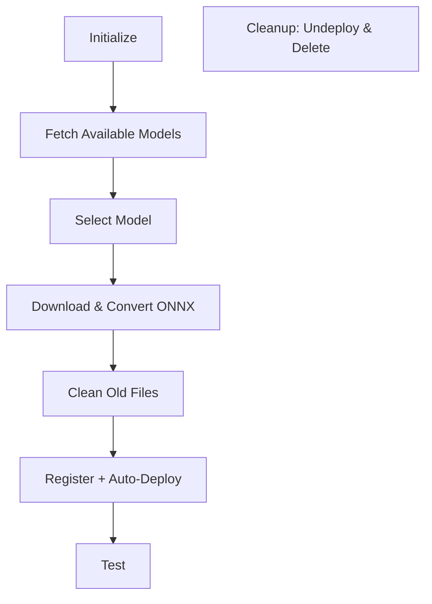

# ONNX Local Model Registration (Pre-Registered Version)

## 📚 Overview
This script demonstrates registering a **local ONNX model** that's already available from HuggingFace, using MLCommons with automatic deployment features.

### 🎯 Key Difference from Previous
- **Registered**: Model is cached/known to MLCommons
- **Auto-Deploy**: Deploys immediately after registration
- **HuggingFace API**: Fetches available models

---

## 📋 Key Features

### Fetching Available Models
```python
from huggingface_hub import HfApi

def get_sentence_transformer_models():
    api = HfApi()
    models = api.list_models(author="sentence-transformers")
    model_names = [model.modelId for model in models]
    return model_names

available_models = get_sentence_transformer_models()
# Returns: ['sentence-transformers/all-MiniLM-L6-v1', ...]
```

### Cleanup Strategy
```python
import shutil

# Remove old ONNX folder if exists
shutil.rmtree("sentence_transformer_model_files", ignore_errors=True)

# Fresh download and conversion
model_path_onnx = pre_trained_model.save_as_onnx(model_id=model_id)
```

---

## 🔄 Workflow



---

## ✨ Key Advantages

1. **Auto-Deploy**: No separate deployment step
2. **Model Discovery**: See all available SentenceTransformer models
3. **Clean Slate**: Remove old conversions before new ones
4. **Simplified**: High-level MLCommons API

---

## 📖 Resources

- 🔗 [HuggingFace Sentence Transformers](https://huggingface.co/sentence-transformers)
- 🔗 [MLCommons Client API](https://opensearch.org/docs/latest/ml-commons-plugin/ml-commons-client/)

---

## ✨ Summary

Similar to the "not registered" version but with:
- ✅ Model discovery via HuggingFace API
- ✅ Automatic deployment
- ✅ Cleaner file management
- ✅ Better for repeated deployments

