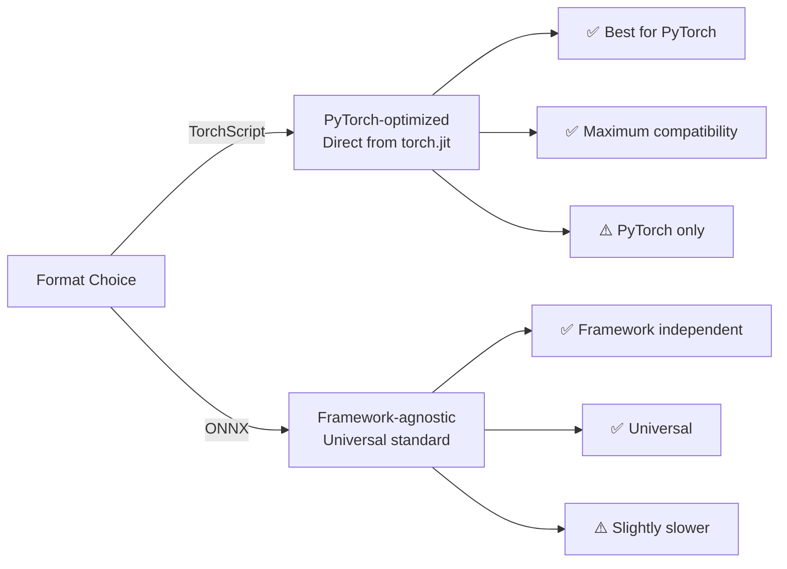
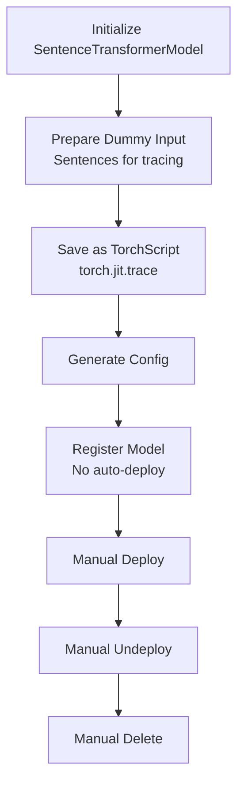

# TorchScript Model Registration - Production Format

## 📚 Overview
This script shows how to **download, convert to TorchScript format, and register a SentenceTransformer model**. TorchScript is faster than ONNX for PyTorch-native deployments.

### 🎯 Key Concepts
- **TorchScript**: PyTorch's optimized format for inference
- **Pre-trained Model**: `sentence-transformers/all-MiniLM-L6-v2` (improved v2)
- **Model Serialization**: Uses `torch.jit` for compilation
- **No Auto-Deploy**: Manual deployment control

---

## 📊 TorchScript vs ONNX



---

## 🔄 Workflow



---

## 📋 Key Code Patterns

### Dummy Input Preparation
```python
# Critical for tracing - example sentences
sentences = [
    "for example providing a small sentence",
    "we can add multiple sentences"
]

model_path = pre_trained_model.save_as_pt(
    model_id=model_id,
    sentences=sentences  # ← Dummy inputs for tracing
)
```

**Why Dummy Inputs?**
- TorchScript traces execution path with sample inputs
- Optimizes for that shape
- Must match actual usage shape

---

### Model Config Generation
```python
model_config_path_torch = pre_trained_model.make_model_config_json(
    model_format='TORCH_SCRIPT'
)
```

---

### Registration (No Auto-Deploy)
```python
model_id = ml_client.register_model(
    model_path,
    model_config_path_torch,
    isVerbose=True
    # ⚠️ NO wait_until_deployed=True
)

print(f'Model registered with model id: {model_id}')
# Must deploy manually!
```

---

## 💡 Key Learning Points

### When to Use TorchScript vs ONNX

| Scenario | TorchScript | ONNX |
|----------|-------------|------|
| **PyTorch backend** | ✅ Best | ✅ Good |
| **Multi-framework** | ❌ No | ✅ Yes |
| **NVIDIA GPU** | ✅ Optimized | ✅ Good |
| **Inference speed** | ✅ Fastest | ✅ Fast |
| **Model size** | ⚠️ Larger | ✅ Smaller |

---

## 📖 Resources

- 🔗 [PyTorch TorchScript](https://pytorch.org/docs/stable/jit.html)
- 🔗 [Sentence Transformers Deployment](https://www.sbert.net/docs/pretrained-models/)

---

## ✨ Summary

TorchScript offers:
- ✅ **Maximum speed** for PyTorch deployments
- ✅ **Full optimization** from torch.jit
- ✅ **Native compilation** to machine code
- ✅ **Production-ready** performance

Use when **pure PyTorch speed matters most**! 🚀

