# Question-Answering Model with OpenSearch Integration

## 📚 Overview
This comprehensive guide demonstrates how to **prepare, register, deploy, and use a Question-Answering (QA) model** (DistilBERT) in OpenSearch for extractive QA tasks.

### 🎯 Key Concepts
- **QA Task**: Given a question and passage, extract the answer span
- **DistilBERT**: Lightweight, fast version of BERT trained on SQuAD dataset
- **Extractive QA**: Finds answer within provided text (vs. generative QA)
- **Full Pipeline**: From model download → TorchScript conversion → OpenSearch deployment

---

## 💡 What is Question-Answering?


**In Plain English:**
- System receives a question
- System receives a passage
- Model finds where the answer is in the passage
- Returns start and end token positions
- Extract the answer span

---

## 🔄 Complete Workflow

```mermaid
graph TD
    A["🚀 Initialize Clients"] --> B["⚙️ Configure Cluster"]
    B --> C["🤖 Download QA Model<br/>distilbert-base-uncased-distilled-squad"]
    C --> D["🔄 Convert to TorchScript<br/>torch.jit.trace"]
    D --> E["💾 Save Components<br/>Model + Tokenizer"]
    E --> F["📦 Create ZIP Archive"]
    F --> G["📋 Generate ML Config"]
    G --> H["📤 Register to OpenSearch"]
    H --> I["🚀 Deploy Model"]
    I --> J["🔍 Create Index"]
    J --> K["📚 Ingest Documents"]
    K --> L["❓ Run QA Task"]
    L --> M["📊 Extract Answer"]
    M --> N["🧹 Cleanup"]
```



---

## 📝 Step-by-Step Implementation

### **Step 1: Initialize Clients** 🔌

```python
import torch
from opensearch_py_ml.ml_commons import MLCommonClient
from opensearchpy import OpenSearch
import zipfile, os, json
from transformers import AutoModelForQuestionAnswering, AutoProcessor, AutoTokenizer
import warnings

# Suppress warnings
warnings.filterwarnings("ignore", message="Unverified HTTPS request")
warnings.filterwarnings('ignore', category=DeprecationWarning)
warnings.filterwarnings('ignore', category=FutureWarning)
warnings.filterwarnings("ignore", message="TracerWarning: torch.tensor")

# Setup
HOST = 'localhost'
CLUSTER_URL = {'host': HOST, 'port': 9200}

def get_os_client(cluster_url=CLUSTER_URL, username='admin', password='Developer@123'):
    client = OpenSearch(
        hosts=[cluster_url],
        http_auth=(username, password),
        verify_certs=False,
        ssl_assert_hostname=False,
        ssl_show_warn=False,
        use_ssl=True,
        timeout=300
    )
    return client

client = get_os_client()
ml_client = MLCommonClient(client)
```

---

### **Step 2: Configure Cluster** ⚙️

```python
print("=== Step 1: Initializing OpenSearch Client ===")
client.cluster.put_settings(body={
    "persistent": {
        "plugins": {
            "ml_commons": {
                "allow_registering_model_via_url": "true",
                "allow_registering_model_via_local_file": "true",
                "only_run_on_ml_node": "false",
                "model_access_control_enabled": "true",
                "native_memory_threshold": "99"
            }
        }
    }
})
```

---

### **Step 3: Download QA Model** 🤖

```python
print("\n=== Step 2: Preparing Hugging Face Model ===")

os.makedirs("saved_models", exist_ok=True)

# Model configuration
model_name = "distilbert/distilbert-base-uncased-distilled-squad"
text_to_encode = "example search query"

print(f"Loading model: {model_name}")

# Load pre-trained model, tokenizer, and processor
model = AutoModelForQuestionAnswering.from_pretrained(
    model_name,
    torchscript=True,      # ← Enable TorchScript compatibility
    return_dict=False      # ← Return tuple instead of dict
)
tokenizer = AutoTokenizer.from_pretrained(model_name)
processor = AutoProcessor.from_pretrained(model_name)

print("✅ Model and tokenizer loaded successfully")
```

**Model Details:**
```
Model: distilbert-base-uncased-distilled-squad
├── Size: ~260MB
├── Layers: 6 (vs 12 for BERT)
├── Parameters: 66M (vs 110M for BERT)
├── Task: Question-Answering (SQuAD dataset)
├── Speed: 40x faster than BERT
└── Accuracy: Similar to BERT
```

---

### **Step 4: Convert to TorchScript** 🔄

```python
print("\n=== Step 3: Converting Model to TorchScript ===")

# Generate dummy input for model tracing
inputs = processor(text=text_to_encode, return_tensors="pt")
dummy_input = (inputs['input_ids'], inputs['attention_mask'])

# Trace the model - creates optimized graph
print("Tracing model...")
traced_model = torch.jit.trace(model, dummy_input)

# Save the traced model
torch.jit.save(traced_model, "saved_models/distilbert-base-uncased-distilled-squad.pt")
print("✅ TorchScript model saved")
```

**Why Trace?**


---

### **Step 5: Save Model Components** 💾

```python
print("\n=== Step 4: Saving Model Components ===")

# Save tokenizer
tokenizer.save_pretrained("saved_models/tokenizer")
print("✅ Tokenizer saved")

# Save model configuration
model.config.save_pretrained("saved_models/model_config")
print("✅ Model configuration saved")
```

**Components:**
```
saved_models/
├── distilbert-base-uncased-distilled-squad.pt  # TorchScript model
├── tokenizer/
│   ├── tokenizer.json
│   ├── special_tokens_map.json
│   └── tokenizer_config.json
└── model_config/
    └── config.json
```

---

### **Step 6: Create ZIP Archive** 📦

```python
print("\n=== Step 5: Creating Model Zip File ===")

with zipfile.ZipFile('saved_models/distilbert-base-uncased-distilled-squad.zip', 'w', zipfile.ZIP_DEFLATED) as zipf:
    # Add TorchScript model
    zipf.write('saved_models/distilbert-base-uncased-distilled-squad.pt', 
               'distilbert-base-uncased-distilled-squad.pt')
    
    # Add tokenizer
    zipf.write('saved_models/tokenizer/tokenizer.json', 'tokenizer.json')

print("✅ Model zip file created")
```

**Why ZIP?**
- ✅ Single file upload
- ✅ Compression (~40% size reduction)
- ✅ Easy distribution
- ✅ Atomic transfer

---

### **Step 7: Create ML Commons Configuration** 📋

```python
print("\n=== Step 6: Creating ML Commons Configuration ===")

# Read model config
with open('saved_models/model_config/config.json') as f:
    all_config = json.load(f)

# Create ML Commons config
mlcommons_model_config = {
    'name': "distilbert-base-uncased-distilled-squad",
    'version': '1.0.0',
    'model_format': 'TORCH_SCRIPT',
    "function_name": "QUESTION_ANSWERING",  # ← Key: QA task type
    'model_config': {
        'model_type': 'distilbert',
        'framework_type': 'huggingface_transformers',
        'embedding_dimension': all_config.get('dim', 768)
    }
}

with open('saved_models/mlcommons_model_config.json', 'w') as f:
    json.dump(mlcommons_model_config, f)

print("✅ ML Commons configuration created")
```

---

### **Step 8: Register & Deploy** 📤🚀

```python
print("\n=== Step 7: Registering and Deploying Model ===")

model_path = "saved_models/distilbert-base-uncased-distilled-squad.zip"
model_config_path = "saved_models/mlcommons_model_config.json"

# Register
print("Registering model...")
model_id = ml_client.register_model(
    model_path,
    model_config_path,
    isVerbose=True,
    deploy_model=False  # Manual deployment
)
print(f"✅ Model registered: {model_id}")

# Deploy
print("Deploying model...")
ml_client.deploy_model(model_id)
print("✅ Model deployed successfully")
```

---

### **Step 9: Create Index & Ingest Documents** 🔍📚

```python
print("\n=== Step 8: Creating Search Index ===")

index_config = {
    "settings": {"number_of_shards": 2},
    "mappings": {
        "properties": {
            "text": {"type": "text"},
            "embedding": {
                "type": "dense_vector",
                "dims": 768,
                "index": True,
                "similarity": "cosine"
            }
        }
    }
}

# Create index
index_name = "qa_documents"
try:
    client.indices.delete(index=index_name)
except:
    pass

client.indices.create(index=index_name, body=index_config)

# Ingest sample documents
documents = [
    {
        "_id": "1",
        "_index": index_name,
        "text": "Paris is the capital of France, located in central France"
    },
    {
        "_id": "2",
        "_index": index_name,
        "text": "The Eiffel Tower is an iconic landmark in Paris"
    }
]

for doc in documents:
    client.index(index=index_name, body=doc)
```

---

### **Step 10: Run QA Task** ❓

```python
print("\n=== Step 9: Running QA Task ===")

question = "What is the capital of France?"
passage = "Paris is the capital of France, located in central France"

# Prepare inputs
qa_input = f"[CLS] {question} [SEP] {passage} [SEP]"

# Get model prediction
qa_result = ml_client.generate_qa_answer(
    model_id,
    question,
    passage
)

print(f"Question: {question}")
print(f"Passage: {passage}")
print(f"Answer: {qa_result}")
```

---

## 💡 Key Learning Points

### 🎓 How QA Models Work


### 📊 SQuAD Dataset Overview

| Metric | Value |
|--------|-------|
| **Train Samples** | 87,599 |
| **Dev Samples** | 10,570 |
| **Questions** | ~100k |
| **Passages** | 23k Wikipedia articles |
| **Task Type** | Extractive QA |

### 🔍 QA vs Other Tasks


---

## 📋 Common Patterns

### ✅ QA Wrapper Class

```python
class QuestionAnswerer:
    def __init__(self, client, model_id):
        self.ml_client = MLCommonClient(client)
        self.model_id = model_id
    
    def answer(self, question: str, passage: str) -> dict:
        """
        Find answer to question in passage
        
        Returns:
            {
                'answer': 'Paris',
                'start': 0,
                'end': 5,
                'confidence': 0.95
            }
        """
        result = self.ml_client.generate_qa_answer(
            self.model_id,
            question,
            passage
        )
        
        return {
            'answer': result.get('answer', ''),
            'start': result.get('start', 0),
            'end': result.get('end', 0),
            'confidence': result.get('score', 0)
        }

# Usage
qa = QuestionAnswerer(client, model_id)
answer = qa.answer(
    "Where is Paris?",
    "Paris is the capital of France"
)
print(f"Answer: {answer['answer']} (confidence: {answer['confidence']:.2%})")
```

---

## 🔧 Troubleshooting

| Issue | Solution |
|-------|----------|
| Tracing fails | Check dummy input matches model input shape |
| Model too large | Use smaller model or more storage |
| QA results poor | Ensure passage contains answer |
| Timeout during deployment | Increase timeout, check memory |

---

## 📖 Additional Resources

- 🔗 [SQuAD Dataset](https://rajpurkar.github.io/SQuAD-explorer/)
- 🔗 [DistilBERT Paper](https://arxiv.org/abs/1910.01108)
- 🔗 [Transformers QA Pipeline](https://huggingface.co/docs/transformers/tasks/question_answering)

---

## ✨ Summary

This guide demonstrates:
- ✅ **Model preparation** from HuggingFace
- ✅ **TorchScript conversion** for optimization
- ✅ **OpenSearch integration** for deployment
- ✅ **Production QA pipeline** with full infrastructure

Perfect for **building intelligent document-based Q&A systems**! 🚀

