# QA with Ingest Pipeline - Production RAG System

## 📚 Overview
This comprehensive guide shows how to build a **complete RAG (Retrieval-Augmented Generation) pipeline** that combines:
1. **Text Embedding Model**: For semantic search/retrieval
2. **Question-Answering Model**: For answer extraction
3. **Ingest Pipeline**: For automatic embedding generation

### 🎯 Key Concept: Two-Stage RAG Pipeline

```
Stage 1 - Retrieval:
Question → Embed → Search → Get Top Passages

Stage 2 - Reading Comprehension:
Question + Passages → QA Model → Extract Answer
```

---

## 🔄 Complete RAG Architecture

```mermaid
graph TD
    A["📝 User Question"] --> B["🔍 Embed Question<br/>768-D vector"]
    B --> C["🔎 Semantic Search<br/>Find top 5 passages"]
    C --> D["📄 Retrieved Passages"]
    D --> E["❓ QA Model<br/>Extract answer from<br/>each passage"]
    E --> F["📊 Rank Answers<br/>by confidence"]
    F --> G["✅ Return Best Answer"]
```



---

## 📋 Complete Workflow

```mermaid
graph TD
    A["🚀 Initialize Clients"] --> B["⚙️ Configure Cluster"]
    B --> C["👥 Create Model Group"]
    C --> D["📦 Register Text Embedding Model"]
    D --> E["⏳ Poll & Deploy Embedding Model"]
    E --> F["📦 Register QA Model"]
    F --> G["⏳ Deploy QA Model"]
    G --> H["🔗 Create Ingest Pipeline<br/>with text embedding processor"]
    H --> I["🗂️ Create Search Index<br/>with pipeline reference"]
    I --> J["📚 Ingest Documents<br/>Auto-generate embeddings"]
    J --> K["🔍 User Query"]
    K --> L["🎯 Hybrid Search<br/>BM25 + Neural"]
    L --> M["❓ QA on Top Passages"]
    M --> N["✅ Return Answer"]
```



---

## 📝 Step-by-Step Implementation

### **Steps 1-6: Setup & Model Preparation** 🔌📦

These are identical to the standalone QA guide:
- Initialize clients
- Configure cluster
- Download QA model
- Convert to TorchScript
- Create ML Commons config
- Register QA model

---

### **Step 7: Register Text Embedding Model** 📦

```python
print("\n=== Step 7: Registering and Deploying Text Embedding Model ===")

model_group_name = f"local_model_group_{int(time.time())}"
print(f"Registering model group: {model_group_name}")

# Create model group
model_group_response = client.transport.perform_request(
    method='POST',
    url='/_plugins/_ml/model_groups/_register',
    body={
        "name": model_group_name,
        "description": "A model group for local models"
    }
)

model_group_id = model_group_response['model_group_id']

# Register text embedding model
register_response = client.transport.perform_request(
    method='POST',
    url='/_plugins/_ml/models/_register',
    body={
        "name": "huggingface/sentence-transformers/msmarco-distilbert-base-tas-b",
        "version": "1.0.2",
        "model_group_id": model_group_id,
        "model_format": "TORCH_SCRIPT",
        "function_name": "TEXT_EMBEDDING",
    }
)

register_task_id = register_response['task_id']

# Wait for registration
while True:
    task_status = client.transport.perform_request(
        method='GET',
        url=f'/_plugins/_ml/tasks/{register_task_id}'
    )
    if task_status['state'] == 'COMPLETED':
        model_id = task_status['model_id']
        break
    time.sleep(10)

# Deploy
deploy_response = client.transport.perform_request(
    method='POST',
    url=f'/_plugins/_ml/models/{model_id}/_deploy',
    timeout=50000
)

deploy_task_id = deploy_response['task_id']

# Wait for deployment
while True:
    deployment_status = client.transport.perform_request(
        method='GET',
        url=f'/_plugins/_ml/tasks/{deploy_task_id}'
    )
    if deployment_status['state'] == 'COMPLETED':
        break
    time.sleep(10)

print("✅ Text embedding model registered and deployed")
```

**Why Two Models?**


---

### **Step 8: Register & Deploy QA Model** 🔍

```python
print("\n=== Step 8: Registering and Deploying Custom QA Model ===")

model_path = "saved_models/distilbert-base-uncased-distilled-squad.zip"
model_config_path = "saved_models/mlcommons_model_config.json"

# Register using MLCommons client (easier)
print("Registering custom QA model...")
model_id_qa = ml_client.register_model(
    model_path,
    model_config_path,
    isVerbose=True,
    deploy_model=False
)
print(f"✅ QA Model registered: {model_id_qa}")

# Deploy
print("Deploying custom QA model...")
ml_client.deploy_model(model_id_qa, wait_until_deployed=True)
print("✅ Custom QA model deployed successfully")
```

---

### **Step 9: Create Ingest Pipeline** 🔗

```python
print("\n=== Step 9: Creating Ingest Pipeline ===")

# Define ingest pipeline with text embedding processor
pipeline_body = {
    "description": "A pipeline to generate text embeddings for neural search",
    "processors": [
        {
            "text_embedding": {
                "model_id": model_id,  # ← Embedding model ID
                "field_map": {
                    "text": "text_embedding"  # text field → text_embedding vector
                }
            }
        }
    ]
}

# Create pipeline
client.ingest.put_pipeline(id="qa_pipeline", body=pipeline_body)
print("✅ Ingest pipeline created")
```

**Pipeline Flow:**


---

### **Step 10: Create Search Index** 🗂️

```python
print("\n=== Step 10: Creating Search Index ===")

# Define index with embedding mapping
index_config = {
    "settings": {
        "number_of_shards": 1,
        "default_pipeline": "qa_pipeline"  # ← Use our pipeline!
    },
    "mappings": {
        "properties": {
            "text": {
                "type": "text",
                "analyzer": "standard"
            },
            "text_embedding": {
                "type": "dense_vector",
                "dims": 768,
                "index": True,
                "similarity": "cosine"
            }
        }
    }
}

# Create index
index_name = "qa_documents"
try:
    client.indices.delete(index=index_name)
except:
    pass

client.indices.create(index=index_name, body=index_config)
print(f"✅ Index created: {index_name}")
```

**Index Structure:**
```
qa_documents/
├── text (text field)
├── text_embedding (768-D vector)
└── Pipeline reference: qa_pipeline
    └── Auto-generates embeddings on insert
```

---

### **Step 11: Ingest Documents** 📚

```python
print("\n=== Step 11: Ingesting Documents ===")

documents = [
    {
        "text": "Paris is the capital of France and is located in central France."
    },
    {
        "text": "The Eiffel Tower is an iconic iron lattice tower in Paris."
    },
    {
        "text": "The Louvre Museum in Paris is home to the Mona Lisa."
    }
]

for i, doc in enumerate(documents):
    client.index(
        index=index_name,
        id=str(i),
        body=doc
    )
    print(f"Document {i} ingested - embedding auto-generated by pipeline")

print("✅ Documents indexed with auto-generated embeddings")
```

**Auto-Processing:**
```
Input Document:
{
    "text": "Paris is the capital of France"
}
        ↓
Pipeline Processor:
Calls text_embedding model
        ↓
Stored Document:
{
    "text": "Paris is the capital of France",
    "text_embedding": [0.123, -0.456, ..., 0.789]  ← Auto-generated!
}
```

---

### **Step 12: Hybrid Search** 🔍

```python
print("\n=== Step 12: Hybrid Search ===")

question = "What is the capital of France?"

# Embed question
question_embedding = ml_client.generate_embedding(
    model_id,
    [question]
)
question_vector = question_embedding["inference_results"][0]["output"][0]["data"]

# Hybrid search: BM25 + Neural
search_query = {
    "size": 5,
    "query": {
        "hybrid": {
            "queries": [
                {
                    "match": {
                        "text": question  # ← BM25 search
                    }
                },
                {
                    "knn": {
                        "text_embedding": {
                            "vector": question_vector,  # ← Neural search
                            "k": 3
                        }
                    }
                }
            ]
        }
    }
}

results = client.search(index=index_name, body=search_query)

passages = [hit["_source"]["text"] for hit in results["hits"]["hits"]]
print(f"Retrieved {len(passages)} passages:")
for i, p in enumerate(passages):
    print(f"  {i+1}. {p}")
```

---

### **Step 13: QA on Retrieved Passages** ❓

```python
print("\n=== Step 13: Running QA on Retrieved Passages ===")

answers = []

for passage in passages:
    qa_result = ml_client.generate_qa_answer(
        model_id_qa,
        question,
        passage
    )
    
    if qa_result.get('answer'):
        answers.append({
            'answer': qa_result['answer'],
            'passage': passage,
            'confidence': qa_result.get('score', 0)
        })

# Sort by confidence
answers.sort(key=lambda x: x['confidence'], reverse=True)

print("Answers found:")
for i, ans in enumerate(answers[:3]):
    print(f"  {i+1}. Answer: '{ans['answer']}'")
    print(f"     Confidence: {ans['confidence']:.2%}")
    print(f"     From: {ans['passage'][:50]}...")
```

---

## 💡 Key Learning Points

### 🎓 Why Hybrid Search?

```mermaid
graph LR
    A["BM25 Search"]
    B["Neural Search"]
    C["Hybrid Search"]
    
    A --> A1["✅ Fast"]
    A --> A2["✅ Keyword matching"]
    A --> A3["❌ No semantic understanding"]
    
    B --> B1["⚠️ Slower"]
    B --> B2["✅ Semantic understanding"]
    B --> B3["❌ May miss keywords"]
    
    C --> C1["✅ Fast enough"]
    C --> C2["✅ Semantically aware"]
    C --> C3["✅ Keyword aware"]
```



### 📊 Two-Stage Pipeline Benefits


### 🔍 Ingest Pipeline Automation

```
Without Pipeline:
Manual Step → Embed → Store

With Pipeline:
Automatic ← Embed ← Store
```

---

## 📋 Complete Production Code Template

```python
class RAGSystem:
    def __init__(self, client, embedding_model_id, qa_model_id, index_name):
        self.client = client
        self.ml_client = MLCommonClient(client)
        self.embedding_model_id = embedding_model_id
        self.qa_model_id = qa_model_id
        self.index_name = index_name
    
    def ingest_documents(self, documents: list):
        """Auto-embed and store documents"""
        for doc in documents:
            self.client.index(
                index=self.index_name,
                body={"text": doc}
            )
    
    def search_and_answer(self, question: str, top_k: int = 5) -> str:
        """Find best answer to question"""
        # Embed question
        emb = self.ml_client.generate_embedding(
            self.embedding_model_id,
            [question]
        )
        q_vector = emb["inference_results"][0]["output"][0]["data"]
        
        # Search
        results = self.client.search(
            index=self.index_name,
            body={
                "size": top_k,
                "query": {
                    "knn": {
                        "text_embedding": {
                            "vector": q_vector,
                            "k": top_k
                        }
                    }
                }
            }
        )
        
        passages = [h["_source"]["text"] for h in results["hits"]["hits"]]
        
        # QA
        best_answer = None
        best_confidence = 0
        
        for passage in passages:
            qa_result = self.ml_client.generate_qa_answer(
                self.qa_model_id,
                question,
                passage
            )
            
            if qa_result.get('score', 0) > best_confidence:
                best_confidence = qa_result.get('score', 0)
                best_answer = qa_result.get('answer', '')
        
        return best_answer or "Answer not found"

# Usage
rag = RAGSystem(client, embedding_model_id, qa_model_id, "qa_index")

# Ingest
docs = ["Paris is capital...", "Eiffel Tower..."]
rag.ingest_documents(docs)

# Query
answer = rag.search_and_answer("What is Paris?")
print(answer)
```

---

## 🔧 Troubleshooting

| Issue | Solution |
|-------|----------|
| Pipeline not applying | Check `default_pipeline` setting in index |
| No embeddings generated | Verify pipeline is active |
| Slow search | Add index to text_embedding field |
| QA returns empty | Ensure passage contains answer |

---

## 📖 Additional Resources

- 🔗 [Ingest Pipelines](https://opensearch.org/docs/latest/ingest-pipelines/)
- 🔗 [Hybrid Search](https://opensearch.org/docs/latest/search-plugins/search-relevance/hybrid-search/)
- 🔗 [Neural Search](https://opensearch.org/docs/latest/search-plugins/neural-search/)

---

## ✨ Summary

This architecture provides:
- ✅ **Automatic embedding** via ingest pipelines
- ✅ **Hybrid search** combining BM25 + neural
- ✅ **QA on passages** for detailed answers
- ✅ **Production-ready** RAG system
- ✅ **Scalable** to thousands of documents

Perfect for **enterprise document-based Q&A systems**! 🚀

