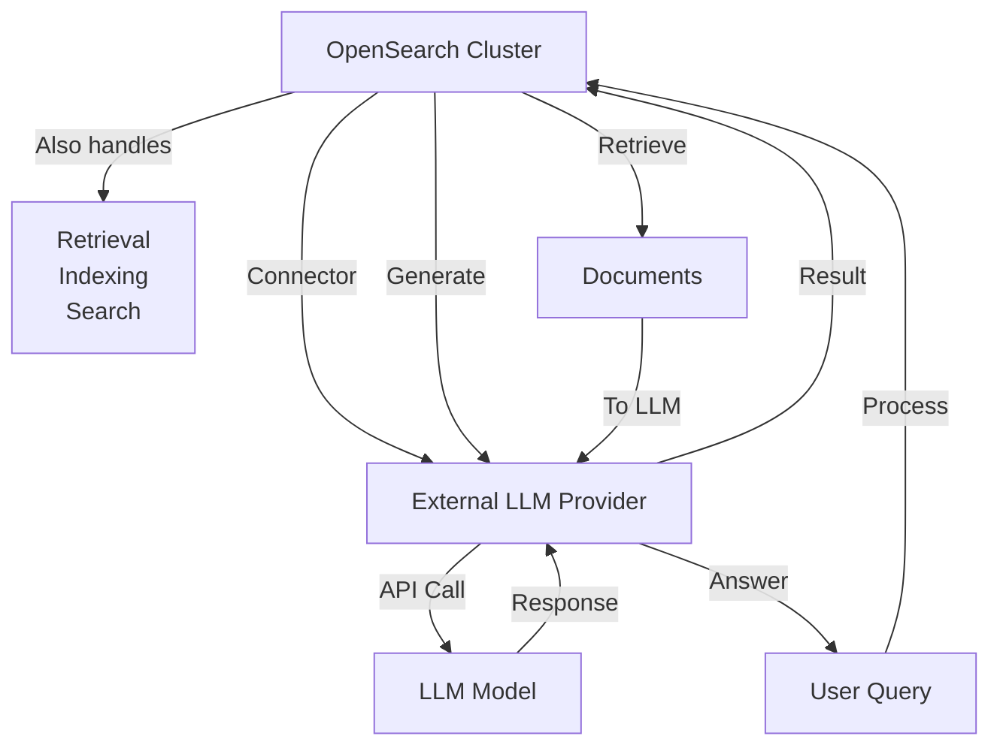
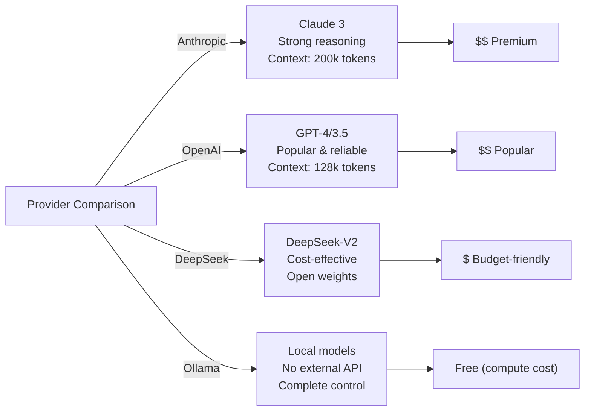
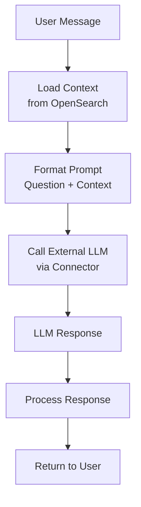
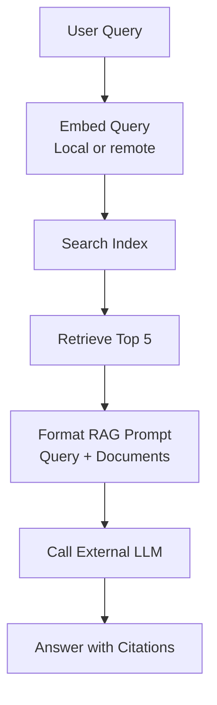
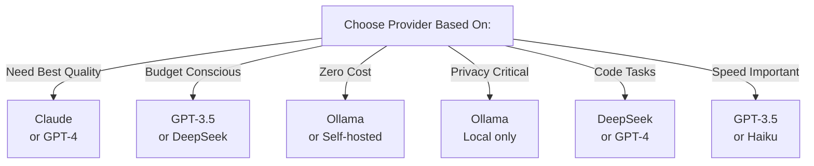

# External Hosted Models Integration Guide

## 📚 Overview
This comprehensive guide covers integrating **external LLM providers** (Anthropic, OpenAI, DeepSeek, Ollama) with OpenSearch for advanced RAG and conversational AI capabilities.

### 🎯 Key Concepts
- **External Models**: Models hosted by third-party providers (not in your cluster)
- **Connectors**: OpenSearch connectors bridge your cluster to external APIs
- **Inference Pipelines**: Automatically call external models during ingestion/search
- **Cost-Effective**: Only pay for API calls, not infrastructure

---

## 🏗️ Architecture Overview



---

## 📊 Provider Comparison



---

## 🔄 Integration Patterns

### Pattern 1: Chat Completions with Connector

```python
# Create connector to external LLM
connector_body = {
    "name": "anthropic_connector",
    "description": "Connector to Anthropic Claude",
    "version": "1",
    "protocol": "http",
    "parameters": {
        "endpoint": "https://api.anthropic.com/v1/messages",
        "auth": "api_key",
        "model": "claude-3-opus-20240229"
    }
}

# Register connector
client.transport.perform_request(
    method='POST',
    url='/_plugins/_ml/connectors/_create',
    body=connector_body
)

# Use in inference pipeline
pipeline = {
    "processors": [
        {
            "text_embedding": {
                "connector_id": connector_id,
                "model_id": "claude-3"
            }
        }
    ]
}
```

---

## 🌟 Supported External Providers

### 1️⃣ Anthropic Claude

**Models:**
- `claude-3-opus-20240229` - Most capable, best reasoning
- `claude-3-sonnet-20240229` - Balanced, faster  
- `claude-3-haiku-20240307` - Fast, cost-effective

**Strengths:**
- ✅ Excellent reasoning and analysis
- ✅ Large context window (200k tokens)
- ✅ Constitutional AI (safe by design)
- ✅ Strong at complex tasks

**Use Cases:**
- Document analysis and summarization
- Complex reasoning tasks
- Creative writing and brainstorming

**Cost Tier:** Premium

---

### 2️⃣ OpenAI GPT

**Models:**
- `gpt-4` - Most powerful
- `gpt-4-turbo` - Faster than GPT-4
- `gpt-3.5-turbo` - Cost-effective

**Strengths:**
- ✅ Most popular and stable
- ✅ Excellent for general tasks
- ✅ Large ecosystem & examples
- ✅ Good fine-tuning support

**Use Cases:**
- General Q&A
- Text generation
- Classification tasks

**Cost Tier:** Medium

---

### 3️⃣ DeepSeek

**Models:**
- `deepseek-chat` - General purpose
- `deepseek-coder` - Code generation

**Strengths:**
- ✅ Open weights (can self-host)
- ✅ Cost-effective
- ✅ Strong code understanding
- ✅ Growing capabilities

**Use Cases:**
- Cost-sensitive applications
- Code generation
- Technical content

**Cost Tier:** Budget

---

### 4️⃣ Ollama (Local)

**Models:**
- `llama2`, `mistral`, `neural-chat`
- All run locally on your infrastructure

**Strengths:**
- ✅ No external API calls
- ✅ Complete data privacy
- ✅ No API costs
- ✅ Instant inference

**Use Cases:**
- Sensitive data processing
- Low-latency applications
- Cost-sensitive at scale

**Cost Tier:** Free (compute only)

---

## 🔧 Common Integration Patterns

### Pattern: Chat Completion Workflow



### Pattern: Embedding + Chat RAG



---

## 📋 Implementation Strategies

### Strategy 1: Direct API Calls (Simple)

```python
# Direct library usage - simple but not integrated with OpenSearch
import anthropic

client = anthropic.Anthropic(api_key="sk-...")

message = client.messages.create(
    model="claude-3-opus-20240229",
    max_tokens=1024,
    messages=[
        {"role": "user", "content": "What is Paris?"}
    ]
)

print(message.content[0].text)
```

**Pros:** Simple, direct control
**Cons:** Not integrated with OpenSearch, manual context management

---

### Strategy 2: OpenSearch Connectors (Integrated)

```python
# Via OpenSearch connectors - integrated with pipelines and search

# Create connector
connector = client.transport.perform_request(
    method='POST',
    url='/_plugins/_ml/connectors/_create',
    body={
        "name": "claude_connector",
        "protocol": "http",
        "parameters": {
            "endpoint": "https://api.anthropic.com/v1/messages",
            "auth": "bearer_token",
            "model": "claude-3-opus-20240229"
        }
    }
)

# Use in pipeline
pipeline = client.ingest.put_pipeline(
    id="qa_pipeline",
    body={
        "processors": [
            {
                "text_embedding": {
                    "connector_id": connector['connector_id']
                }
            }
        ]
    }
)
```

**Pros:** Integrated, automatic, scalable
**Cons:** More setup, potential latency

---

### Strategy 3: Agent Framework (Advanced)

```python
# Using LangChain or LlamaIndex with OpenSearch
from langchain.chat_models import ChatAnthropic
from langchain.retrievers import OpenSearchRetriever

llm = ChatAnthropic(model="claude-3-opus-20240229")
retriever = OpenSearchRetriever(opensearch_url="...", index_name="documents")

# Automatic RAG
from langchain.chains import RetrievalQA

qa = RetrievalQA.from_chain_type(
    llm=llm,
    chain_type="stuff",
    retriever=retriever
)

answer = qa.run("What is Paris?")
```

**Pros:** High-level, powerful, flexible
**Cons:** Framework dependent, can hide details

---

## 💡 Key Design Patterns

### Pattern: Prompt Engineering for RAG

```python
SYSTEM_PROMPT = """
You are a helpful Q&A assistant. Answer questions using the provided context.
If the answer is not in the context, say "I don't have that information".
Always cite which document you're referencing.
"""

USER_PROMPT_TEMPLATE = """
Context from documents:
{context}

Question: {question}

Answer:
"""

def format_rag_prompt(question: str, documents: list) -> str:
    context = "\n---\n".join([d["text"] for d in documents])
    return USER_PROMPT_TEMPLATE.format(context=context, question=question)
```

### Pattern: Error Handling & Retries

```python
import tenacity

@tenacity.retry(
    stop=tenacity.stop_after_attempt(3),
    wait=tenacity.wait_exponential(multiplier=1, min=4, max=10)
)
def call_external_llm(prompt: str) -> str:
    """Call external LLM with retry logic"""
    try:
        response = client.messages.create(
            model="claude-3-opus-20240229",
            max_tokens=1024,
            messages=[{"role": "user", "content": prompt}]
        )
        return response.content[0].text
    except Exception as e:
        print(f"Error: {e}, retrying...")
        raise
```

---

## 📊 Cost Comparison

```
Query: 1,000-token input + 500-token output

Anthropic Claude:
Input: 1K × $0.003/1K = $0.003
Output: 500 × $0.015/1K = $0.0075
Total: $0.0105 per query

OpenAI GPT-3.5:
Input: 1K × $0.0005/1K = $0.0005
Output: 500 × $0.0015/1K = $0.00075
Total: $0.00125 per query

OpenAI GPT-4:
Input: 1K × $0.03/1K = $0.03
Output: 500 × $0.06/1K = $0.03
Total: $0.06 per query

Ollama (Local):
Cost: $0 (just compute)
```

---

## 🎯 When to Use Each Provider



---

## 🔐 Security Best Practices

```python
# ✅ DO: Use environment variables for API keys
import os
ANTHROPIC_API_KEY = os.getenv("ANTHROPIC_API_KEY")

# ✅ DO: Use OpenSearch encryption for connectors
connector = {
    "parameters": {
        "auth": "api_key",
        "auth_params": {
            "api_key": ANTHROPIC_API_KEY  # Never hardcode!
        }
    }
}

# ✅ DO: Validate and sanitize prompts
def sanitize_prompt(prompt: str) -> str:
    # Remove potentially malicious content
    prompt = prompt.strip()
    prompt = prompt[:5000]  # Limit length
    return prompt

# ❌ DON'T: Expose API keys in code
client = anthropic.Anthropic(api_key="sk-ant-...")  # DANGER!

# ❌ DON'T: Trust user input directly
prompt = user_input  # DANGER!
```

---

## 📖 Additional Resources

- 🔗 [Anthropic API Docs](https://docs.anthropic.com/claude/reference/getting-started-with-the-api)
- 🔗 [OpenAI API Docs](https://platform.openai.com/docs/api-reference)
- 🔗 [DeepSeek API](https://www.deepseek.com/api)
- 🔗 [Ollama Documentation](https://ollama.ai/)
- 🔗 [OpenSearch Connectors](https://opensearch.org/docs/latest/ml-commons-plugin/ml-commons-connectors/)

---

## ✨ Summary

External hosted models provide:
- ✅ **Access to cutting-edge LLMs** without hosting
- ✅ **Flexible pricing** - pay only for usage
- ✅ **Latest models** - providers handle updates
- ✅ **Easy integration** with OpenSearch connectors
- ⚠️ **API dependency** - external latency/costs
- ⚠️ **Data transmission** - ensure compliance

Choose based on your needs:
- **Best Quality**: Claude 3 Opus or GPT-4
- **Best Value**: GPT-3.5 Turbo
- **Most Control**: Ollama (local)
- **Best for Code**: DeepSeek

Next, see provider-specific guides for detailed implementation! 🚀

