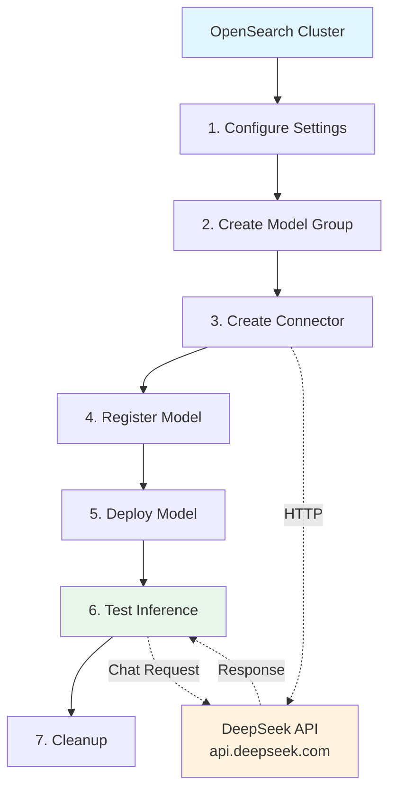
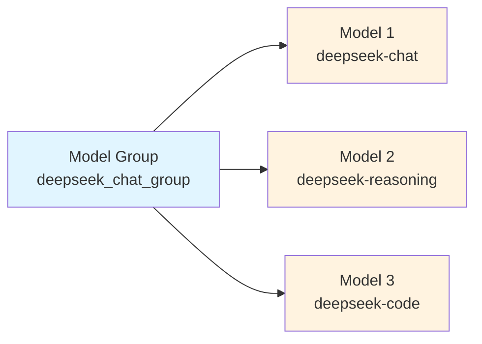
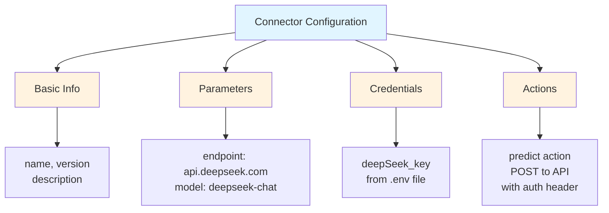
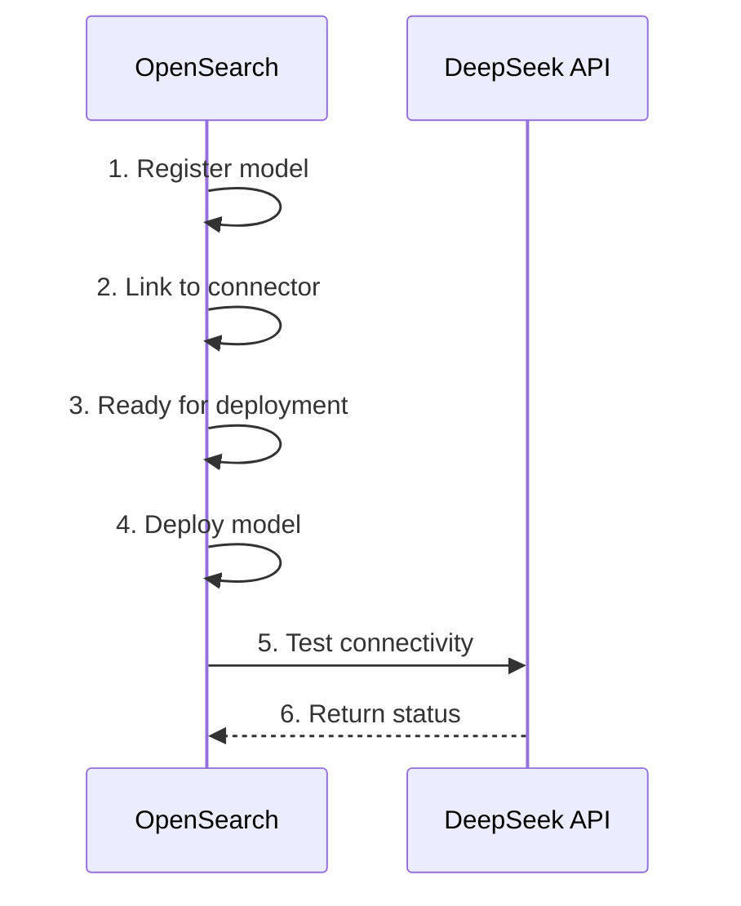
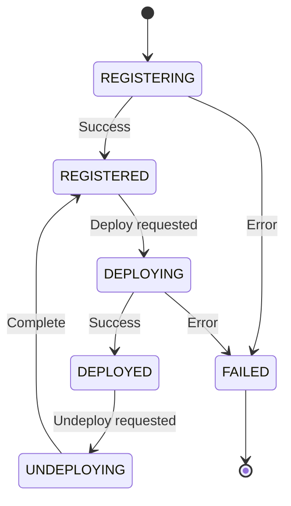
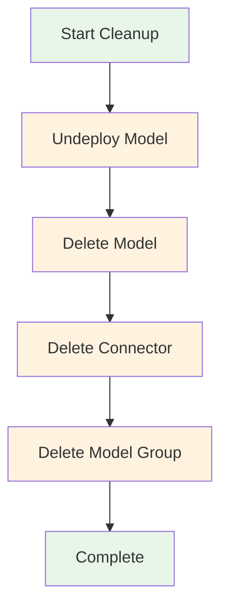

# DeepSeek Connector Chat - Complete Integration Guide

## 📖 Overview

This script demonstrates **complete integration of DeepSeek's chat API** with OpenSearch using the ML Commons connector framework. It shows how to create a remote connector, register a model, and test inference all in a streamlined workflow.

### 🎯 What You'll Learn
- Creating HTTP connectors for external APIs
- Registering remote models with model groups
- Deploying and testing chat models
- Proper resource cleanup patterns
- Error handling and status monitoring

---

## 🏗️ Complete Integration Architecture



---

## 🔄 Step-by-Step Workflow

### Step 1: Initialize & Configure Cluster

```python
def get_os_client(cluster_url=CLUSTER_URL, username=DEFAULT_USERNAME, password=DEFAULT_PASSWORD):
    """Create OpenSearch client with SSL configuration"""
    client = OpenSearch(
        hosts=[cluster_url],
        http_auth=(username, password),
        verify_certs=False,
        ssl_assert_hostname=False,
        ssl_show_warn=False,
        use_ssl=True,
        max_retries=10,
        retry_on_timeout=True,
        timeout=300  # Extended timeout for API calls
    )
    return client
```

**Key configuration points:**
| Parameter | Purpose | Why It Matters |
|-----------|---------|---|
| `verify_certs=False` | Disable SSL verification | For testing/local setup |
| `max_retries=10` | Retry failed requests | Handle transient failures |
| `timeout=300` | 5-minute timeout | External APIs need more time |

### Step 2: Configure Cluster Settings

```python
cluster_settings = {
    "persistent": {
        # Allow any connector endpoint
        "plugins.ml_commons.trusted_connector_endpoints_regex": [".*"],
        # Run ML tasks on any node
        "plugins.ml_commons.only_run_on_ml_node": "false",
        # Enable conversation memory
        "plugins.ml_commons.memory_feature_enabled": "true",
        # Allow private IP connectors
        "plugins.ml_commons.connector.private_ip_enabled": "true"
    }
}
```

**Why these settings?**
- ✅ `trusted_connector_endpoints_regex`: Accept DeepSeek's public API
- ✅ `only_run_on_ml_node`: Flexibility in node allocation
- ✅ `memory_feature_enabled`: Support stateful conversations
- ✅ `connector.private_ip_enabled`: For self-hosted scenarios

---

## 📋 Core Components Explained

### Component 1: Model Group

```python
model_group_name = f"deepseek_chat_group_{int(time.time())}"
model_group_body = {
    "name": model_group_name,
    "description": "Model group for deepseek chat"
}
model_group_response = client.transport.perform_request(
    'POST',
    '/_plugins/_ml/model_groups/_register',
    body=model_group_body
)
model_group_id = model_group_response['model_group_id']
```

**Purpose:** Organize related models together



### Component 2: HTTP Connector

```python
connector_body = {
    "name": "DeepSeek Chat",
    "description": "Connector for DeepSeek Chat API",
    "version": "1",
    "protocol": "http",
    "parameters": {
        "endpoint": "api.deepseek.com",
        "model": "deepseek-chat"
    },
    "credential": {
        "deepSeek_key": os.getenv("DEEPSEEK_API_KEY")
    },
    "actions": [
        {
            "action_type": "predict",
            "method": "POST",
            "url": "https://${parameters.endpoint}/v1/chat/completions",
            "headers": {
                "Content-Type": "application/json",
                "Authorization": "Bearer ${credential.deepSeek_key}"
            },
            "request_body": "{ \"model\": \"${parameters.model}\", \"messages\": ${parameters.messages} }"
        }
    ]
}
```

**Connector Anatomy:**



**Key elements:**
- ✅ `parameters`: Placeholders for dynamic values
- ✅ `credential`: Secure API key storage
- ✅ `actions`: Define how to call the API
- ✅ Template variables: `${parameters.model}`, `${parameters.messages}`

### Component 3: Model Registration

```python
model_body = {
    "name": "deepseek_chat_model",
    "function_name": "remote",        # Use external API
    "model_group_id": model_group_id, # Organize in group
    "description": f"{DEEPSEEK_MODEL} chat model",
    "connector_id": connector_id,      # Use our connector
    "model_format": "TORCH_SCRIPT"
}
model_response = client.transport.perform_request(
    'POST',
    '/_plugins/_ml/models/_register',
    body=model_body
)
model_id = model_response['model_id']
```

**Registration workflow:**



---

## 🚀 Deployment & Status Monitoring

### Deployment Process

```python
deploy_body = {"deployment_plan": [{"model_id": model_id, "workers": 1}]}
client.transport.perform_request(
    'POST',
    f'/_plugins/_ml/models/{model_id}/_deploy',
    body=deploy_body
)
```

### Status Monitoring with Polling

```python
while True:
    status_response = client.transport.perform_request(
        'GET',
        f'/_plugins/_ml/models/{model_id}'
    )
    current_status = status_response['model_state']
    print(f"Current status: {current_status}")
    
    if current_status == 'DEPLOYED':
        print("✓ Ready for inference!")
        break
    elif current_status == 'FAILED':
        print("✗ Deployment failed!")
        return
    
    time.sleep(5)  # Check every 5 seconds
```

**Status State Machine:**



---

## 💬 Testing with Chat Messages

### Test Prediction

```python
predict_body = {
    "parameters": {
        "messages": [
            {
                "role": "system",
                "content": "You are a helpful assistant."
            },
            {
                "role": "user",
                "content": "Why is the sky blue?"
            }
        ]
    }
}

predict_response = client.transport.perform_request(
    'POST',
    f'/_plugins/_ml/models/{model_id}/_predict',
    body=predict_body
)
```

**Message Format (OpenAI-compatible):**

| Role | Purpose | Example |
|------|---------|---------|
| `system` | Set model behavior | "You are a helpful assistant" |
| `user` | User input | "Why is the sky blue?" |
| `assistant` | Model response | (in multi-turn) |

**Typical Response:**

```json
{
  "inference_results": [
    {
      "output": [
        {
          "name": "response",
          "dataAsString": "The sky appears blue due to Rayleigh scattering..."
        }
      ]
    }
  ]
}
```

---

## 🧹 Resource Cleanup Pattern

### Cleanup Order (Critical!)

```python
def cleanup_resources(client, model_id, connector_id, model_group_id):
    """
    Cleanup in correct order: Model → Connector → Group
    """
    
    # Step 1: Undeploy model first
    client.transport.perform_request(
        'POST',
        f'/_plugins/_ml/models/{model_id}/_undeploy'
    )
    
    # Step 2: Delete model
    client.transport.perform_request(
        'DELETE',
        f'/_plugins/_ml/models/{model_id}'
    )
    
    # Step 3: Delete connector
    client.transport.perform_request(
        'DELETE',
        f'/_plugins/_ml/connectors/{connector_id}'
    )
    
    # Step 4: Delete model group
    client.transport.perform_request(
        'DELETE',
        f'/_plugins/_ml/model_groups/{model_group_id}'
    )
```

**Cleanup Dependency Chain:**



**Why this order?**
- ✅ Model depends on connector (delete first)
- ✅ Connector can be removed independently
- ✅ Model group can be empty
- ✅ Avoids orphaned resources

---

## 🔑 Key Configuration Parameters

### Connector Parameters

```python
"parameters": {
    "endpoint": "api.deepseek.com",      # DeepSeek's public endpoint
    "model": "deepseek-chat"               # Model variant to use
}
```

### Request Template Variables

| Variable | Replaced With | Example |
|----------|---------------|---------|
| `${parameters.endpoint}` | `api.deepseek.com` | |
| `${parameters.model}` | `deepseek-chat` | |
| `${credential.deepSeek_key}` | API key from .env | |
| `${parameters.messages}` | Chat messages array | |

### Available DeepSeek Models

| Model | Best For | Speed | Cost |
|-------|----------|-------|------|
| `deepseek-chat` | General chat | ⚡⚡⚡ | $ |
| `deepseek-coder` | Code generation | ⚡⚡ | $$ |
| `deepseek-reasoner` | Complex reasoning | ⚡ | $$$ |

---

## 💡 Common Patterns & Best Practices

### Pattern 1: Error Handling with Try-Catch

```python
try:
    predict_response = client.transport.perform_request(
        'POST',
        f'/_plugins/_ml/models/{model_id}/_predict',
        body=predict_body
    )
    print("✓ Prediction successful!")
except Exception as e:
    print(f"⚠ Error during prediction: {e}")
    # Continue gracefully
```

### Pattern 2: Timeout Management

```python
# For long-running API calls
timeout=300  # 5 minutes
retry_on_timeout=True
max_retries=10

# Increase timeout for complex queries
predict_body = {
    "parameters": {
        "messages": [...],
        "temperature": 0.7,      # Creativity
        "max_tokens": 2000,      # Response length
        "top_p": 0.9             # Diversity
    }
}
```

### Pattern 3: Timestamp-based Resource Naming

```python
# Avoid conflicts with unique names
model_group_name = f"deepseek_chat_group_{int(time.time())}"
# Result: deepseek_chat_group_1699564800
```

---

## 🧪 Testing Scenarios

### Test 1: Basic Functionality

```python
# Simple question
messages = [
    {"role": "user", "content": "Hello, how are you?"}
]
# Expected: Greeting response
```

### Test 2: Multi-turn Conversation

```python
# First turn
messages = [
    {"role": "user", "content": "What's the capital of France?"}
]
# Response: Paris

# Second turn (with history)
messages = [
    {"role": "user", "content": "What's the capital of France?"},
    {"role": "assistant", "content": "The capital of France is Paris."},
    {"role": "user", "content": "What's its population?"}
]
# Response: About 2.2 million
```

### Test 3: Role-based Behavior

```python
# With system prompt
messages = [
    {"role": "system", "content": "You are a Python expert."},
    {"role": "user", "content": "Write a function to reverse a list."}
]
# Response: Expert-level Python code
```

---

## ⚠️ Troubleshooting Guide

| Issue | Cause | Solution |
|-------|-------|----------|
| **API Key Error** | Invalid/missing DEEPSEEK_API_KEY | Verify .env file has correct key |
| **Timeout Error** | API too slow | Increase timeout to 300s |
| **Connection Refused** | Invalid endpoint | Check api.deepseek.com is accessible |
| **Model Not Deployed** | Deployment failed | Check cluster logs, retry deploy |
| **Prediction Error** | Invalid message format | Ensure messages have role/content |
| **SSL Warning** | verify_certs=False | Expected for local testing |

---

## 🔄 Complete Workflow Example

```python
# 1. Create client
client = get_os_client()

# 2. Create model group
model_group_id = register_model_group(client)
# Result: "model_group_id_123456"

# 3. Create connector
connector_id = create_connector(client)
# Result: "connector_id_789012"

# 4. Register model
model_id = register_model(client, model_group_id, connector_id)
# Result: "model_id_345678"

# 5. Deploy model
deploy_model(client, model_id)
# Status: DEPLOYED

# 6. Test with message
response = test_prediction(client, model_id)
# Result: Chat response from DeepSeek

# 7. Cleanup
cleanup_resources(client, model_id, connector_id, model_group_id)
# Status: All resources removed
```

---

## 📊 Performance Considerations

### Latency Breakdown

```
Request Flow:
OpenSearch → HTTP Connector → DeepSeek API → LLM Processing → Response
   1ms         2ms              500ms         1500ms          50ms
──────────────────────────────────────────────────────────────
Total: ~2 seconds (for typical queries)
```

### Optimization Tips

| Optimization | Impact | Difficulty |
|-------------|--------|-----------|
| Caching responses | ⚡⚡⚡ | Easy |
| Batch requests | ⚡⚡ | Medium |
| Use faster model | ⚡⚡ | Easy |
| Add local layer | ⚡ | Hard |

---

## 🎓 Learning Path

```
1. Understand Connectors (10 min)
   ├─ HTTP connectors
   ├─ Parameter templating
   └─ Credential management

2. Setup Integration (15 min)
   ├─ Create connector
   ├─ Register model
   └─ Deploy

3. Test Functionality (10 min)
   ├─ Send messages
   ├─ Parse responses
   └─ Handle errors

4. Production Patterns (15 min)
   ├─ Cleanup resources
   ├─ Error handling
   └─ Performance tuning
```

---

## 🔗 Related Topics

- 🔗 [OpenAI Integration](../openai/README_OPENAI.md)
- 🔗 [Anthropic Connector](../anthropic/anthropic_connector_chat.md)
- 🔗 [External Models Overview](../README_EXTERNAL_MODELS.md)
- 🔗 [Agent Systems](../../5. REALTIME_PROJECTS/agents_tools/README_AGENTS_TOOLS.md)

---

## ✨ Summary

This script demonstrates:
- ✅ **Complete DeepSeek integration** with OpenSearch
- ✅ **HTTP connector creation** for external APIs
- ✅ **Model lifecycle management** (register, deploy, test)
- ✅ **Proper resource cleanup** pattern
- ✅ **Error handling** and status monitoring
- ✅ **Production-ready** code structure

**Perfect for learning how to integrate any external chat API with OpenSearch!** 🚀

