# Ollama Connector Embedding (Production Edition)

## 📚 Overview

`ollama_connector_embedding.py` is a **production-grade implementation** of local Ollama embedding model integration with OpenSearch ML Commons. This script demonstrates how to:

- **Deploy embedding models locally** (Gemma, Nomic Embed, BGE, etc.)
- **Stream model downloads** with real-time progress tracking
- **Generate vector embeddings** using Ollama
- **Integrate embeddings into OpenSearch** for semantic search
- **Build production-ready RAG systems** entirely on-premise

Unlike chat models that generate text, embedding models convert text into **dense vectors** that capture semantic meaning, enabling powerful semantic search and similarity matching.

---

## 🏗️ Architecture Overview

```mermaid
graph TB
    subgraph "Your Data"
        Doc1["📄 Document 1<br/>Text content"]
        Doc2["📄 Document 2<br/>Text content"]
        Query["🔍 Query<br/>Search text"]
    end
    
    subgraph "Embedding Pipeline"
        OllamaEmbed["🤖 Ollama Embedding<br/>embeddinggemma:latest<br/>Local GPU/CPU"]
        Vec1["🔢 Vector 1<br/>768 dimensions"]
        Vec2["🔢 Vector 2<br/>768 dimensions"]
        VecQ["🔢 Query Vector<br/>768 dimensions"]
    end
    
    subgraph "OpenSearch"
        OSCluster["🔍 OpenSearch Cluster<br/>localhost:9200"]
        Index["📇 Vector Index<br/>Dense vectors"]
    end
    
    subgraph "Output"
        ResultsNode["✨ Similar Results<br/>Ranked by similarity"]
    end
    
    Doc1 -->|"Text"| OllamaEmbed
    Doc2 -->|"Text"| OllamaEmbed
    Query -->|"Text"| OllamaEmbed
    OllamaEmbed -->|"768-dim vector"| Vec1
    OllamaEmbed -->|"768-dim vector"| Vec2
    OllamaEmbed -->|"768-dim vector"| VecQ
    Vec1 -->|"Index & store"| OSCluster
    Vec2 -->|"Index & store"| OSCluster
    VecQ -->|"Compare"| Index
    Index -->|"Semantic match"| ResultsNode
    
    style OllamaEmbed fill:#45b7d1,stroke:#0284c7,color:#fff
    style OSCluster fill:#4ecdc4,stroke:#0d9488,color:#fff
    style ResultsNode fill:#d3f9d8,stroke:#2f9e44,color:#000
```



---

## 🔑 Key Concepts: Chat vs Embedding Models

### Chat Models (What You've Seen)

```python
# Input: Question
prompt = "Why is the sky blue?"

# Processing: Generate human-readable text
response = "The sky appears blue due to Rayleigh scattering..."

# Output: Text response (variable length)
```

### Embedding Models (This File)

```python
# Input: Text document or query
text = "Sky is blue"

# Processing: Convert to numerical vector
# Each word's meaning captured in vector space

# Output: Dense vector (fixed dimensions)
embedding = [0.245, -0.891, 0.156, ..., 0.423]
#            └─ 768 dimensions (typical)
```

**Why embeddings matter:**
- Capture semantic meaning numerically
- Enable similarity searches
- Build recommendation systems
- Power information retrieval
- Enable clustering and classification

---

## 📊 Embedding Models Comparison

| Model | Parameters | Dimensions | Speed | Quality | Use Case |
|-------|-----------|-----------|-------|---------|----------|
| `embeddinggemma:latest` | 40M | 768 | 50-100ms | Good | General text |
| `nomic-embed-text` | 137M | 768 | 100-200ms | Excellent | Production search |
| `bge-small` | 33M | 384 | 30-60ms | Good | Lightweight |
| `bge-base` | 109M | 768 | 100-150ms | Very Good | Standard |
| `bge-large` | 335M | 1024 | 200-400ms | Excellent | High quality |

**Key metrics:**
- **Dimensions**: Higher = richer semantic info, slower operations
- **Speed**: Latency per text → vector conversion
- **Memory**: Required GPU/CPU RAM for model
- **Quality**: Semantic accuracy on benchmarks

---

## 🔄 Step-by-Step Implementation

### Step 1: Initialize Cluster with Embedding Support

```python
cluster_settings = {
    "persistent": {
        "plugins.ml_commons.trusted_connector_endpoints_regex": [".*"],
        "plugins.ml_commons.only_run_on_ml_node": "false",
        "plugins.ml_commons.memory_feature_enabled": "true",
        "plugins.ml_commons.connector.private_ip_enabled": "true"
    }
}
client.cluster.put_settings(body=cluster_settings)
```

**Why these settings?**
- Allow private IP connectivity to local Ollama
- Enable memory feature for tracking model resource usage
- Allow ML operations on any node (not just ML nodes)

### Step 2: List and Download Embedding Model

```python
# Step 2a: List available models
try:
    resp = requests.get(f"http://{OLLAMA_IP_URL}/api/tags")
    resp.raise_for_status()
    models = resp.json().get('models', [])
    print("Available Ollama models:")
    for i, m in enumerate(models, start=1):
        print(f"  {i}. {m.get('name')}")
except Exception as e:
    print(f"Could not list models: {e}")
    return

# Step 2b: Stream download the model
try:
    payload = {
        "name": OLLAMA_MODEL,
        "stream": True
    }
    response = requests.post(
        f"http://{OLLAMA_IP_URL}/api/pull",
        headers={"Content-Type": "application/json"},
        data=json.dumps(payload),
        stream=True
    )
    response.raise_for_status()
    
    for chunk in response.iter_content(chunk_size=None):
        if chunk:
            try:
                data = json.loads(chunk.decode('utf-8'))
                if "status" in data:
                    print(f"Status: {data['status']}")
                if "total" in data and "completed" in data:
                    progress = (data["completed"] / data["total"]) * 100
                    print(f"Download Progress: {progress:.2f}%")
            except json.JSONDecodeError:
                pass
except Exception as e:
    print(f"Error pulling model: {e}")
```

**Streaming benefits:**
- Real-time progress feedback
- Prevents timeouts on large models
- Better user experience
- Handles network interruptions

### Step 3: Create Model Group

```python
model_group_name = f"ollama_embedding_group_{int(time.time())}"
model_group_body = {
    "name": model_group_name,
    "description": "Model group for Ollama embeddings"
}
model_group_response = client.transport.perform_request(
    'POST',
    '/_plugins/_ml/model_groups/_register',
    body=model_group_body
)
model_group_id = model_group_response['model_group_id']
```

**Why model groups?**
- Organize related models
- Manage permissions
- Version control
- Logical grouping for production systems

### Step 4: Create Embedding Connector

**🔑 KEY DIFFERENCE: Embedding API endpoint**

```python
connector_body = {
    "name": "ollama_connector",
    "description": "Connector for Ollama API",
    "version": 1,
    "protocol": "http",
    "parameters": {
        "endpoint": OLLAMA_IP_URL,
        "model": OLLAMA_MODEL
    },
    "credential": {
        "dummy_key": "dummy"
    },
    "actions": [
        {
            "action_type": "predict",
            "method": "POST",
            "url": "http://${parameters.endpoint}/v1/embeddings",
            # ↑ Embedding API (different from /api/generate)
            "headers": {
                "Content-Type": "application/json"
            },
            "request_body": "{ \"model\": \"${parameters.model}\", \"input\": \"${parameters.input}\", \"stream\": false }"
            # ↑ "input" parameter for embeddings (not "prompt")
        }
    ]
}
connector_response = client.transport.perform_request(
    'POST',
    '/_plugins/_ml/connectors/_create',
    body=connector_body
)
connector_id = connector_response['connector_id']
```

**Embedding connector specifics:**
- Endpoint: `/v1/embeddings` (OpenAI-compatible format)
- Parameter: `input` (the text to embed)
- Returns: Vector representation (768 dimensions)

### Step 5: Register and Deploy Model

```python
model_body = {
    "name": "ollama_embedding_model",
    "function_name": "remote",
    "model_group_id": model_group_id,
    "description": f"Ollama {OLLAMA_MODEL} embedding model",
    "connector_id": connector_id,
    "model_format": "TORCH_SCRIPT"
}
model_response = client.transport.perform_request(
    'POST',
    '/_plugins/_ml/models/_register',
    body=model_body
)
model_id = model_response['model_id']

# Deploy the model
deploy_body = {"deployment_plan": [{"model_id": model_id, "workers": 1}]}
try:
    client.transport.perform_request(
        'POST',
        f'/_plugins/_ml/models/{model_id}/_deploy',
        body=deploy_body
    )
except Exception as e:
    print(f"Error deploying model: {e}")
    return

# Wait for deployment
print("⏳ Waiting for deployment...")
while True:
    status_response = client.transport.perform_request(
        'GET',
        f'/_plugins/_ml/models/{model_id}'
    )
    current_status = status_response['model_state']
    print(f"   Status: {current_status}")
    
    if current_status == 'DEPLOYED':
        print("✓ Deployment complete!")
        break
    elif current_status == 'FAILED':
        print("✗ Deployment failed!")
        return
    
    time.sleep(5)
```

### Step 6: Test Embedding Generation

```python
# Test with sample text
predict_body = {"parameters": {
    "input": "Sky is blue"  # The text to embed
}}

try:
    predict_response = client.transport.perform_request(
        'POST',
        f'/_plugins/_ml/models/{model_id}/_predict',
        body=predict_body
    )
    print("✓ Embedding generation successful!")
    print(json.dumps(predict_response, indent=2))
    
    # Response structure:
    # {
    #   "predictions": [
    #     {
    #       "output": [
    #         0.245, -0.891, 0.156, ..., 0.423  ← 768-dim vector
    #       ]
    #     }
    #   ]
    # }
except Exception as e:
    print(f"Error during embedding: {e}")
```

### Step 7: Exception-Safe Cleanup

```python
def cleanup_resources(client, model_id, connector_id, model_group_id):
    """Clean up resources with exception safety."""
    
    # Step 1: Undeploy
    try:
        client.transport.perform_request(
            'POST',
            f'/_plugins/_ml/models/{model_id}/_undeploy'
        )
        print(f"✓ Undeployed model: {model_id}")
    except Exception as e:
        print(f"⚠ Error undeploying: {e}")
        # Continue to next cleanup step
    
    # Step 2: Delete model
    try:
        client.transport.perform_request(
            'DELETE',
            f'/_plugins/_ml/models/{model_id}'
        )
        print(f"✓ Deleted model: {model_id}")
    except Exception as e:
        print(f"⚠ Error deleting model: {e}")
    
    # Step 3: Delete connector
    try:
        client.transport.perform_request(
            'DELETE',
            f'/_plugins/_ml/connectors/{connector_id}'
        )
        print(f"✓ Deleted connector: {connector_id}")
    except Exception as e:
        print(f"⚠ Error deleting connector: {e}")
    
    # Step 4: Delete model group
    try:
        client.transport.perform_request(
            'DELETE',
            f'/_plugins/_ml/model_groups/{model_group_id}'
        )
        print(f"✓ Deleted model group: {model_group_id}")
    except Exception as e:
        print(f"⚠ Error deleting group: {e}")
    
    print("✓ Cleanup completed!")
```

---

## 🔄 API Format Comparison

### Chat Model Request/Response

```python
# Chat connector endpoint: /api/generate
request = {
    "model": "smollm2:135m",
    "prompt": "Why is the sky blue?",
    "stream": False
}

response = {
    "predictions": [
        {
            "response": "The sky appears blue due to Rayleigh scattering..."
        }
    ]
}
```

### Embedding Model Request/Response

```python
# Embedding connector endpoint: /v1/embeddings
request = {
    "model": "embeddinggemma:latest",
    "input": "Sky is blue",
    "stream": False
}

response = {
    "predictions": [
        {
            "output": [0.245, -0.891, 0.156, ..., 0.423]  # 768 numbers
        }
    ]
}
```

**Key differences:**
| Aspect | Chat | Embedding |
|--------|------|-----------|
| Endpoint | `/api/generate` | `/v1/embeddings` |
| Input param | `prompt` | `input` |
| Output | Text string | Number array |
| Use case | Question answering | Search/similarity |
| Output size | Variable (100-2000 tokens) | Fixed (typically 768-1024 dims) |

---

## 🚀 Running the Script

### Prerequisites

```bash
# 1. Ollama server running with embedding model
curl http://192.168.0.151:11435/api/tags

# 2. OpenSearch cluster accessible
curl -u admin:Developer@123 https://localhost:9200

# 3. Install dependencies
pip install opensearch-py requests python-dotenv
```

### Execution

```bash
cd opensearch/my_tutorial/scripts/4. LLM_AGENTS_RAG/3. external_hosted_models/ollama
python ollama_connector_embedding.py
```

### Expected Output

```
=== Ollama Embedding Model Integration with OpenSearch ===

Step 1: Initializing OpenSearch Client and Configuring Cluster...
✓ Cluster settings configured successfully

Step 2: Listing available Ollama models from endpoint...
Available Ollama models:
  1. embeddinggemma:latest
  2. nomic-embed-text

Attempting to pull model: embeddinggemma:latest
Status: pulling manifest
Download Progress: 25.50%
Download Progress: 75.20%
Model 'embeddinggemma:latest' pull complete.

Step 3: Initializing OpenSearch Client and Creating Model Group...
✓ Created model group 'ollama_embedding_group_1698765432' with ID: abc123def456

Step 4: Creating Ollama connector...
✓ Created Ollama connector with ID: conn123def456

Step 5: Registering and Deploying Model...
✓ Registered model with ID: model123def456
✓ Model deployment initiated
⏳ Waiting for model deployment to complete...
   Current status: DEPLOYING
   Current status: DEPLOYED
✓ Model deployed successfully!

Step 6: Testing Model with Sample Data...
✓ Model prediction successful!
{
  "predictions": [
    {
      "output": [
        0.245, -0.891, 0.156, 0.423, ...,
        0.612 (768 total dimensions)
      ]
    }
  ]
}

Step 7: Cleaning Up Resources...
✓ Undeployed model with ID: model123def456
✓ Deleted model with ID: model123def456
✓ Deleted connector with ID: conn123def456
✓ Deleted model group with ID: abc123def456
✓ Cleanup completed!
```

---

## 🔧 Configuration Options

### Change Embedding Model

```python
# Fast & lightweight (33M params)
OLLAMA_MODEL = "bge-small"

# Standard (137M params)
OLLAMA_MODEL = "nomic-embed-text"

# High quality (335M params)
OLLAMA_MODEL = "bge-large"

# Gemma-based (40M params)
OLLAMA_MODEL = "embeddinggemma:latest"
```

### Change Ollama Endpoint

```python
# Local machine
OLLAMA_IP_URL = "localhost:11434"

# Remote server
OLLAMA_IP_URL = "192.168.0.151:11435"

# Docker container
OLLAMA_IP_URL = "ollama:11434"
```

### Adjust Timeout

```python
# In get_os_client()
client = OpenSearch(
    hosts=[cluster_url],
    timeout=300,  # Increase for slow networks
    # ... rest of config
)
```

---

## 📊 Performance Metrics

### Embedding Generation Speed

| Model | Input Length | Latency | Throughput |
|-------|-------------|---------|-----------|
| bge-small | 128 tokens | 30-60ms | 2000-3000 docs/sec |
| embeddinggemma | 128 tokens | 50-100ms | 1000-2000 docs/sec |
| nomic-embed-text | 128 tokens | 100-200ms | 500-1000 docs/sec |
| bge-large | 256 tokens | 200-400ms | 250-500 docs/sec |

### Memory Requirements

| Model | Model Size | RAM Required | GPU Memory |
|-------|-----------|-------------|-----------|
| bge-small | 33M | 200 MB | 400 MB (optional) |
| embeddinggemma | 40M | 250 MB | 500 MB (optional) |
| nomic-embed-text | 137M | 500 MB | 1 GB |
| bge-large | 335M | 1.2 GB | 2 GB |

---

## 🎯 Practical Use Cases

### 1. Semantic Search System

```python
# Index documents with embeddings
documents = [
    "Machine learning is a subset of AI",
    "Deep learning uses neural networks",
    "Natural language processing handles text"
]

for doc in documents:
    embedding = get_embedding(doc, model_id)
    index_document(doc, embedding)

# Search with natural language
query = "AI and learning algorithms"
query_embedding = get_embedding(query, model_id)
results = semantic_search(query_embedding)  # Returns ranked results
```

### 2. Duplicate Detection

```python
# Find similar documents
doc1_embedding = get_embedding("Product pricing updated", model_id)
doc2_embedding = get_embedding("New pricing for products", model_id)

similarity = cosine_similarity(doc1_embedding, doc2_embedding)
# High similarity (0.85) → likely duplicates
```

### 3. Document Clustering

```python
# Group similar documents
embeddings = [get_embedding(doc, model_id) for doc in all_documents]
clusters = kmeans_clustering(embeddings, k=10)
# Documents grouped by semantic similarity
```

### 4. Recommendation System

```python
# Find similar items
user_query_embedding = get_embedding(user_query, model_id)
item_embeddings = [get_embedding(item, model_id) for item in items]

recommendations = find_nearest_neighbors(
    user_query_embedding,
    item_embeddings,
    k=5
)
```

---

## 🛠️ Troubleshooting

### Issue 1: "Could not list models from Ollama"

**Symptom:** Connection refused error

**Solutions:**
```bash
# Check Ollama is running
curl http://192.168.0.151:11435/api/tags

# Check firewall
sudo ufw allow 11435

# Check process
ps aux | grep ollama
```

### Issue 2: "Error pulling model"

**Symptom:** Streaming download fails

**Solutions:**
- Insufficient disk space (check `df -h`)
- Network interruption (retry with timeout=600)
- Model doesn't exist (verify with `curl http://ollama:11435/api/tags`)

### Issue 3: "Model deployment failed"

**Symptom:** Deployment status stuck in DEPLOYING

**Solutions:**
- Check OpenSearch logs: `GET /_nodes/stats`
- Verify model format: `GET /_plugins/_ml/models/{model_id}`
- Increase timeout (model loading time)

### Issue 4: "Error during prediction"

**Symptom:** Embedding generation fails

**Solutions:**
```bash
# Test connector directly
curl -X POST http://192.168.0.151:11435/v1/embeddings \
  -H "Content-Type: application/json" \
  -d '{"model":"embeddinggemma:latest","input":"test"}'

# Check model deployment
GET /_plugins/_ml/models/{model_id}
```

---

## 📈 Production Patterns

### Pattern 1: Batch Embedding Generation

```python
def generate_embeddings_batch(texts, model_id, batch_size=10):
    """Generate embeddings for multiple texts efficiently."""
    embeddings = []
    
    for i in range(0, len(texts), batch_size):
        batch = texts[i:i + batch_size]
        for text in batch:
            embed_response = client.transport.perform_request(
                'POST',
                f'/_plugins/_ml/models/{model_id}/_predict',
                body={"parameters": {"input": text}}
            )
            embedding = embed_response['predictions'][0]['output']
            embeddings.append(embedding)
    
    return embeddings
```

### Pattern 2: Caching Embeddings

```python
import hashlib

embedding_cache = {}

def get_embedding_cached(text, model_id):
    """Get embedding with caching to avoid recomputation."""
    text_hash = hashlib.md5(text.encode()).hexdigest()
    
    if text_hash not in embedding_cache:
        embed_response = client.transport.perform_request(
            'POST',
            f'/_plugins/_ml/models/{model_id}/_predict',
            body={"parameters": {"input": text}}
        )
        embedding_cache[text_hash] = embed_response['predictions'][0]['output']
    
    return embedding_cache[text_hash]
```

### Pattern 3: Error Handling with Retry

```python
import time

def get_embedding_with_retry(text, model_id, max_retries=3):
    """Get embedding with automatic retry on failure."""
    for attempt in range(max_retries):
        try:
            embed_response = client.transport.perform_request(
                'POST',
                f'/_plugins/_ml/models/{model_id}/_predict',
                body={"parameters": {"input": text}},
                timeout=30
            )
            return embed_response['predictions'][0]['output']
        except Exception as e:
            if attempt == max_retries - 1:
                raise
            print(f"Retry {attempt + 1}/{max_retries} after error: {e}")
            time.sleep(2 ** attempt)  # Exponential backoff
```

---

## 🎓 Production Checklist

- [ ] **Configuration**
  - [ ] Ollama model downloaded: `curl http://ollama:11435/api/tags | grep embedding`
  - [ ] OpenSearch cluster running: `curl -u admin:pass https://localhost:9200`
  - [ ] Network connectivity verified
  - [ ] Credentials in `.env` file

- [ ] **Performance**
  - [ ] Model latency tested: < 200ms per document
  - [ ] Memory available: >= model size + 500MB
  - [ ] Batch size optimized for throughput
  - [ ] Caching implemented for repeated queries

- [ ] **Error Handling**
  - [ ] All network calls have try-catch
  - [ ] Retry logic with exponential backoff
  - [ ] Timeout values appropriate
  - [ ] Cleanup always executes

- [ ] **Monitoring**
  - [ ] Embedding latency tracked
  - [ ] Failed predictions logged
  - [ ] Resource utilization monitored
  - [ ] Model deployment status checked

- [ ] **Production Deployment**
  - [ ] Load testing completed
  - [ ] Scaling strategy documented
  - [ ] Backup/recovery tested
  - [ ] Documentation complete

---

## 🔗 Learning Path: Embeddings

**Beginner to Expert:**

1. **Start**: Understand what embeddings are (vectors representing meaning)
2. **Learn**: This script - local embedding generation
3. **Practice**: Generate embeddings for your data
4. **Build**: Semantic search system with OpenSearch
5. **Optimize**: Batch processing, caching, performance tuning
6. **Master**: Multi-model ensembles, reranking, advanced RAG

---

## ✨ Summary

This production-grade embedding integration demonstrates:

✅ **Embedding model deployment** for semantic search  
✅ **Streaming downloads** with progress tracking  
✅ **OpenAI-compatible API** format (v1/embeddings)  
✅ **Vector generation** with exception safety  
✅ **Production patterns** for batch processing  
✅ **Performance optimization** through caching  
✅ **Error handling** with retry logic  

Use this as your foundation for building **scalable semantic search systems** entirely on-premise with complete data privacy!

