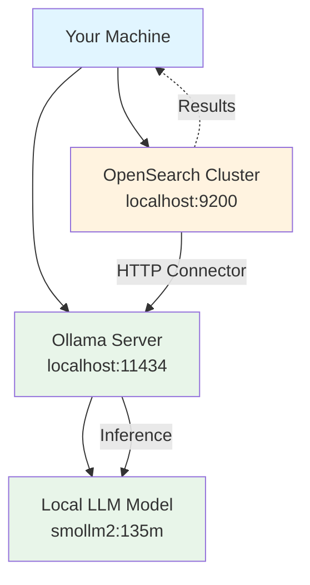
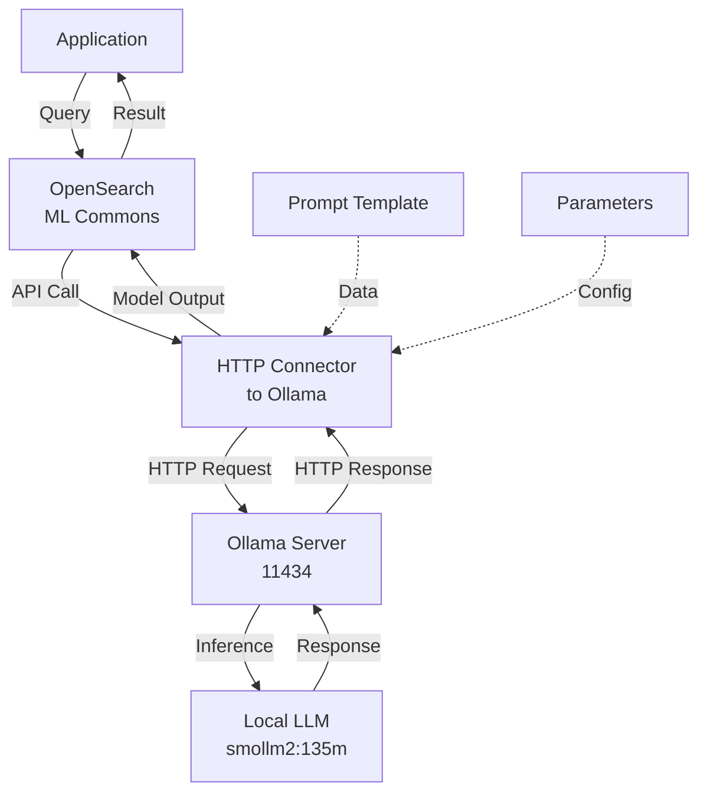
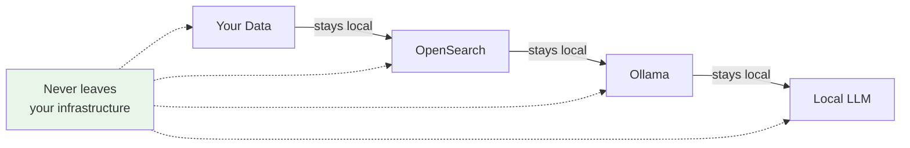
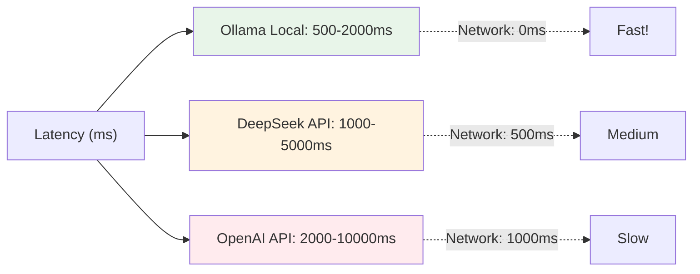

# Ollama Connector Chat - Local LLM Integration Guide

## 📖 Overview

This script demonstrates **integrating Ollama (local LLM) with OpenSearch** for privacy-first, self-hosted chat applications. Unlike cloud APIs, Ollama runs entirely on your infrastructure, giving you complete control and no API costs.

### 🎯 What You'll Learn
- Connecting to local Ollama instances
- HTTP connector configuration for local services
- Prompt-based (vs message-based) API format
- Self-hosted LLM deployment patterns
- Privacy-first RAG architecture

### 🔑 Key Differentiators from Cloud LLMs

| Aspect | Cloud (DeepSeek/OpenAI) | Ollama (Local) |
|--------|----------------------|----------------|
| **Location** | External servers | Your machine |
| **Cost** | Per API call | Free (compute cost only) |
| **Privacy** | Data sent to provider | Data stays local |
| **Latency** | 1-5 seconds | 500ms-2s |
| **Control** | Limited | Full |
| **Models** | Few options | 100+ available |

---

## 🏗️ Local LLM Architecture



---

## 🔄 Step-by-Step Implementation

### Step 1: Configure Local Ollama Connection

```python
# Configuration constants
HOST = 'localhost'
OLLAMA_IP_URL = 'ollama:11434'  # Docker container or localhost:11434
OLLAMA_MODEL = 'smollm2:135m'   # Lightweight model (~135M parameters)
PORT = 9200                      # OpenSearch port
```

**Configuration Options:**

| Setting | Value | Use Case |
|---------|-------|----------|
| `localhost:11434` | Local machine | Development/testing |
| `ollama:11434` | Docker container | Container networking |
| `remote-ip:11434` | Remote machine | Network deployment |

### Step 2: Create OpenSearch Client

```python
def get_os_client(cluster_url=CLUSTER_URL, 
                  username=DEFAULT_USERNAME, 
                  password=DEFAULT_PASSWORD):
    """Create client for local cluster"""
    client = OpenSearch(
        hosts=[cluster_url],
        http_auth=(username, password),
        verify_certs=False,
        ssl_assert_hostname=False,
        ssl_show_warn=False,
        use_ssl=True,
        max_retries=10,
        retry_on_timeout=True,
        timeout=300  # Local APIs need less time, but we're generous
    )
    return client
```

### Step 3: Configure Cluster Settings

```python
cluster_settings = {
    "persistent": {
        # Accept local endpoints
        "plugins.ml_commons.trusted_connector_endpoints_regex": [".*"],
        # Run ML tasks on any node
        "plugins.ml_commons.only_run_on_ml_node": "false",
        # Enable memory for conversations
        "plugins.ml_commons.memory_feature_enabled": "true",
        # Allow private IP (localhost is private)
        "plugins.ml_commons.connector.private_ip_enabled": "true"
    }
}
client.cluster.put_settings(body=cluster_settings)
```

### Step 4: Create Model Group

```python
model_group_name = f"ollama_embedding_group_{int(time.time())}"
model_group_body = {
    "name": model_group_name,
    "description": "Model group for Ollama chat"
}
model_group_response = client.transport.perform_request(
    'POST',
    '/_plugins/_ml/model_groups/_register',
    body=model_group_body
)
model_group_id = model_group_response['model_group_id']
```

### Step 5: Create Ollama Connector (Key Difference!)

```python
connector_body = {
    "name": "ollama_connector",
    "description": "Connector for Ollama API",
    "version": 1,
    "protocol": "http",
    "parameters": {
        "endpoint": OLLAMA_IP_URL,    # localhost:11434
        "model": OLLAMA_MODEL          # smollm2:135m
    },
    "credential": {
        "dummy_key": "dummy"           # Ollama doesn't need auth
    },
    "actions": [
        {
            "action_type": "predict",
            "method": "POST",
            "url": "http://${parameters.endpoint}/api/generate",  # Ollama's endpoint
            "headers": {
                "Content-Type": "application/json"
            },
            "request_body": "{ \"model\": \"${parameters.model}\", \"prompt\": \"${parameters.prompt}\", \"stream\": false }"
        }
    ]
}
```

**API Format Comparison:**

```
CloudLLM (OpenAI/DeepSeek/Anthropic):
POST /v1/chat/completions
{
  "messages": [
    {"role": "system", "content": "..."},
    {"role": "user", "content": "..."}
  ]
}

Ollama:
POST /api/generate
{
  "model": "smollm2",
  "prompt": "Why is the sky blue?",
  "stream": false
}
```

### Step 6: Register Model

```python
model_body = {
    "name": "ollama_chat_model",
    "function_name": "remote",
    "model_group_id": model_group_id,
    "description": f"Ollama {OLLAMA_MODEL} chat model",
    "connector_id": connector_id,
    "model_format": "TORCH_SCRIPT"
}
model_response = client.transport.perform_request(
    'POST',
    '/_plugins/_ml/models/_register',
    body=model_body
)
model_id = model_response['model_id']
```

### Step 7: Deploy Model

```python
deploy_body = {"deployment_plan": [{"model_id": model_id, "workers": 1}]}
try:
    client.transport.perform_request(
        'POST',
        f'/_plugins/_ml/models/{model_id}/_deploy',
        body=deploy_body
    )
    print("✓ Model deployment initiated")
except Exception as e:
    print(f"⚠ Error deploying model: {e}")
    return

# Wait for deployment
while True:
    status_response = client.transport.perform_request(
        'GET',
        f'/_plugins/_ml/models/{model_id}'
    )
    current_status = status_response['model_state']
    
    if current_status == 'DEPLOYED':
        print("✓ Model deployed successfully!")
        break
    elif current_status == 'FAILED':
        print("✗ Model deployment failed!")
        return
    
    time.sleep(5)
```

---

## 💬 Testing with Prompt Format

```python
# Key: Uses "prompt" not "messages"
predict_body = {
    "parameters": {
        "prompt": "Why is the sky blue? Please explain in a simple way."
    }
}

predict_response = client.transport.perform_request(
    'POST',
    f'/_plugins/_ml/models/{model_id}/_predict',
    body=predict_body
)
```

**Typical Ollama Response:**

```json
{
  "inference_results": [
    {
      "output": [
        {
          "name": "response",
          "dataAsString": "The sky appears blue due to Rayleigh scattering of sunlight in our atmosphere..."
        }
      ]
    }
  ]
}
```

---

## 🧹 Resource Cleanup

```python
def cleanup_resources(client, model_id, connector_id, model_group_id):
    """Clean up in correct order"""
    
    # 1. Undeploy
    try:
        client.transport.perform_request(
            'POST',
            f'/_plugins/_ml/models/{model_id}/_undeploy'
        )
        print(f"✓ Undeployed model")
    except Exception as e:
        print(f"⚠ Error: {e}")
    
    # 2. Delete model
    try:
        client.transport.perform_request(
            'DELETE',
            f'/_plugins/_ml/models/{model_id}'
        )
        print(f"✓ Deleted model")
    except Exception as e:
        print(f"⚠ Error: {e}")
    
    # 3. Delete connector
    try:
        client.transport.perform_request(
            'DELETE',
            f'/_plugins/_ml/connectors/{connector_id}'
        )
        print(f"✓ Deleted connector")
    except Exception as e:
        print(f"⚠ Error: {e}")
    
    # 4. Delete model group
    try:
        client.transport.perform_request(
            'DELETE',
            f'/_plugins/_ml/model_groups/{model_group_id}'
        )
        print(f"✓ Deleted model group")
    except Exception as e:
        print(f"⚠ Error: {e}")
```

---

## 📊 Ollama Models Overview

### Lightweight Models (For Local Testing)

| Model | Size | Speed | Quality | Use Case |
|-------|------|-------|---------|----------|
| `smollm2:135m` | 1.3GB | ⚡⚡⚡ | Good | Quick testing |
| `smollm:135m` | 1.3GB | ⚡⚡⚡ | Good | Development |
| `neural-chat:7b` | 4.1GB | ⚡⚡ | Better | Local prod |
| `mistral:7b` | 4.1GB | ⚡⚡ | Better | General purpose |

### Medium Models (For Production)

| Model | Size | Speed | Quality | Use Case |
|-------|------|-------|---------|----------|
| `llama2:13b` | 7.4GB | ⚡ | Excellent | Production RAG |
| `mistral:13b` | 8GB | ⚡ | Excellent | General chat |
| `neural-chat:13b` | 7.4GB | ⚡ | Excellent | Instruction |

### Installation

```bash
# Install Ollama from ollama.ai
# Then pull a model:
ollama pull smollm2:135m
ollama pull mistral:7b

# Verify it's running:
ollama serve  # Starts on localhost:11434
```

---

## 🏗️ Architecture Flow Diagram



---

## 💡 Key Patterns

### Pattern 1: Prompt Formatting for Ollama

```python
# For better responses, structure prompts carefully
prompts = {
    "qa": "Question: {query}\nAnswer: ",
    "summarize": "Summarize this: {text}\n\nSummary: ",
    "classify": "Classify this: {text}\n\nCategory: ",
}

predict_body = {
    "parameters": {
        "prompt": prompts["qa"].format(query="Why is the sky blue?")
    }
}
```

### Pattern 2: Local Development Workflow

```python
# 1. Start Ollama locally
# ollama serve

# 2. Pull model
# ollama pull smollm2:135m

# 3. Run script
# python ollama_connector_chat_lite.py

# 4. Everything stays on your machine - no cloud costs!
```

### Pattern 3: Docker Deployment

```python
# Update configuration for Docker
OLLAMA_IP_URL = 'ollama:11434'  # Service name in docker-compose

# docker-compose.yml
services:
  ollama:
    image: ollama/ollama:latest
    ports:
      - "11434:11434"
  
  opensearch:
    image: opensearchproject/opensearch:latest
```

---

## 🚀 Advantages of Ollama

### Privacy & Security



### Cost Analysis

| Scenario | Cloud (DeepSeek) | Local (Ollama) |
|----------|------------------|----------------|
| 1000 queries/day | $0.50-2.00 | $0 |
| 100K queries/month | $15-60 | $0 |
| CPU hours | 0 | ~$5/month |
| **Total Cost/Month** | **$15-60** | **~$5** |

### Performance

| Metric | Cloud | Ollama |
|--------|-------|--------|
| Average latency | 1-5s | 500ms-2s |
| Network overhead | 1-2s | 0ms (local) |
| Dependency on connectivity | Internet required | Local only |
| Rate limiting | Yes (strict) | No limits |

---

## ⚠️ Troubleshooting

| Problem | Cause | Solution |
|---------|-------|----------|
| **Connection Refused** | Ollama not running | Run `ollama serve` |
| **Model Not Found** | Model not pulled | Run `ollama pull smollm2:135m` |
| **Port Already in Use** | Another service on 11434 | Change port or kill process |
| **Out of Memory** | Model too large | Use smaller model (135m → 7b) |
| **Slow Responses** | Underpowered CPU | Reduce model size or get GPU |
| **Timeout Error** | Inference taking too long | Increase timeout or use faster model |

---

## 🔗 Complete Local RAG Example

```python
"""
Complete local RAG with Ollama:
- Documents stored in OpenSearch
- Embedding via local model
- Query via Ollama
- No cloud dependencies
"""

# 1. Index documents locally
for doc in documents:
    client.index(index="docs", body=doc)

# 2. Search for relevant docs
results = client.search(index="docs", body={...})

# 3. Format prompt with retrieved docs
prompt = f"""Context: {results}

Question: Why is the sky blue?

Answer: """

# 4. Get response from local Ollama
response = client.transport.perform_request(
    'POST',
    f'/_plugins/_ml/models/{model_id}/_predict',
    body={"parameters": {"prompt": prompt}}
)
```

---

## 📈 Performance Comparison Diagram



---

## 🎓 Learning Path

```
1. Install Ollama (5 min)
   ├─ Download from ollama.ai
   └─ Start server

2. Pull a Model (2 min)
   ├─ ollama pull smollm2:135m
   └─ Verify with ollama list

3. Run This Script (5 min)
   ├─ Create connector
   ├─ Deploy model
   └─ Test inference

4. Build RAG (30 min)
   ├─ Index documents
   ├─ Search locally
   └─ Generate responses

5. Production Setup (1 hour)
   ├─ Docker deployment
   ├─ GPU optimization
   └─ Performance tuning
```

---

## 🔗 Related Topics

- 🔗 [DeepSeek Integration](../deepseek/deepseek_connector_chat_lite.md)
- 🔗 [OpenAI Integration](../openai/README_OPENAI.md)
- 🔗 [Local vs Cloud Comparison](../README_EXTERNAL_MODELS.md)
- 🔗 [Full Production Version](./ollama_connector_chat.py)

---

## ✨ Summary

This script demonstrates:
- ✅ **Local LLM integration** with Ollama
- ✅ **Privacy-first RAG** architecture
- ✅ **Cost-effective deployment** (no API costs)
- ✅ **Simple HTTP connector** for local services
- ✅ **Fast inference** on local hardware
- ✅ **Complete control** over your models

**Perfect for building private, self-hosted RAG systems!** 🚀

