# Ollama Connector Chat (Production Edition)

## 📚 Overview

`ollama_connector_chat.py` is a **production-grade implementation** of local Ollama LLM integration with OpenSearch ML Commons. Unlike the lite version, this implementation includes:

- **Streaming model downloads** with progress tracking
- **Robust error handling** for all operations
- **Exception-safe resource cleanup** with graceful degradation
- **Production monitoring patterns** for model deployment
- **Advanced configuration options** for distributed Ollama deployments
- **Comprehensive logging** throughout the workflow

This guide helps you understand how to build **enterprise-ready local LLM systems** that prioritize reliability, observability, and graceful failure recovery.

---

## 🏗️ Architecture Overview

```mermaid
graph TB
    subgraph "Your Infrastructure"
        OSearch["🔍 OpenSearch Cluster<br/>localhost:9200"]
        OllamaHost["🤖 Ollama Server<br/>192.168.0.151:11435<br/>CPU/GPU Compute"]
    end
    
    subgraph "Application Layer"
        PyScript["🐍 ollama_connector_chat.py<br/>Production Handler"]
    end
    
    subgraph "LLM Models"
        Model1["smollm2:135m<br/>Lightweight"]
        Model2["neural-chat:latest<br/>Standard"]
        Model3["Custom Models<br/>Large"]
    end
    
    PyScript -->|"Create cluster settings"| OSearch
    PyScript -->|"Pull model via stream"| OllamaHost
    PyScript -->|"Register & deploy"| OSearch
    PyScript -->|"Test inference"| OSearch
    PyScript -->|"Cleanup safely"| OSearch
    OllamaHost -->|"Host & run"| Model1
    OllamaHost -->|"Host & run"| Model2
    OllamaHost -->|"Host & run"| Model3
    OSearch -->|"Call model"| OllamaHost
    
    style PyScript fill:#ff6b6b,stroke:#c92a2a,color:#fff
    style OSearch fill:#4ecdc4,stroke:#0d9488,color:#fff
    style OllamaHost fill:#45b7d1,stroke:#0284c7,color:#fff
```



---

## 🔑 Key Features vs Lite Version

### Streaming Model Downloads


**Advantages of streaming downloads:**
- Real-time progress feedback
- Works with large models (7B-13B parameters)
- Prevents timeout on slow networks
- Shows completion percentage
- Better user experience

### Production Error Handling

```mermaid
graph TD
    A["Operation<br/>Attempt"] --> B{Try Block}
    B -->|"Success"| C["✓ Continue"]
    B -->|"Exception"| D["Log Error<br/>Details"]
    D --> E{Critical?}
    E -->|"Yes"| F["Return<br/>Early"]
    E -->|"No"| G["Warn & Continue"]
    F --> H["Run Cleanup<br/>Finally Block"]
    G --> H
    H --> I["✓ Cleanup<br/>Complete"]
    
    style A fill:#fff3bf,stroke:#f59f00
    style C fill:#d3f9d8,stroke:#2f9e44
    style F fill:#ffe0e0,stroke:#c92a2a
    style I fill:#d3f9d8,stroke:#2f9e44
```



---

## 📋 7-Step Implementation Workflow

### Step 1: Cluster Configuration with Validation

```python
# Configure cluster to accept Ollama endpoints
cluster_settings = {
    "persistent": {
        "plugins.ml_commons.trusted_connector_endpoints_regex": [".*"],
        "plugins.ml_commons.only_run_on_ml_node": "false",
        "plugins.ml_commons.memory_feature_enabled": "true",
        "plugins.ml_commons.connector.private_ip_enabled": "true"
    }
}
client.cluster.put_settings(body=cluster_settings)
```

**Configuration explained:**
- `trusted_connector_endpoints_regex`: Allows Ollama endpoint (192.168.0.151:11435)
- `memory_feature_enabled`: Enables model memory tracking
- `connector.private_ip_enabled`: Allows private IP connectivity

### Step 2: List Models with Error Handling

```python
try:
    resp = requests.get(f"http://{OLLAMA_IP_URL}/api/tags")
    resp.raise_for_status()  # Raise exception for HTTP errors
    models = resp.json().get('models', [])
    if not models:
        print("No models returned from Ollama endpoint.")
        return  # Exit gracefully if no models
    for i, m in enumerate(models, start=1):
        print(f"  {i}. {m.get('name')}")
except Exception as e:
    print(f"Could not list models: {e}")
    return  # Exit if connectivity fails
```

**Error handling patterns:**
- Uses `raise_for_status()` for HTTP errors
- Checks for empty model list
- Catches all network exceptions
- Returns early if Ollama is unreachable

### Step 3: Streaming Model Download (Production Feature)

```python
try:
    payload = {
        "name": OLLAMA_MODEL,
        "stream": True  # Enable streaming for large models
    }
    headers = {"Content-Type": "application/json"}
    response = requests.post(
        f"http://{OLLAMA_IP_URL}/api/pull",
        headers=headers,
        data=json.dumps(payload),
        stream=True  # Stream the response
    )
    response.raise_for_status()
    
    # Process streamed chunks
    for chunk in response.iter_content(chunk_size=None):
        if chunk:
            try:
                data = json.loads(chunk.decode('utf-8'))
                if "status" in data:
                    print(f"Status: {data['status']}")
                if "total" in data and "completed" in data:
                    progress = (data["completed"] / data["total"]) * 100
                    print(f"Download Progress: {progress:.2f}%")
            except json.JSONDecodeError:
                print(f"Received non-JSON chunk: {chunk.decode('utf-8')}")
except requests.exceptions.RequestException as e:
    print(f"Error pulling model: {e}")
    if hasattr(e, 'response') and e.response is not None:
        print(f"Response content: {e.response.text}")
```

**Streaming features:**
- `stream=True` enables chunked download
- Shows download progress percentage
- Handles both JSON and non-JSON responses
- Extracts HTTP error details for debugging
- Works with models 1GB - 50GB+

### Step 4: Model Group Creation

```python
model_group_name = f"ollama_embedding_group_{int(time.time())}"
model_group_body = {
    "name": model_group_name,
    "description": "Model group for Ollama chat"
}
model_group_response = client.transport.perform_request(
    'POST',
    '/_plugins/_ml/model_groups/_register',
    body=model_group_body
)
model_group_id = model_group_response['model_group_id']
```

**Best practice:** Timestamp-based naming prevents conflicts when running multiple times

### Step 5: Create Ollama Connector with Proper API Format

```python
connector_body = {
    "name": "ollama_connector",
    "description": "Connector for Ollama API",
    "version": 1,
    "protocol": "http",
    "parameters": {
        "endpoint": OLLAMA_IP_URL,
        "model": OLLAMA_MODEL
    },
    "credential": {
        "dummy_key": "dummy"  # Ollama doesn't require auth
    },
    "actions": [
        {
            "action_type": "predict",
            "method": "POST",
            "url": "http://${parameters.endpoint}/api/generate",
            "headers": {
                "Content-Type": "application/json"
            },
            "request_body": "{ \"model\": \"${parameters.model}\", \"prompt\": \"${parameters.prompt}\", \"stream\": false }"
        }
    ]
}
connector_response = client.transport.perform_request(
    'POST',
    '/_plugins/_ml/connectors/_create',
    body=connector_body
)
connector_id = connector_response['connector_id']
```

**Key differences from cloud APIs:**
- Uses `/api/generate` endpoint (not `/chat/completions`)
- Uses `prompt` parameter (not `messages` array)
- `stream: false` for synchronous responses
- No authentication needed

### Step 6: Deploy Model with Status Polling

```python
model_body = {
    "name": "ollama_chat_model",
    "function_name": "remote",
    "model_group_id": model_group_id,
    "description": f"Ollama {OLLAMA_MODEL} chat model",
    "connector_id": connector_id,
    "model_format": "TORCH_SCRIPT"
}
model_response = client.transport.perform_request(
    'POST',
    '/_plugins/_ml/models/_register',
    body=model_body
)
model_id = model_response['model_id']

# Deploy the model
deploy_body = {"deployment_plan": [{"model_id": model_id, "workers": 1}]}
try:
    client.transport.perform_request(
        'POST',
        f'/_plugins/_ml/models/{model_id}/_deploy',
        body=deploy_body
    )
except Exception as e:
    print(f"⚠ Error deploying model: {e}")
    return  # Exit early on deployment failure

# Poll for deployment completion
print("⏳ Waiting for model deployment...")
while True:
    status_response = client.transport.perform_request(
        'GET',
        f'/_plugins/_ml/models/{model_id}'
    )
    current_status = status_response['model_state']
    print(f"   Current status: {current_status}")
    
    if current_status == 'DEPLOYED':
        print("✓ Model deployed successfully!")
        break
    elif current_status == 'FAILED':
        print("✗ Model deployment failed!")
        return  # Exit early on failure
    
    time.sleep(5)  # Poll every 5 seconds
```

**Production patterns:**
- Deployment is asynchronous (returns immediately)
- Polling with sleep intervals prevents CPU spinning
- Early exit on failure prevents infinite loops
- Status checking prevents race conditions

### Step 7: Exception-Safe Cleanup (Production Critical)

```python
def cleanup_resources(client, model_id, connector_id, model_group_id):
    """Clean up all created resources in correct order."""
    
    # 1. Undeploy the model
    try:
        client.transport.perform_request(
            'POST',
            f'/_plugins/_ml/models/{model_id}/_undeploy'
        )
        print(f"✓ Undeployed model: {model_id}")
    except Exception as e:
        print(f"⚠ Error undeploying model: {e}")
        # Don't return - continue cleanup
    
    # 2. Delete the model
    try:
        client.transport.perform_request(
            'DELETE',
            f'/_plugins/_ml/models/{model_id}'
        )
        print(f"✓ Deleted model: {model_id}")
    except Exception as e:
        print(f"⚠ Error deleting model: {e}")
        # Don't return - continue cleanup
    
    # 3. Delete the connector
    try:
        client.transport.perform_request(
            'DELETE',
            f'/_plugins/_ml/connectors/{connector_id}'
        )
        print(f"✓ Deleted connector: {connector_id}")
    except Exception as e:
        print(f"⚠ Error deleting connector: {e}")
        # Don't return - continue cleanup
    
    # 4. Delete the model group
    try:
        client.transport.perform_request(
            'DELETE',
            f'/_plugins/_ml/model_groups/{model_group_id}'
        )
        print(f"✓ Deleted model group: {model_group_id}")
    except Exception as e:
        print(f"⚠ Error deleting model group: {e}")
        # Still mark cleanup as complete
    
    print("✓ Cleanup completed!")
```

**Critical cleanup principles:**
- Catch exceptions in each step (don't propagate)
- Continue cleanup even if one step fails
- Cleanup resources in **reverse order** of creation
- Log all errors for troubleshooting
- Mark cleanup complete even with partial failures

---

## 🔄 API Format Comparison

### Cloud APIs (DeepSeek, OpenAI, Anthropic)

```python
# Message-based format (chat-like)
request = {
    "model": "deepseek-chat",
    "messages": [
        {"role": "user", "content": "Why is the sky blue?"}
    ],
    "temperature": 0.7
}
```

### Ollama (Local)

```python
# Prompt-based format (text completion)
request = {
    "model": "smollm2:135m",
    "prompt": "Why is the sky blue?",
    "stream": false,
    "temperature": 0.7
}
```

**Key differences:**
- Cloud: Conversational (messages array with roles)
- Ollama: Completion-based (single prompt string)
- Cloud: Supports multi-turn conversations natively
- Ollama: Requires manual message concatenation for multi-turn

---

## 📊 Production Patterns

### Pattern 1: Streaming Downloads for Large Models

| Model | Size | Download Time | Streaming Benefit |
|-------|------|---------------|--------------------|
| smollm2:135m | 60 MB | 2-5 sec | Progress feedback |
| neural-chat:latest | 4 GB | 30-120 sec | Prevents timeout |
| mistral:7b | 4 GB | 30-120 sec | User feedback |
| llama2:13b | 8 GB | 60-300 sec | Essential for UX |

### Pattern 2: Error Handling Strategy

| Scenario | Lite Approach | Production Approach |
|----------|--------------|----------------------|
| Network error | Let exception propagate | Catch, log, return cleanly |
| Model not found | Crash | List available, guide user |
| Deployment fails | Partial cleanup | Exception-safe full cleanup |
| HTTP error | No details | Extract response content |

### Pattern 3: Resource Cleanup Order

```
Creation Order:        Cleanup Order:
1. Model Group         → 4. Model Group (last)
2. Connector           → 3. Connector
3. Model               → 2. Model
4. Deployment          → 1. Undeploy (first)
```

**Why this order matters:**
- Undeploy before delete (releases resources)
- Delete model before connector (model no longer needed)
- Delete connector before group (connector belongs to group)
- Delete group last (cleanup dependencies first)

---

## 🚀 Running the Script

### Prerequisites

```bash
# 1. Ollama running and accessible
# Check at: http://192.168.0.151:11435/api/tags

# 2. OpenSearch cluster running
# Check at: https://localhost:9200

# 3. Required Python packages
pip install opensearch-py requests python-dotenv
```

### Execution

```bash
# Navigate to the script directory
cd opensearch/my_tutorial/scripts/4. LLM_AGENTS_RAG/3. external_hosted_models/ollama

# Run the production connector
python ollama_connector_chat.py
```

### Expected Output

```
=== Ollama Embedding Model Integration with OpenSearch ===

Step 1: Initializing OpenSearch Client and Configuring Cluster...
✓ Cluster settings configured successfully

Step 2: Listing available Ollama models from endpoint...
Available Ollama models:
  1. smollm2:135m
  2. neural-chat:latest

Attempting to pull model: smollm2:135m
Status: pulling manifest
Download Progress: 15.50%
Download Progress: 45.75%
Download Progress: 95.20%
Model 'smollm2:135m' pull complete.

Step 3: Initializing OpenSearch Client and Creating Model Group...
✓ Created model group 'ollama_embedding_group_1698765432' with ID: abc123def456

Step 4: Creating Ollama connector...
✓ Created Ollama connector with ID: conn123def456

Step 5: Registering and Deploying Model...
✓ Registered model with ID: model123def456
✓ Model deployment initiated
⏳ Waiting for model deployment to complete...
   Current status: DEPLOYING
   Current status: DEPLOYING
✓ Model deployed successfully!

Step 6: Testing Model with Sample Data...
✓ Model prediction successful!
{
  "predictions": [
    {
      "response": "The sky appears blue due to Rayleigh scattering..."
    }
  ]
}

Step 7: Cleaning Up Resources...
✓ Undeployed model with ID: model123def456
✓ Deleted model with ID: model123def456
✓ Deleted connector with ID: conn123def456
✓ Deleted model group with ID: abc123def456
✓ Cleanup completed!
```

---

## 🛠️ Configuration Customization

### Change Ollama Host

```python
# For remote Ollama server
OLLAMA_IP_URL = "192.168.0.151:11435"  # Your server IP and port

# For local Ollama
OLLAMA_IP_URL = "localhost:11434"

# For Docker-based Ollama
OLLAMA_IP_URL = "ollama:11434"  # From docker-compose service name
```

### Select Different Models

```python
# Lightweight (135M parameters - good for testing)
OLLAMA_MODEL = "smollm2:135m"

# Standard (7B parameters - good for general use)
OLLAMA_MODEL = "neural-chat:latest"

# Large (13B parameters - better quality)
OLLAMA_MODEL = "mistral:latest"

# Production (70B parameters - best quality)
OLLAMA_MODEL = "llama2:70b"
```

### Adjust Timeout for Slow Networks

```python
# In get_os_client function
client = OpenSearch(
    hosts=[cluster_url],
    timeout=300,  # Increase for slow networks
    # ... other params
)
```

---

## 📈 Performance Optimization

### Local Inference Latency

| Model | Parameters | Memory | Latency | Throughput |
|-------|-----------|--------|---------|-----------|
| smollm2 | 135M | 150 MB | 100-300ms | 300-500 tokens/sec |
| neural-chat | 7B | 4-8 GB | 500ms-2s | 50-150 tokens/sec |
| mistral | 7B | 4-8 GB | 800ms-2.5s | 50-100 tokens/sec |
| llama2 | 13B | 8-16 GB | 2-5s | 30-60 tokens/sec |

### Cost Comparison (Annual)

| Solution | Setup | Monthly | Annual | Notes |
|----------|-------|---------|--------|-------|
| Ollama Local | $500-2000 | $0 | $0 | One-time hardware |
| DeepSeek API | $0 | $15-60 | $180-720 | Per-query cost |
| OpenAI API | $0 | $50-200 | $600-2400 | High volume pricing |

---

## 🔍 Troubleshooting Guide

### Issue 1: "Could not list models from Ollama"

```
Error: Could not list models from 192.168.0.151:11435: Connection refused
```

**Solutions:**
1. Verify Ollama is running: `curl http://192.168.0.151:11435/api/tags`
2. Check firewall: `sudo ufw allow 11435`
3. Verify network connectivity: `ping 192.168.0.151`
4. Check Ollama service: `sudo systemctl status ollama`

### Issue 2: "Model deployment failed"

```
✗ Model deployment failed!
```

**Solutions:**
1. Check OpenSearch ML nodes: `GET /_nodes/stats/ml_*`
2. Verify model compatibility: `GET /_plugins/_ml/models/{model_id}`
3. Check cluster memory: `GET /_nodes/stats/jvm`
4. Increase timeout value (slow deployment)

### Issue 3: "Error during prediction"

```
⚠ Error during prediction: model not deployed
```

**Solutions:**
1. Verify model deployment status
2. Wait longer for deployment to complete
3. Check model format compatibility
4. Review OpenSearch logs for details

### Issue 4: "Cleanup failed" (non-fatal)

```
⚠ Error deleting model: Resource in use
```

**Solutions:**
1. Wait a few seconds, manually cleanup: `DELETE /_plugins/_ml/models/{model_id}`
2. Check if other requests using model
3. Review resource dependency chain

---

## 🎓 Production Checklist

- [ ] **Configuration**
  - [ ] Ollama host accessible and responding
  - [ ] Required model downloaded or available
  - [ ] OpenSearch cluster reachable
  - [ ] Network firewall rules configured
  - [ ] Credentials stored in `.env` file

- [ ] **Error Handling**
  - [ ] All network calls have try-catch
  - [ ] Early exit on critical errors
  - [ ] HTTP error details captured
  - [ ] Graceful degradation implemented
  - [ ] User-friendly error messages

- [ ] **Resource Management**
  - [ ] Cleanup function always called
  - [ ] Exception handling in cleanup
  - [ ] No resource leaks possible
  - [ ] Cleanup order verified
  - [ ] Monitoring for stuck resources

- [ ] **Performance**
  - [ ] Timeout values appropriate
  - [ ] Polling intervals optimized
  - [ ] Model size suitable for hardware
  - [ ] Memory requirements checked
  - [ ] Latency expectations documented

- [ ] **Monitoring**
  - [ ] Status updates logged
  - [ ] Progress feedback shown
  - [ ] Errors logged with context
  - [ ] Deployment time tracked
  - [ ] Resource utilization monitored

---

## 🔗 Learning Path

**Beginner to Production:**

1. **Start**: `ollama_connector_chat_lite.py` (understand basics)
2. **Progress**: `ollama_connector_chat.py` (learn production patterns)
3. **Advance**: Implement custom error handlers
4. **Master**: Build monitoring dashboard for deployed models
5. **Expert**: Implement auto-scaling for Ollama clusters

---

## 📚 Key Differences: Lite vs Production

| Aspect | Lite | Production |
|--------|------|-----------|
| Model Download | None (assumed present) | Streaming with progress |
| Error Handling | Basic try-catch | Comprehensive try-catch all levels |
| Cleanup | Simple cleanup | Exception-safe cleanup with continuation |
| Logging | Minimal status messages | Detailed logging throughout |
| Failure Recovery | Returns immediately | Attempts recovery where possible |
| Code Length | ~100 lines | ~300 lines |
| Production Ready | 70% | 95%+ |

---

## ✨ Summary

This production-grade Ollama connector demonstrates:

✅ **Streaming downloads** for large models with progress feedback  
✅ **Robust error handling** at every operation level  
✅ **Exception-safe resource cleanup** with graceful degradation  
✅ **Production monitoring patterns** for deployment status  
✅ **Comprehensive logging** for troubleshooting  
✅ **Best practices** for local LLM integration  

Use this as your template for building **reliable, observable, and maintainable** local LLM systems with OpenSearch!

