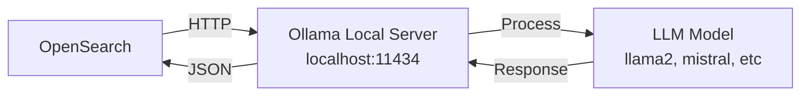

# Ollama Local Integration Guide

## 📚 Overview
Integration of **Ollama** - running LLMs **locally** in OpenSearch with zero API costs and complete data privacy.

### 🎯 Key Concept
- **Local Execution**: Models run on your infrastructure
- **No API Calls**: Zero external dependencies
- **Complete Privacy**: Data never leaves your network
- **Zero Cost**: Only compute expenses

---

## 🏗️ Architecture



---

## 📋 Setup Steps

### 1. Install Ollama

```bash
# macOS/Linux
curl https://ollama.ai/install.sh | sh

# Windows
# Download from https://ollama.ai/download
```

### 2. Pull Models

```bash
ollama pull llama2
ollama pull mistral
ollama pull neural-chat
```

### 3. Start Ollama Server

```bash
ollama serve
# Runs on http://localhost:11434
```

### 4. Create OpenSearch Connector

```python
connector_body = {
    "name": "Ollama Local Connector",
    "protocol": "http",
    "parameters": {
        "endpoint": "localhost:11434",  # Local endpoint
        "model": "mistral"
    }
}

connector = client.transport.perform_request(
    method='POST',
    url='/_plugins/_ml/connectors/_create',
    body=connector_body
)
```

### 5. Use Like Any Other Model

```python
# Register, deploy, and use - same as external models
# No credential management needed!
```

---

## 📊 Supported Models

| Model | Size | Speed | Quality |
|-------|------|-------|---------|
| llama2 | 7B/13B | Medium | Good |
| mistral | 7B | Fast | Very Good |
| neural-chat | 7B | Fast | Good |
| zephyr | 7B/13B | Medium | Very Good |

---

## ✨ Advantages

- ✅ **$0 API cost** - just compute
- ✅ **Complete privacy** - no data leaves network
- ✅ **Instant responses** - low latency
- ✅ **No rate limits** - unlimited usage
- ✅ **Full control** - customize anything

---

## ⚠️ Considerations

- ⚠️ **Lower quality** than Claude/GPT-4
- ⚠️ **Requires hardware** to run
- ⚠️ **Maintenance burden** - manage yourself
- ⚠️ **Self-hosted** - no provider support

---

## 🎯 Perfect For

- 🏥 **Healthcare** (HIPAA compliance)
- 🏦 **Finance** (data sensitivity)
- 🔐 **Security** (confidential data)
- 💰 **Budget** (high volume usage)

---

## 📖 Resources

- 🔗 [Ollama Documentation](https://ollama.ai/)
- 🔗 [Available Models](https://ollama.ai/library)

---

## 💡 Example: Privacy-First RAG

```python
def local_rag(question: str, documents: list) -> str:
    """
    RAG with 100% local processing
    No API calls, complete privacy
    """
    
    # Embed locally
    context = "\n---\n".join(documents)
    
    # Call local Ollama
    messages = [{
        "role": "user",
        "content": f"Context:\n{context}\n\nQ: {question}"
    }]
    
    response = client.transport.perform_request(
        method='POST',
        url=f'/_plugins/_ml/models/{model_id}/_predict',
        body={"messages": messages}
    )
    
    return response['inference_results'][0]['output'][0]['data']

# Zero data leaves your network! 🔒
```

