# OpenAI Chat Completions (Production Edition)

## 📚 Overview

`openai_connector_chat_completions_organized.py` is a **production-grade implementation** of OpenAI chat completions integration with OpenSearch ML Commons. This script demonstrates how to:

- **Deploy GPT-4o-mini chat model** for conversational AI
- **Support multimodal inputs** (text + images)
- **Analyze images** with vision capabilities
- **Integrate chat completions** into OpenSearch
- **Build intelligent assistant systems** with OpenAI API

This is the **most advanced variant** supporting both text and image inputs, enabling vision-based analysis within your RAG pipeline.

---

## 🏗️ Architecture Overview

```mermaid
graph TB
    subgraph "Input Processing"
        Text["📝 Text Input<br/>Natural language"]
        Image["🖼️ Image Input<br/>JPEG/PNG"]
        Base64["🔐 Base64 Encode<br/>Data URI format"]
    end
    
    subgraph "OpenAI API"
        APIKey["🔑 Authentication<br/>Bearer token"]
        GPT4o["🧠 GPT-4o-mini<br/>Multimodal LLM"]
    end
    
    subgraph "Processing"
        Vision["👁️ Vision Analysis<br/>Image understanding"]
        Language["💬 Language Model<br/>Reasoning"]
    end
    
    subgraph "Output"
        Response["✨ Chat Response<br/>Text answer"]
    end
    
    subgraph "OpenSearch"
        OSIndex["📇 Response Index<br/>Store & search"]
    end
    
    Text -->|"Prepare"| GPT4o
    Image -->|"Encode"| Base64
    Base64 -->|"Send"| GPT4o
    APIKey -->|"Authorize"| GPT4o
    GPT4o -->|"Analyze"| Vision
    GPT4o -->|"Reason"| Language
    Vision -->|"Output"| Response
    Language -->|"Output"| Response
    Response -->|"Index"| OSIndex
    
    style GPT4o fill:#10a37f,stroke:#0d7e4f,color:#fff
    style Vision fill:#ff6b6b,stroke:#c92a2a,color:#fff
    style Response fill:#d3f9d8,stroke:#2f9e44,color:#000
```



---

## 🔑 Chat Completions vs Embeddings

### Embeddings (Previous File)

```python
# Input: Text to vectorize
input_text = "What is OpenSearch?"

# Output: Fixed-size vector (1536 dimensions)
output = [0.234, -0.891, ..., 0.423]
# Use case: Semantic search, similarity matching
```

### Chat Completions (This File)

```python
# Input: Conversational messages (text or images)
messages = [
    {
        "role": "user",
        "content": [
            {"type": "text", "text": "What's in this image?"},
            {"type": "image_url", "image_url": {"url": "data:image/jpeg;base64,..."}}
        ]
    }
]

# Output: Natural language response (variable length)
output = "This image shows a product package for diapers with..."
# Use case: QA, image analysis, reasoning, conversation
```

---

## 🎨 Multimodal Input Support

### Text-Only Request

```python
test_predict_body = {
    "parameters": {
        "messages": [
            {
                "role": "user",
                "content": "Hello! Can you help me understand how OpenSearch ML works?"
            }
        ]
    }
}
```

### Image + Text Request

```python
# Encode image to base64
def encode_image(image_path):
    """Convert image file to base64 data URI."""
    with open(image_path, "rb") as image_file:
        return base64.b64encode(image_file.read()).decode('utf-8')

base64_image = encode_image("diapers.png")

test_predict_body = {
    "parameters": {
        "messages": [
            {
                "role": "user",
                "content": [
                    {
                        "type": "text",
                        "text": "What's in this image?"
                    },
                    {
                        "type": "image_url",
                        "image_url": {
                            "url": f"data:image/jpeg;base64,{base64_image}"
                        }
                    }
                ]
            }
        ]
    }
}
```

**Supported image formats:**
- JPEG
- PNG
- GIF
- WebP

**Maximum image size:** 20 MB per image

---

## 🔄 Step-by-Step Implementation

### Step 1: Initialize with Image Support

```python
import base64

def encode_image(image_path):
    """
    Encode an image file to base64 for API transmission.
    
    Args:
        image_path (str): Path to image file (JPEG, PNG, GIF, WebP)
        
    Returns:
        str: Base64-encoded image data
    """
    with open(image_path, "rb") as image_file:
        return base64.b64encode(image_file.read()).decode('utf-8')

# Configure cluster for OpenAI
cluster_settings = {
    "persistent": {
        "plugins.ml_commons.trusted_connector_endpoints_regex": "^https://api\\.openai\\.com/.*$",
        "plugins.ml_commons.only_run_on_ml_node": "false",
        "plugins.ml_commons.memory_feature_enabled": "true"
    }
}
client.cluster.put_settings(body=cluster_settings)
```

### Step 2: Create Model Group

```python
model_group_name = f"openai_model_group_{int(time.time())}"
llm_model_group_body = {
    "name": model_group_name,
    "description": "A model group for OpenAI chat completion models"
}

response = client.transport.perform_request(
    'POST',
    '/_plugins/_ml/model_groups/_register',
    body=llm_model_group_body
)
llm_model_group_id = response['model_group_id']
```

### Step 3: Create Chat Completions Connector

```python
llm_connector_body = {
    "name": "OpenAI Chat Connector",
    "description": "The connector to public OpenAI model service for GPT-4o-mini",
    "version": 1,
    "protocol": "http",
    "parameters": {
        "endpoint": "api.openai.com",
        "model": "gpt-4o-mini"  # Supports text + images
    },
    "credential": {
        "openAI_key": OPENAI_API_KEY
    },
    "actions": [
        {
            "action_type": "predict",
            "method": "POST",
            "url": "https://${parameters.endpoint}/v1/chat/completions",
            "headers": {
                "Authorization": "Bearer ${credential.openAI_key}"
            },
            "request_body": "{ \"model\": \"${parameters.model}\", \"messages\": ${parameters.messages} }"
        }
    ]
}

response = client.transport.perform_request(
    'POST',
    '/_plugins/_ml/connectors/_create',
    body=llm_connector_body
)
llm_connector_id = response['connector_id']
```

**Key differences:**
- Endpoint: `/v1/chat/completions` (not `/v1/embeddings`)
- Parameter: `messages` array (not `input`)
- Model: `gpt-4o-mini` (multimodal capable)

### Step 4: Register and Deploy Model

```python
llm_model_body = {
    "name": "openAI-gpt-4o-mini",
    "function_name": "remote",
    "model_group_id": llm_model_group_id,
    "description": "OpenAI GPT-4o-mini chat completion model",
    "connector_id": llm_connector_id
}

response = client.transport.perform_request(
    'POST',
    '/_plugins/_ml/models/_register',
    body=llm_model_body
)
llm_model_id = response['model_id']

# Deploy
deploy_body = {
    "deployment_plan": [
        {
            "model_id": llm_model_id,
            "workers": 1
        }
    ]
}

client.transport.perform_request(
    'POST',
    f'/_plugins/_ml/models/{llm_model_id}/_deploy',
    body=deploy_body
)

# Wait for deployment
while True:
    status_response = client.transport.perform_request(
        'GET',
        f'/_plugins/_ml/models/{llm_model_id}'
    )
    if status_response['model_state'] == 'DEPLOYED':
        print("✓ Model deployed successfully!")
        break
    time.sleep(5)
```

### Step 5: Test with Image Analysis

```python
# Encode the image
try:
    base64_image = encode_image("diapers.png")
    print(f"✓ Successfully encoded image")
except Exception as e:
    print(f"⚠ Error encoding image: {e}")
    base64_image = None

# Prepare request with image
if base64_image:
    test_predict_body = {
        "parameters": {
            "messages": [
                {
                    "role": "user",
                    "content": [
                        {
                            "type": "text",
                            "text": "What's in this image? Describe the product."
                        },
                        {
                            "type": "image_url",
                            "image_url": {
                                "url": f"data:image/jpeg;base64,{base64_image}"
                            }
                        }
                    ]
                }
            ]
        }
    }
else:
    # Fallback to text-only
    test_predict_body = {
        "parameters": {
            "messages": [
                {
                    "role": "user",
                    "content": "Hello! How can I use OpenSearch with AI?"
                }
            ]
        }
    }

# Get response
try:
    predict_response = client.transport.perform_request(
        'POST',
        f'/_plugins/_ml/models/{llm_model_id}/_predict',
        body=test_predict_body
    )
    print("✓ Model prediction successful!")
    print(json.dumps(predict_response, indent=2))
except Exception as e:
    print(f"⚠ Error during prediction: {e}")
```

### Step 6: Cleanup Resources (Optional)

```python
def cleanup_resources(client, model_id, connector_id, model_group_id):
    """Clean up resources - optional for persistent systems."""
    
    try:
        client.transport.perform_request(
            'POST',
            f'/_plugins/_ml/models/{model_id}/_undeploy'
        )
        print(f"✓ Undeployed model")
    except Exception as e:
        print(f"⚠ Error undeploying: {e}")

    try:
        client.transport.perform_request(
            'DELETE',
            f'/_plugins/_ml/models/{model_id}'
        )
        print(f"✓ Deleted model")
    except Exception as e:
        print(f"⚠ Error deleting model: {e}")

    try:
        client.transport.perform_request(
            'DELETE',
            f'/_plugins/_ml/connectors/{connector_id}'
        )
        print(f"✓ Deleted connector")
    except Exception as e:
        print(f"⚠ Error deleting connector: {e}")

    try:
        client.transport.perform_request(
            'DELETE',
            f'/_plugins/_ml/model_groups/{model_group_id}'
        )
        print(f"✓ Deleted model group")
    except Exception as e:
        print(f"⚠ Error deleting group: {e}")
```

---

## 📊 GPT-4o-mini Capabilities

### Model Comparison

| Aspect | GPT-4o-mini | GPT-4 | GPT-3.5-turbo |
|--------|------------|-------|----------------|
| Vision Support | ✅ Yes | ✅ Yes | ❌ No |
| Context Window | 128K | 8K-128K | 4K-16K |
| Cost per 1M tokens | $0.15 | $30 | $0.50 |
| Speed | Fast | Slow | Very Fast |
| Image Analysis | Excellent | Excellent | N/A |
| Reasoning | Very Good | Best | Good |

### Real-World Use Cases

1. **Product Image Analysis**
   - Analyze product photos
   - Extract product information
   - Generate product descriptions

2. **Document Processing**
   - Analyze document images
   - Extract text and structure
   - Categorize documents

3. **Visual Question Answering**
   - Answer questions about images
   - Provide image descriptions
   - Analyze diagrams and charts

4. **Quality Control**
   - Inspect product images
   - Detect defects
   - Validate compliance

---

## 🚀 Running the Script

### Prerequisites

```bash
# 1. OpenAI API key with vision access
export OPENAI_API_KEY="sk-..."

# 2. Test image file in current directory
ls diapers.png

# 3. OpenSearch running
curl -u admin:Developer@123 https://localhost:9200

# 4. Python dependencies
pip install opensearch-py
```

### Execution

```bash
cd opensearch/my_tutorial/scripts/4. LLM_AGENTS_RAG/3. external_hosted_models/openai
python openai_connector_chat_completions_organized.py
```

### Expected Output

```
=== OpenAI Chat Completions Model Integration with OpenSearch ===

Step 1: Initializing OpenSearch Client and Configuring Cluster...
✓ Cluster settings configured successfully

Step 2: Creating Model Group...
✓ Created model group with ID: abc123

Step 3: Creating OpenAI Chat Completions Connector...
✓ Created OpenAI chat connector with ID: conn123

Step 4: Registering and Deploying Chat Completion Model...
✓ Registered model with ID: model123
✓ Model deployment initiated
⏳ Waiting for model deployment to complete...
   Current status: DEPLOYING
   Current status: DEPLOYED
✓ Model deployed successfully!

Step 5: Testing Chat Completion Model with Image Analysis...
✓ Successfully encoded image: diapers.png
✓ Model prediction successful!
Response:
{
  "predictions": [
    {
      "output": "This image shows a package of diapers. The packaging features..."
    }
  ]
}

✓ Chat completion model integration completed successfully!

Note: Resources are left active for continued use.
```

---

## 📈 Performance Metrics

### Response Latency

| Input Type | Latency | Notes |
|-----------|---------|-------|
| Text only | 100-300ms | Fastest |
| Single image + text | 500-1500ms | Network overhead |
| Multiple images | 1-3s | Bandwidth dependent |
| Complex images | 2-5s | Analysis time |

### Cost Calculation

```
Input tokens:  0.075 / 1M tokens
Output tokens: 0.30  / 1M tokens

Example request:
- Image: ~500 tokens
- Question: ~20 tokens
- Answer: ~200 tokens
Total: 720 tokens

Cost: (520 input × $0.075 + 200 output × $0.30) / 1M
    = ($0.039 + $0.06) / 1M
    ≈ $0.0001 per request
```

---

## 🛠️ Troubleshooting Guide

### Issue 1: "Image encoding fails"

```python
# Solution: Handle missing image gracefully
try:
    base64_image = encode_image(IMAGE_PATH)
except FileNotFoundError:
    print("Image not found, using text-only request")
    base64_image = None
except Exception as e:
    print(f"Error encoding: {e}")
    base64_image = None
```

### Issue 2: "Image too large"

```
Error: Image exceeds 20MB limit
```

**Solution:**
```python
import os

def get_image_size_mb(path):
    return os.path.getsize(path) / (1024 * 1024)

# Check size before encoding
if get_image_size_mb("image.jpg") > 20:
    print("Image too large, needs compression")
    # Use PIL to compress
    from PIL import Image
    img = Image.open("image.jpg")
    img.thumbnail((2000, 2000))
    img.save("image_compressed.jpg", quality=85)
```

### Issue 3: "Model deployment timeout"

```
Error: Model deployment exceeded timeout
```

**Solutions:**
- Increase polling timeout
- Check OpenSearch ML node availability
- Verify OpenAI API key is valid
- Check cluster resources available

### Issue 4: "Vision requests fail"

```
Error: vision_requests_not_supported
```

**Solutions:**
- Use model: `gpt-4o-mini` (supports vision)
- Don't use `gpt-3.5-turbo` (no vision)
- Verify image is properly base64 encoded
- Check image format is supported

---

## 🎓 Production Checklist

- [ ] **Configuration**
  - [ ] OPENAI_API_KEY set and valid
  - [ ] OpenSearch cluster reachable
  - [ ] Network allows HTTPS outbound
  - [ ] Vision API access enabled

- [ ] **Image Handling**
  - [ ] Image size checked before encoding
  - [ ] File exists error handling
  - [ ] Base64 encoding verified
  - [ ] Fallback to text-only implemented

- [ ] **Performance**
  - [ ] Image compression applied if needed
  - [ ] Async processing for batch images
  - [ ] Caching of responses
  - [ ] Timeout values appropriate

- [ ] **Error Handling**
  - [ ] Try-catch on image encoding
  - [ ] Graceful fallback to text
  - [ ] API error handling
  - [ ] Cleanup always executes

- [ ] **Cost Monitoring**
  - [ ] Usage tracked
  - [ ] Budget alerts set
  - [ ] Token counting implemented
  - [ ] Regular cost review

---

## 🔗 Learning Path: Multimodal AI

**Beginner to Expert:**

1. **Start**: Text-only chat completions
2. **Learn**: This script - vision capabilities
3. **Practice**: Analyze your own product images
4. **Build**: Image analysis pipeline
5. **Optimize**: Batch processing, caching
6. **Master**: Multi-turn conversations with images

---

## ✨ Summary

This production-grade chat completions integration demonstrates:

✅ **Multimodal input support** (text + images)  
✅ **Vision capabilities** via GPT-4o-mini  
✅ **Image encoding** to base64 format  
✅ **Graceful fallback** to text-only mode  
✅ **Exception-safe cleanup**  
✅ **Production error handling**  

Use this as your foundation for building **intelligent visual analysis systems** that combine language understanding with image comprehension!

