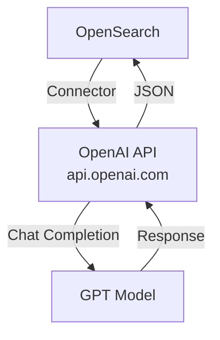

# OpenAI GPT Integration Guide

## 📚 Overview
Integration of **OpenAI's GPT models** (GPT-4, GPT-3.5-turbo) with OpenSearch for chat, embeddings, and advanced RAG applications.

### 🎯 Supported Models
- `gpt-4` - Most powerful, best reasoning
- `gpt-4-turbo` - Faster GPT-4, lower cost
- `gpt-3.5-turbo` - Fast, cost-effective, general purpose

---

## 🔄 Integration Architecture



---

## 📋 Quick Setup

### 1. Create Connector

```python
connector_body = {
    "name": "OpenAI GPT Connector",
    "description": "Connector for OpenAI Chat API",
    "version": "1",
    "protocol": "http",
    "parameters": {
        "endpoint": "api.openai.com",
        "model": "gpt-4-turbo",
        "organization_id": "org-xxxxx"  # Optional
    },
    "credential": {
        "openai_key": os.getenv("OPENAI_API_KEY")
    }
}

connector = client.transport.perform_request(
    method='POST',
    url='/_plugins/_ml/connectors/_create',
    body=connector_body
)
```

### 2. Register Model

```python
model_body = {
    "name": "GPT-4 Turbo",
    "function_name": "CHAT",
    "connector_id": connector_id,
    "model_format": "REMOTE"
}

model = client.transport.perform_request(
    method='POST',
    url='/_plugins/_ml/models/_register',
    body=model_body
)
```

### 3. Deploy & Use

```python
# Deploy
client.transport.perform_request(
    method='POST',
    url=f'/_plugins/_ml/models/{model_id}/_deploy'
)

# Chat
response = client.transport.perform_request(
    method='POST',
    url=f'/_plugins/_ml/models/{model_id}/_predict',
    body={
        "messages": [
            {"role": "user", "content": "What is AI?"}
        ]
    }
)
```

---

## 💡 Key Features

| Feature | GPT-4 | GPT-4-Turbo | GPT-3.5 |
|---------|--------|-----------|---------|
| Context | 8K | 128K | 4K |
| Cost | $$$$ | $$$ | $ |
| Speed | Slow | Medium | Fast |
| Best For | Complex | Balanced | Budget |

---

## 🔧 Common Use Cases

```
1. Chat & Conversation
   ✅ Multi-turn dialogue
   ✅ Context-aware responses

2. RAG (Retrieval-Augmented Generation)
   ✅ Question answering with documents
   ✅ Summarization

3. Text Processing
   ✅ Classification
   ✅ Content generation
   ✅ Code review
```

---

## 💰 Cost Comparison

```
Input token @ 128K context:
GPT-4: $0.03 per 1K tokens
GPT-4-Turbo: $0.01 per 1K tokens
GPT-3.5: $0.0005 per 1K tokens
```

---

## 📖 Resources

- 🔗 [OpenAI API Docs](https://platform.openai.com/docs/api-reference)
- 🔗 [Model Pricing](https://openai.com/pricing)

---

## ✨ When to Use

- ✅ Best for **general-purpose** tasks
- ✅ **Most stable** API
- ✅ **Large ecosystem** of examples
- ✅ Good for **code generation**

Use GPT-3.5-turbo for **cost-effective** production! 🚀

