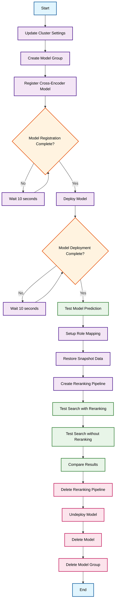

# Reranking Cross-Encoder MS-MARCO Model Workflow

## Overview

This workflow demonstrates how to implement a complete reranking system using OpenSearch and the MS-MARCO cross-encoder model. The script shows the full lifecycle of model management including registration, deployment, prediction, testing with search pipelines, and cleanup.

## Workflow Diagram

## Key Components

### 1. Model Setup Phase
- **Cluster Configuration**: Updates OpenSearch cluster settings to enable model registration and deployment
- **Model Group Creation**: Creates a logical grouping for organizing related models
- **Model Registration**: Registers the HuggingFace cross-encoder model for MS-MARCO dataset
- **Model Deployment**: Deploys the model to make it available for predictions

### 2. Testing Phase  
- **Prediction Testing**: Tests the model with sample query and document pairs
- **Data Preparation**: Sets up role mappings and restores snapshot data for testing
- **Pipeline Creation**: Creates a reranking search pipeline that uses the deployed model

### 3. Search Comparison
- **Reranked Search**: Executes search queries using the reranking pipeline
- **Standard Search**: Executes the same queries without reranking for comparison
- **Result Analysis**: Compares the relevance and ranking differences between approaches

### 4. Cleanup Phase
- **Resource Cleanup**: Systematically removes all created resources (pipeline, model, model group)
- **Proper Shutdown**: Ensures no orphaned resources remain in the cluster

## Use Cases

- **Improving Search Relevance**: Enhance search result quality using neural reranking
- **A/B Testing**: Compare search quality with and without reranking
- **Model Lifecycle Management**: Demonstrate proper model deployment and cleanup procedures
- **Pipeline Integration**: Show how to integrate ML models into OpenSearch search pipelines

## Technical Benefits

- **Better Relevance**: Cross-encoder models provide more accurate relevance scoring
- **Contextual Understanding**: Models consider query-document relationships more holistically
- **Flexible Integration**: Can be applied to any search use case requiring improved ranking
- **Resource Management**: Demonstrates proper model lifecycle management practices