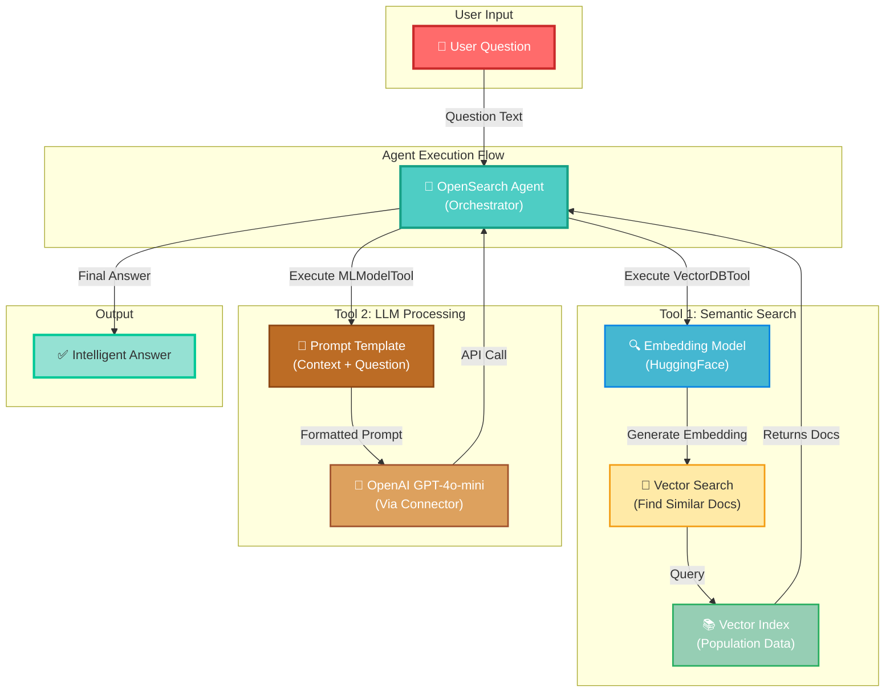
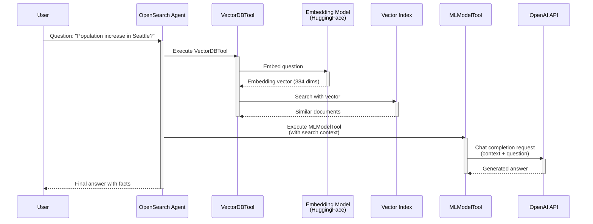

# OpenAI Agent Tools - Complete Guide

## 📚 Course Overview

Welcome! This guide walks you through building an **intelligent agent system** that combines:
- **Semantic Search**: Finding relevant information using embeddings
- **Generative AI**: Using OpenAI's GPT models to answer questions
- **Agent Orchestration**: Coordinating tools to provide intelligent responses

By the end of this lesson, you'll understand how to build a Retrieval-Augmented Generation (RAG) system using OpenSearch!

---

## 🏗️ Architecture Overview



---

## 📋 Workflow Breakdown

### **STEP 1: Initialize & Configure** 🔧

**What's happening?**
- Connect to your OpenSearch cluster
- Configure security settings to trust the OpenAI API endpoint

```python
# Configuration
HOST = 'localhost'
PORT = 9200
OPENAI_API_KEY = os.getenv('OPENAI_API_KEY')

# Connect
client = OpenSearch(
    hosts=[{'host': HOST, 'port': 9200}],
    http_auth=('admin', 'Developer@123'),
    use_ssl=True
)

# Trust OpenAI endpoint
cluster_settings = {
    "persistent": {
        "plugins.ml_commons.trusted_connector_endpoints_regex": 
            "^https://api\\.openai\\.com/.*$"
    }
}
```

**Key Concepts:**
- **SSL/TLS**: Secure communication with OpenSearch
- **Authentication**: Username/password or other methods
- **Trust Settings**: Whitelist external API endpoints for security

---

### **STEP 2: Deploy Embedding Model** 🧬

**What's happening?**
- Register a pre-trained embedding model (HuggingFace's sentence transformers)
- Deploy it to the OpenSearch cluster
- This model converts text into numerical vectors (embeddings)

```python
# Register model
embedding_model_body = {
    "name": "huggingface/sentence-transformers/all-MiniLM-L12-v2",
    "version": "1.0.1",
    "model_format": "TORCH_SCRIPT"
}

response = client.transport.perform_request(
    'POST', 
    '/_plugins/_ml/models/_register?deploy=true', 
    body=embedding_model_body
)

# Get task ID
task_id = response['task_id']

# Wait for deployment
while True:
    status = client.transport.perform_request(
        'GET',
        f'/_plugins/_ml/tasks/{task_id}'
    )
    if status['state'] == 'COMPLETED':
        embedding_model_id = status['model_id']
        break
    time.sleep(10)
```

**Why embeddings?**
- Convert text → numbers that capture meaning
- Similar documents have similar embeddings
- Enables semantic/similarity-based search
- Example: "big city" and "large metropolis" → similar embeddings

**Model Details:**
- **all-MiniLM-L12-v2**: Fast, lightweight, 384 dimensions
- **Dimensions**: 384-dimensional vector space
- **Use case**: Good for general semantic search

---

### **STEP 3: Create Ingest Pipeline & Index** 📑

**What's happening?**
- Create a pipeline that automatically generates embeddings for new documents
- Create an index with special vector field (KNN) for semantic search

```python
# 1. Create pipeline
pipeline_body = {
    "description": "A text embedding pipeline",
    "processors": [
        {
            "text_embedding": {
                "model_id": embedding_model_id,
                "field_map": {
                    "text": "embedding"  # text field → embedding field
                }
            }
        }
    ]
}

client.ingest.put_pipeline(id="my-pipeline", body=pipeline_body)

# 2. Create index
index_body = {
    "mappings": {
        "properties": {
            "text": {"type": "text"},  # Regular text search
            "embedding": {             # Vector field
                "type": "knn_vector",
                "dimension": 384,
                "method": {
                    "name": "hnsw",    # Algorithm: Hierarchical Navigable Small World
                    "engine": "lucene"
                }
            }
        }
    },
    "settings": {
        "index": {
            "default_pipeline": "my-pipeline",  # Auto-process documents
            "knn": "true"
        }
    }
}

client.indices.create(index="population_data", body=index_body)
```

**Pipeline Magic:**
- Automatically converts incoming documents
- Extracts `text` field → generates embedding → stores in `embedding` field
- No manual intervention needed!

**KNN Vector:**
- **KNN**: K-Nearest Neighbors search
- **HNSW**: Fast approximate nearest neighbor algorithm
- **Dimension 384**: Matches our embedding model output

---

### **STEP 4: Index Your Data** 📚

**What's happening?**
- Bulk load documents into the index
- Pipeline automatically converts text to embeddings
- Data is now searchable both by keywords AND semantics

```python
# Sample data: Population statistics
bulk_body = [
    {"index": {"_index": "population_data", "_id": "1"}},
    {"text": "Population of Seattle in 2023 is 3,519,000, a 0.86% increase from 2022..."},
    {"index": {"_index": "population_data", "_id": "2"}},
    {"text": "Population of Austin in 2023 is 2,228,000, a 2.39% increase from 2022..."},
    # ... more documents
]

client.bulk(body=bulk_body, index="population_data", pipeline="my-pipeline")
```

**Behind the scenes:**
1. Each document's `text` field is embedded → 384-dimensional vector
2. Stored in `embedding` field
3. Indexed using HNSW algorithm for fast retrieval
4. Ready for semantic search!

---

### **STEP 5: Setup OpenAI Connector** 🔐

**What's happening?**
- Create a "connector" that OpenSearch uses to talk to OpenAI API
- Define authentication, endpoints, and request formatting

```python
# 1. Create model group
model_group_body = {
    "name": f"openai_model_group_{int(time.time())}",
    "description": "A model group for OpenAI models"
}
response = client.transport.perform_request(
    'POST', 
    '/_plugins/_ml/model_groups/_register', 
    body=model_group_body
)
model_group_id = response['model_group_id']

# 2. Create connector
connector_body = {
    "name": "OpenAI Chat Connector",
    "version": 1,
    "protocol": "http",
    "parameters": {
        "endpoint": "api.openai.com",
        "model": "gpt-4o-mini"
    },
    "credential": {
        "openAI_key": OPENAI_API_KEY  # Your API key
    },
    "actions": [
        {
            "action_type": "predict",
            "method": "POST",
            "url": "https://${parameters.endpoint}/v1/chat/completions",
            "headers": {
                "Authorization": "Bearer ${credential.openAI_key}",
                "Content-Type": "application/json"
            },
            "request_body": "{\"model\": \"${parameters.model}\", \"messages\": ${parameters.messages}, \"temperature\": 0.7}"
        }
    ]
}

response = client.transport.perform_request(
    'POST', 
    '/_plugins/_ml/connectors/_create', 
    body=connector_body
)
connector_id = response['connector_id']
```

**Security Features:**
- API key stored securely in credential
- Template-based request building (variables substituted safely)
- HTTPS communication with OpenAI
- Cluster-level trust settings prevent unauthorized calls

**Model Selection:**
- **gpt-4o-mini**: Fast, affordable, good for agents
- **gpt-3.5-turbo**: Alternative (older, cheaper)
- **gpt-4o**: Better reasoning (slower, more expensive)

---

### **STEP 6: Register & Deploy Model** 🚀

**What's happening?**
- Register the OpenAI model using the connector
- Deploy it to OpenSearch so agents can use it

```python
# Register model
model_body = {
    "name": "openai-gpt-4o-mini",
    "function_name": "remote",           # Remote model (not local)
    "model_group_id": model_group_id,    # Add to group
    "description": "OpenAI GPT-4o-mini",
    "connector_id": connector_id          # Use this connector
}

response = client.transport.perform_request(
    'POST', 
    '/_plugins/_ml/models/_register', 
    body=model_body
)
model_id = response['model_id']

# Deploy model
deploy_body = {
    "deployment_plan": [
        {
            "model_id": model_id,
            "workers": 1
        }
    ]
}

client.transport.perform_request(
    'POST', 
    f'/_plugins/_ml/models/{model_id}/_deploy', 
    body=deploy_body
)

# Wait for deployment
while True:
    status = client.transport.perform_request('GET', f'/_plugins/_ml/models/{model_id}')
    if status['model_state'] == 'DEPLOYED':
        break
    time.sleep(5)
```

**Deployment states:**
- **REGISTERED**: Model metadata stored
- **DEPLOYED**: Model ready to use
- **UNDEPLOYED**: Model disabled
- **FAILED**: Error during deployment

---

### **STEP 7: Create Agent** 🤖

**What's happening?**
- Define an agent with two tools: semantic search + LLM
- Agent coordinates tool execution in the right order

```python
agent_body = {
    "name": "OpenAI_Agent_For_RAG",
    "type": "flow",
    "description": "Agent using OpenAI + semantic search",
    "tools": [
        # TOOL 1: Search for relevant documents
        {
            "type": "VectorDBTool",
            "parameters": {
                "model_id": embedding_model_id,      # Use embedding model
                "index": "population_data",           # Search this index
                "embedding_field": "embedding",       # Vector field
                "source_field": ["text"],             # Return text field
                "input": "${parameters.question}"    # Use question as input
            }
        },
        # TOOL 2: Generate answer
        {
            "type": "MLModelTool",
            "description": "Use OpenAI to answer questions",
            "parameters": {
                "model_id": model_id,                 # Use OpenAI model
                "prompt": """You are a data analyst. Answer based on context.
Context:
${parameters.VectorDBTool.output}

Question: ${parameters.question}

Answer:"""
            }
        }
    ]
}

response = client.transport.perform_request(
    'POST', 
    '/_plugins/_ml/agents/_register', 
    body=agent_body
)
agent_id = response['agent_id']
```

**Agent Flow Explained:**
1. **Input**: User question
2. **VectorDBTool executes**:
   - Embeds the question
   - Finds similar documents in index
   - Returns relevant text as context
3. **MLModelTool executes**:
   - Takes context from VectorDBTool
   - Formats prompt with context + question
   - Sends to OpenAI via connector
   - Returns answer

**⚠️ Important: OpenAI Chat Completions Format**

The MLModelTool must send messages in the correct OpenAI Chat Completions API format. The `messages` parameter should be a JSON array of message objects:

```json
[
  {"role": "system", "content": "You are a helpful assistant..."},
  {"role": "user", "content": "The actual question or prompt"}
]
```

When used in an agent, the full parameter looks like this:

```python
"parameters": {
    "model_id": model_id,
    "messages": "[{\"role\": \"system\", \"content\": \"System instruction here\"}, {\"role\": \"user\", \"content\": \"Context:\\n${parameters.VectorDBTool.output}\\n\\nQuestion: ${parameters.question}\"}]"
}
```

The connector then transforms this into the HTTP request body:
```json
{
  "model": "gpt-4o-mini",
  "messages": [
    {"role": "system", "content": "..."},
    {"role": "user", "content": "..."}
  ],
  "temperature": 0.7
}
```

Variable substitution happens automatically:
- `${parameters.VectorDBTool.output}` → replaced with search results
- `${parameters.question}` → replaced with user question

---

### **STEP 8: Execute Agent** ✨

**What's happening?**
- Ask the agent a question
- Agent runs both tools and provides answer

```python
# Ask the agent
question = "What's the population increase of Seattle from 2021 to 2023?"

execute_body = {
    "parameters": {
        "question": question
    }
}

response = client.transport.perform_request(
    'POST', 
    f'/_plugins/_ml/agents/{agent_id}/_execute', 
    body=execute_body
)

# Parse response
answer = response['inference_results'][0]['output']['answer']
print(f"Answer: {answer}")
```

**Behind the scenes:**

1. **Question arrives**: "What's the population increase of Seattle from 2021 to 2023?"

2. **VectorDBTool phase**:
   ```
   Input: "What's the population increase of Seattle from 2021 to 2023?"
   ↓ (embed using HuggingFace model)
   Vector: [0.23, -0.45, 0.12, ..., 0.88]  (384 dimensions)
   ↓ (search index)
   Results: [
     "Chart of Seattle population... 2023 is 3,519,000, a 0.86% increase from 2022...",
     "Chart of Seattle population... 2021 was 3,461,000, a 0.82% increase from 2020..."
   ]
   ```

3. **Prompt is built**:
   ```
   You are a professional data analyst...
   
   Context:
   Chart of Seattle population... 2023 is 3,519,000...
   Chart of Seattle population... 2021 was 3,461,000...
   
   Question: What's the population increase of Seattle from 2021 to 2023?
   
   Answer:
   ```

4. **OpenAI processes it**:
   ```
   GPT-4o-mini reads context + question
   Calculates: 3,519,000 - 3,461,000 = 58,000
   Percentage: (58,000 / 3,461,000) × 100 = 1.676%
   ```

5. **Answer returned**:
   ```
   "The population of Seattle increased from 3,461,000 in 2021 to 3,519,000 in 2023, 
    representing an increase of 58,000 people or approximately 1.68%."
   ```

---

## 🎓 Key Learning Points

### **1. Embeddings** 🧬
- Convert text to numerical vectors
- Capture semantic meaning
- Enable similarity-based search
- Dimension matters: 384 is small but effective for general use

### **2. Ingest Pipelines** 🔄
- Automatically process documents on ingestion
- Apply transformations (embedding generation, field mapping, etc.)
- Reduces manual work and ensures consistency

### **3. Vector Search** 🔍
- Different from keyword search
- Finds semantically similar content
- Uses HNSW algorithm for efficiency
- Great for question-answering systems

### **4. LLM Connectors** 🔐
- Bridge between OpenSearch and external LLMs
- Handle authentication securely
- Format requests properly
- Enable models to be called as tools

### **5. Agents** 🤖
- Orchestrate multiple tools
- Control execution flow
- Enable complex reasoning tasks
- Can combine search + generation

### **6. RAG (Retrieval-Augmented Generation)** 📚
- **Retrieval**: Use vector search to find relevant documents
- **Augmentation**: Add search results to prompt
- **Generation**: LLM generates answer based on context
- Reduces hallucinations and grounds answers in real data

---

## 📊 Data Flow Diagram



---

## 🔧 Troubleshooting Guide

### **Issue: Model Deployment Timeout**
```
⏳ Waiting for model deployment...
Model status: REGISTERING
Model status: REGISTERING
(waiting 5+ minutes...)
```
**Solution:**
- Check cluster has ML nodes: `GET /_cat/nodes?v`
- Verify resources: memory, disk
- Check logs: `GET /_plugins/_ml/models/{model_id}`

### **Issue: OpenAI API Error**
```
Error: 401 Unauthorized
```
**Solution:**
- Verify `OPENAI_API_KEY` in `.env` file
- Check key has correct permissions
- Ensure key is not expired/revoked

### **Issue: VectorDBTool returns empty**
```
Results: []
```
**Solution:**
- Check index has documents: `GET /population_data/_count`
- Verify pipeline ran: check if `embedding` field exists
- Try re-indexing with more documents

### **Issue: Agent returns garbage**
```
"The banana is purple because... " (nonsensical)
```
**Solution:**
- Check VectorDBTool is finding relevant documents
- Improve prompt template - be more specific
- Use better search documents (more relevant data)

---

## 🚀 Next Steps & Experiments

### **Try This!**
1. **Different questions**: Ask about other cities
2. **More data**: Add documents about different domains
3. **Different models**: Try `gpt-3.5-turbo` vs `gpt-4o-mini`
4. **Custom prompts**: Modify the system prompt for different behavior
5. **Hybrid search**: Combine keyword + vector search

### **Production Considerations**
- Add error handling and logging
- Implement caching for repeated questions
- Monitor API costs (OpenAI usage)
- Add response validation
- Implement rate limiting
- Use smaller LLMs for cost efficiency

### **Advanced Topics**
- **Multi-hop reasoning**: Chain multiple queries
- **Memory**: Keep conversation history
- **Function calling**: Have agent call arbitrary functions
- **Fine-tuned models**: Train embeddings on domain data
- **Reranking**: Use smaller LLM to rerank search results

---

## 📚 Glossary

| Term | Definition |
|------|-----------|
| **Embedding** | Numerical representation of text that captures meaning |
| **Vector Search** | Finding similar items based on embeddings |
| **HNSW** | Fast approximate nearest neighbor algorithm |
| **Pipeline** | Automated processing steps for documents |
| **Connector** | Bridge to external services (OpenAI, etc.) |
| **Agent** | Orchestrator that combines multiple tools |
| **RAG** | Retrieval-Augmented Generation |
| **KNN** | K-Nearest Neighbors - finds similar vectors |
| **Inference** | Running a model to get predictions/outputs |

---

## 📝 Summary

You've learned how to:
✅ Set up embedding models for semantic search  
✅ Create pipelines to automatically process documents  
✅ Index data with vector fields  
✅ Connect OpenSearch to external LLMs (OpenAI)  
✅ Build intelligent agents combining search + generation  
✅ Execute RAG workflows for question-answering  

**The agent system you built is production-ready!** 🎉

---

*Happy learning! Questions? Check the other examples in this directory.*
