# Plan-Execute-Reflect Agent - Advanced Agent Workflow

## Overview

This document explains the **Plan-Execute-Reflect (PER) Agent Pattern**, an advanced workflow where an AI agent:

1. **PLAN**: Breaks down a complex problem into actionable steps
2. **EXECUTE**: Performs each step and collects results
3. **REFLECT**: Analyzes results, identifies gaps, and refines the approach

## Workflow Diagram

```
┌─────────────────────────────────────────────────────────────────────┐
│                  PLAN-EXECUTE-REFLECT AGENT LOOP                    │
├─────────────────────────────────────────────────────────────────────┤
│                                                                       │
│  Question/Task                                                       │
│      │                                                               │
│      └─────────────────────────┐                                    │
│                                v                                    │
│                    ┌───────────────────┐                           │
│                    │   PLAN PHASE      │  Agent thinks about       │
│                    │                   │  solution approach        │
│                    │ - Identify steps  │                           │
│                    │ - Select tools    │                           │
│                    │ - Create plan     │                           │
│                    └───────────────────┘                           │
│                            │                                       │
│                            v                                       │
│                    ┌───────────────────┐                           │
│                    │ EXECUTE PHASE     │  Agent executes plan      │
│                    │                   │  using available tools    │
│                    │ - Tool 1: Search  │                           │
│                    │ - Tool 2: Analyze │                           │
│                    │ - Collect results │                           │
│                    └───────────────────┘                           │
│                            │                                       │
│                            v                                       │
│                    ┌───────────────────┐                           │
│                    │ REFLECT PHASE     │  Agent evaluates results  │
│                    │                   │  and decides next steps   │
│                    │ - Check completeness                          │
│                    │ - Identify gaps   │                           │
│                    │ - Success or retry│                           │
│                    └───────────────────┘                           │
│                            │                                       │
│         ┌──────────────────┼──────────────────┐                   │
│         │                  │                  │                   │
│     Success            Need More          Complete               │
│         │              Information         Loop                  │
│         v              │                   v                     │
│   Final Answer         └──→ (Back to PLAN)  Done                │
│                                                                   │
└─────────────────────────────────────────────────────────────────────┘
```

## Mermaid Diagram

### Agent Workflow

```mermaid
flowchart TD
    A["🚀 START: User Question/Task"] --> B["💭 PLAN PHASE"]
    B --> B1["Analyze the problem"]
    B --> B2["Break into sub-tasks"]
    B --> B3["Decide which tools to use"]
    B1 --> C["⚙️ EXECUTE PHASE"]
    B2 --> C
    B3 --> C
    
    C --> C1["🔍 Tool 1: Search Products"]
    C --> C2["📊 Tool 2: Analyze Data"]
    C --> C3["🎯 Tool 3: Calculate Metrics"]
    
    C1 --> D["🤔 REFLECT PHASE"]
    C2 --> D
    C3 --> D
    
    D --> D1{Is Answer Complete?}
    
    D1 -->|❌ No, Need More Info| E["Identify Gaps"]
    E --> B
    
    D1 -->|✅ Yes, Success!| F["📤 FINAL ANSWER"]
    
    style A fill:#4A90E2,stroke:#2E5C8A,stroke-width:3px,color:#fff
    style B fill:#F39C12,stroke:#C87F0A,stroke-width:2px,color:#000
    style C fill:#E74C3C,stroke:#C0392B,stroke-width:2px,color:#fff
    style D fill:#27AE60,stroke:#1E8449,stroke-width:2px,color:#fff
    style F fill:#8E44AD,stroke:#663399,stroke-width:3px,color:#fff
    style D1 fill:#F39C12,stroke:#C87F0A,stroke-width:2px,color:#000
```



## Three Critical Phases

| Phase | Focus Question | Activities | LLM Calls |
|-------|---|---|---|
| **PLAN** | "What should I do?" | • Understand goal<br>• List sub-tasks<br>• Choose tools<br>• Set expectations | 1-2 |
| **EXECUTE** | "Let me do it" | • Run tools<br>• Collect output<br>• Handle errors<br>• Track progress | 1-N to tools |
| **REFLECT** | "Did it work?" | • Evaluate results<br>• Check completeness<br>• Identify gaps<br>• Plan next steps | 1-2 |

## Tool Selection in Planning

```
    User Question
         |
         v
    ┌────────────────────────┐
    │ PLANNING AGENT         │
    │ "Which tools do I      │
    │  need for this task?"  │
    └────────────────────────┘
         |
    ┌────┴────────────────────────────┐
    |                                  |
    v                                  v
┌──────────────┐              ┌──────────────────┐
│ VectorDBTool │              │ SearchIndexTool  │
│              │              │                  │
│ • Semantic   │              │ • Keyword        │
│   search     │              │   search         │
│ • Similarity │              │ • Filters        │
│   matching   │              │ • Aggregations   │
└──────────────┘              └──────────────────┘
    |                                  |
    └────────┬──────────────────────────┘
             |
             v
    ┌──────────────────────────┐
    │ REFLECTION AGENT         │
    │ "Do the results answer   │
    │  the user's question?"   │
    └──────────────────────────┘
```

## Key Concepts

### 1. PLANNING PHASE

**Goal**: Agent analyzes the complex question and breaks it into actionable sub-tasks

**Activities**:
- Analyze the problem statement
- Break down into smaller, manageable tasks
- Select appropriate tools for each task
- Create an execution plan
- Set expectations for results

**Characteristics**:
- 1-2 LLM calls
- Deterministic planning logic
- Tool-aware reasoning

**Example**: 
- Question: "Find the best office setup for someone with a budget of $500"
- Plan: 
  1. Search for furniture under $500
  2. Search for ergonomic accessories under $500
  3. Combine results based on quality ratings
  4. Summarize recommendations

### 2. EXECUTION PHASE

**Goal**: Agent executes the plan using available tools

**Activities**:
- Call VectorDBTool for semantic searches
- Call MLModelTool for analysis
- Handle tool-specific logic
- Collect and organize results
- Catch and handle errors

**Characteristics**:
- Variable tool calls (1-N)
- Each tool returns structured data
- Sequential or parallel execution possible
- Error handling and retry logic

**Example Tools**:
- `VectorDBTool`: Find products via semantic search
- `MLModelTool`: Analyze/summarize findings
- `CalculatorTool`: Compute totals/percentages

### 3. REFLECTION PHASE

**Goal**: Agent evaluates if results answer the original question

**Activities**:
- Check if results are complete
- Identify information gaps
- Validate result quality
- Decide: Success → Answer | Gap Found → Back to PLAN

**Characteristics**:
- 1-2 LLM calls
- Comparison against original goal
- Quality assessment
- Potential loop-back to PLAN

**Example**:
- Reflection: "Did I find enough high-rated office furniture options?"
- Gap: "I found furniture but not enough accessories"
- Decision: "Go back to PLAN to search for more accessories"

## Advantages of PER Pattern

✓ **Better Accuracy**: Structured thinking reduces errors
✓ **Self-Correction**: Agent can identify and fix mistakes
✓ **Transparency**: Clear reasoning visible in each phase
✓ **Reduced Hallucinations**: Validation through reflection
✓ **Handles Complexity**: Breaks down multi-step problems effectively
✓ **Flexible**: Can adapt the plan based on execution results
✓ **Scalable**: Works with multiple tools and data sources

## When to Use Plan-Execute-Reflect

**Best For**:
- Complex, multi-faceted questions
- Analysis requiring multiple data sources
- Comparisons and recommendations
- Questions needing validation/verification
- Tasks requiring iterative refinement
- Ambiguous or poorly-specified goals

**Less Suitable For**:
- Simple lookup queries (use direct tools)
- Time-sensitive operations (PER adds latency)
- Single-step tasks (overkill complexity)

## Implementation Details

### Architecture

```
┌─────────────────────────────────────────┐
│   OpenSearch Cluster                    │
│                                         │
│  ┌─────────────────────────────────┐   │
│  │  Embedding Model                │   │
│  │  (HuggingFace)                  │   │
│  └─────────────────────────────────┘   │
│                  │                      │
│  ┌──────────────┴──────────────┐       │
│  │  Ingest Pipeline            │       │
│  │  (Auto-embedding on index)  │       │
│  └──────────────┬──────────────┘       │
│                 │                      │
│  ┌──────────────┴──────────────┐       │
│  │  Product Index              │       │
│  │  (with vector fields)       │       │
│  └─────────────────────────────┘       │
│                                         │
└─────────────────────────────────────────┘
                  │
                  │ VectorDBTool
                  │ (semantic search)
                  │
┌─────────────────────────────────────────┐
│   OpenAI Agent Framework                │
│                                         │
│  ┌─────────────────────────────────┐   │
│  │  Agent Flow                     │   │
│  │  - Tool Registry                │   │
│  │  - Execution Engine             │   │
│  │  - Response Parser              │   │
│  └─────────────────────────────────┘   │
│                                         │
│  ┌──────────┐        ┌──────────────┐  │
│  │ Plan     │        │ MLModelTool  │  │
│  │ Phase    │◄──────►│ (Reasoning)  │  │
│  └──────────┘        └──────────────┘  │
│       ▲                                 │
│       │                                 │
│  ┌────┴─────┐                          │
│  │ Reflect  │                          │
│  │ Phase    │                          │
│  └────┬─────┘                          │
│       │                                 │
└───────┼─────────────────────────────────┘
        │
   Final Answer
```

### Data Flow

1. **User Question** → Agent receives query
2. **Plan Phase** → LLM creates execution plan
3. **Tool Selection** → Identify which tools to use
4. **Execution Phase** → Run tools in sequence
   - VectorDBTool searches for products
   - MLModelTool analyzes results
5. **Result Collection** → Organize tool outputs
6. **Reflection Phase** → LLM evaluates completeness
7. **Decision Point**:
   - If complete → Return Final Answer
   - If gaps → Loop back to PLAN with updated context

## Configuration

### Models

- **Embedding Model**: HuggingFace `sentence-transformers/all-MiniLM-L6-v2`
  - Vector dimension: 384
  - Format: TORCH_SCRIPT
  - Auto-deployed in ingest pipeline

- **LLM Model**: OpenAI `gpt-4o-mini`
  - Via remote connector
  - Endpoint: `/v1/chat/completions`
  - Temperature: 0.7 (balanced creativity)

### Tools

- **VectorDBTool**: 
  - Performs semantic search in product index
  - Returns top 10 matching products
  - Includes similarity scores

- **MLModelTool**:
  - Calls OpenAI LLM for reasoning
  - Supports analysis, summarization, recommendations
  - Uses chat completion format

## Sample Queries

### Query 1: Product Discovery & Comparison
```
"What are the best wireless accessories available, and what should I consider when choosing them?"
```

**Expected Agent Flow**:
1. **Plan**: Search for wireless accessories, compare quality vs price
2. **Execute**: Search index, gather top products, analyze features
3. **Reflect**: "Found 5 products, summarize key differences"
4. **Result**: Ranked list with comparison

### Query 2: Inventory Analysis
```
"Find all high-rated furniture that's in stock and recommend a complete office setup under $700"
```

**Expected Agent Flow**:
1. **Plan**: Find furniture, filter by rating/stock, calculate totals
2. **Execute**: Multi-part search, combination analysis
3. **Reflect**: "Do recommended items fit budget and solve use case?"
4. **Result**: Itemized setup recommendation

### Query 3: Multi-tier Analysis
```
"What budget-friendly office solutions would work best for a startup with 5 employees, and why?"
```

**Expected Agent Flow**:
1. **Plan**: Find affordable options, calculate per-employee cost, assess variety
2. **Execute**: Price-filtered search, diversity analysis
3. **Reflect**: "Is this scalable and practical for 5 employees?"
4. **Result**: Recommended bundle with reasoning

## Performance Characteristics

| Aspect | Value |
|--------|-------|
| Average Plan Phase | 2-5 seconds |
| Average Execute Phase | 3-8 seconds |
| Average Reflect Phase | 2-5 seconds |
| Total Per Query | 7-18 seconds |
| Typical Loop Count | 1-2 iterations |
| Max Loops | 5 (configurable) |

## Error Handling

The agent handles:
- Connection timeouts → Retry with backoff
- Empty results → Refine search criteria
- Model errors → Fallback to simpler query
- Malformed responses → Parse multiple formats
- Incomplete data → Request clarification

## Learning Outcomes

After studying this implementation, you'll understand:

1. **Multi-Phase Reasoning**: How to structure AI reasoning into distinct phases
2. **Tool Orchestration**: Coordinating multiple tools for complex tasks
3. **Self-Correction**: Building agents that can identify and fix their own mistakes
4. **Transparency**: Creating visible, auditable decision-making processes
5. **Vector Search**: Semantic search beyond keyword matching
6. **OpenSearch Integration**: Production deployment of ML models
7. **OpenAI API**: Using chat completions for agent reasoning

## References

- **Source File**: `4. plan_execute_reflect_agent.py`
- **Reference Pattern**: `3. openai_agent_tools.py`
- **Alternative Pattern**: `1. ollama_agent_tools.py`
- **Related Examples**: `/5. agents_tools/` directory

## Quick Start

```bash
# 1. Ensure OpenSearch is running
docker-compose up -d

# 2. Set environment variables
export OPENAI_API_KEY="your-api-key"

# 3. Run the agent
cd "5. agents_tools/"
python "4. plan_execute_reflect_agent.py"
```

## Summary

The **Plan-Execute-Reflect pattern** is a powerful approach for building intelligent agents that can tackle complex problems through structured reasoning. By breaking the task into three distinct phases, agents can:

- **Think before acting** (Plan phase)
- **Execute with tools** (Execute phase)  
- **Validate and iterate** (Reflect phase)

This leads to more accurate, transparent, and reliable AI systems that users can understand and trust.
