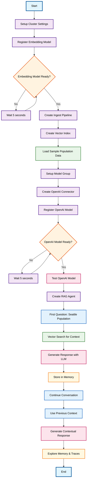

# RAG Conversational Flow Agent with Memory

## Overview

This workflow demonstrates a complete Retrieval-Augmented Generation (RAG) system with conversational memory capabilities. The agent combines vector similarity search with OpenAI's language model to provide contextual, data-driven responses while maintaining conversation history.

## Workflow Diagram

## Key Components

### 1. Infrastructure Setup
- **Cluster Configuration**: Enables ML operations and memory features in OpenSearch
- **Embedding Model**: Deploys sentence-transformers model for text vectorization
- **Vector Index**: Creates k-NN enabled index with embedding pipeline for automatic vectorization
- **Sample Data**: Loads population statistics for various US metropolitan areas

### 2. AI Integration
- **OpenAI Connector**: Establishes secure connection to OpenAI's GPT-3.5-turbo model
- **Model Registration**: Registers and deploys the language model for text generation
- **Connector Testing**: Validates the AI integration with sample predictions

### 3. RAG Agent Architecture
- **Vector Search Tool**: Retrieves relevant context using semantic similarity
- **Language Model Tool**: Generates responses based on retrieved context and conversation history
- **Memory Management**: Maintains conversation state across multiple interactions

### 4. Conversational Flow
- **Context Retrieval**: Uses vector similarity to find relevant documents
- **Response Generation**: Combines retrieved context with user questions
- **Memory Persistence**: Stores conversation history for future reference
- **Contextual Awareness**: References previous conversation elements in follow-up responses

## Use Cases

- **Intelligent Data Analysis**: Ask natural language questions about complex datasets
- **Conversational Search**: Maintain context across multiple related queries
- **Knowledge Base Interaction**: Interact with corporate knowledge using natural language
- **Customer Support**: Provide contextual assistance based on documentation

## Technical Features

- **Semantic Search**: Vector embeddings enable meaning-based document retrieval
- **Conversation Memory**: Maintains context across multiple question-answer cycles
- **Hybrid Intelligence**: Combines retrieval accuracy with generative capabilities
- **Trace Analysis**: Full observability into the reasoning and retrieval process

## Memory Management

The system provides comprehensive conversation tracking:
- **Memory Details**: Access to complete conversation state
- **Message History**: Chronological record of all interactions
- **Execution Traces**: Step-by-step breakdown of how responses were generated
- **Context Propagation**: Seamless context flow between related questions