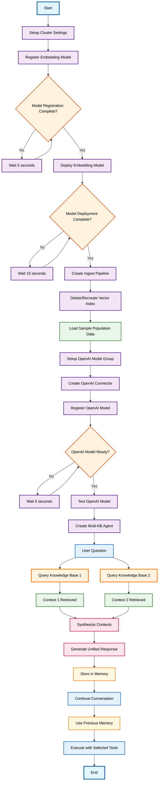

# RAG Conversational Flow Agent with Multiple Knowledge Bases

## Overview

This advanced RAG workflow extends the basic conversational agent by implementing multiple knowledge base access. The agent can simultaneously query multiple data sources (knowledge bases) and synthesize information from different contexts to provide comprehensive, well-rounded responses.

## Workflow Diagram

## Key Components

### 1. Enhanced Infrastructure Setup
- **Model Registration**: Complete embedding model setup with explicit deployment
- **Pipeline Management**: Robust ingest pipeline for automatic text vectorization
- **Index Recreation**: Clean slate approach ensuring fresh data environment
- **OpenAI Integration**: Full connector and model setup for language generation

### 2. Multiple Knowledge Base Architecture
- **Dual Vector Tools**: Two independent VectorDBTool instances (context1, context2)
- **Parallel Retrieval**: Simultaneous querying of multiple knowledge sources
- **Context Synthesis**: ML model combines information from multiple sources
- **Flexible Tool Selection**: Ability to specify which knowledge bases to query

### 3. Advanced Agent Capabilities
- **Multi-Source Context**: Agent receives context from multiple knowledge bases
- **Intelligent Synthesis**: Language model weaves together information from different sources
- **Memory Integration**: Maintains conversation history across multi-source interactions
- **Selective Retrieval**: Option to query specific knowledge bases based on question type

### 4. Conversational Enhancements
- **Context Enrichment**: Richer responses due to multiple information sources
- **Cross-Reference Capability**: Ability to correlate information across knowledge bases
- **Tool Selection**: Dynamic selection of specific knowledge bases for targeted queries
- **Memory Continuity**: Seamless conversation flow with enhanced context awareness

## Use Cases

### Enterprise Knowledge Management
- **Multi-Department Queries**: Access information from different organizational silos
- **Cross-Functional Analysis**: Synthesize data from various business units
- **Comprehensive Research**: Gather insights from multiple documentation sources

### Research and Analysis
- **Comparative Studies**: Compare information across different datasets
- **Trend Analysis**: Correlate data from multiple time periods or sources
- **Fact Verification**: Cross-reference information for accuracy

### Customer Support
- **Multi-Product Support**: Access documentation from different product lines
- **Policy Integration**: Combine information from various policy documents
- **Historical Context**: Reference both current and legacy documentation

## Technical Advantages

### Enhanced Information Retrieval
- **Broader Context**: Access to multiple information sources simultaneously
- **Reduced Information Silos**: Breaks down barriers between separate knowledge bases
- **Comprehensive Responses**: More complete answers through multi-source synthesis

### Flexible Architecture
- **Modular Design**: Easy to add or remove knowledge bases
- **Selective Querying**: Choose specific sources based on query requirements
- **Scalable Framework**: Architecture supports additional knowledge bases

### Advanced Memory Management
- **Multi-Source History**: Tracks which sources contributed to each response
- **Context Correlation**: Maintains relationships between different information sources
- **Intelligent Routing**: Learns which sources are most relevant for different query types

## Implementation Highlights

- **Parallel Processing**: Simultaneous queries to multiple knowledge bases for efficiency
- **Context Aggregation**: Sophisticated merging of information from different sources
- **Tool Orchestration**: Coordinated execution of multiple retrieval and generation tools
- **Conversation Continuity**: Maintains multi-source context across conversation turns