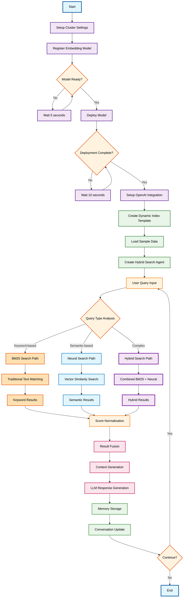

# RAG Conversational Agent with Dynamic Index and Hybrid Search

## Overview

This sophisticated RAG implementation demonstrates dynamic index creation with hybrid search capabilities, combining BM25 (traditional keyword search) with neural search (vector embeddings). The system dynamically adapts to user queries and can create specialized indices for different types of data and search requirements.

## Workflow Diagram

## Key Components

### 1. Advanced Infrastructure Setup
- **Dynamic Cluster Configuration**: Adaptive settings based on workload requirements
- **Model Lifecycle Management**: Complete embedding model registration and deployment
- **Flexible Index Templates**: Templates that support both traditional and vector search
- **Multi-Modal Data Loading**: Support for various data types and structures

### 2. Hybrid Search Architecture
- **BM25 Integration**: Traditional keyword-based search for exact term matching
- **Neural Search**: Vector embeddings for semantic similarity matching
- **Query Intelligence**: Automatic determination of optimal search strategy
- **Score Fusion**: Sophisticated combination of different search result scores

### 3. Dynamic Index Management
- **Runtime Index Creation**: Indices created based on data characteristics and query patterns
- **Schema Adaptation**: Flexible mappings that support both text and vector fields
- **Performance Optimization**: Dynamic tuning based on search patterns and data volume
- **Multi-Index Support**: Ability to search across multiple specialized indices

### 4. Intelligent Query Processing
- **Query Type Detection**: Analyzes user queries to determine optimal search approach
- **Strategy Selection**: Chooses between BM25, neural, or hybrid search strategies
- **Result Normalization**: Ensures consistent scoring across different search methods
- **Context Optimization**: Builds optimal context for language model generation

## Use Cases

### Enterprise Search
- **Document Discovery**: Find relevant documents using both keywords and semantic meaning
- **Expert Finding**: Locate subject matter experts based on their work and expertise
- **Policy Search**: Navigate complex policy documents using natural language

### E-commerce Applications
- **Product Search**: Find products using descriptions, features, or similar items
- **Recommendation Systems**: Suggest products based on user behavior and preferences
- **Inventory Management**: Locate items based on various attributes and descriptions

### Research and Academia
- **Literature Discovery**: Find research papers using concepts rather than just keywords
- **Cross-Disciplinary Research**: Connect ideas across different academic domains
- **Citation Analysis**: Understand relationships between different research works

### Technical Support
- **Issue Resolution**: Find solutions based on problem descriptions and symptoms
- **Knowledge Base Search**: Access technical documentation using natural language
- **Troubleshooting**: Match user problems with historical solutions

## Technical Innovations

### Hybrid Search Benefits
- **Precision + Recall**: Combines exact matching with semantic understanding
- **Query Flexibility**: Handles both specific terms and conceptual searches
- **Ranking Optimization**: Sophisticated scoring that considers multiple relevance signals
- **Language Understanding**: Better handling of synonyms, context, and intent

### Dynamic Adaptation
- **Query-Driven Optimization**: System learns from query patterns and optimizes accordingly
- **Index Specialization**: Creates specialized indices for different data types and use cases
- **Performance Tuning**: Automatic adjustment of search parameters based on results quality
- **Resource Management**: Efficient allocation of computational resources across search types

### Advanced Memory Integration
- **Search Pattern Learning**: Remembers effective search strategies for similar queries
- **Context Accumulation**: Builds richer context through multi-turn conversations
- **Query Refinement**: Uses conversation history to improve subsequent searches
- **Result Quality Tracking**: Monitors and improves search result relevance over time

## Architecture Advantages

### Scalability
- **Horizontal Scaling**: Architecture supports distributed search across multiple nodes
- **Index Partitioning**: Dynamic partitioning strategies for large datasets
- **Query Load Balancing**: Distributes search load across available resources

### Flexibility
- **Multi-Modal Support**: Handles text, metadata, and structured data simultaneously
- **Plugin Architecture**: Easy integration of new search algorithms and ranking methods
- **Configuration Management**: Dynamic configuration updates without system restart

### Observability
- **Search Analytics**: Comprehensive metrics on search performance and quality
- **Query Tracing**: Detailed visibility into search execution and decision making
- **Performance Monitoring**: Real-time monitoring of search latency and accuracy