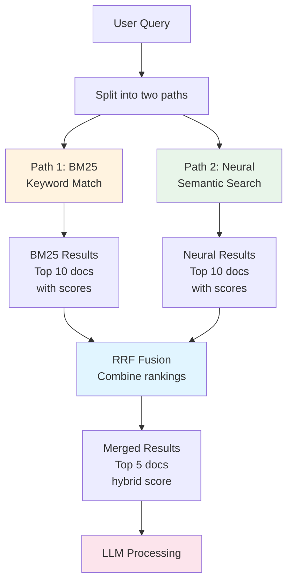
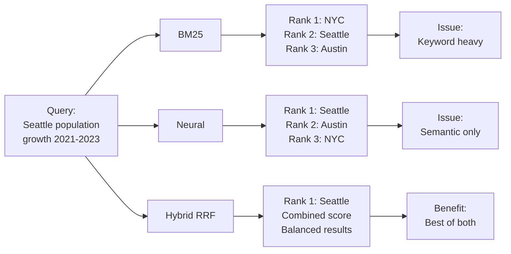
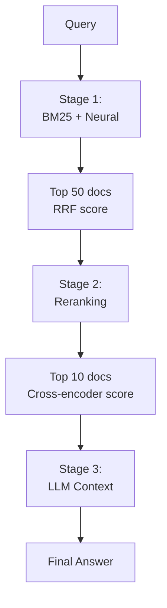

# RAG with Hybrid Search + RRF (Reciprocal Rank Fusion)

## 📖 Overview

This advanced script combines **BM25 keyword search** and **neural semantic search** using **Reciprocal Rank Fusion (RRF)** to achieve optimal retrieval. It demonstrates how to fuse multiple search signals for better relevance.

### 🎯 What You'll Learn
- Hybrid search architecture (BM25 + neural)
- Reciprocal Rank Fusion (RRF) algorithm
- Search pipeline implementation
- Weight tuning for ranking
- Multi-signal combination strategies

---

## 🏗️ Hybrid Search Architecture



---

## 🔄 Reciprocal Rank Fusion (RRF) Algorithm

### The Math Behind RRF

$$\text{RRF}(d) = \sum_{i=1}^{m} \frac{1}{k + \text{rank}_i(d)}$$

Where:
- $d$ = document
- $m$ = number of search methods (2 for BM25 + neural)
- $k$ = rank constant (typically 40-60)
- $\text{rank}_i(d)$ = rank of doc in search method $i$

### Example Calculation

```
Document A:
- BM25 rank: 3 → score = 1/(40+3) = 0.0244
- Neural rank: 1 → score = 1/(40+1) = 0.0244
- RRF total = 0.0488

Document B:
- BM25 rank: 1 → score = 1/(40+1) = 0.0244
- Neural rank: 5 → score = 1/(40+5) = 0.0213
- RRF total = 0.0457

Result: Document A ranks higher despite different positions
```

---

## 📋 Implementation Steps

### Step 1: Register Embedding Model

```python
# Register sentence-transformers
register_response = os_client.transport.perform_request(
    "POST",
    "/_plugins/_ml/models/_register",
    body={
        "name": "huggingface/sentence-transformers/all-MiniLM-L12-v2",
        "version": "1.0.1",
        "model_format": "TORCH_SCRIPT"
    }
)

# Monitor deployment
model_id = wait_for_model_deployment(register_response['task_id'])
```

### Step 2: Create Vector Index

```python
os_client.indices.create(
    index="my_test_data",
    body={
        "mappings": {
            "properties": {
                "text": {"type": "text"},
                "embedding": {
                    "type": "knn_vector",
                    "dimension": 384,
                    "method": {
                        "name": "hnsw",
                        "space_type": "l2",
                        "engine": "lucene"
                    }
                }
            }
        },
        "settings": {
            "index": {
                "default_pipeline": "test-pipeline-local-model",
                "knn": "true"
            }
        }
    }
)
```

### Step 3: Create RRF Search Pipeline

```python
def create_rrf_pipeline(name: str, weights: list = None):
    """Create RRF fusion pipeline"""
    
    body = {
        "description": "Post processor for hybrid RRF search",
        "phase_results_processors": [
            {
                "score-ranker-processor": {
                    "combination": {
                        "technique": "rrf",
                        "rank_constant": 40,  # Tunable parameter
                    }
                }
            }
        ]
    }
    
    # Add weights if provided
    if weights:
        body["phase_results_processors"][0]["score-ranker-processor"][
            "combination"]["parameters"] = {
            "weights": weights  # e.g., [0.7, 0.3]
        }
    
    return os_client.transport.perform_request(
        "PUT",
        f"/_search/pipeline/{name}",
        body=body
    )

# Create pipeline with 70% BM25, 30% neural
create_rrf_pipeline(
    "rrf-weighted-pipeline",
    weights=[0.7, 0.3]
)

# Create pipeline with equal weights
create_rrf_pipeline(
    "rrf-equal-pipeline"
)
```

**RRF Pipeline Parameters:**
| Parameter | Purpose | Default | Range |
|-----------|---------|---------|-------|
| `technique` | Fusion method | "rrf" | rrf, linear |
| `rank_constant` | RRF offset ($k$) | 60 | 1-1000 |
| `weights[i]` | Signal importance | [1.0, 1.0] | [0-1, 0-1] |

### Step 4: Execute Hybrid Query

```python
def hybrid_search_with_rrf(query: str, model_id: str):
    """Execute hybrid BM25 + neural search with RRF fusion"""
    
    response = os_client.transport.perform_request(
        "GET",
        "/my_test_data/_search?search_pipeline=rrf-weighted-pipeline",
        body={
            "_source": {
                "exclude": ["embedding"]  # Don't return vectors
            },
            "size": 5,
            "query": {
                "hybrid": {
                    "queries": [
                        # Query 1: BM25 keyword match
                        {
                            "match": {
                                "text": {
                                    "query": query
                                }
                            }
                        },
                        # Query 2: Neural semantic search
                        {
                            "neural": {
                                "embedding": {
                                    "query_text": query,
                                    "model_id": model_id,
                                    "k": 10  # Top-K vectors
                                }
                            }
                        }
                    ]
                }
            }
        }
    )
    
    return response
```

### Step 5: Process Results

```python
def process_hybrid_results(response):
    """Extract and analyze hybrid results"""
    
    results = []
    for hit in response['hits']['hits']:
        results.append({
            'id': hit['_id'],
            'score': hit['_score'],
            'text': hit['_source']['text'][:100] + "...",
            'hybrid_score': hit['_score']  # RRF combined score
        })
    
    return pd.DataFrame(results)

# Example usage
results_df = process_hybrid_results(hybrid_response)
print(results_df)
```

---

## 📊 Comparison: BM25 vs Neural vs Hybrid



---

## 🎯 Search Methods Compared

| Method | BM25 | Neural | Hybrid |
|--------|------|--------|--------|
| **Exact match** | ✅ | ❌ | ✅ |
| **Semantic** | ❌ | ✅ | ✅ |
| **Fast** | ✅ | ❌ | ⚠️ |
| **Accurate** | ⚠️ | ✅ | ✅ |
| **Interpretable** | ✅ | ❌ | ⚠️ |

---

## 💡 Key Patterns

### Pattern 1: Dynamic Weight Tuning

```python
# For fact-based queries: prioritize BM25
weights_fact = [0.8, 0.2]  # 80% BM25, 20% neural

# For semantic queries: prioritize neural
weights_semantic = [0.2, 0.8]  # 20% BM25, 80% neural

# Balanced approach
weights_balanced = [0.5, 0.5]  # Equal
```

### Pattern 2: Rank Constant Tuning

```python
# k=40: Favors lower-ranked results
# - More diversity
# - Less dominated by top result

# k=60: Default, neutral
# - Standard RRF behavior

# k=100: Favors higher-ranked results
# - More concentration on top results
# - Less impact of rank differences
```

### Pattern 3: Multi-Stage Ranking



---

## 📈 Performance Analysis

### Execution Times

```python
import time

def benchmark_searches(query: str, model_id: str):
    """Compare search latencies"""
    
    # BM25 only
    start = time.time()
    bm25_results = os_client.search(
        index="my_test_data",
        body={
            "query": {"match": {"text": query}},
            "size": 5
        }
    )
    bm25_time = time.time() - start
    
    # Neural only
    start = time.time()
    neural_results = os_client.search(
        index="my_test_data",
        body={
            "query": {
                "neural": {
                    "embedding": {
                        "query_text": query,
                        "model_id": model_id,
                        "k": 10
                    }
                }
            },
            "size": 5
        }
    )
    neural_time = time.time() - start
    
    # Hybrid
    start = time.time()
    hybrid_results = os_client.search(
        index="my_test_data",
        body={
            "query": {
                "hybrid": {
                    "queries": [
                        {"match": {"text": query}},
                        {
                            "neural": {
                                "embedding": {
                                    "query_text": query,
                                    "model_id": model_id,
                                    "k": 10
                                }
                            }
                        }
                    ]
                }
            }
        },
        params={"search_pipeline": "rrf-weighted-pipeline"}
    )
    hybrid_time = time.time() - start
    
    return {
        "BM25": bm25_time,
        "Neural": neural_time,
        "Hybrid": hybrid_time
    }
```

**Example Results:**
| Method | Latency | Notes |
|--------|---------|-------|
| BM25 | 5ms | Fast, but less accurate |
| Neural | 150ms | Accurate, but slow |
| Hybrid | 155ms | Best relevance, slight overhead |

---

## 🔧 Configuration Tuning

### For Different Query Types

```python
CONFIG_TEMPLATES = {
    "factual": {
        "weights": [0.8, 0.2],
        "rank_constant": 40,
        "size": 5
    },
    "semantic": {
        "weights": [0.2, 0.8],
        "rank_constant": 60,
        "size": 10
    },
    "balanced": {
        "weights": [0.5, 0.5],
        "rank_constant": 40,
        "size": 5
    },
    "diverse": {
        "weights": [0.5, 0.5],
        "rank_constant": 100,  # Higher = more diversity
        "size": 10
    }
}
```

### Adaptive Selection

```python
def select_search_config(query: str):
    """Auto-select config based on query characteristics"""
    
    if any(word in query.lower() for word in ['how many', 'what is', 'count']):
        return CONFIG_TEMPLATES["factual"]
    elif any(word in query.lower() for word in ['similar', 'like', 'related']):
        return CONFIG_TEMPLATES["semantic"]
    else:
        return CONFIG_TEMPLATES["balanced"]
```

---

## ✨ Advanced Patterns

### Pattern: A/B Testing

```python
def ab_test_search_configs(query: str, model_id: str):
    """Compare two search configurations"""
    
    # Config A: BM25-heavy
    results_a = hybrid_search_with_rrf(
        query, model_id,
        weights=[0.8, 0.2],
        pipeline="rrf-config-a"
    )
    
    # Config B: Neural-heavy
    results_b = hybrid_search_with_rrf(
        query, model_id,
        weights=[0.2, 0.8],
        pipeline="rrf-config-b"
    )
    
    # Compare
    print(f"Config A top result: {results_a[0]['_id']}")
    print(f"Config B top result: {results_b[0]['_id']}")
```

### Pattern: Progressive Filtering

```python
def progressive_search(query: str, model_id: str):
    """Multi-stage filtering"""
    
    # Stage 1: Quick BM25 filter (50 docs)
    bm25_docs = bm25_search(query, size=50)
    
    # Stage 2: Neural rerank top 20
    neural_rerank = neural_search(query, size=20)
    
    # Stage 3: RRF fusion on these
    final = rrf_fusion(bm25_docs, neural_rerank)
    
    return final[:5]  # Top 5
```

---

## 📊 Example Workflow

```python
def complete_hybrid_rag_workflow(query: str, model_id: str, llm_model_id: str):
    """Full RAG pipeline with hybrid search"""
    
    # 1. Hybrid search with RRF
    search_results = hybrid_search_with_rrf(query, model_id)
    
    # 2. Extract context
    context = "\n---\n".join([
        hit['_source']['text']
        for hit in search_results['hits']['hits']
    ])
    
    # 3. Format for LLM
    prompt = f"""Context:
{context}

Question: {query}

Answer based on the context above:"""
    
    # 4. Call LLM
    answer = os_client.transport.perform_request(
        'POST',
        f'/_plugins/_ml/models/{llm_model_id}/_predict',
        body={
            "parameters": {
                "messages": [
                    {"role": "system", "content": "You are a helpful assistant."},
                    {"role": "user", "content": prompt}
                ]
            }
        }
    )
    
    return answer
```

---

## 🎓 Learning Progression

```
1. BM25 Search (basic keyword)
   ↓
2. Neural Search (semantic vectors)
   ↓
3. Hybrid Search (combine both) ← YOU ARE HERE
   ↓
4. RRF Fusion (optimal weighting)
   ↓
5. Reranking (cross-encoder refinement)
   ↓
6. Multi-stage RAG (full pipeline)
```

---

## ⚠️ Troubleshooting

| Issue | Cause | Solution |
|-------|-------|----------|
| Low recall | Weights favor one method | Increase less-used method weight |
| Poor diversity | RRF k too small | Increase k to 80-100 |
| Slow queries | Both searches full | Reduce neural k parameter |
| Wrong top result | Bad weighting | Use A/B testing to tune |

---

## 📚 Related Topics

- 🔗 Vector search: `4. rag_conversational_flow_agent_dynamic_index_bm25_neural_hybrid.md`
- 🔗 Reranking: `../reranking/1. reranking_cross_encoder_msmarco.md`
- 🔗 Search pipelines: `OS-RAG-ARCHITECTURE.md`

---

## ✨ Summary

This advanced script demonstrates:
- ✅ **Hybrid search fusion** (BM25 + neural)
- ✅ **RRF algorithm** for optimal ranking
- ✅ **Weight tuning** for relevance
- ✅ **Performance optimization** with pipelines
- ✅ **Multi-signal combination** for best results

Perfect for production RAG systems! 🚀

