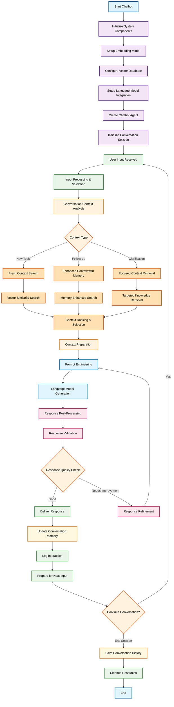

# RAG Chatbot Conversation Agent

## Overview

This workflow demonstrates a production-ready RAG chatbot implementation designed for interactive conversational experiences. The system provides a complete chatbot framework with sophisticated conversation management, context awareness, and extensible architecture suitable for various chatbot applications.

## Workflow Diagram

## Key Components

### 1. Chatbot Infrastructure
- **Session Management**: Handles multiple concurrent chat sessions with isolated contexts
- **Input Processing**: Validates, sanitizes, and preprocesses user inputs
- **Context Awareness**: Maintains conversation state and user preferences
- **Response Quality**: Implements quality checks and response validation

### 2. Intelligent Context Management
- **Topic Detection**: Identifies when users switch between different topics
- **Memory Integration**: Uses conversation history to improve context relevance
- **Context Prioritization**: Ranks and selects most relevant information for responses
- **Dynamic Context**: Adapts context retrieval based on conversation flow

### 3. Advanced Conversation Flow
- **Intent Recognition**: Understands user intent and conversation goals
- **Response Personalization**: Tailors responses based on user history and preferences
- **Conversation Continuity**: Maintains logical flow across multiple exchanges
- **Error Handling**: Graceful handling of unclear inputs and system errors

### 4. Production Features
- **Logging and Analytics**: Comprehensive tracking of conversations and performance
- **Response Optimization**: Continuous improvement of response quality
- **Resource Management**: Efficient handling of system resources and connections
- **Scalability**: Architecture supports multiple concurrent users

## Use Cases

### Customer Service Automation
- **24/7 Support**: Provide round-the-clock customer assistance
- **Query Resolution**: Handle common customer questions and issues
- **Escalation Management**: Seamlessly hand off complex issues to human agents
- **Multi-Language Support**: Communicate with customers in their preferred language

### Internal Knowledge Assistant
- **Employee Onboarding**: Guide new employees through company procedures
- **Policy Clarification**: Answer questions about company policies and procedures
- **Technical Support**: Provide IT and technical assistance to staff
- **Training Assistance**: Support learning and development programs

### E-learning and Education
- **Student Support**: Answer questions about course materials and assignments
- **Tutoring Assistant**: Provide personalized learning support
- **Assessment Help**: Guide students through evaluation processes
- **Research Assistant**: Help with finding relevant academic resources

### Healthcare Support
- **Patient Information**: Provide general health information and guidance
- **Appointment Assistance**: Help with scheduling and preparation
- **Medication Information**: Answer questions about prescriptions and treatments
- **Wellness Coaching**: Support patient wellness and preventive care

## Technical Features

### Conversation Management
- **Session Persistence**: Maintains conversation state across interactions
- **Context Windows**: Manages conversation history within optimal length limits
- **Memory Hierarchy**: Implements short-term and long-term memory structures
- **Topic Tracking**: Monitors conversation topics and transitions

### Response Generation
- **Template System**: Uses conversation templates for consistent responses
- **Dynamic Prompting**: Adapts prompts based on conversation context and user profile
- **Multi-turn Coherence**: Ensures responses make sense within conversation flow
- **Tone Management**: Maintains appropriate conversational tone and style

### Quality Assurance
- **Response Filtering**: Prevents inappropriate or harmful content
- **Accuracy Validation**: Checks response accuracy against knowledge base
- **Coherence Testing**: Ensures responses are logical and coherent
- **User Feedback Integration**: Learns from user satisfaction signals

### Performance Optimization
- **Caching Strategy**: Caches common queries and responses for faster delivery
- **Load Balancing**: Distributes conversation load across available resources
- **Response Time Optimization**: Minimizes latency for real-time conversations
- **Resource Monitoring**: Tracks and optimizes system resource usage

## Architecture Benefits

### User Experience
- **Natural Conversations**: Feels like talking to a knowledgeable human assistant
- **Contextual Responses**: Understands conversation history and user intent
- **Consistent Personality**: Maintains consistent tone and behavior across interactions
- **Error Recovery**: Gracefully handles misunderstandings and errors

### Operational Excellence
- **Monitoring and Alerting**: Comprehensive observability into chatbot performance
- **Continuous Learning**: Improves responses based on user interactions and feedback
- **Scalable Architecture**: Handles growing user bases and conversation volumes
- **Maintenance Friendly**: Easy to update knowledge base and conversation flows

### Business Value
- **Cost Reduction**: Reduces human support costs while maintaining quality
- **Availability**: Provides 24/7 service availability
- **Consistency**: Delivers consistent service quality across all interactions
- **Analytics**: Provides insights into customer needs and behavior patterns