# RAG Architecture with OpenSearch

This diagram illustrates a Retrieval-Augmented Generation (RAG) architecture using OpenSearch as the vector database, with support for long-term memory and caching mechanisms.

## Swimlane Diagram

```mermaid
graph LR
    subgraph UnstructuredData["Unstructured data"]
        direction TB
        subgraph DataTypes["📊 🖼️ 🎧 📄 📋"]
            UD["Tables | Images | Audio<br/>Documents | Logs"]
        end
        subgraph UsersBox["👥 Users"]
            direction LR
            U1["1"]
            U2["2"]
            U3["3"]
        end
    end
    
    subgraph EmbeddingModel["Embedding model"]
        direction TB
        EM["OpenAI<br/>🤗 Hugging Face<br/>🔴 cohere"]
        EM1["Create<br/>Embeddings"]
        EM2["Create<br/>Embeddings"]
        EM3["Create<br/>Embeddings"]
    end
    
    subgraph VectorDB["Vector database"]
        direction TB
        VDB["OpenSearch"]
        VDB1["Get relevant<br/>documents from db"]
        LTM["Long term memory<br/>💾"]
        Cache["💾🖥️<br/>Check cache for<br/>similar queries & answers"]
    end
    
    subgraph LLM["Large Language Models"]
        direction TB
        LLMS["🔍 deepseek<br/>ANTHROPIC<br/>🦙 LlamaIndex<br/>🔴 cohere<br/>OpenAI"]
        LLM1["Construct<br/>prompts"]
        LLM2["Query LLM and<br/>get answers"]
        LLM3["Get response"]
        LLM4["Query LLM and<br/>get answers"]
        LLM5["Construct prompts,<br/>if not in cache"]
        LLM6["Query LLM and<br/>get answers"]
    end
    
    %% Flow 1 - Ask questions (Cyan - Served by LLM)
    U1 -->|"Ask questions"| EM1
    EM1 -->|"Create<br/>Embeddings"| VDB1
    VDB1 -->|"Get relevant<br/>documents from db"| LLM1
    LLM1 -->|"Construct<br/>prompts"| LLM2
    LLM2 -.->|"Served by LLM"| U1
    
    %% Flow 2 - User query (Red - Served by Vector db)  
    U2 ==>|"User query"| EM2
    EM2 ==>|"Embed<br/>history"| LTM
    LTM ==>|"Get response"| LLM3
    LLM3 ==>|"Query LLM and<br/>get answers"| LLM4
    LLM4 ==>|"Store in LTM"| LTM
    LTM -.->|"Served by Vector db"| U2
    
    %% Flow 3 - Ask questions with cache (Red - Served by Vector db)
    U3 ==>|"Ask questions"| EM3
    EM3 ==>|"Cache<br/>lookup"| Cache
    Cache ==>|"Return"| EM3
    EM3 -.->|"Served by Vector db"| U3
    Cache ==>|"Construct prompts,<br/>if not in cache"| LLM5
    LLM5 ==>|"Query LLM and<br/>get answers"| LLM6
    LLM6 ==>|"Result: store<br/>in Cache"| Cache
    
    classDef unstructuredStyle fill:#f5f5f5,stroke:#8b7bb8,stroke-width:3px,color:#000
    classDef embeddingStyle fill:#f5f5f5,stroke:#8b7bb8,stroke-width:3px,color:#000
    classDef vectorStyle fill:#f5f5f5,stroke:#4a90e2,stroke-width:3px,color:#000
    classDef llmStyle fill:#f5f5f5,stroke:#e27d60,stroke-width:3px,color:#000
    classDef userStyle fill:#fff,stroke:#666,stroke-width:2px
    classDef actionStyle fill:#e6d5ff,stroke:#7b4397,stroke-width:2px
    
    class UnstructuredData,UD unstructuredStyle
    class U1,U2,U3 userStyle
    class EmbeddingModel,EM embeddingStyle
    class EM1,EM2,EM3 actionStyle
    class VectorDB vectorStyle
    class VDB,VDB1,LTM,Cache actionStyle
    class LLM,LLMS llmStyle
    class LLM1,LLM2,LLM3,LLM4,LLM5,LLM6 actionStyle
    
    %% Cyan arrows for Flow 1 (Served by LLM)
    linkStyle 0,1,2,3,4 stroke:#00CED1,stroke-width:4px
    
    %% Red arrows for Flow 2 (Served by Vector db)
    linkStyle 5,6,7,8,9,10 stroke:#DC143C,stroke-width:4px
    
    %% Red arrows for Flow 3 (Served by Vector db)
    linkStyle 11,12,13,14,15,16 stroke:#DC143C,stroke-width:4px
```

### Legend
- 🔵 **Cyan arrows (─→)**: Served by LLM
- 🔴 **Red arrows (═⇒)**: Served by Vector db

---

## Detailed Flow Diagram

```mermaid
graph TB
    subgraph UnstructuredData["Unstructured data"]
        UD1["📊 Tables"]
        UD2["🖼️ Images"]
        UD3["🎧 Audio"]
        UD4["📄 Documents"]
        UD5["📋 Logs"]
    end

    subgraph EmbeddingModel["Embedding model"]
        EM1["OpenAI<br/>🤗 Hugging Face<br/>🔴 cohere"]
        EM2["Create<br/>Embeddings"]
        EM3["Create<br/>Embeddings"]
        EM4["Create<br/>Embeddings"]
    end

    subgraph VectorDB["Vector database"]
        VDB1["OpenSearch<br/>Vector Store"]
        VDB2["Get relevant<br/>documents from db"]
        VDB3["Long term memory<br/>💾 Database"]
        VDB4["Cache<br/>💾🖥️<br/>Check cache for<br/>similar queries & answers"]
    end

    subgraph LLM["Large Language Models"]
        LLM1["🔍 deepseek<br/>ANTHROP\\C<br/>🦙 LlamaIndex<br/>🔴 cohere<br/>OpenAI"]
        LLM2["Construct<br/>prompts"]
        LLM3["Query LLM and get answers"]
        LLM4["Get response"]
        LLM5["Query LLM and get answers"]
        LLM6["Construct prompts,<br/>if not in cache"]
        LLM7["Query LLM and get answers"]
    end

    subgraph Users["Users"]
        U1["👥<br/>1"]
        U2["👥<br/>2"]
        U3["👥<br/>3"]
    end

    %% Flow 1 - Ask questions (cyan arrows)
    U1 -->|"Ask questions"| EM2
    EM2 -->|"Create<br/>Embeddings"| VDB2
    VDB2 -->|"Get relevant<br/>documents from db"| LLM2
    LLM2 -->|"Construct<br/>prompts"| LLM3
    LLM3 -.->|"Served by LLM"| U1

    %% Flow 2 - User query (red arrows)
    U2 -->|"User query"| EM3
    EM3 -->|"Embed<br/>history"| VDB3
    VDB3 -->|"Get response"| LLM4
    LLM4 -->|"Query LLM and get answers"| LLM5
    LLM5 -->|"Store in LTM"| VDB3
    VDB3 -.->|"Served by Vector db"| U2

    %% Flow 3 - Ask questions with cache (red arrows)
    U3 -->|"Ask questions"| EM4
    EM4 -->|"Cache<br/>lookup"| VDB4
    VDB4 -->|"Return"| EM4
    EM4 -.->|"Served by Vector db"| U3
    VDB4 -->|"Construct prompts,<br/>if not in cache"| LLM6
    LLM6 -->|"Query LLM and get answers"| LLM7
    LLM7 -->|"Result: store<br/>in Cache"| VDB4

    %% Styling
    classDef unstructuredStyle fill:#f0e6ff,stroke:#6b46c1,stroke-width:3px
    classDef embeddingStyle fill:#e6f7ff,stroke:#1890ff,stroke-width:2px
    classDef vectorStyle fill:#e6f9f5,stroke:#00b4a6,stroke-width:2px
    classDef llmStyle fill:#fff5e6,stroke:#fa8c16,stroke-width:2px
    classDef userStyle fill:#f0f0f0,stroke:#333,stroke-width:2px

    class UnstructuredData,UD1,UD2,UD3,UD4,UD5 unstructuredStyle
    class EmbeddingModel,EM1,EM2,EM3,EM4 embeddingStyle
    class VectorDB,VDB1,VDB2,VDB3,VDB4 vectorStyle
    class LLM,LLM1,LLM2,LLM3,LLM4,LLM5,LLM6,LLM7 llmStyle
    class Users,U1,U2,U3 userStyle

    linkStyle 0,1,2,3,4 stroke:#00CED1,stroke-width:3px
    linkStyle 5,6,7,8,9,10 stroke:#DC143C,stroke-width:3px
    linkStyle 11,12,13,14,15,16 stroke:#DC143C,stroke-width:3px
```

## Architecture Overview

### Components

1. **Unstructured Data Sources**
   - Tables, Images, Audio, Documents, Logs
   - Various data formats requiring processing

2. **Embedding Models**
   - OpenAI
   - Hugging Face
   - Cohere
   - Converts data and queries into vector embeddings

3. **Vector Database (OpenSearch)**
   - Primary vector store for document retrieval
   - Long-term memory storage for conversation history
   - Cache system for frequently asked questions

4. **Large Language Models**
   - DeepSeek
   - Anthropic
   - LlamaIndex
   - Cohere
   - OpenAI
   - Generates responses based on retrieved context

### Three Query Flows

#### Flow 1: Basic RAG (Cyan - Served by LLM)
1. User asks questions
2. Query is embedded
3. Relevant documents retrieved from vector database
4. Prompts constructed with context
5. LLM generates and returns answer

#### Flow 2: RAG with Long-Term Memory (Red - Served by Vector DB)
1. User submits query
2. Query is embedded along with conversation history
3. Stored in long-term memory database
4. Response retrieved and processed by LLM
5. Result stored back in long-term memory for future reference

#### Flow 3: RAG with Caching (Red - Served by Vector DB)
1. User asks questions
2. Query embedding created
3. Cache checked for similar queries
4. If found in cache: Return cached answer directly
5. If not in cache: Construct prompts, query LLM, store result in cache

### Benefits

- **Efficiency**: Caching reduces redundant LLM calls
- **Context Awareness**: Long-term memory maintains conversation history
- **Scalability**: Vector database enables fast similarity search
- **Flexibility**: Multiple embedding and LLM provider options
