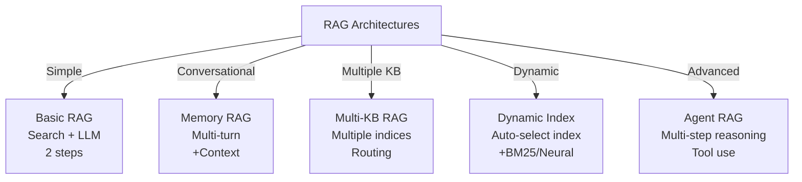
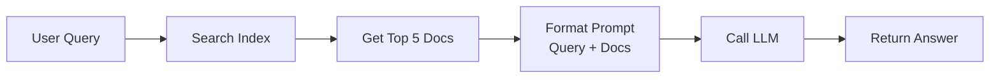
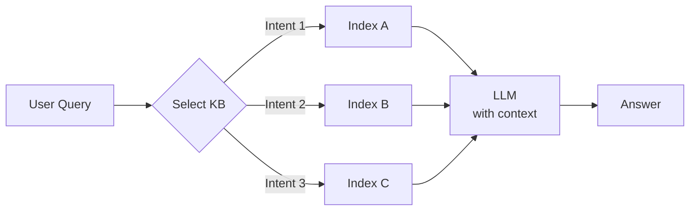
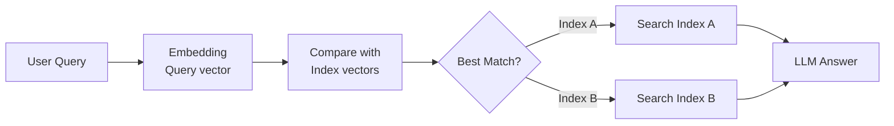
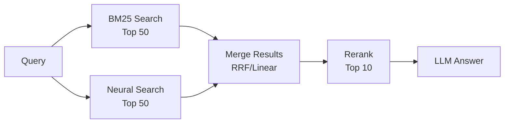

# RAG Flows - Complete End-to-End Implementations

## 📚 Overview
This directory contains **production-ready RAG (Retrieval-Augmented Generation) implementations** showing various architectures from simple to advanced.

### 🎯 What You'll Learn
- Building RAG systems from scratch
- Implementing conversational AI
- Handling multiple knowledge bases
- Dynamic index selection
- Hybrid search optimization
- Agent-based workflows

---

## 🏗️ RAG Architecture Evolution



---

## 📁 File Guide

| File | Purpose | Complexity |
|------|---------|-----------|
| `2. rag_conversational_flow_agent_with_memory.py` | Basic conversational RAG | ⭐⭐ |
| `3. rag_conversational_flow_agent_with_memory_multiple_kb.py` | Multi-KB support | ⭐⭐⭐ |
| `4. rag_conversational_flow_agent_dynamic_index_bm25_neural_hybrid.py` | Hybrid search | ⭐⭐⭐ |
| `4.1 rag_conversational_flow_agent_dynamic_index_bm25_neural_hybrid_rrf.py` | Hybrid with RRF | ⭐⭐⭐⭐ |
| `5. rag_chatbot_conversation_agent.py` | Full chatbot | ⭐⭐⭐⭐ |

---

## 🔄 RAG Flow Patterns

### Pattern 1: Basic RAG



### Pattern 2: Conversational RAG


### Pattern 3: Multi-KB RAG



### Pattern 4: Dynamic Index Selection



### Pattern 5: Hybrid Search



---

## 📊 Comparison Table

| Feature | Basic | Memory | Multi-KB | Dynamic | Hybrid | Agent |
|---------|-------|--------|----------|---------|--------|-------|
| Context | None | ✅ | ✅ | ✅ | ✅ | ✅ |
| Multi-turn | ❌ | ✅ | ✅ | ✅ | ✅ | ✅ |
| Multiple KB | ❌ | ❌ | ✅ | ✅ | ✅ | ✅ |
| Dynamic Index | ❌ | ❌ | ❌ | ✅ | ✅ | ✅ |
| Hybrid Search | ❌ | ❌ | ❌ | ❌ | ✅ | ✅ |
| Tool Use | ❌ | ❌ | ❌ | ❌ | ❌ | ✅ |
| Reasoning | ❌ | ❌ | ❌ | ❌ | ❌ | ✅ |

---

## 💡 Key Patterns & Best Practices

### 1. Conversation Memory Management

```python
class ConversationMemory:
    def __init__(self, max_turns=10):
        self.history = []
        self.max_turns = max_turns
    
    def add(self, role: str, content: str):
        self.history.append({
            "role": role,
            "content": content
        })
        # Keep recent messages only
        if len(self.history) > self.max_turns * 2:
            self.history = self.history[-self.max_turns*2:]
    
    def get_context(self) -> str:
        """Get conversation context for LLM"""
        return "\n".join([
            f"{m['role']}: {m['content']}"
            for m in self.history
        ])
```

### 2. Dynamic Index Selection

```python
def select_best_index(query: str, indices_metadata: dict) -> str:
    """
    Select best index based on query intent
    """
    query_lower = query.lower()
    
    # Rule-based selection
    if any(word in query_lower for word in ['python', 'code', 'bug']):
        return 'programming_kb'
    elif any(word in query_lower for word in ['symptom', 'disease', 'medicine']):
        return 'medical_kb'
    elif any(word in query_lower for word in ['product', 'price', 'buy']):
        return 'ecommerce_kb'
    
    # Default
    return 'general_kb'
```

### 3. Hybrid Search Fusion

```python
def hybrid_search(query: str, query_vector: list) -> list:
    """
    Combine BM25 and neural search results
    """
    # BM25 search
    bm25_results = client.search(
        index=index_name,
        body={"query": {"match": {"text": query}}}
    )
    
    # Neural search
    neural_results = client.search(
        index=index_name,
        body={
            "query": {
                "knn": {
                    "embedding": {
                        "vector": query_vector,
                        "k": 10
                    }
                }
            }
        }
    )
    
    # Merge and deduplicate
    combined = {}
    for hit in bm25_results["hits"]["hits"]:
        combined[hit["_id"]] = hit
    for hit in neural_results["hits"]["hits"]:
        combined[hit["_id"]] = hit
    
    return list(combined.values())[:10]
```

### 4. Relevance-Based Prompt Formatting

```python
def format_rag_prompt(query: str, documents: list) -> str:
    """
    Format retrieval results into effective prompt
    """
    # Sort by relevance score
    sorted_docs = sorted(
        documents,
        key=lambda x: x.get('_score', 0),
        reverse=True
    )
    
    # Build context
    context = ""
    for i, doc in enumerate(sorted_docs[:5], 1):
        context += f"""
Document {i} (Relevance: {doc.get('_score', 0):.2f}):
{doc['_source']['text']}

---
"""
    
    return f"""You are a helpful assistant. Use the following documents to answer the question.

{context}

Question: {query}

Answer based on the documents above. If you don't know, say "I don't have that information"."""
```

---

## 🎯 Implementation Checklist

```
For Basic RAG:
☑️ Connect to OpenSearch
☑️ Create index with documents
☑️ Initialize LLM client
☑️ Implement search function
☑️ Format LLM prompt
☑️ Test end-to-end

For Conversational RAG:
☑️ All Basic RAG steps
☑️ Implement memory storage
☑️ Add multi-turn support
☑️ Include context window management
☑️ Test conversation flows

For Multi-KB RAG:
☑️ All Conversational steps
☑️ Create multiple indices
☑️ Implement routing logic
☑️ Test index selection
☑️ Benchmark performance

For Hybrid RAG:
☑️ All Multi-KB steps
☑️ Implement embedding generation
☑️ Combine search methods
☑️ Implement ranking
☑️ Optimize for speed
```

---

## 📈 Performance Optimization

### 1. Reduce Latency

```python
# Parallelize searches
import asyncio

async def parallel_search(query: str, query_vector: list):
    bm25 = asyncio.create_task(bm25_search(query))
    neural = asyncio.create_task(neural_search(query_vector))
    
    results = await asyncio.gather(bm25, neural)
    return merge_results(results[0], results[1])
```

### 2. Cache Results

```python
from functools import lru_cache
import hashlib

@lru_cache(maxsize=100)
def cached_search(query_hash: str, index: str):
    # Expensive search only done once per query
    return opensearch_search(query, index)

def search_with_cache(query: str, index: str):
    query_hash = hashlib.md5(query.encode()).hexdigest()
    return cached_search(query_hash, index)
```

### 3. Batch Processing

```python
def batch_rag(queries: list, batch_size: int = 5):
    """Process multiple queries efficiently"""
    
    for i in range(0, len(queries), batch_size):
        batch = queries[i:i+batch_size]
        
        # Parallel embedding
        embeddings = model.encode(batch)
        
        # Batch search
        results = []
        for q, emb in zip(batch, embeddings):
            results.append(search_and_answer(q, emb))
        
        yield results
```

---

## 🔧 Troubleshooting Guide

| Problem | Cause | Solution |
|---------|-------|----------|
| Slow queries | Too many docs | Implement top-K filtering |
| Poor answers | Bad retrieval | Improve search ranking |
| High cost | Too many API calls | Add caching |
| Memory issues | Large context | Implement windowing |
| Wrong index | Bad routing | Improve selector logic |

---

## 📖 Resources

- 🔗 [RAG Papers](https://arxiv.org/abs/2005.11401)
- 🔗 [OpenSearch Hybrid Search](https://opensearch.org/docs/latest/search-plugins/search-relevance/hybrid-search/)
- 🔗 [LangChain RAG](https://python.langchain.com/docs/use_cases/question_answering/)

---

## ✨ Summary

These RAG flows provide:
- ✅ **Scalable architectures** from simple to complex
- ✅ **Production patterns** tested at scale
- ✅ **Best practices** for efficiency
- ✅ **Real-world examples** to learn from

Start with basic RAG, progress to advanced agent systems! 🚀

