# RAG Conversational Flow Agent with Memory

## Overview
This script implements a complete **Retrieval-Augmented Generation (RAG)** conversational agent with memory capabilities using OpenSearch and OpenAI. The agent maintains context across conversations and provides data-driven responses based on vector similarity search.

---

## Architecture Flow

```mermaid
graph TD
    A["🌐 Initialize OpenSearch Client"] -->|Configure Credentials| B["⚙️ Setup Cluster Settings"]
    B -->|Configure ML Commons| C["📦 Register Embedding Model"]
    
    C -->|Deploy Model| D["⏳ Monitor Task Status"]
    D -->|Model Ready| E["🔌 Create Ingest Pipeline"]
    E -->|Configure Embedding| F["📇 Create Vector Index"]
    
    F -->|Index Created| G["📊 Load Sample Data"]
    G -->|Bulk Insert| H["✅ Data Indexed with Embeddings"]
    
    H -->|Setup LLM| I["🤝 Setup OpenAI Connector"]
    I -->|Register Connector| J["🔑 Register OpenAI Model"]
    
    J -->|Deploy Model| K["🧪 Test OpenAI Model"]
    K -->|Test Complete| L["🤖 Create RAG Agent"]
    
    L -->|Register Agent| M["💬 Agent with Memory Enabled"]
    M -->|Execute Query| N["🔍 Vector Search for Relevant Docs"]
    N -->|Retrieve Context| O["🧠 Generate Response with GPT-3.5"]
    
    O -->|Return Answer| P["📝 Store in Conversation Memory"]
    P -->|Follow-up Query| Q["🔄 Continue with Context Preserved"]
    
    Q -->|Explore Memory| R["📚 View Conversation History"]
    R -->|Traces| S["🔎 Analyze Agent Traces & Details"]
    
    style A fill:#e1f5ff
    style B fill:#b3e5fc
    style C fill:#81d4fa
    style D fill:#4fc3f7
    style E fill:#29b6f6
    style F fill:#03a9f4
    style G fill:#039be5
    style H fill:#0288d1
    style I fill:#e1bee7
    style J fill:#ce93d8
    style K fill:#ba68c8
    style L fill:#ab47bc
    style M fill:#9c27b0
    style N fill:#ffe082
    style O fill:#ffd54f
    style P fill:#ffca28
    style Q fill:#fbc02d
    style R fill:#f57f17
    style S fill:#ff6f00
```



---

## Detailed Component Breakdown

### 1. **Cluster Configuration**


### 2. **Model Registration & Deployment Pipeline**


### 3. **Data Ingestion Pipeline**


### 4. **LLM Integration**

```mermaid
graph TD
    A["Register Model Group"] -->|Generate ID| B["Model Group Created"]
    B -->|Model Group ID| C["Create Connector"]
    
    C -->|Connector Config| D["OpenAI Endpoint"]
    D -->|Bearer Token| E["Setup Auth"]
    E -->|Credentials| F["Register OpenAI Model"]
    
    F -->|Deploy=true| G["Monitor Deployment"]
    G -->|COMPLETED| H["✅ LLM Ready"]
    
    I["Test Model"] -->|Sample Prompt| J["Send to OpenAI API"]
    J -->|Response| K["Verify Integration"]
    
    style A fill:#ce93d8
    style B fill:#ba68c8
    style C fill:#ab47bc
    style D fill:#9c27b0
    style E fill:#8e24aa
    style F fill:#7b1fa2
    style G fill:#6a1b9a
    style H fill:#4a148c,color:#fff
```


### 5. **RAG Agent Creation**

```mermaid
graph TD
    A["Agent Configuration"] -->|Type| B["conversational_flow"]
    A -->|App Type| C["rag"]
    A -->|Memory| D["conversation_index"]
    
    E["VectorDBTool"] -->|Config| F["model_id: Embedding Model"]
    E -->|Config| G["index: my_test_data"]
    E -->|Config| H["search_fields: embedding"]
    
    I["MLModelTool"] -->|Config| J["model_id: OpenAI GPT-3.5"]
    I -->|Config| K["System Prompt: Data Analyst"]
    I -->|Config| L["Context from Vector Search"]
    
    E -->|Tool 1| M["Register Agent"]
    I -->|Tool 2| M
    M -->|Register| N["✅ Agent Registered"]
    
    style A fill:#ffca28
    style B fill:#fbc02d
    style C fill:#f57f17
    style D fill:#ff6f00
    style E fill:#ffe082
    style I fill:#ffd54f
    style N fill:#e65100,color:#fff
```


### 6. **Conversation Flow with Memory**


### 7. **Memory Exploration**


---

## Key Features

### 🎯 **Core Capabilities**
- **Vector Search**: Uses sentence-transformers for semantic search with 384-dimensional embeddings
- **LLM Integration**: Connects to OpenAI GPT-3.5-turbo for response generation
- **Conversation Memory**: Maintains context across multiple turns using conversation indices
- **Ingest Pipeline**: Automatically embeds documents on ingestion
- **Multi-turn Dialogue**: Supports follow-up questions with preserved context

### 🔄 **Main Functions**
1. `setup_cluster_settings()` - Configures OpenSearch for ML operations
2. `register_embedding_model()` - Registers and deploys HuggingFace model
3. `create_ingest_pipeline()` - Sets up automatic embedding on data ingestion
4. `create_vector_index()` - Creates KNN index with vector field
5. `load_sample_data()` - Inserts population data with auto-embedding
6. `setup_openai_connector()` - Registers OpenAI model with credentials
7. `create_rag_agent()` - Creates agent with vector search and LLM tools
8. `test_conversation()` - Tests multi-turn conversation with memory
9. `explore_memory()` - Retrieves and analyzes conversation history

---

## Data Flow Summary

```
User Query
    ↓
Vector Search (Embedding Model)
    ↓
Retrieve Top K Documents
    ↓
Send to LLM with Context
    ↓
Generate Response
    ↓
Store in Conversation Memory
    ↓
(Optional) Load Memory for Follow-up
    ↓
Response to User
```

---

## Technologies Used
- 🔍 **OpenSearch**: Vector database and agent orchestration
- 🤖 **Sentence Transformers**: All-MiniLM-L12-v2 for embeddings (384-dim)
- 🧠 **OpenAI GPT-3.5-turbo**: Large Language Model for responses
- 💾 **Conversation Index**: Memory storage for multi-turn dialogue
- 📊 **HuggingFace Models**: Pre-trained embedding model

---

## Configuration Parameters
- **Embedding Dimension**: 384 (all-MiniLM-L12-v2)
- **Vector Method**: HNSW (Hierarchical Navigable Small World)
- **Space Type**: L2 (Euclidean distance)
- **Engine**: Lucene
- **LLM Model**: gpt-3.5-turbo
- **Memory Type**: conversation_index
