# RAG Conversational Flow Agent with Multiple Knowledge Bases

## Overview
This script extends the RAG agent with **multiple knowledge base support**, allowing the agent to query multiple indices and combine insights from different data sources. It demonstrates how to use multiple `VectorDBTool` instances within a single agent for comprehensive data analysis.

---

## Architecture Flow

```mermaid
graph TD
    A["🌐 Initialize OpenSearch Client"] -->|Connection| B["⚙️ Setup Cluster Settings"]
    B -->|ML Commons Config| C["📦 Register Embedding Model"]
    
    C -->|Deploy| D["⏳ Monitor Registration"]
    D -->|Model ID| E["🔌 Create Ingest Pipeline"]
    E -->|Configure| F["📇 Create Vector Index"]
    
    F -->|Index Setup| G["📊 Load Sample Data"]
    G -->|Population Data| H["✅ Data with Embeddings"]
    
    H -->|Setup Phase| I["🤝 Register Model Group"]
    I -->|Group ID| J["🔗 Create OpenAI Connector"]
    J -->|Connector ID| K["🔑 Register OpenAI Model"]
    
    K -->|Deploy| L["🧪 Test OpenAI Model"]
    L -->|Test Complete| M["🤖 Create Multi-KB Agent"]
    
    M -->|Tool Config| N["Tool 1: VectorDBTool - KB1"]
    M -->|Tool Config| O["Tool 2: VectorDBTool - KB2"]
    M -->|Tool Config| P["Tool 3: MLModelTool - LLM"]
    
    N -->|Query| Q["Execute Agent Query"]
    O -->|Query| Q
    P -->|Context| Q
    
    Q -->|KB1 Results| R["Combine Context from Multiple KBs"]
    Q -->|KB2 Results| R
    
    R -->|Combined Context| S["Send to LLM"]
    S -->|Generate Response| T["Return Answer"]
    
    T -->|Store| U["📝 Save to Conversation Memory"]
    U -->|Continue| V["🔄 Follow-up Query with Context"]
    
    V -->|Selected Tools| W["Execute with Specific KB Selection"]
    W -->|Optional| X["Query Only Selected Knowledge Bases"]
    
    style A fill:#e1f5ff
    style B fill:#b3e5fc
    style C fill:#81d4fa
    style D fill:#4fc3f7
    style E fill:#29b6f6
    style F fill:#03a9f4
    style G fill:#039be5
    style H fill:#0288d1
    style M fill:#9c27b0,color:#fff
    style N fill:#ab47bc
    style O fill:#ba68c8
    style P fill:#ce93d8
    style Q fill:#ffd54f
    style R fill:#ffca28
    style S fill:#fbc02d
    style T fill:#f57f17
    style U fill:#ff6f00
    style V fill:#ff5722
    style W fill:#e64a19
    style X fill:#bf360c,color:#fff
```



---

## Multi-Knowledge Base Architecture

```mermaid
graph TD
    Agent["🤖 RAG Agent"]
    
    VT1["VectorDBTool - Context1"] -->|Index| KB1["Knowledge Base 1<br/>my_test_data"]
    VT2["VectorDBTool - Context2"] -->|Index| KB2["Knowledge Base 2<br/>my_test_data"]
    
    KB1 -->|Query| S1["Search Results 1"]
    KB2 -->|Query| S2["Search Results 2"]
    
    MLT["MLModelTool<br/>OpenAI GPT-3.5"]
    
    S1 -->|Output| MLT
    S2 -->|Output| MLT
    
    Agent -->|Route| VT1
    Agent -->|Route| VT2
    Agent -->|Route| MLT
    
    MLT -->|Context1 + Context2| R["Generate Response"]
    R -->|Answer| Agent
    
    Agent -->|Optional| STool["Selected Tools Filter"]
    STool -->|context1 only| VT1
    STool -->|context2 only| VT2
    
    style Agent fill:#9c27b0,color:#fff
    style VT1 fill:#4fc3f7
    style VT2 fill:#29b6f6
    style KB1 fill:#0288d1
    style KB2 fill:#0288d1
    style MLT fill:#fbc02d
    style R fill:#f57f17
    style STool fill:#ff6f00,color:#fff
```



---

## Detailed Component Flows

### 1. **Setup Phase**


### 2. **Data Ingestion with Auto-Embedding**

```mermaid
graph LR
    A["Ingest Pipeline"] -->|Processor| B["Text Embedding"]
    B -->|Model ID| C["384-dim Embedding"]
    C -->|Field Map| D["text → embedding"]
    
    E["Sample Docs"] -->|Bulk Insert| F["OpenSearch"]
    F -->|Pipeline| B
    B -->|Auto-embed| G["KNN Vector Index"]
    G -->|Indexed| H["✅ Ready for Search"]
    
    style A fill:#81d4fa
    style B fill:#29b6f6
    style C fill:#0288d1
    style D fill:#0277bd
    style G fill:#01579b,color:#fff
    style H fill:#01579b,color:#fff
```


### 3. **OpenAI Connector & Model Registration**

```mermaid
graph TD
    A["Model Group"] -->|Create| B["Model Group ID"]
    B -->|Reference| C["Connector"]
    
    C -->|Config| D["Name: OpenAI Chat Connector"]
    C -->|Config| E["Endpoint: api.openai.com"]
    C -->|Config| F["Model: gpt-3.5-turbo"]
    C -->|Config| G["Auth: Bearer Token"]
    
    D -->|Connector ID| H["Register OpenAI Model"]
    E -->|Connector ID| H
    F -->|Connector ID| H
    G -->|Connector ID| H
    
    H -->|Deploy=true| I["Monitor Registration"]
    I -->|COMPLETED| J["✅ OpenAI Model Ready"]
    
    style A fill:#ce93d8
    style B fill:#ba68c8
    style C fill:#ab47bc
    style J fill:#4a148c,color:#fff
```


### 4. **Multi-KB Agent Configuration**


### 5. **Query Execution with Multiple KBs**

```mermaid
graph TD
    A["User Question"] -->|Input| B["Agent Execute"]
    
    B -->|Call Tool 1| C["VectorDBTool - context1"]
    B -->|Call Tool 2| D["VectorDBTool - context2"]
    
    C -->|Query| E["Search KB1"]
    D -->|Query| F["Search KB2"]
    
    E -->|Results| G["context1.output"]
    F -->|Results| H["context2.output"]
    
    G -->|Combine| I["Build Prompt"]
    H -->|Combine| I
    
    I -->|Pass to| J["MLModelTool"]
    J -->|System Prompt| K["You are a data analyst"]
    J -->|Context| L["Context1 + Context2"]
    J -->|Question| M["Original Question"]
    
    K -->|Request| N["OpenAI API"]
    L -->|Request| N
    M -->|Request| N
    
    N -->|Response| O["Generate Answer"]
    O -->|Return| P["User Response"]
    
    P -->|Store| Q["📝 Conversation Memory"]
    
    style A fill:#c8e6c9
    style B fill:#a5d6a7
    style C fill:#4fc3f7
    style D fill:#29b6f6
    style E fill:#0288d1
    style F fill:#0277bd
    style I fill:#ffca28
    style J fill:#fbc02d
    style N fill:#f57f17
    style O fill:#ff6f00
    style P fill:#ff5722
    style Q fill:#bf360c,color:#fff
```


### 6. **Memory & Continuation Flow**


---

## Key Features

### 🎯 **Advanced Capabilities**
- **Multiple Knowledge Bases**: Query different indices simultaneously
- **Context Aggregation**: Combine results from multiple sources
- **Selective Tool Usage**: Execute only specific tools via `selected_tools` parameter
- **Conversation Memory**: Full multi-turn dialogue support
- **Dynamic Tool Selection**: Choose which KBs to query per request
- **Parallel Search**: Execute searches against multiple indices concurrently

### 🔄 **Query Execution Options**

**Option 1: Query All Knowledge Bases**
```json
{
  "parameters": {
    "question": "What's the population data for major cities?"
  }
}
```

**Option 2: Query Specific Knowledge Bases**
```json
{
  "parameters": {
    "question": "What's the population data for major cities?",
    "selected_tools": ["context1", "context2"]
  }
}
```

**Option 3: Continue Conversation with Memory**
```json
{
  "parameters": {
    "question": "Compare with another city"
  },
  "memory_id": "previous_memory_id"
}
```

---

## Main Processing Functions

| Function | Purpose |
|----------|---------|
| `register_embedding_model()` | Register HuggingFace embedding model with auto-deploy |
| `create_ingest_pipeline()` | Setup auto-embedding pipeline for documents |
| `load_sample_data()` | Insert population data with automatic vector creation |
| `setup_openai_connector()` | Configure OpenAI API connection and credentials |
| `agent_registration_response` | Create agent with multiple VectorDBTool instances |
| `memory_id extraction` | Extract conversation ID from first response |

---

## Data Flow

```
User Query
    ↓
Agent Receives Question
    ↓
├─ VectorDBTool(context1) → KB1 Search
├─ VectorDBTool(context2) → KB2 Search
└─ Combine Results
    ↓
MLModelTool Receives:
  - System Prompt (Data Analyst)
  - Context from KB1
  - Context from KB2
  - Original Question
    ↓
OpenAI GPT-3.5 Generation
    ↓
Response to User
    ↓
Store in Conversation Memory
    ↓
(Optional) Load Memory for Follow-ups
```

---

## Configuration Parameters

| Parameter | Value | Purpose |
|-----------|-------|---------|
| **Embedding Model** | all-MiniLM-L12-v2 | 384-dimensional semantic embeddings |
| **Vector Dimension** | 384 | HNSW index dimension |
| **Space Type** | L2 | Euclidean distance metric |
| **Engine** | Lucene | KNN search engine |
| **LLM Model** | gpt-3.5-turbo | Language generation |
| **Tools** | 3 (2 VectorDB + 1 LLM) | Multi-KB + LLM generation |
| **Memory Type** | conversation_index | Conversation storage |

---

## Technologies Stack
- 🔍 **OpenSearch**: Vector database with agent framework
- 🤖 **Sentence Transformers**: Embedding generation
- 🧠 **OpenAI GPT-3.5**: Response generation
- 💾 **Conversation Index**: Memory management
- ⚙️ **Ingest Pipeline**: Automatic embedding on index

---

## Unique Aspects
1. **Multiple KB Integration**: Single agent queries multiple knowledge bases
2. **Context Combination**: Merges insights from different sources
3. **Selective Querying**: Can limit to specific KBs via `selected_tools`
4. **Scalable Design**: Easy to add more VectorDBTools for additional KBs
5. **Full Conversation Context**: Maintains memory across turns with multiple sources
