# RAG Conversational Flow Agent with Dynamic Index & Hybrid Search (BM25 + Neural + Search Pipeline)

## Overview
This script demonstrates **hybrid search capabilities** combining BM25 (keyword-based), neural (semantic), and normalized ranking through a search pipeline. It showcases dynamic index selection and query methodology for comprehensive information retrieval with the RAG agent.

---

## Architecture Flow

```mermaid
graph TD
    A["🌐 Initialize OpenSearch"] -->|Configure| B["⚙️ Setup Cluster"]
    B -->|ML Commons| C["📦 Register Model"]
    
    C -->|Deploy| D["🔌 Create Pipeline"]
    D -->|Configure| E["📇 Create Index"]
    E -->|Setup| F["📊 Load Data"]
    
    F -->|Sample Data| G["✅ Index Ready"]
    
    G -->|Setup LLM| H["🤝 Model Group"]
    H -->|Create| I["🔗 Connector"]
    I -->|Register| J["🔑 OpenAI Model"]
    
    J -->|Deploy| K["🧪 Test Model"]
    K -->|Create| L["🤖 Agent with SearchIndexTool"]
    
    L -->|Execute| M["User Query"]
    
    M -->|Route| N["SearchIndexTool"]
    N -->|Dynamic| O{Query Type}
    
    O -->|BM25| P["Keyword Search"]
    O -->|Neural| Q["Semantic Search"]
    O -->|Hybrid| R["Combined Search"]
    
    P -->|Results| S["Normalize Scores"]
    Q -->|Results| S
    R -->|Results| S
    
    S -->|Pipeline| T["Search Pipeline Processor"]
    T -->|Min-Max Norm| U["Normalize to 0-1"]
    T -->|Arithmetic Mean| V["Weighted Combination"]
    
    U -->|Weight 0.3| V
    V -->|Weight 0.7| W["Re-ranked Results"]
    
    W -->|Top Results| X["MLModelTool"]
    X -->|Context| Y["LLM Generation"]
    Y -->|Response| Z["Return Answer"]
    
    style A fill:#e1f5ff
    style B fill:#b3e5fc
    style C fill:#81d4fa
    style D fill:#4fc3f7
    style E fill:#29b6f6
    style F fill:#03a9f4
    style L fill:#9c27b0,color:#fff
    style P fill:#4fc3f7
    style Q fill:#0288d1
    style R fill:#01579b,color:#fff
    style T fill:#ffca28
    style V fill:#f57f17
    style W fill:#ff6f00
    style Y fill:#bf360c,color:#fff
```



---

## Hybrid Search Architecture

```mermaid
graph TD
    Query["🔍 User Query"]
    
    Query -->|Input| HybridSearch["Hybrid Query"]
    
    HybridSearch -->|Branch 1| BM25Q["BM25 Query"]
    HybridSearch -->|Branch 2| NeuralQ["Neural Query"]
    
    BM25Q -->|Lucene Search| BM25R["BM25 Results"]
    NeuralQ -->|Vector Search| VectorR["Vector Results"]
    
    BM25R -->|Scores| Norm1["Normalize Scores<br/>Min-Max to [0,1]"]
    VectorR -->|Scores| Norm2["Normalize Scores<br/>Min-Max to [0,1]"]
    
    Norm1 -->|Weight 0.3| Combine["Arithmetic Mean<br/>Combination"]
    Norm2 -->|Weight 0.7| Combine
    
    Combine -->|Final Scores| Rerank["Re-ranked Results"]
    Rerank -->|Top K Docs| Output["✅ Final Results"]
    
    Output -->|Send to LLM| LLM["GPT-3.5 Response"]
    LLM -->|Generate| Answer["Answer with Context"]
    
    style Query fill:#4fc3f7
    style BM25Q fill:#29b6f6
    style NeuralQ fill:#0288d1
    style BM25R fill:#0277bd
    style VectorR fill:#01579b
    style Norm1 fill:#ffca28
    style Norm2 fill:#fbc02d
    style Combine fill:#f57f17,color:#fff
    style Rerank fill:#ff6f00
    style Output fill:#ff5722,color:#fff
    style LLM fill:#ce93d8
    style Answer fill:#8e24aa,color:#fff
```



---

## Detailed Component Flows

### 1. **Setup & Model Deployment**

```mermaid
graph LR
    A["Register Model"] -->|Task| B["Monitor Status"]
    B -->|Model ID| C["Deploy Model"]
    C -->|Task| D["Monitor Deployment"]
    D -->|COMPLETED| E["✅ Ready"]
    
    F["Create Pipeline"] -->|Processor| G["Text Embedding"]
    G -->|Model ID| H["Field Map"]
    H -->|text→embedding| I["Pipeline Ready"]
    
    E -->|Index Setup| J["Create Index"]
    I -->|Default Pipeline| J
    
    style A fill:#4fc3f7
    style B fill:#29b6f6
    style C fill:#0288d1
    style D fill:#0277bd
    style E fill:#01579b,color:#fff
    style I fill:#81d4fa
    style J fill:#29b6f6
```


### 2. **Index Creation & Data Ingestion**


### 3. **BM25 Query Execution**


### 4. **Neural/Vector Query Execution**


### 5. **Hybrid Query Combination**


### 6. **Search Pipeline Processor**

```mermaid
graph TD
    A["Search Pipeline Config"] -->|Type| B["nlp-search-pipeline"]
    B -->|Processor| C["Normalization Processor"]
    
    C -->|Technique| D["Min-Max Normalization"]
    D -->|Formula| E["(x - min) / (max - min)"]
    E -->|Range| F["[0, 1] interval"]
    
    C -->|Combination| G["Arithmetic Mean"]
    G -->|Weights| H["[0.3, 0.7]"]
    H -->|Formula| I["0.3×BM25 + 0.7×Neural"]
    
    F -->|Apply| J["Normalized Scores"]
    I -->|Apply| K["Weighted Combination"]
    
    J -->|Output| L["Final Rankings"]
    K -->|Output| L
    
    L -->|Return| M["✅ Pipeline Ready"]
    
    style A fill:#ffca28
    style C fill:#fbc02d
    style D fill:#f57f17
    style G fill:#ff6f00
    style H fill:#ff5722
    style M fill:#bf360c,color:#fff
```


### 7. **Agent Execution Flow**


### 8. **Response Generation with Context**

```mermaid
graph TD
    A["Search Results"] -->|Top K| B["Extract Context"]
    B -->|Text Content| C["Relevant Documents"]
    
    D["System Prompt"] -->|Role| E["Professional Data Analyst"]
    E -->|Instruction| F["Answer based on context"]
    F -->|Fallback| G["Analyze if needed"]
    
    C -->|Prepare| H["Build LLM Request"]
    E -->|Prepare| H
    
    I["User Question"] -->|Include| H
    H -->|Send to| J["OpenAI API"]
    
    J -->|GPT-3.5-turbo| K["Generate Response"]
    K -->|Output| L["Answer from LLM"]
    
    L -->|Return| M["✅ Final Answer"]
    
    style D fill:#ce93d8
    style E fill:#ba68c8
    style K fill:#9c27b0,color:#fff
    style M fill:#9c27b0,color:#fff
```


---

## Query Comparison Matrix

| Search Type | Method | Strength | Weakness |
|-------------|--------|----------|----------|
| **BM25** | Keyword Matching | Exact term matches | Misses semantic meaning |
| **Neural** | Vector Similarity | Semantic understanding | Computationally expensive |
| **Hybrid** | Combined | Best of both | Requires tuning |

---

## Key Features

### 🎯 **Advanced Search Capabilities**
- **BM25 Search**: Traditional keyword-based retrieval using TF-IDF
- **Neural Search**: Semantic search using vector embeddings (HNSW)
- **Hybrid Search**: Combines BM25 and neural with normalized scoring
- **Search Pipeline**: Post-processor for score normalization and weighting
- **Dynamic Index**: Single parameter-driven interface for different query types
- **Re-ranking**: Scores merged via weighted arithmetic mean (0.3 BM25, 0.7 Neural)

### 🔍 **Search Pipeline Configuration**
```
Normalization:
  - Min-Max: Scales scores to [0, 1]
  
Combination:
  - Technique: Arithmetic Mean
  - Weights: [0.3, 0.7]
  - Formula: 0.3 × BM25_score + 0.7 × Neural_score
```

---

## Execution Flow


---

## Main Components

### SearchIndexTool Configuration
```json
{
  "type": "SearchIndexTool",
  "parameters": {
    "input": '{"index": "${parameters.index}", "query": ${parameters.query} }'
  }
}
```

### Query Parameters Structure
```python
{
  "question": "What's the population...",
  "index": "my_test_data",
  "query": {
    # BM25 Query
    "query": {"match": {"text": "${parameters.question}"}},
    "size": 2,
    "_source": "text"
  }
}
```

---

## Technologies Used
- 🔍 **OpenSearch**: Search engine with pipeline support
- 📊 **BM25 Algorithm**: Probabilistic ranking function
- 🤖 **Sentence Transformers**: Neural embedding generation
- 🧠 **OpenAI GPT-3.5-turbo**: Language generation
- 🔄 **Search Pipeline**: Post-processing & normalization
- ⚙️ **Ingest Pipeline**: Auto-embedding on indexing

---

## Unique Aspects
1. **Three Search Modes**: Flexible query execution (BM25, Neural, Hybrid)
2. **Score Normalization**: Min-Max scaling ensures comparable scores
3. **Weighted Combination**: Tunable weights for ranking preference
4. **Dynamic Index Selection**: Parameter-driven query routing
5. **Pipeline Architecture**: Extensible for additional processors
6. **Context Quality**: Hybrid approach ensures both relevance and recall
