# RAG Conversational Agent with Dynamic Index & Hybrid Search + RRF (Reciprocal Rank Fusion)

## Overview
This script extends hybrid search with **Reciprocal Rank Fusion (RRF)**, an advanced ranking algorithm that combines rankings from multiple search methods. It demonstrates state-of-the-art information retrieval combining BM25, neural search, and RRF for optimal result ranking in a conversational RAG system.

---

## Architecture Flow

```mermaid
graph TD
    A["🌐 Initialize OpenSearch"] -->|Setup| B["⚙️ Configure Cluster"]
    B -->|ML Commons| C["📦 Register Embedding"]
    
    C -->|Deploy| D["🔌 Ingest Pipeline"]
    D -->|Setup| E["📇 Create Index"]
    E -->|Bulk Load| F["📊 Index Data"]
    
    F -->|Embeddings| G["✅ Data Ready"]
    
    G -->|LLM Phase| H["🤝 Model Group"]
    H -->|Create| I["🔗 OpenAI Connector"]
    I -->|Register| J["🔑 OpenAI Model"]
    
    J -->|Deploy| K["🧪 Test LLM"]
    K -->|Create| L["🤖 Agent with<br/>SearchIndexTool"]
    
    L -->|Execute| M["User Query"]
    
    M -->|Route| N["SearchIndexTool"]
    N -->|Query Type| O{Search Method}
    
    O -->|BM25| P["Keyword Ranking"]
    O -->|Neural| Q["Vector Ranking"]
    O -->|RRF| R["Reciprocal Rank Fusion"]
    
    P -->|Rank 1, 2, 3...| S["BM25 Rankings"]
    Q -->|Rank 1, 2, 3...| T["Neural Rankings"]
    
    S -->|Combine| U["RRF Fusion"]
    T -->|Combine| U
    
    U -->|Formula| V["1/(k + rank)"]
    V -->|Normalize| W["Final RRF Scores"]
    
    R -->|Direct RRF| W
    
    W -->|Top K| X["Final Results"]
    X -->|Context| Y["MLModelTool"]
    Y -->|Generate| Z["LLM Response"]
    Z -->|Return| AA["✅ Answer"]
    
    style A fill:#e1f5ff
    style B fill:#b3e5fc
    style C fill:#81d4fa
    style D fill:#4fc3f7
    style E fill:#29b6f6
    style L fill:#9c27b0,color:#fff
    style P fill:#4fc3f7
    style Q fill:#0288d1
    style U fill:#ff6f00,color:#fff
    style V fill:#ff5722,color:#fff
    style W fill:#bf360c,color:#fff
    style Z fill:#8e24aa,color:#fff
    style AA fill:#6a1b9a,color:#fff
```



---

## Reciprocal Rank Fusion (RRF) Architecture

```mermaid
graph TD
    subgraph Input["🔍 Input"]
        Q["User Query"]
    end
    
    subgraph BM25["📝 BM25 Search"]
        B1["Execute Query"]
        B2["Get Results"]
        B3["Assign Ranks<br/>1,2,3..."]
    end
    
    subgraph Neural["🧠 Neural Search"]
        N1["Encode Query"]
        N2["Vector Search"]
        N3["Assign Ranks<br/>1,2,3..."]
    end
    
    subgraph Fusion["⚙️ RRF Fusion"]
        F1["Calculate RRF Score"]
        F2["Formula: 1/(k + rank)"]
        F3["k=60 default"]
        F4["Sum Scores"]
    end
    
    subgraph Output["✅ Output"]
        O1["Final Rankings"]
        O2["Top Results"]
    end
    
    Q --> B1
    Q --> N1
    
    B1 --> B2
    N1 --> N2
    
    B2 --> B3
    N2 --> N3
    
    B3 -->|Ranks| F1
    N3 -->|Ranks| F1
    
    F1 --> F2
    F2 --> F3
    F3 --> F4
    
    F4 --> O1
    O1 --> O2
    
    style Input fill:#e1f5ff
    style B1 fill:#4fc3f7
    style B2 fill:#29b6f6
    style B3 fill:#0288d1
    style N1 fill:#0277bd
    style N2 fill:#01579b
    style N3 fill:#004d99,color:#fff
    style F1 fill:#ffca28
    style F2 fill:#fbc02d
    style F3 fill:#f57f17
    style F4 fill:#ff6f00
    style Output fill:#e65100,color:#fff
```



---

## RRF Algorithm Deep Dive

### RRF Scoring Formula
```
RRF_Score(document) = Σ (1 / (k + rank))

Where:
  - k = constant (typically 60)
  - rank = document's rank in each ranking list
  - Σ = sum across all ranking methods
```

### Ranking Combination Example


---

## Detailed Component Flows

### 1. **Setup & Deployment Pipeline**


### 2. **Data Ingestion with Vector Generation**

```mermaid
graph TD
    A["Sample Documents<br/>Population Data"] -->|Bulk Insert| B["Ingest API"]
    
    B -->|Apply Pipeline| C["Text Embedding Processor"]
    C -->|Input| D["text field"]
    C -->|Model| E["Embedding Model"]
    E -->|Generate| F["384-dim vector"]
    
    F -->|Map to| G["embedding field"]
    G -->|Index| H["KNN Index"]
    
    I["Ingest Success"] --> J["✅ Documents Indexed<br/>with Vectors"]
    
    B -->|Update| I
    
    style A fill:#b3e5fc
    style B fill:#81d4fa
    style C fill:#4fc3f7
    style E fill:#0288d1
    style F fill:#0277bd,color:#fff
    style J fill:#01579b,color:#fff
```


### 3. **BM25 Ranking Generation**


### 4. **Neural Ranking Generation**


### 5. **RRF Fusion Algorithm**


### 6. **Query Execution Path**


### 7. **Multi-turn Conversation Flow**


---

## Key Features

### 🎯 **Advanced Ranking Capabilities**
- **BM25 Ranking**: Traditional keyword matching with TF-IDF
- **Neural Ranking**: Semantic understanding with vector similarity
- **Reciprocal Rank Fusion**: Optimal combination of multiple rankings
- **Parallel Execution**: Simultaneous BM25 and neural searches
- **Dynamic Parameters**: k-value tunable for RRF formula
- **Multi-turn Memory**: Full conversation context preservation

### ⚙️ **RRF Configuration**
```
k (constant) = 60 (default)
Higher k → gives more weight to lower-ranked documents
Lower k → favors top-ranked documents

RRF Score = 1/(k + rank_bm25) + 1/(k + rank_neural)
```

---

## Comparison: Search Methods

| Method | Strength | Weakness | Use Case |
|--------|----------|----------|----------|
| **BM25** | Exact term matching | Semantic blindness | Factual queries |
| **Neural** | Semantic similarity | Computational cost | Complex queries |
| **RRF** | Balanced best results | Parameter tuning | Production systems |

---

## Data Processing Pipeline

```
Input: User Query
  ↓
[Parallel Execution]
├─ BM25: Generate keyword-based rankings
└─ Neural: Generate semantic-based rankings
  ↓
[RRF Fusion]
├─ Calculate RRF scores for each document
├─ Apply formula: 1/(k + rank)
└─ Combine and normalize
  ↓
[Result Selection]
├─ Sort by final RRF score
└─ Extract top K documents
  ↓
[Context Preparation]
├─ Format document content
└─ Prepare for LLM
  ↓
[LLM Generation]
├─ Send context + question
├─ Generate response
└─ Return answer
  ↓
[Memory Storage]
└─ Save to conversation index
```

---

## Execution Statistics

### Performance Benefits of RRF
- **Recall Improvement**: Captures results missed by individual methods
- **Precision Enhancement**: Redundant high-ranking documents score higher
- **Diversity**: Balances keyword-exact and semantic-similar matches
- **Robustness**: Reduces sensitivity to any single ranking method

### Typical RRF Score Distribution
```
Doc1 (appears in both): ~0.031 (high)
Doc2 (BM25 only): ~0.020 (medium)
Doc3 (Neural only): ~0.019 (medium)
Doc4 (neither): 0.000 (excluded)
```

---

## Technologies Used
- 🔍 **OpenSearch**: Search & ranking engine
- 📊 **BM25 Algorithm**: Probabilistic ranking
- 🤖 **Sentence Transformers**: Neural embeddings
- 🧠 **OpenAI GPT-3.5-turbo**: Response generation
- ⚙️ **Reciprocal Rank Fusion**: Result fusion algorithm
- 💾 **Conversation Index**: Memory management

---

## Unique Aspects
1. **RRF Algorithm**: State-of-the-art ranking fusion
2. **Parallel Searches**: Simultaneous BM25 + neural execution
3. **Formula-based Combination**: Mathematically principled fusion
4. **k-value Tuning**: Adjustable weighting for RRF
5. **Production Ready**: Balanced approach for real-world systems
6. **Full Memory**: Multi-turn conversations with RRF ranking

---

## Advanced Usage

### Adjusting RRF Weight (k-value)
```python
k = 60  # Higher k → more balanced
k = 20  # Lower k → favors top results
```

### Understanding Final Scores
```
High RRF Score (0.03+): Document appears high in both rankings
Medium Score (0.02): Document appears in one ranking well
Low Score (0.01-): Document low-ranked or missing in one
```
