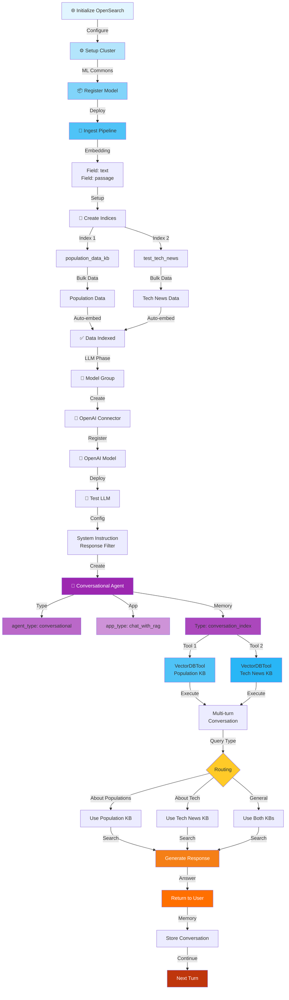
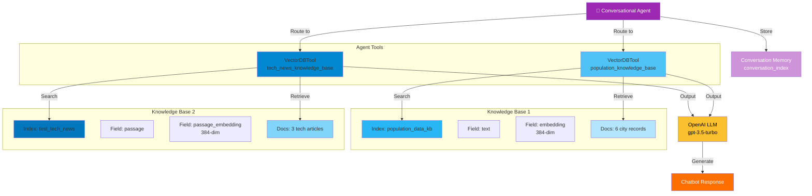
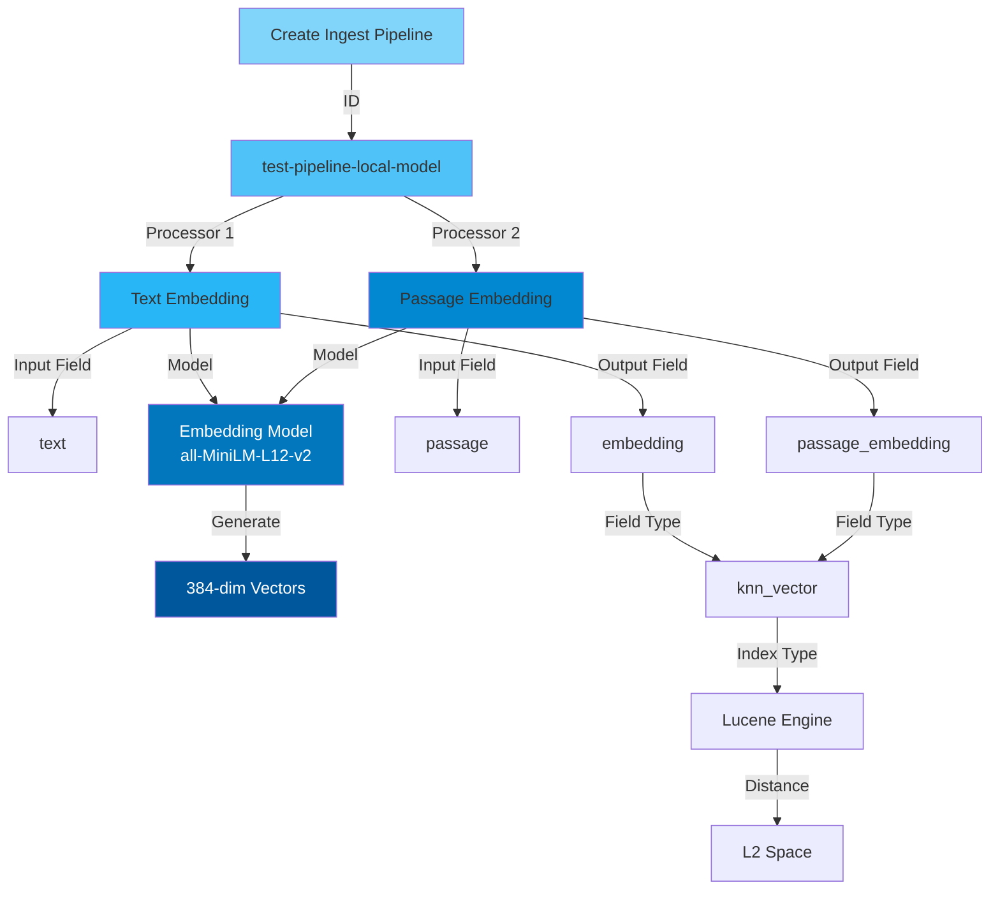
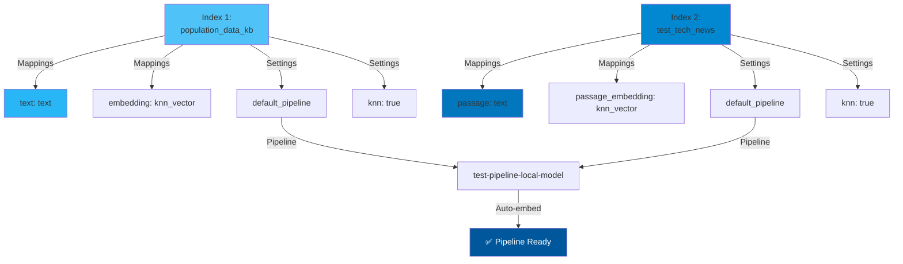
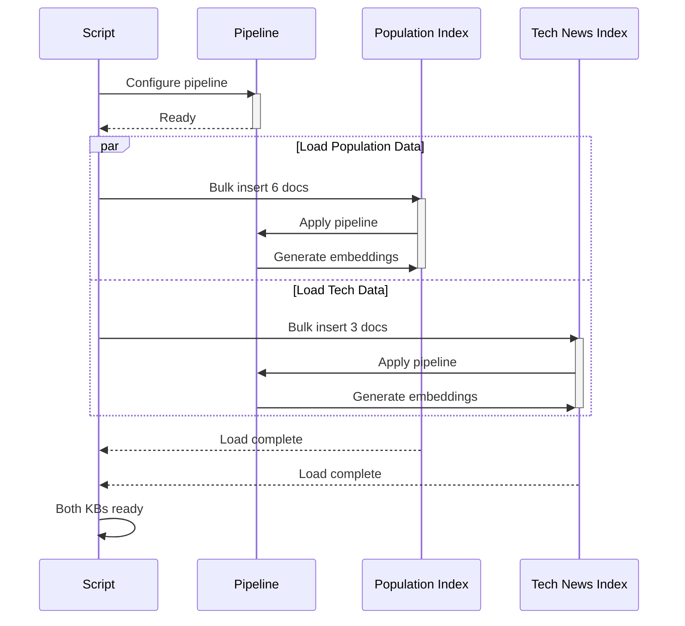
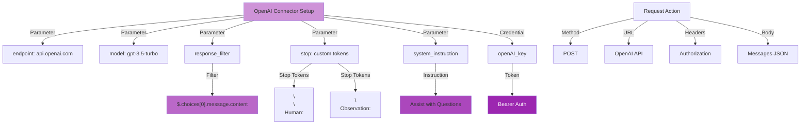
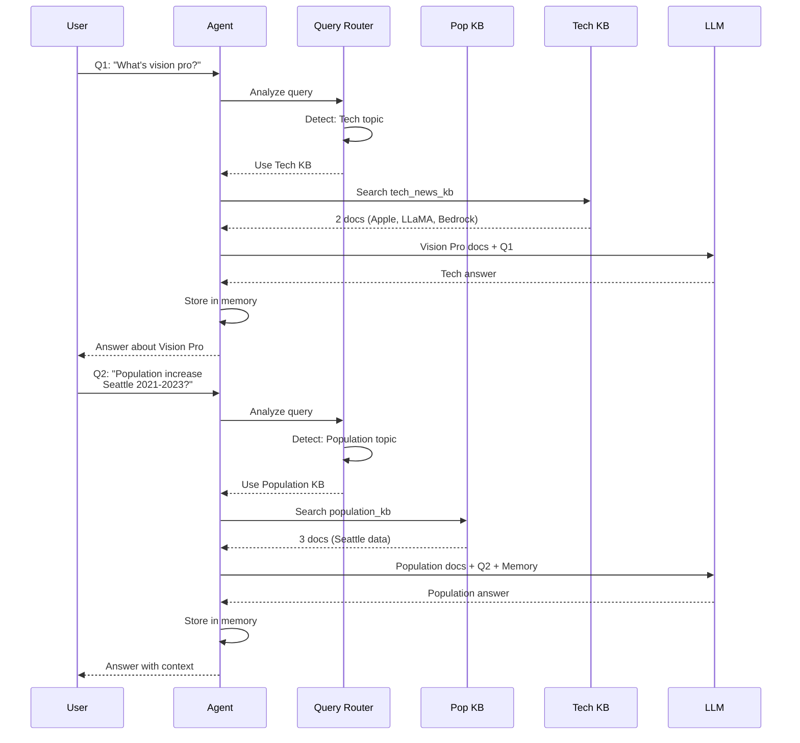
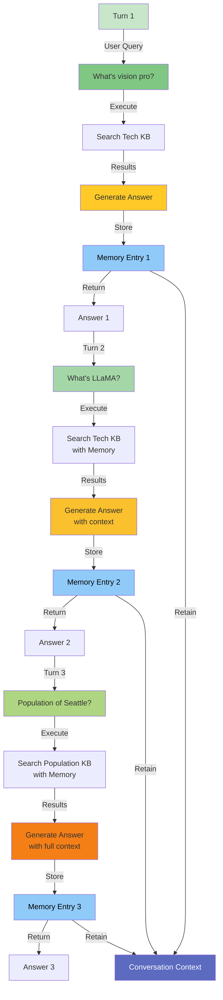
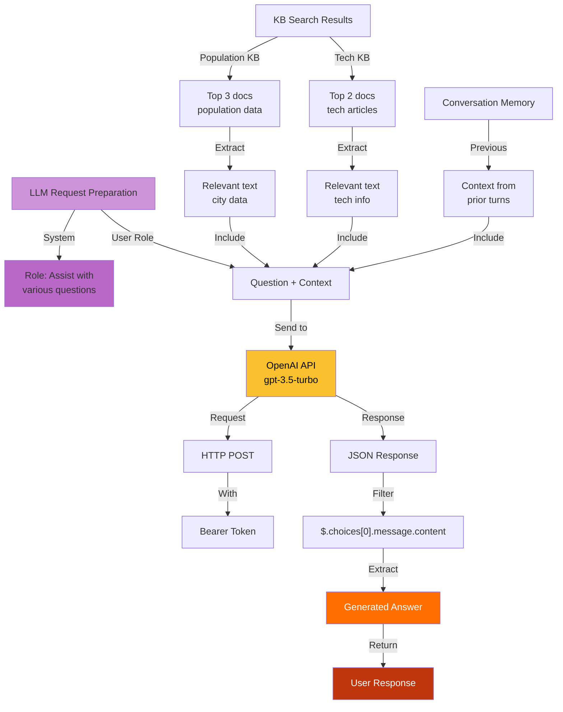

# RAG Chatbot Conversational Agent

## Overview
This script implements a **conversational RAG chatbot** with advanced agent capabilities, supporting multiple knowledge bases (tech news and population data) and full conversation memory. It demonstrates an intelligent agent that routes queries to appropriate knowledge bases and maintains context across multi-turn conversations.

---

## Architecture Flow



---

## Dual Knowledge Base Architecture



---

## Detailed Component Flows

### 1. **Dual Ingest Pipeline Setup**


### 2. **Index Creation Strategy**


### 3. **Data Loading from Multiple Sources**


### 4. **OpenAI Connector Configuration**


### 5. **Conversational Agent Structure**

```mermaid
graph TD
    A["Agent Configuration"] -->|Type| B["conversational"]
    A -->|App Type| C["chat_with_rag"]
    A -->|Description| D["Chat Agent with RAG"]
    
    E["LLM Configuration"] -->|Model| F["openai_model_id"]
    E -->|max_iteration| G["3"]
    E -->|response_filter| H["$.choices[0].message.content"]
    
    I["Memory Configuration"] -->|Type| J["conversation_index"]
    
    K["Tool 1: VectorDBTool"] -->|Name| L["population_knowledge_base"]
    K -->|Description| M["Population data of US cities"]
    K -->|Index| N["population_data_kb"]
    K -->|Embedding| O["embedding field"]
    K -->|doc_size| P["3 docs"]
    K -->|Source| Q["text field"]
    
    R["Tool 2: VectorDBTool"] -->|Name| S["tech_news_knowledge_base"]
    R -->|Description| T["Tech news data"]
    R -->|Index| U["test_tech_news"]
    R -->|Embedding| V["passage_embedding"]
    R -->|doc_size| W["2 docs"]
    R -->|Source| X["passage field"]
    
    E -->|Register| Y["✅ Agent Ready"]
    I -->|Register| Y
    K -->|Register| Y
    R -->|Register| Y
    
    style A fill:#ffca28
    style B fill:#fbc02d
    style C fill:#f57f17
    style Y fill:#e65100,color:#fff
```


### 6. **Query Execution with KB Routing**


### 7. **Multi-turn Conversation State**


### 8. **Response Generation Pipeline**


---

## Key Features

### 🎯 **Advanced Chatbot Capabilities**
- **Dual Knowledge Bases**: Population data and tech news simultaneously available
- **Intelligent Routing**: Automatically selects appropriate KB based on query
- **Full Conversation Memory**: Maintains context across unlimited turns
- **Max Iteration Control**: Limits agent loops to prevent infinite execution
- **Response Filtering**: Extracts clean responses from OpenAI API
- **Custom Stop Tokens**: Prevents unwanted response continuation
- **Multi-field Embedding**: Different text fields for different content types

### 🔄 **Knowledge Base Specifications**

**Population KB (population_data_kb)**
- Documents: 6 US metro areas
- Field: `text` (population statistics)
- Embedding: `embedding` field
- Return: Top 3 documents per query
- Data: Ogden-Layton, NYC, Chicago, Miami, Austin, Seattle

**Tech News KB (test_tech_news)**
- Documents: 3 tech topics
- Field: `passage` (tech articles)
- Embedding: `passage_embedding` field
- Return: Top 2 documents per query
- Data: Apple Vision Pro, LLaMA, Amazon Bedrock

---

## Agent Configuration Parameters

| Parameter | Value | Purpose |
|-----------|-------|---------|
| **Agent Type** | conversational | Multi-turn chat support |
| **App Type** | chat_with_rag | RAG-enabled chatbot |
| **LLM Model** | gpt-3.5-turbo | Response generation |
| **Max Iterations** | 3 | Loop prevention |
| **Memory Type** | conversation_index | Multi-turn storage |
| **Pop KB doc_size** | 3 | Retrieved documents |
| **Tech KB doc_size** | 2 | Retrieved documents |
| **Embedding Dim** | 384 | Vector dimension |

---

## Data Flow

```
User Query
    ↓
[Query Analysis]
├─ Semantic understanding
└─ KB relevance detection
    ↓
[KB Selection]
├─ Route to Population KB (if about demographics)
├─ Route to Tech KB (if about technology)
└─ Route to Both (if general)
    ↓
[Parallel Search]
├─ VectorDBTool: population_knowledge_base
└─ VectorDBTool: tech_news_knowledge_base
    ↓
[Result Aggregation]
├─ Combine retrieved documents
└─ Maintain context order
    ↓
[LLM Request]
├─ System: Assistant role
├─ Context: Retrieved documents
├─ Memory: Previous turns
└─ Question: Current query
    ↓
[Response Generation]
├─ OpenAI gpt-3.5-turbo
├─ Filter response content
└─ Stop at control tokens
    ↓
[Memory Storage]
├─ Save question
├─ Save answer
└─ Link to conversation
    ↓
Return Answer to User
```

---

## Technologies Used
- 🔍 **OpenSearch**: Multi-index search and agent orchestration
- 🤖 **Sentence Transformers**: Embedding generation (all-MiniLM-L12-v2)
- 🧠 **OpenAI GPT-3.5-turbo**: Conversational response generation
- 💾 **Conversation Index**: Memory management for multi-turn dialogue
- 📝 **Ingest Pipeline**: Dual-field automatic embedding
- ⚙️ **ML Commons**: Model registration and deployment

---

## Unique Aspects
1. **Multiple Domain Support**: Seamlessly switches between population and tech domains
2. **Dual Field Embedding**: Different field mappings for different content types
3. **Configurable Doc Retrieval**: Different doc_size per KB (3 vs 2)
4. **Intelligent Routing**: Uses semantic understanding for KB selection
5. **Full Memory Integration**: Maintains complete conversation history
6. **Production Ready**: Includes response filtering and iteration limits
7. **Extensible Design**: Easy to add more knowledge bases and tools

---

## Example Conversation Flow

```
User: "What's vision pro?"
→ Agent detects tech topic
→ Queries test_tech_news (top 2 docs)
→ Returns Vision Pro overview

User: "When was it released?"
→ Agent uses memory
→ Queries tech KB with context
→ Returns release date info

User: "Compare with Seattle population"
→ Agent detects topic switch
→ Queries both KBs
→ Combines tech KB memory with population data
→ Returns comparative answer
```
