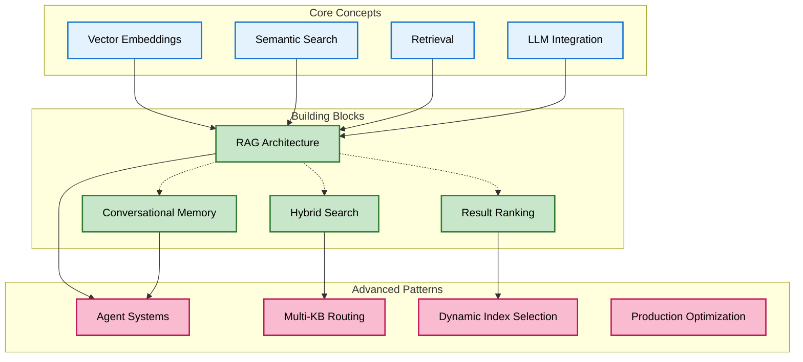

# 📖 LLM Agents & RAG - Complete Learning Guide

## 🎯 Quick Navigation

### For Students - Where to Start?

**I'm new to embeddings and LLMs** → Start here:
1. Review the main architecture diagrams below
2. Explore folder 1: OpenSearch Supported Models
3. Then: Explore folder 2: Custom Models
4. Then: Explore a specific topic below

**I want to build RAG systems** → Follow this path:
```
1. Embeddings & Vector Search (1. opensearch_supported_models/)
   ↓
2. Model Integration (2. custom_models/)
   ↓
3. Advanced RAG (6. RAG_flows/)
   ↓
4. Multi-step Systems (4. agents_tools/)
```

**I want to use external LLMs** → Go here:
- Start with: `3. external_hosted_models/README_EXTERNAL_MODELS.md`
- Choose your provider: OpenAI, Anthropic, DeepSeek, or Ollama

---

## 🏗️ Learning Path Overview

```mermaid
graph TD
    Start["🚀 START HERE<br/>OpenSearch + LLM Basics"] --> M1["Module 1<br/>Vector Embeddings<br/>& Models"]
    Start --> M2["Module 2<br/>Custom Models<br/>Integration"]
    Start --> M3["Module 3<br/>External LLMs<br/>Integration"]
    
    M1 --> S["Subfolders:<br/>text_embedding/<br/>sparse_encoding/<br/>cross_encoder/"]
    M2 --> C["Files:<br/>QA Models<br/>Pipelines<br/>Integration"]
    M3 --> E["Providers:<br/>OpenAI<br/>Anthropic<br/>DeepSeek<br/>Ollama"]
    
    M1 --> M4["Module 4<br/>Agents & Tools<br/>Multi-step Reasoning"]
    M2 --> M5["Module 5<br/>Result Reranking<br/>Relevance"]
    M3 --> M6["Module 6<br/>Complete RAG<br/>End-to-End"]
    
    M4 --> M7["Module 7<br/>MCP<br/>Protocol Integration"]
    M5 --> M7
    M6 --> M7
    
    M7 --> Advanced["🎓 ADVANCED<br/>Production RAG Systems"]
    M4 --> Advanced
    M5 --> Advanced
    M6 --> Advanced
    
    classDef start fill:#e1f5fe,stroke:#01579b,stroke-width:3px,color:#000
    classDef module fill:#c8e6c9,stroke:#2e7d32,stroke-width:2px,color:#000
    classDef sub fill:#fff9c4,stroke:#f57f17,stroke-width:2px,color:#000
    classDef adv fill:#f8bbd0,stroke:#c2185b,stroke-width:3px,color:#000
    
    class Start start
    class M1,M2,M3,M4,M5,M6 module
    class S,C,E sub
    class Advanced adv
```



---

## 📁 Folder Structure

### 1. opensearch_supported_models/
**Purpose:** Learn OpenSearch's built-in ML models and vector capabilities

**Subfolders:**
- `text_embedding/` - Vector embeddings and semantic search
- `sparse_encoding/` - Sparse neural encoding techniques
- `cross_encoder/` - Cross-encoder models for ranking
- `semantic_highlighting/` - Semantic highlighting capabilities

**Key Topics Covered:**
- Sentence-Transformers integration (ST)
- ONNX model deployment
- TorchScript optimization
- Vector indexing strategies
- Semantic search implementations

---

### 2. custom_models/
**Purpose:** Build and integrate custom ML models from scratch

**Files:**
- `os_client_custom_model_QA.md` - Build Question-Answering models
- `os_client_custom_model_QA.py` - Complete QA implementation
- `os_client_custom_model_QA_ingest_pipeline.md` - Full RAG pipeline documentation
- `os_client_custom_model_QA_ingest_pipeline.py` - RAG pipeline code

**Key Topics Covered:**
- Custom model preparation
- RAG system architecture
- Inference pipeline setup
- Integration patterns

---

### 3. external_hosted_models/
**Purpose:** Integrate external LLM providers with OpenSearch

**Providers:**
- `README_EXTERNAL_MODELS.md` - Overview and comparison
- `openai/` - OpenAI integration (GPT-4, GPT-3.5)
- `anthropic/` - Anthropic Claude integration
- `deepseek/` - DeepSeek model integration
- `ollama/` - Local Ollama model support

**Key Topics Covered:**
- API connector creation
- Model comparison and selection
- Cost optimization
- Context window management

---

### 4. agents_tools/
**Purpose:** Build multi-step reasoning systems with agents

**Files:**
- `README_AGENTS_TOOLS.md` - Agent framework overview
- `1. rag_ollama_connector.py` - Ollama agent connector
- `2. rag_non_supported_st_model.py` - Non-supported model integration
- `sentence_transformer_model_files/` - Pre-trained model storage

**Key Topics Covered:**
- Agent architecture and loops
- Tool definition and execution
- Multi-step reasoning
- Memory management
- Error handling and recovery

---

### 5. reranking/
**Purpose:** Improve search result relevance with reranking

**Files:**
- `1. reranking_cross_encoder_msmarco.md` - Cross-encoder guide
- `1. reranking_cross_encoder_msmarco.py` - Implementation code
- `1. reranking_cross_encoder_msmarco.sh` - Shell script execution

**Key Topics Covered:**
- MS-MARCO cross-encoder model
- Result reranking workflow
- Search pipeline integration
- Relevance scoring

---

### 6. RAG_flows/
**Purpose:** Complete end-to-end RAG implementations

**Files:**
- `README_RAG_FLOWS.md` - RAG architecture overview
- `OS-RAG-ARCHITECTURE.md` - Detailed architecture documentation
- `2. rag_conversational_flow_agent_with_memory.md` - Conversational RAG guide
- `2. rag_conversational_flow_agent_with_memory.py` - Implementation code
- `3. rag_conversational_flow_agent_with_memory_multiple_kb.md` - Multi-KB systems
- `3. rag_conversational_flow_agent_with_memory_multiple_kb.py` - Multi-KB code
- `4. rag_conversational_flow_agent_dynamic_index_bm25_neural_hybrid.md` - Hybrid search guide
- `4. rag_conversational_flow_agent_dynamic_index_bm25_neural_hybrid.py` - Hybrid code
- `4.1 rag_conversational_flow_agent_dynamic_index_bm25_neural_hybrid_rrf.md` - RRF guide
- `4.1 rag_conversational_flow_agent_dynamic_index_bm25_neural_hybrid_rrf.py` - RRF code
- `5. rag_chatbot_conversation_agent.md` - Advanced chatbot guide
- `5. rag_chatbot_conversation_agent.py` - Full chatbot implementation
- `docs/` - Additional documentation resources

**Key Topics Covered:**
- Basic RAG workflows
- Conversational RAG with memory
- Multi-knowledge base systems
- Dynamic index selection
- Hybrid search (BM25 + Neural)
- Reciprocal Rank Fusion (RRF)
- Full conversational agents

---

### 7. MCP/
**Purpose:** Model Context Protocol integration for agent interoperability

**Files:**
- `1. inbuilt_mcp_server_NOT_WORKING.ipynb` - Experimental MCP server implementation
- `opensearch_mcp_complete_demo.ipynb` - Complete MCP demonstration

**Key Topics Covered:**
- Model Context Protocol (MCP) basics
- Agent-to-agent communication
- Protocol standards and integration
- OpenSearch MCP server setup
- Interoperability patterns

**What You'll Learn:**
- Understanding the Model Context Protocol
- Building MCP-compatible agents
- Protocol-based agent communication
- Cross-platform agent integration

**Use Cases:**
- Multi-agent systems
- Agent interoperability
- Standardized tool calling
- Cross-platform AI integration

---

## 🎓 Learning Progression

```mermaid
graph TD
    A["Foundation<br/>Module 1<br/>Vector Embeddings"] --> B["Integration<br/>Module 2 & 3<br/>Custom + External Models"]
    
    B --> C["Enhancement<br/>Module 5<br/>Reranking"]
    
    B --> D["Production<br/>Module 6<br/>RAG Flows"]
    
    C --> E["Advanced<br/>Module 4<br/>Agents & Tools"]
    D --> E
    
    E --> F["Mastery<br/>🏆 Build Production<br/>RAG Systems"]
    
    classDef f fill:#bbdefb,stroke:#1565c0,stroke-width:2px,color:#000
    classDef i fill:#c8e6c9,stroke:#2e7d32,stroke-width:2px,color:#000
    classDef e fill:#fff9c4,stroke:#f57f17,stroke-width:2px,color:#000
    classDef p fill:#ffe0b2,stroke:#e65100,stroke-width:2px,color:#000
    classDef a fill:#f8bbd0,stroke:#c2185b,stroke-width:2px,color:#000
    classDef m fill:#ce93d8,stroke:#6a1b9a,stroke-width:3px,color:#fff
    
    class A f
    class B i
    class C e
    class D p
    class E a
    class F m
```



---

## 🔄 What You Can Build

```mermaid
graph LR
    A["After Module 1"] --> A1["🔍 Semantic Search<br/>Find similar content"]
    
    B["After Module 2"] --> B1["📚 Basic RAG<br/>Q&A from documents"]
    
    C["After Module 3"] --> C1["🤖 Powered Search<br/>ChatGPT-like search"]
    
    D["After Module 5"] --> D1["⚡ Ranked Results<br/>Better relevance"]
    
    E["After Module 6"] --> E1["💬 Conversational AI<br/>Multi-turn dialogue"]
    
    F["After Module 4"] --> F1["🧠 Smart Agents<br/>Multi-step reasoning"]
    
    A1 --> Master["🏆 Production Systems"]
    B1 --> Master
    C1 --> Master
    D1 --> Master
    E1 --> Master
    F1 --> Master
    
    classDef m1 fill:#e3f2fd,stroke:#1976d2,stroke-width:2px,color:#000
    classDef m2 fill:#e8f5e9,stroke:#388e3c,stroke-width:2px,color:#000
    classDef m3 fill:#fff3e0,stroke:#d84315,stroke-width:2px,color:#000
    classDef m5 fill:#fce4ec,stroke:#c2185b,stroke-width:2px,color:#000
    classDef m6 fill:#f3e5f5,stroke:#6a1b9a,stroke-width:2px,color:#000
    classDef m4 fill:#e0f2f1,stroke:#00796b,stroke-width:2px,color:#000
    classDef master fill:#f1f8e9,stroke:#558b2f,stroke-width:3px,color:#000
    
    class A1 m1
    class B1 m2
    class C1 m3
    class D1 m5
    class E1 m6
    class F1 m4
    class Master master
```



---

## 🏛️ Architecture Overview

```mermaid
graph TB
    subgraph "OpenSearch Cluster"
        OS["OpenSearch<br/>Search Engine"]
    end
    
    subgraph "Embedding Models"
        EM["Vector Embeddings<br/>Semantic search"]
        SM["Sparse Models<br/>Keyword search"]
        CE["Cross-Encoders<br/>Result ranking"]
    end
    
    subgraph "External LLMs"
        OAI["OpenAI<br/>GPT-4"]
        AN["Anthropic<br/>Claude"]
        DS["DeepSeek<br/>Models"]
        OL["Ollama<br/>Local"]
    end
    
    subgraph "Your Application"
        RAG["RAG System<br/>Retrieval & Generation"]
        AGENT["Agent System<br/>Multi-step reasoning"]
        UI["User Interface<br/>Chat/Search"]
    end
    
    EM --> OS
    SM --> OS
    CE --> OS
    
    OS --> RAG
    OS --> AGENT
    
    OAI --> RAG
    OAI --> AGENT
    AN --> RAG
    AN --> AGENT
    DS --> AGENT
    OL --> RAG
    OL --> AGENT
    
    RAG --> UI
    AGENT --> UI
    UI --> User["👤 User"]
    
    classDef cluster fill:#e3f2fd,stroke:#1976d2,stroke-width:2px,color:#000
    classDef models fill:#f3e5f5,stroke:#6a1b9a,stroke-width:2px,color:#000
    classDef llm fill:#fce4ec,stroke:#c2185b,stroke-width:2px,color:#000
    classDef app fill:#c8e6c9,stroke:#2e7d32,stroke-width:2px,color:#000
    classDef user fill:#fff9c4,stroke:#f57f17,stroke-width:2px,color:#000
    
    class OS,EMSystem cluster
    class EM,SM,CE models
    class OAI,AN,DS,OL llm
    class RAG,AGENT,UI app
    class User user
```



---

## 📚 Complete Topic Map

```mermaid
graph TD
    ROOT["LLM + RAG Mastery"]
    
    ROOT --> VECTORS["Vector Technology"]
    VECTORS --> VE["Vector Embeddings<br/>Semantic Search"]
    VECTORS --> SE["Sparse Encoding<br/>Keyword Search"]
    VECTORS --> HYB["Hybrid Search<br/>Combined"]
    
    ROOT --> MODELS["Model Integration"]
    MODELS --> CUSTOM["Custom Models<br/>Your own ML"]
    MODELS --> EXTERNAL["External LLMs<br/>OpenAI/Claude"]
    
    ROOT --> RANK["Relevance"]
    RANK --> CE["Cross-Encoder<br/>Reranking"]
    RANK --> RRF["Result Fusion<br/>RRF"]
    
    ROOT --> RAG["RAG Systems"]
    RAG --> BASICRAG["Basic RAG<br/>Simple Q&A"]
    RAG --> CONVRAG["Conversational<br/>Multi-turn"]
    RAG --> MULTIRAG["Multi-KB<br/>Multiple Sources"]
    RAG --> ADVRAG["Advanced RAG<br/>Dynamic Index"]
    
    ROOT --> AGENTS["Agents"]
    AGENTS --> TOOL["Tool Use<br/>Function Calling"]
    AGENTS --> REASON["Multi-step<br/>Reasoning"]
    AGENTS --> MEM["Memory<br/>Conversation"]
    
    classDef v fill:#e3f2fd,stroke:#1976d2,stroke-width:2px,color:#000
    classDef m fill:#f3e5f5,stroke:#6a1b9a,stroke-width:2px,color:#000
    classDef r fill:#fce4ec,stroke:#c2185b,stroke-width:2px,color:#000
    classDef g fill:#c8e6c9,stroke:#2e7d32,stroke-width:2px,color:#000
    classDef a fill:#fff3e0,stroke:#d84315,stroke-width:2px,color:#000
    classDef root fill:#ffebee,stroke:#b71c1c,stroke-width:3px,color:#000
    
    class VE,SE,HYB v
    class CUSTOM,EXTERNAL m
    class CE,RRF r
    class BASICRAG,CONVRAG,MULTIRAG,ADVRAG g
    class TOOL,REASON,MEM a
    class ROOT root
```



---

## 📁 Folder Structure

---

## 🎯 Learning Paths

### Path 1: RAG Fundamentals
**Goal:** Build your first RAG system

**Modules to complete:**
1. Module 1 - Vector embeddings and models
2. Module 2 - Custom model integration
3. Module 6 - Basic RAG flows (start with file 2)

**What you'll build:** A simple question-answering system over documents

---

### Path 2: Advanced RAG Specialist
**Goal:** Master sophisticated RAG techniques

**Modules to complete:**
1. Complete Path 1 first
2. Module 5 - Result reranking
3. Module 6 - All RAG flow implementations (files 2-4.1)
4. Module 4 - Agent systems

**What you'll build:** Production-grade conversational AI with hybrid search

---

### Path 3: LLM Integration Expert
**Goal:** Master external LLM integration

**Modules to complete:**
1. Module 3 - External hosted models
2. Pick your provider: OpenAI, Anthropic, DeepSeek, or Ollama
3. Module 2 - Custom model integration
4. Module 4 - Build agents with external LLMs

**What you'll build:** Systems powered by ChatGPT, Claude, or other LLMs

---

### Path 4: Search Optimization
**Goal:** Build fast, relevant search systems

**Modules to complete:**
1. Module 1 - Vector embeddings
2. Module 5 - Reranking techniques
3. Module 6 - Hybrid search implementations (files 4 and 4.1)

**What you'll build:** High-performance search combining BM25 and semantic search

---

## 🔍 Find Resources by Topic

### Vector Embeddings & Search
- **Module 1**: Folder `1. opensearch_supported_models/`
  - `text_embedding/` - Semantic search basics
  - `sparse_encoding/` - Keyword-based search
  - `cross_encoder/` - Relevance ranking

### Question Answering Systems
- **Module 2**: `os_client_custom_model_QA.md` and related files
- **Module 6**: `2. rag_conversational_flow_agent_with_memory.md`

### Conversational RAG
- **Module 6**: 
  - `2. rag_conversational_flow_agent_with_memory.md` - Basic multi-turn
  - `3. rag_conversational_flow_agent_with_memory_multiple_kb.md` - Multiple knowledge bases

### Hybrid & Advanced Search
- **Module 6**:
  - `4. rag_conversational_flow_agent_dynamic_index_bm25_neural_hybrid.md` - BM25 + Neural
  - `4.1 rag_conversational_flow_agent_dynamic_index_bm25_neural_hybrid_rrf.md` - RRF fusion

### External LLM Integration
- **Module 3**: `3. external_hosted_models/README_EXTERNAL_MODELS.md`
  - `openai/` - GPT models
  - `anthropic/` - Claude models
  - `deepseek/` - DeepSeek models
  - `ollama/` - Local models

### Agent Systems
- **Module 4**: `README_AGENTS_TOOLS.md` and implementation files

### Result Reranking
- **Module 5**: `1. reranking_cross_encoder_msmarco.md` and related files

---

## � Quick Reference Guide

### By Learning Style

**Prefer Diagrams & Visuals?**
- Start with: README files in each module
- They contain Mermaid diagrams and architecture overviews

**Prefer Step-by-Step Code?**
- Start with: `.md` files with implementation walkthroughs
- Then examine: Corresponding `.py` files

**Prefer Learning by Building?**
- Pick a learning path above
- Run the `.py` files in order
- Modify and experiment

### By Scope

**Quick Overview:**
- Module 1 README
- Module 6 `README_RAG_FLOWS.md`

**Comprehensive Learning:**
- One complete module at a time
- 6 modules total for complete coverage

**Production-Ready System:**
- Path 2 or Path 4 (depending on goals)
- Includes all essential modules with practical examples

---

## ❓ FAQ

**Q: Which file should I start with?**
A: Start with Module 1 README in `1. opensearch_supported_models/` to understand vector embeddings

**Q: Can I skip some modules?**
A: Choose a learning path that matches your goal. Each path builds progressively.

**Q: Where are the code examples?**
A: Every `.md` file has working code examples. Corresponding `.py` files have complete implementations.

**Q: Can I run the code?**
A: Yes! All examples are production-ready. You'll need a running OpenSearch cluster.

**Q: Do I need prior ML knowledge?**
A: No, concepts are explained from first principles in each module.

**Q: What if I get stuck?**
A: Check the troubleshooting sections in README files and markdown guides.

**Q: How do I build my own system?**
A: Follow a learning path, then combine concepts from multiple modules.

---

## 📞 Document Types

### README Files (Start Here!)
Overview and orientation documents:
- Easy to understand narrative flow
- Visual Mermaid diagrams
- Good for getting oriented
- General reading pace

### Technical Guides (Deep Dive)
Detailed implementation files (.md):
- Step-by-step code walkthroughs
- Best practices and patterns
- Troubleshooting sections
- More detailed reading

### Implementation Files (.py)
Complete working code:
- Production-ready code
- Comments and explanations
- Run directly with OpenSearch
- Executable examples

### Shell Scripts (.sh)
Quick execution wrappers:
- Bash implementations
- Easy execution
- Useful for automation

---

## 🎯 Success Path

```mermaid
graph TD
    A["📖 Read Overview<br/>Module README"] --> B["📊 Study Diagrams<br/>Understand Architecture"]
    B --> C["💻 Review Code<br/>Module Guides"]
    C --> D["🚀 Run Examples<br/>Module .py Files"]
    D --> E["🧪 Experiment<br/>Modify Parameters"]
    E --> F["🏗️ Build Your Project<br/>Combine Concepts"]
    F --> G["✨ Deploy<br/>Production System"]
    
    classDef step1 fill:#e3f2fd,stroke:#1976d2,stroke-width:2px,color:#000
    classDef step2 fill:#e8f5e9,stroke:#388e3c,stroke-width:2px,color:#000
    classDef step3 fill:#fff3e0,stroke:#d84315,stroke-width:2px,color:#000
    classDef step4 fill:#fce4ec,stroke:#c2185b,stroke-width:2px,color:#000
    classDef step5 fill:#f3e5f5,stroke:#6a1b9a,stroke-width:2px,color:#000
    classDef step6 fill:#e0f2f1,stroke:#00796b,stroke-width:2px,color:#000
    classDef step7 fill:#f1f8e9,stroke:#558b2f,stroke-width:2px,color:#000
    
    class A step1
    class B step2
    class C step3
    class D step4
    class E step5
    class F step6
    class G step7
```



---

## � Getting Started Now

### Step 1: Orient Yourself
1. Read this document completely
2. Review the architecture diagrams above
3. Choose a learning path that matches your goals

### Step 2: Start with Module 1
1. Navigate to `1. opensearch_supported_models/`
2. Read the README for that section
3. Study the subfolders: text_embedding, sparse_encoding, cross_encoder

### Step 3: Progress Through Your Chosen Path
- Follow the learning path you selected
- Read each module's README first
- Study the `.md` implementation guides
- Run and modify the `.py` code examples

### Step 4: Build Your System
- Combine concepts from multiple modules
- Use the examples as templates
- Customize for your specific use case

---

## 🎓 What Each Module Teaches

**Module 1: Vector Embeddings**
- How to transform text into vectors
- Semantic vs. sparse search
- Model deployment and optimization

**Module 2: Custom Models**
- Building question-answering systems
- Creating inference pipelines
- Integrating models with search

**Module 3: External LLMs**
- Connecting to ChatGPT, Claude, DeepSeek
- Cost comparison across providers
- Creating custom connectors

**Module 4: Agent Systems**
- Building systems that reason and plan
- Multi-step task execution
- Tool definition and calling

**Module 5: Reranking**
- Improving search relevance
- Cross-encoder models
- Ranking pipeline integration

**Module 6: Complete RAG**
- End-to-end retrieval systems
- Conversational memory management
- Advanced hybrid search
- Production architectures

**Module 7: MCP Integration**
- Model Context Protocol fundamentals
- Agent interoperability standards
- Cross-platform communication
- Protocol-based tool calling

---

## 🔗 Key Concepts Across Modules



---

## 📚 Additional Resources Within This Folder

### Configuration Files
- `docker-compose-opensearch-single.yml` - Single-node OpenSearch setup
- `docker-compose-opensearch-ml-cluster.yml` - Multi-node with ML plugins
- `docker-compose-opensearch-single-ollama.yml` - With Ollama integration
- `docker-compose-opensearch-single-ollama-lite.yml` - Lightweight Ollama setup

### Supporting Files
- `ollama-entrypoint.sh` - Ollama initialization script

### Using Docker Compose
Each docker-compose file sets up a complete environment. Use:
```bash
docker-compose -f docker-compose-opensearch-ml-cluster.yml up
```

---

## ✨ Tips for Success

1. **Start Simple:** Begin with Module 1, progress systematically
2. **Read Diagrams Carefully:** Visual representations encode key concepts
3. **Run Examples:** Type code yourself, observe what changes
4. **Experiment:** Modify parameters, see effects
5. **Reference Others:** Use cross-links to explore related topics
6. **Build Projects:** Combine concepts into real applications
7. **Join Community:** Look for OpenSearch forums and discussions
8. **Have Fun:** This is exciting technology!

---

## 🏁 Your Learning Journey

This folder contains everything you need to go from zero to building production-grade RAG systems powered by OpenSearch and LLMs.

**Choose your path, start with Module 1, and begin building!**

**Your future RAG systems await! 🚀**

