# 📖 Realtime Projects - Complete Learning Guide

## 🎯 Quick Navigation

### For Students - Where to Start?

**I want to build real applications** → Start here:
1. Choose a project that interests you
2. Review its README and QUICKSTART
3. Follow the setup instructions

**I want search-as-you-type** → Go to:
- Folder 1: Search As You Type - Full frontend implementation

**I want business intelligence** → Go to:
- Folder 4-7: Business Intelligence Agent/Apps with RAG, memory, and long-term memory

**I want to understand performance** → Go to:
- Folder 2: Ingestion and Search Performance - Benchmarking

**I want geographic search** → Go to:
- Folder 3: Geo-spatial - Location-based queries

---

## 🏗️ Project Overview

```mermaid
graph TD
    Start["🚀 REALTIME PROJECTS<br/>Production Applications"] --> P1["Project 1<br/>Search As You Type<br/>Real-time search UI"]
    Start --> P2["Project 2<br/>Performance<br/>Benchmarking"]
    Start --> P3["Project 3<br/>Geo-spatial<br/>Location search"]
    Start --> P4["Project 4<br/>Business Intel<br/>Basic RAG"]
    
    P4 --> P5["Project 5<br/>Agentic App<br/>Multi-step"]
    P5 --> P6["Project 6<br/>With Memory<br/>Conversation"]
    P6 --> P7["Project 7<br/>Long-term Memory<br/>Context"]
    P7 --> P8["Project 8<br/>MCP Server<br/>Protocol Integration"]
    
    P1 --> Advanced["🎓 ADVANCED<br/>Production Apps"]
    P2 --> Advanced
    P3 --> Advanced
    P8 --> Advanced
    
    classDef start fill:#e1f5fe,stroke:#01579b,stroke-width:3px,color:#000
    classDef project fill:#c8e6c9,stroke:#2e7d32,stroke-width:2px,color:#000
    classDef chain fill:#fff9c4,stroke:#f57f17,stroke-width:2px,color:#000
    classDef adv fill:#f8bbd0,stroke:#c2185b,stroke-width:3px,color:#000
    
    class Start start
    class P1,P2,P3,P4 project
    class P5,P6,P7,P8 chain
    class Advanced adv
```



---

## 📁 Project Structure

### 1. search_as_you_type/
**Status**: Full-featured, production-ready application

**Purpose:** Real-time search interface with live autocomplete and instant results

**Key Features:**
- Real-time search suggestions
- Instant result updates
- Multiple frontend options (Streamlit, Gradio, React)
- Backend API
- WebSocket support
- Full architecture documentation

**Technology Stack:**
- **Backend**: Python FastAPI
- **Frontends**: 
  - Streamlit (quick development)
  - Gradio (simple interface)
  - React (advanced UI)
- **Search**: OpenSearch with autocomplete
- **Communication**: WebSocket for real-time updates

**Key Files:**
- `README.md` - Project overview
- `QUICKSTART.md` - Fast setup guide
- `ARCHITECTURE.md` - System design
- `FRONTEND_COMPARISON.md` - Frontend options analysis
- `REALTIME_SEARCH.md` - Implementation details
- `NETWORK_CONFIG.md` - Networking setup
- `PROJECT_SUMMARY.md` - Complete summary
- `backend/` - Python backend code
- `streamlit_app.py` - Streamlit frontend
- `gradio_app.py` - Gradio frontend
- `react-frontend/` - React application

**What You'll Learn:**
- Real-time data streaming
- WebSocket communication
- Frontend backend integration
- Search optimization for UX
- Production deployment

---

### 2. ingestion_and_search_performance/
**Status**: Demonstration and benchmarking

**Purpose:** Compare performance metrics of different ingestion and search strategies

**Key Features:**
- Performance comparisons
- Benchmark data
- Optimization insights
- Real metrics from production

**Key Files:**
- `ingestion_search_performance_comparisons.ipynb` - Interactive notebook
- `docker-compose-opensearch-single.yml` - Test environment

**What You'll Learn:**
- Performance measurement
- Optimization techniques
- Bottleneck identification
- Scaling strategies

---

### 3. geo_spatial/
**Status**: Geo-spatial search implementation

**Purpose:** Location-based search and geographic queries

**Key Features:**
- Geographic data indexing
- Distance queries
- Bounding box searches
- Location-based filtering

**Technology:**
- Geo-point mappings
- Distance aggregations
- Spatial queries

**Key Files:**
- `geo_spatial_data.ipynb` - Interactive examples
- `app/` - Application code

**What You'll Learn:**
- Geo-spatial indexing
- Distance calculations
- Location-based features
- Map integration patterns

---

### 4. business_intelligence_agent/
**Status**: Basic RAG with database integration

**Purpose:** Query business databases using natural language with RAG

**Key Features:**
- SQL database integration (PostgreSQL, MSSQL)
- Natural language to SQL
- RAG over database schemas
- Basic agent reasoning
- Knowledge base of database structure

**Technology Stack:**
- **Database**: PostgreSQL or MSSQL
- **Search**: OpenSearch
- **LLM**: Configurable (OpenAI, etc.)
- **Framework**: Python agent

**Key Files:**
- `README.md` - Project overview
- `QUICKSTART.md` - Setup guide
- `WHAT_IS_RAG.md` - RAG explanation
- `PROJECT_SUMMARY.md` - Complete summary
- `pyproject.toml` - Python dependencies
- `docker-compose-*.yml` - Multiple configurations
- `opensearch-POSTGRES-RAG/` - PostgreSQL implementation
- `opensearch-MSSQL-RAG/` - MSSQL implementation
- `non-RAG/` - Baseline comparison

**What You'll Learn:**
- LLM integration with databases
- RAG systems in practice
- Multi-step reasoning
- Agent design patterns
- Database schema understanding

---

### 5. business_intelligence_agentic_app/
**Status**: Advanced agent with multi-turn dialogue

**Purpose:** Enhanced BI agent with agentic capabilities and workflows

**Key Features:**
- Multi-step reasoning
- Tool calling
- Stateless agents
- Database integration
- Streamlined workflows

**Technology Stack:**
- Similar to Project 4
- Enhanced agent framework
- Better tool definition

**Key Files:**
- `README.md` - Overview
- `QUICKSTART.md` - Setup
- `INDEX.md` - Documentation index
- `PROJECT_SUMMARY.md` - Full summary
- `WORKFLOW.md` - Workflow documentation
- `app.py` - Main application
- `pyproject.toml` - Dependencies

**What You'll Learn:**
- Advanced agent frameworks
- Tool definition and use
- Multi-step workflows
- Error recovery

---

### 6. business_intelligence_agentic_app_memory/
**Status**: Agent with conversational memory

**Purpose:** BI agent that remembers conversation history for context

**Key Features:**
- Conversational memory
- Multi-turn context
- Query history
- Contextual reasoning
- Better user experience

**Technology Stack:**
- Based on Project 5
- Added memory layer
- Session management

**Key Files:**
- `README.md` - Overview
- `QUICKSTART.md` - Setup
- `CONVERSATIONAL_MEMORY_IMPLEMENTATION.md` - Memory details
- `POSTGRESQL_CASE_SENSITIVITY_FIX.md` - Database fixes
- `INDEX.md` - Documentation
- `PROJECT_SUMMARY.md` - Summary
- `WORKFLOW.md` - Workflows
- `app.py` - Application with memory

**What You'll Learn:**
- Memory management in agents
- Conversation context
- State preservation
- Multi-turn interactions

---

### 7. business_intelligence_agentic_app_ltm/
**Status**: Agent with long-term memory

**Purpose:** Advanced agent with persistent long-term memory across sessions

**Key Features:**
- Long-term memory storage
- Persistent context
- Session continuity
- Knowledge accumulation
- Advanced reasoning

**Technology Stack:**
- Based on Project 6
- Enhanced memory system
- Persistent storage layer

**Key Files:**
- `README.md` - Overview
- `LTM_IMPLEMENTATION.md` - LTM details
- `CHECKBOX_UI_UPDATE.md` - UI improvements
- `app.py` - Application with LTM
- Configuration files

**What You'll Learn:**
- Long-term memory patterns
- Persistent state management
- Knowledge graphs
- Advanced agent patterns

---

### 8. opensearch_mcp_server_app/
**Status**: Model Context Protocol (MCP) server implementation

**Purpose:** Full-featured MCP server for OpenSearch integration with agent ecosystems

**Key Features:**
- Complete MCP server implementation
- OpenSearch tool integration
- Protocol-compliant endpoints
- Multi-agent system support
- Standardized tool calling
- Cross-platform compatibility

**Technology Stack:**
- **Protocol**: Model Context Protocol (MCP)
- **Backend**: Python MCP server
- **Search**: OpenSearch integration
- **Client**: MCP client demonstration
- **Tools**: Search, indexing, analytics

**Key Files:**
- `README.md` - Project overview
- `MCP_SERVER_SETUP.md` - Setup and configuration
- `app.py` - Main application
- `mcp_server_config.yaml` - Server configuration
- `start_mcp_server.py` - Server startup
- `mcp_client.py` - Client demonstration
- `config.py` - Configuration management
- `docs/` - Additional documentation
- `.env.example` - Environment template

**What You'll Learn:**
- Model Context Protocol implementation
- Agent-to-agent communication standards
- Tool definition and registration
- Protocol-based integrations
- Cross-platform agent systems
- Server/client architecture
- MCP ecosystem integration

**Use Cases:**
- Multi-agent orchestration
- Standardized tool calling
- Cross-platform AI integration
- Agent interoperability
- Enterprise agent systems

---

## 🎓 Project Progression

```mermaid
graph TD
    A["Project 1<br/>Search As You Type<br/>Real-time UI"] --> Advanced1["🏆 Production<br/>Search Interface"]
    
    B["Project 2<br/>Performance<br/>Benchmarking"] --> Advanced2["🏆 Optimized<br/>Systems"]
    
    C["Project 3<br/>Geo-spatial<br/>Location Search"] --> Advanced3["🏆 Location-based<br/>Apps"]
    
    D["Project 4<br/>BI Agent<br/>Basic RAG"] --> E["Project 5<br/>Agentic App<br/>Multi-step"]
    
    E --> F["Project 6<br/>With Memory<br/>Conversation"]
    
    F --> G["Project 7<br/>LTM<br/>Long-term Memory"]
    
    G --> H["Project 8<br/>MCP Server<br/>Protocol Integration"]
    
    H --> Advanced4["🏆 Enterprise<br/>BI Systems"]
    
    classDef p1 fill:#e3f2fd,stroke:#1976d2,stroke-width:2px,color:#000
    classDef p2 fill:#e8f5e9,stroke:#388e3c,stroke-width:2px,color:#000
    classDef p3 fill:#fff3e0,stroke:#d84315,stroke-width:2px,color:#000
    classDef p4 fill:#fce4ec,stroke:#c2185b,stroke-width:2px,color:#000
    classDef p5678 fill:#f3e5f5,stroke:#6a1b9a,stroke-width:2px,color:#000
    classDef adv fill:#f1f8e9,stroke:#558b2f,stroke-width:3px,color:#000
    
    class A p1
    class B p2
    class C p3
    class D p4
    class E,F,G,H p5678
    class Advanced1,Advanced2,Advanced3,Advanced4 adv
```



---

## 💡 Which Project For Your Goals?

```mermaid
graph TD
    Goal["What's Your Goal?"]
    
    Goal -->|Build Search UI| P1["Project 1<br/>Search As You Type"]
    Goal -->|Understand Performance| P2["Project 2<br/>Performance"]
    Goal -->|Add Location Search| P3["Project 3<br/>Geo-spatial"]
    Goal -->|BI with RAG| P4["Project 4<br/>Basic BI Agent"]
    Goal -->|Advanced BI Agent| P5["Project 5<br/>Agentic App"]
    Goal -->|Remember Context| P6["Project 6<br/>With Memory"]
    Goal -->|Persistent Memory| P7["Project 7<br/>Long-term Memory"]
    Goal -->|MCP Integration| P8["Project 8<br/>MCP Server"]
    
    P1 --> Use1["🎯 Use This!"]
    P2 --> Use2["🎯 Use This!"]
    P3 --> Use3["🎯 Use This!"]
    P4 --> Use4["🎯 Use This!"]
    P5 --> Use5["🎯 Use This!"]
    P6 --> Use6["🎯 Use This!"]
    P7 --> Use7["🎯 Use This!"]
    P8 --> Use8["🎯 Use This!"]
    
    classDef p1 fill:#e3f2fd,stroke:#1976d2,stroke-width:2px,color:#000
    classDef p2 fill:#e8f5e9,stroke:#388e3c,stroke-width:2px,color:#000
    classDef p3 fill:#fff3e0,stroke:#d84315,stroke-width:2px,color:#000
    classDef p4 fill:#fce4ec,stroke:#c2185b,stroke-width:2px,color:#000
    classDef p5 fill:#f3e5f5,stroke:#6a1b9a,stroke-width:2px,color:#000
    classDef p6 fill:#e0f2f1,stroke:#00796b,stroke-width:2px,color:#000
    classDef p7 fill:#fff9c4,stroke:#f57f17,stroke-width:2px,color:#000
    classDef p8 fill:#ffebee,stroke:#c62828,stroke-width:2px,color:#000
    classDef use fill:#c8e6c9,stroke:#2e7d32,stroke-width:2px,color:#000
    
    class P1 p1
    class P2 p2
    class P3 p3
    class P4 p4
    class P5 p5
    class P6 p6
    class P7 p7
    class P8 p8
    class Use1,Use2,Use3,Use4,Use5,Use6,Use7,Use8 use
```



---

## 🏛️ Search-as-You-Type Architecture


---

## 🏛️ BI Agent with Memory Architecture


---

## 📚 What Each Project Teaches

### Project 1: Search As You Type
- Real-time web interfaces
- WebSocket communication
- Frontend-backend integration
- User experience optimization

### Project 2: Performance Benchmarking
- Performance measurement techniques
- Optimization identification
- Scaling strategies
- Data collection and analysis

### Project 3: Geo-spatial
- Geographic data structures
- Distance calculations
- Location-based queries
- Map integration

### Project 4-7: BI Agents (Progression)
- **4**: Basic RAG + database integration
- **5**: Multi-step reasoning and tools
- **6**: Conversational context management
- **7**: Long-term knowledge persistence

### Project 8: MCP Server
- Model Context Protocol implementation
- Agent interoperability standards
- Tool registration and calling
- Cross-platform integration

---

## 🚀 Quick Start Paths

### Path 1: Search Interface Developer
```
1. Start: Project 1 (Search As You Type)
2. Explore: QUICKSTART.md
3. Try: Each frontend option
4. Optimize: Using Project 2 insights
```

### Path 2: BI Application Developer
```
1. Start: Project 4 (Basic BI Agent)
2. Study: WHAT_IS_RAG.md
3. Progress: Project 5, 6, 7
4. Build: Full conversational app
```

### Path 3: Performance Engineer
```
1. Start: Project 2 (Performance)
2. Benchmark: Different strategies
3. Optimize: Project 1 or Project 4
4. Measure: Improvements
```

### Path 4: Location-Based Services
```
1. Start: Project 3 (Geo-spatial)
2. Learn: Geographic queries
3. Integrate: With Project 1
4. Deploy: Location search UI
```

### Path 5: Agent Protocol Specialist
```
1. Start: Project 8 (MCP Server)
2. Study: MCP_SERVER_SETUP.md
3. Build: Custom MCP tools
4. Integrate: With agent ecosystems
```

---

## ✨ Tips for Success

1. **Read First**: Review README and QUICKSTART before coding
2. **Follow Docs**: Each project has architecture and workflow docs
3. **Try Examples**: Run the provided code first
4. **Understand Design**: Study the architectural decisions
5. **Customize**: Adapt projects for your use cases
6. **Test Thoroughly**: Use project's test patterns
7. **Deploy Properly**: Follow deployment documentation
8. **Have Fun**: These are powerful, real-world systems!

---

## 🎯 Success Path (Any Project)

```mermaid
graph TD
    A["📖 Read README<br/>Understand project"] --> B["📚 Review QUICKSTART<br/>Setup overview"]
    B --> C["🔧 Setup Environment<br/>Docker & dependencies"]
    C --> D["▶️ Run Application<br/>See it working"]
    D --> E["📝 Study Code<br/>Understand implementation"]
    E --> F["✏️ Modify<br/>Customize for your needs"]
    F --> G["🚀 Deploy<br/>Production ready"]
    
    classDef step1 fill:#e3f2fd,stroke:#1976d2,stroke-width:2px,color:#000
    classDef step2 fill:#e8f5e9,stroke:#388e3c,stroke-width:2px,color:#000
    classDef step3 fill:#fff3e0,stroke:#d84315,stroke-width:2px,color:#000
    classDef step4 fill:#fce4ec,stroke:#c2185b,stroke-width:2px,color:#000
    classDef step5 fill:#f3e5f5,stroke:#6a1b9a,stroke-width:2px,color:#000
    classDef step6 fill:#e0f2f1,stroke:#00796b,stroke-width:2px,color:#000
    classDef step7 fill:#fff9c4,stroke:#f57f17,stroke-width:2px,color:#000
    classDef step8 fill:#f1f8e9,stroke:#558b2f,stroke-width:2px,color:#000
    
    class A step1
    class B step2
    class C step3
    class D step4
    class E step5
    class F step6
    class G step7
```



---

## ❓ FAQ

**Q: Which project should I start with?**
A: Choose based on your interest - UI (Project 1), BI (Project 4-7), Performance (Project 2), or Location (Project 3)

**Q: Do I need a database for BI projects?**
A: Yes, projects 4-7 use PostgreSQL or MSSQL. Scripts provided for setup.

**Q: Can I run multiple projects?**
A: Yes, but watch resource usage. Each needs OpenSearch and potentially a database.

**Q: What's the difference between Projects 4, 5, 6, 7?**
A: Progressively add multi-step reasoning, memory, and long-term context persistence.

**Q: What is Project 8 for?**
A: MCP server enables agent interoperability using Model Context Protocol for standardized tool calling.

**Q: How do I customize these projects?**
A: Each is designed to be modified. Study the code structure and adapt for your data.

**Q: Are these production-ready?**
A: Yes, though you may want to add authentication, error handling, and monitoring for your deployment.

**Q: Where's the documentation?**
A: Each project folder has README.md, QUICKSTART.md, and detailed documentation files.

---

## 📁 File Organization

```
5. REALTIME_PROJECTS/
├── 1. search_as_you_type/          # Real-time search UI
│   ├── backend/
│   ├── streamlit_app.py
│   ├── gradio_app.py
│   ├── react-frontend/
│   ├── README.md
│   └── QUICKSTART.md
├── 2. ingestion_and_search_performance/
│   └── ingestion_search_performance_comparisons.ipynb
├── 3. geo_spatial/
│   ├── geo_spatial_data.ipynb
│   └── app/
├── 4. business_intelligence_agent/
│   ├── opensearch-POSTGRES-RAG/
│   ├── opensearch-MSSQL-RAG/
│   ├── README.md
│   ├── WHAT_IS_RAG.md
│   └── QUICKSTART.md
├── 5. business_intelligence_agentic_app/
│   ├── app.py
│   ├── README.md
│   └── QUICKSTART.md
├── 6. business_intelligence_agentic_app_memory/
│   ├── app.py
│   ├── CONVERSATIONAL_MEMORY_IMPLEMENTATION.md
│   └── QUICKSTART.md
├── 7. business_intelligence_agentic_app_ltm/
│   ├── app.py
│   ├── LTM_IMPLEMENTATION.md
│   └── README.md
└── 8. opensearch_mcp_server_app/
    ├── app.py
    ├── MCP_SERVER_SETUP.md
    ├── start_mcp_server.py
    ├── mcp_client.py
    ├── config.py
    ├── README.md
    └── docs/
```

---

## 🎓 Core Competencies

After exploring these projects, you'll understand:

1. **Real-time Interfaces**: WebSocket and streaming applications
2. **Search Optimization**: UX-focused search implementation
3. **Performance Tuning**: Measuring and optimizing systems
4. **Geographic Search**: Location-based queries
5. **RAG Systems**: Retrieval-augmented generation in practice
6. **Agent Design**: Multi-step reasoning agents
7. **Memory Management**: Conversational context and persistence
8. **Database Integration**: LLM and database interaction
9. **Full-stack Development**: From UI to backend to data
10. **Production Patterns**: Real-world deployment considerations
11. **Protocol Standards**: MCP for agent interoperability

---

## 🌟 Key Features Across Projects

- **Project 1**: Real-time, WebSocket, multi-frontend
- **Project 2**: Benchmarking, comparison, optimization insights
- **Project 3**: Geographic indexing, distance queries, location features
- **Projects 4-7**: Progressive complexity, RAG, agents, memory, persistence
- **Project 8**: MCP protocol, agent interoperability, standardized tools

---

## ✨ Your Learning Journey

These are **production-ready applications** showing real-world OpenSearch usage patterns.

Choose a project matching your interests and dive in!

**Start building, learning, and creating value! 🚀**

---

## 🎨 Complete Mindmap: Realtime Projects Ecosystem

```mermaid
mindmap
  root((🚀 Realtime<br/>Projects))
    🔍 Project 1: Search As You Type
      🎨 Frontend Options
        Streamlit
          Quick development
          Python-based
          Easy setup
        Gradio
          Simple interface
          Lightweight
          Fast prototyping
        React
          Advanced UI
          High performance
          Professional look
      🔧 Backend
        FastAPI server
        Request handling
        Search integration
        Result streaming
      📡 Communication
        WebSocket support
        Real-time updates
        Live suggestions
        Instant results
      💡 Features
        Autocomplete
        Prefix matching
        Result ranking
        Performance optimization
      🎯 Use Cases
        Product search
        Content discovery
        Directory lookup
        Recommendation
    📊 Project 2: Performance
      🧪 Benchmarking
        Ingestion comparison
        Search comparison
        Latency measurement
        Throughput analysis
      📈 Metrics
        Query latency
        Indexing speed
        Memory usage
        CPU utilization
      🔍 Analysis
        Bottleneck identification
        Performance profiling
        Resource allocation
        Scaling strategies
      💡 Insights
        Best practices
        Optimization tips
        Configuration tuning
        Trade-off analysis
    🌍 Project 3: Geo-spatial
      📍 Features
        Geo-point indexing
        Distance queries
        Bounding boxes
        Location filtering
      🗺️ Capabilities
        Geographic search
        Proximity matching
        Radius queries
        Map integration
      🛠️ Implementation
        Geo-point fields
        Distance aggregations
        Spatial queries
        Performance tuning
      🎯 Use Cases
        Store locator
        Delivery radius
        Location-based ads
        Neighborhood search
    💼 Project 4: BI Agent Basic
      🤖 Features
        Natural language queries
        SQL generation
        Database integration
        RAG-based reasoning
      🗄️ Database Support
        PostgreSQL integration
        MSSQL integration
        Schema knowledge base
        Query templates
      🔄 Workflow
        Question understanding
        Schema retrieval
        Query generation
        Result presentation
      💡 Learning
        LLM integration
        Agent design
        Database interaction
        RAG patterns
    🎯 Project 5: Agentic App
      🧠 Enhancements
        Multi-step reasoning
        Tool calling
        Workflow execution
        Error recovery
      ⚙️ Architecture
        Stateless agents
        Tool definition
        Orchestration
        Result handling
      💡 Features
        Complex queries
        Multi-stage processing
        Dynamic tool selection
        Adaptive planning
      🚀 Capability
        Advanced reasoning
        Tool coordination
        Error handling
        Performance optimization
    💭 Project 6: With Memory
      🧠 Memory System
        Conversation history
        Context preservation
        Query history
        State management
      🔄 Interaction
        Multi-turn dialogue
        Context awareness
        Contextual reasoning
        Learning from history
      💾 Storage
        Session management
        Memory persistence
        History truncation
        Context window management
      🎯 Experience
        Better UX
        Contextual responses
        Improved accuracy
        User satisfaction
    📚 Project 7: Long-Term Memory
      💾 LTM Storage
        Persistent memory
        Knowledge accumulation
        Cross-session context
        Long-term learning
      🧠 Knowledge Management
        Memory indexing
        Semantic storage
        Relevance retrieval
        Knowledge graphs
      🔄 Integration
        Query augmentation
        Context enrichment
        Relationship tracking
        Memory decay
      🏆 Capabilities
        Multi-session learning
        Knowledge persistence
        Adaptive behavior
        Enhanced reasoning
    🔗 Project 8: MCP Server
      📋 Protocol
        Model Context Protocol
        Standardized communication
        Tool definition
        Cross-platform support
      🛠️ Server Components
        Tool registration
        Protocol handling
        Request processing
        Response formatting
      🤝 Integration
        Agent connectivity
        Multi-agent systems
        Tool orchestration
        Standard interface
      🌐 Ecosystem
        Agent interoperability
        Standardized tooling
        Cross-platform AI
        Enterprise integration
    🎓 Skill Progression
      Level 1: UI Skills
        Project 1
        Frontend development
        Real-time interaction
        User experience
      Level 2: Performance
        Project 2
        Benchmarking
        Optimization
        Analysis
      Level 3: Location
        Project 3
        Geo-spatial queries
        Map integration
        Location services
      Level 4: Foundation
        Project 4
        LLM integration
        Database queries
        RAG basics
      Level 5: Reasoning
        Project 5
        Advanced agents
        Multi-step workflows
        Tool coordination
      Level 6: Context
        Project 6
        Memory management
        Conversation flow
        State persistence
      Level 7: Learning
        Project 7
        Long-term memory
        Knowledge persistence
        Adaptive systems
      Level 8: Standards
        Project 8
        Protocol implementation
        Agent standards
        Interoperability
    🎯 Selection Guide
      UI Developer
        Start: Project 1
        Focus: Frontend skills
        Learn: Real-time updates
        Build: Search interface
      Performance Engineer
        Start: Project 2
        Focus: Optimization
        Learn: Benchmarking
        Build: Fast systems
      Location Services
        Start: Project 3
        Focus: Geo-spatial
        Learn: Distance queries
        Build: Map features
      Data Professional
        Start: Project 4
        Focus: Databases
        Learn: LLM integration
        Build: BI assistant
      AI Specialist
        Start: Project 5-6
        Focus: Agents & Memory
        Learn: Conversation
        Build: Smart assistants
      Enterprise Builder
        Start: Project 7-8
        Focus: Scalability
        Learn: Standards
        Build: Enterprise systems
    🏆 Application Domains
      E-commerce
        Project 1: Search UI
        Project 2: Optimize
        Result: Fast search
      Business Intelligence
        Projects 4-7
        Progressive capability
        Result: Smart analysis
      Location Services
        Project 3
        Geo features
        Result: Map app
      Enterprise AI
        Projects 7-8
        Standards & memory
        Result: Large-scale AI
```

