# Architecture Diagrams for Search-as-you-Type Application

This document contains Mermaid diagrams explaining the architecture and workflows of the search-as-you-type application for both business and technical audiences.

## 1. Business User Workflow - High-Level Overview

```mermaid
%%{init: {'theme':'base', 'themeVariables': { 'primaryColor':'#667eea','primaryTextColor':'#fff','primaryBorderColor':'#764ba2','lineColor':'#764ba2','secondaryColor':'#e8eaf6','tertiaryColor':'#fff','background':'#f5f5f5','mainBkg':'#667eea','secondBkg':'#e8eaf6','border1':'#764ba2','border2':'#9575cd'}}}%%
graph TB
    Start([👤 User Opens App]) --> ChooseFrontend{Choose Interface}
    
    ChooseFrontend -->|Option 1| Streamlit[🎨 Streamlit App<br/>Python-based UI]
    ChooseFrontend -->|Option 2| Gradio[🎨 Gradio App<br/>ML-friendly UI]
    ChooseFrontend -->|Option 3| React[🎨 React App<br/>Modern Web UI]
    
    Streamlit --> EnterQuery[✍️ Type Search Query<br/>e.g., 'boots', 'shirt']
    Gradio --> EnterQuery
    React --> EnterQuery
    
    EnterQuery --> SelectFields[⚙️ Select Search Fields<br/>Product Name, Category, Manufacturer]
    
    SelectFields --> RealTimeSearch[⚡ Real-time Search<br/>Results appear as you type]
    
    RealTimeSearch --> ViewResults[📊 View Results]
    
    ViewResults --> ResultDetails[See Product Details:<br/>✓ Product Name<br/>✓ Category<br/>✓ Manufacturer<br/>✓ Price<br/>✓ Relevance Score]
    
    ResultDetails --> Decision{Satisfied?}
    
    Decision -->|No| RefineSearch[🔄 Refine Search Query]
    RefineSearch --> EnterQuery
    
    Decision -->|Yes| End([✅ Product Found!])
    
    style Start fill:#667eea,stroke:#764ba2,stroke-width:3px,color:#fff
    style End fill:#4caf50,stroke:#2e7d32,stroke-width:3px,color:#fff
    style EnterQuery fill:#fff3cd,stroke:#ff9800,stroke-width:2px
    style ViewResults fill:#e3f2fd,stroke:#2196f3,stroke-width:2px
    style RealTimeSearch fill:#fff9c4,stroke:#fbc02d,stroke-width:2px
```

## 2. Technical Architecture - System Components

## 3. Search Flow - Technical Deep Dive

## 4. Data Flow Architecture

```mermaid
%%{init: {'theme':'base', 'themeVariables': { 'primaryColor':'#d32f2f','primaryTextColor':'#fff','primaryBorderColor':'#b71c1c','lineColor':'#d32f2f','secondaryColor':'#ffcdd2','tertiaryColor':'#fff'}}}%%
flowchart LR
    subgraph Input["📥 Input Layer"]
        direction TB
        Q[User Query:<br/>'shirt']
        F[Selected Fields:<br/>• product_name<br/>• category<br/>• manufacturer]
        C[Config:<br/>size: 10<br/>from: 0]
    end
    
    subgraph Processing["⚙️ Processing Layer"]
        direction TB
        V[Validation]
        QB[Query Builder]
        
        subgraph QTypes["Query Types"]
            Q1[Phrase Prefix<br/>boost: 2.0]
            Q2[Best Fields<br/>fuzziness: AUTO]
            Q3[Phrase Match<br/>slop: 2, boost: 1.5]
        end
        
        E[Execute Search]
    end
    
    subgraph Transform["🔄 Transformation Layer"]
        direction TB
        R[Raw Results]
        H[Apply Highlights]
        S[Score Sorting]
        P[Pagination]
    end
    
    subgraph Output["📤 Output Layer"]
        direction TB
        J[JSON Response:<br/>• total count<br/>• execution time<br/>• hits array<br/>• highlights]
        D[Display in UI:<br/>• Product cards<br/>• Highlighted text<br/>• Relevance scores]
    end
    
    Q --> V
    F --> V
    C --> V
    
    V --> QB
    QB --> Q1
    QB --> Q2
    QB --> Q3
    
    Q1 --> E
    Q2 --> E
    Q3 --> E
    
    E --> R
    R --> H
    H --> S
    S --> P
    
    P --> J
    J --> D
    
    style Input fill:#fff3e0,stroke:#e65100,stroke-width:2px
    style Processing fill:#e1f5fe,stroke:#01579b,stroke-width:2px
    style Transform fill:#f3e5f5,stroke:#4a148c,stroke-width:2px
    style Output fill:#e8f5e9,stroke:#1b5e20,stroke-width:2px
```

## 5. Deployment Architecture

## 6. Component Interaction Matrix

```mermaid
%%{init: {'theme':'base', 'themeVariables': { 'primaryColor':'#00695c','primaryTextColor':'#fff','primaryBorderColor':'#004d40','lineColor':'#00695c','secondaryColor':'#b2dfdb','tertiaryColor':'#fff'}}}%%
flowchart TD
    subgraph Users["👥 User Types"]
        BU[Business User<br/>Focus: Products & Results]
        TU[Technical User<br/>Focus: Architecture & Performance]
    end
    
    subgraph Interfaces["🎨 User Interfaces"]
        ST[Streamlit<br/>• Simple Python UI<br/>• Quick prototyping<br/>• Data science friendly]
        GR[Gradio<br/>• ML model demos<br/>• Easy sharing<br/>• Interactive widgets]
        RE[React<br/>• Modern web app<br/>• Responsive design<br/>• Production-ready]
    end
    
    subgraph Core["⚙️ Core Backend"]
        API[FastAPI<br/>• RESTful endpoints<br/>• Auto documentation<br/>• Type validation<br/>• CORS enabled]
    end
    
    subgraph Search["🔍 Search Engine"]
        OS[OpenSearch<br/>• Distributed search<br/>• Real-time indexing<br/>• Complex queries<br/>• Scalable]
    end
    
    subgraph Features["✨ Key Features"]
        AC[Autocomplete<br/>phrase_prefix]
        FM[Fuzzy Matching<br/>typo tolerance]
        PM[Phrase Matching<br/>exact search]
        HL[Highlighting<br/>matched terms]
    end
    
    BU -.->|Uses| ST
    BU -.->|Uses| GR
    BU -.->|Uses| RE
    TU -.->|Configures| API
    TU -.->|Manages| OS
    
    ST -->|HTTP| API
    GR -->|HTTP| API
    RE -->|HTTP| API
    
    API -->|Search Queries| OS
    
    OS --> AC
    OS --> FM
    OS --> PM
    OS --> HL
    
    style Users fill:#ffebee,stroke:#c62828,stroke-width:2px
    style Interfaces fill:#e3f2fd,stroke:#1565c0,stroke-width:2px
    style Core fill:#fff3e0,stroke:#ef6c00,stroke-width:2px
    style Search fill:#e8f5e9,stroke:#2e7d32,stroke-width:2px
    style Features fill:#f3e5f5,stroke:#6a1b9a,stroke-width:2px
```

---

## Diagram Usage Guide

### For Business Users:
- **Diagram 1**: Understand the user journey and how to use the application
- **Diagram 6**: See how different components serve your needs

### For Technical Users:
- **Diagram 2**: Understand system architecture and components
- **Diagram 3**: Deep dive into the search flow
- **Diagram 4**: Data transformation pipeline
- **Diagram 5**: Deployment architecture and infrastructure

### For Project Managers:
- **Diagram 1**: User experience flow
- **Diagram 5**: Infrastructure requirements
- **Diagram 6**: Technology stack overview
