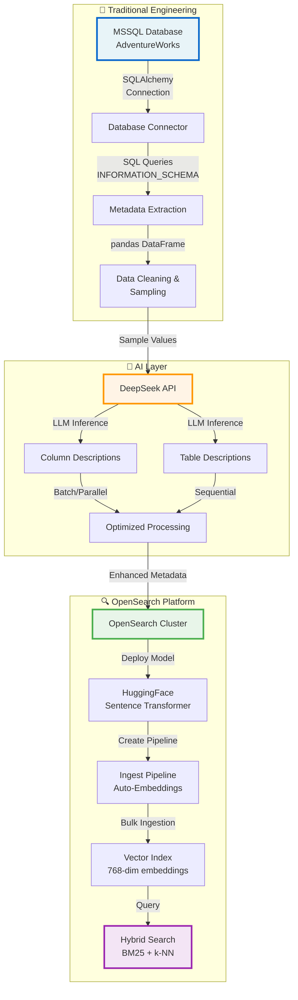
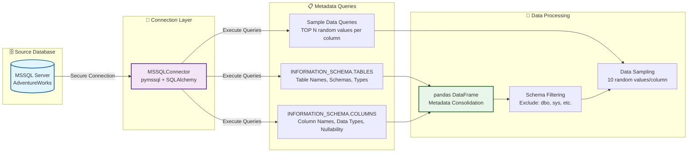
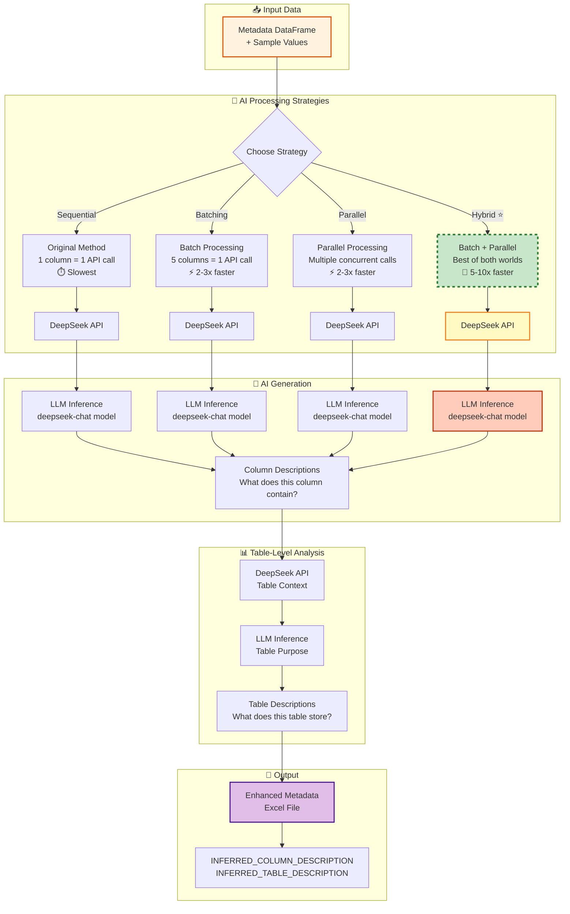
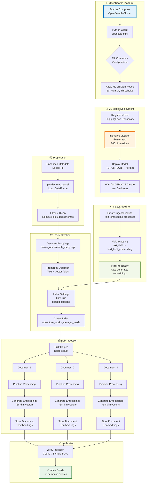
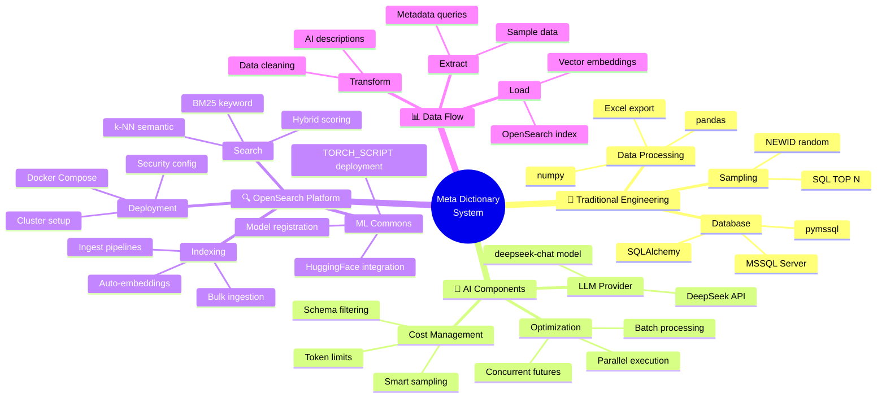
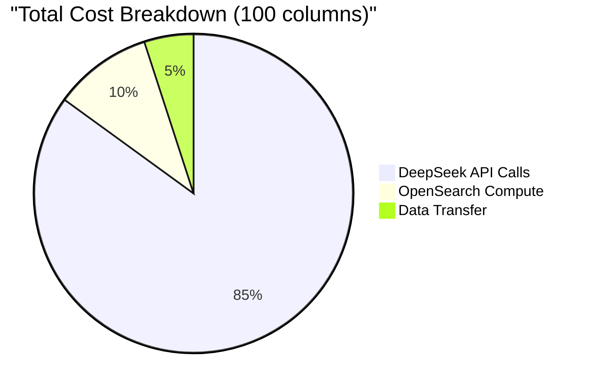

# Build and Ingest Meta Dictionary - AI-Powered Database Metadata Enhancement

> 🎯 **Objective**: Extract database metadata, enhance it with AI-generated descriptions, and ingest it into OpenSearch for semantic search capabilities

---

## 🏗️ High-Level Architecture



---

## 📊 Detailed Workflow

### Phase 1: Database Metadata Extraction (Traditional Engineering)



**Key Components:**
- 🔧 **Traditional Engineering**: Database connectivity, SQL queries, data extraction
- 📊 **Output**: Structured metadata with table/column information and sample values

---

### Phase 2: AI-Powered Description Generation (DeepSeek API)



**Performance Optimization:**

| Strategy | API Calls | Processing Time | Speedup |
|----------|-----------|-----------------|---------|
| Sequential | 1 per column | ~10 min (100 cols) | 1x (baseline) |
| Batch | 1 per 5 columns | ~2-3 min | 2-3x faster |
| Parallel | Concurrent calls | ~2-3 min | 2-3x faster |
| **Hybrid ⭐** | **Batched + Parallel** | **~30-60 sec** | **5-10x faster** |

**Key Components:**
- 🤖 **AI Layer**: LLM-powered semantic understanding of data
- 💰 **Cost**: ~$0.05-0.10 for 100-200 columns (DeepSeek pricing)
- ⚡ **Recommended**: Hybrid strategy with `batch_size=3, max_workers=2`

---

### Phase 3: OpenSearch Ingestion Pipeline (ML + Vector Search)



**Key Features:**

1. **🧠 ML Model Integration**
   - Model: `sentence-transformers/msmarco-distilbert-base-tas-b`
   - Format: TORCH_SCRIPT (optimized for inference)
   - Dimensions: 768 (standard embedding size)
   - Deployment: Automatic with health checks

2. **⚙️ Ingest Pipeline**
   - **text_embedding processor**: Converts text → vectors
   - **Automatic processing**: Every document ingested gets embeddings
   - **Field mapping**: `TABLE_NAME` → `TABLE_NAME_embedding`
   - **No manual work**: Embeddings generated server-side

3. **🗂️ Index Configuration**
   - **k-NN enabled**: Supports vector similarity search
   - **HNSW algorithm**: Fast approximate nearest neighbor search
   - **L2 distance**: Euclidean distance for similarity
   - **Dual fields**: Original text + vector embeddings

---

### Phase 4: Hybrid Search (BM25 + k-NN)

```mermaid
flowchart LR
    subgraph "🔍 Query Input"
        Q[User Query<br/>'Store']
    end
    
    subgraph "🔀 Dual Search Path"
        Q --> PATH1{Parallel Execution}
        Q --> PATH2{Parallel Execution}
        
        PATH1 --> BM25[Keyword Search<br/>BM25 Algorithm]
        PATH2 --> KNN[Semantic Search<br/>k-NN + Embeddings]
        
        BM25 --> MATCH[Match Query<br/>TABLE_NAME: 'Store']
        KNN --> NEURAL[Neural Query<br/>TABLE_NAME_embedding]
        
        MATCH --> SCORE1[Relevance Score<br/>Keyword Boost: 1.0]
        NEURAL --> EMBED[Generate Query Embedding<br/>768-dim vector]
        EMBED --> SCORE2[Similarity Score<br/>Semantic Boost: 1.0]
    end
    
    subgraph "🎯 Score Combination"
        SCORE1 --> COMBINE[Bool Should Query<br/>minimum_should_match: 1]
        SCORE2 --> COMBINE
        COMBINE --> RANK[Combined Ranking<br/>BM25 + k-NN scores]
    end
    
    subgraph "📊 Results"
        RANK --> TOP[Top K Results<br/>Sorted by score]
        TOP --> R1[Result 1<br/>Sales.Store.BusinessEntityID<br/>Score: 2.94]
        TOP --> R2[Result 2<br/>Sales.Store.Name<br/>Score: 2.94]
        TOP --> R3[Result 3<br/>Sales.Store.SalesPersonID<br/>Score: 2.94]
    end
    
    subgraph "🔧 Field Filtering"
        R1 --> EXCLUDE[Exclude Embeddings<br/>_source: excludes *_embedding]
        R2 --> EXCLUDE
        R3 --> EXCLUDE
        EXCLUDE --> DISPLAY[Display Results<br/>Schema, Table, Column, Description]
    end
    
    style Q fill:#fff9c4,stroke:#f57f17,stroke-width:2px
    style BM25 fill:#e1f5fe,stroke:#0277bd,stroke-width:2px
    style KNN fill:#fce4ec,stroke:#c2185b,stroke-width:2px
    style COMBINE fill:#e8f5e9,stroke:#388e3c,stroke-width:3px
    style DISPLAY fill:#f3e5f5,stroke:#7b1fa2,stroke-width:2px
```



**Hybrid Search Benefits:**

| Feature | Keyword Search (BM25) | Semantic Search (k-NN) | Hybrid Search |
|---------|----------------------|------------------------|---------------|
| **Exact Matches** | ✅ Excellent | ❌ May miss | ✅ Best of both |
| **Synonyms** | ❌ Misses | ✅ Understands | ✅ Handles both |
| **Typos** | ❌ Sensitive | ✅ Tolerant | ✅ Robust |
| **Context** | ❌ Limited | ✅ Strong | ✅ Comprehensive |
| **Speed** | 🚀 Very fast | ⚡ Fast | ⚡ Fast |

---

## 🎨 Technology Stack



---

## 📈 Performance Metrics

### AI Processing Performance

```mermaid
gantt
    title Processing Time Comparison (100 columns)
    dateFormat X
    axisFormat %s

    section Sequential
    Original Method : 0, 600s
    
    section Batch
    Batch Processing : 0, 180s
    
    section Parallel
    Parallel Execution : 0, 180s
    
    section Hybrid
    Optimized Hybrid : 0, 45s
```



### Cost Analysis



**Estimated Costs:**
- 💰 **DeepSeek API**: ~$0.05-0.10 for 100-200 columns
- 🔧 **OpenSearch**: Free (local Docker) or ~$0.01/hour (cloud)
- 📊 **Total**: Under $0.15 for complete pipeline

---

## 🎯 Key Features Summary

### Where Traditional Engineering is Used
- ✅ **Database connectivity**: SQLAlchemy, pymssql
- ✅ **Metadata extraction**: SQL queries, INFORMATION_SCHEMA
- ✅ **Data manipulation**: pandas DataFrame operations
- ✅ **Sampling logic**: Random selection, TOP N queries
- ✅ **Excel export**: openpyxl, structured output
- ✅ **Bulk ingestion**: Batch processing, error handling

### Where AI is Used
- 🤖 **Column descriptions**: LLM inference on sample data
- 🤖 **Table descriptions**: LLM inference on table structure
- 🤖 **Semantic understanding**: Context-aware descriptions
- 🤖 **Batch optimization**: Smart batching for efficiency
- 🤖 **Natural language**: Human-readable descriptions

### Where OpenSearch Platform is Used
- 🔍 **Index creation**: Dynamic mapping generation
- 🔍 **ML model deployment**: HuggingFace integration
- 🔍 **Ingest pipeline**: Automatic embedding generation
- 🔍 **Vector storage**: 768-dimensional embeddings
- 🔍 **Hybrid search**: BM25 + k-NN combination
- 🔍 **Score normalization**: Combined relevance ranking
- 🔍 **Field filtering**: Exclude embeddings from results

---

## 🚀 Quick Start Commands

```bash
# 1. Start OpenSearch cluster
cd opensearch-RAG
docker compose -f docker-compose-fully-optimized.yml up -d

# 2. Install dependencies
pip install opensearchpy opensearch-py-ml pandas openpyxl requests

# 3. Run the notebook
jupyter notebook build_meta_dictionary.ipynb

# 4. Key parameters to tune
SAMPLING_COUNT = 10              # Samples per column
batch_size = 3                   # Columns per API batch
max_workers = 2                  # Parallel workers
```

---

## 📚 References

- **OpenSearch**: [opensearch.org](https://opensearch.org)
- **DeepSeek API**: [platform.deepseek.com](https://platform.deepseek.com)
- **HuggingFace Models**: [huggingface.co/sentence-transformers](https://huggingface.co/sentence-transformers)
- **k-NN Plugin**: [OpenSearch k-NN Documentation](https://opensearch.org/docs/latest/search-plugins/knn/)

---

## 🎓 Learning Outcomes

After implementing this pipeline, you will understand:

1. ✅ **Database metadata extraction** using SQL and Python
2. ✅ **LLM integration** for semantic enrichment
3. ✅ **Performance optimization** with batching and parallelization
4. ✅ **Vector embeddings** and semantic search concepts
5. ✅ **OpenSearch ML Commons** for model deployment
6. ✅ **Ingest pipelines** for automated processing
7. ✅ **Hybrid search** combining keyword and semantic approaches
8. ✅ **Production-ready patterns** for scalable AI applications

---

**🎉 Result**: A fully functional AI-powered metadata search system that combines traditional engineering excellence with modern AI capabilities, all built on the robust OpenSearch platform!
