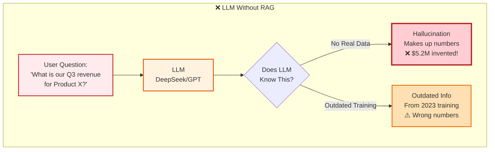
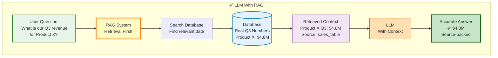
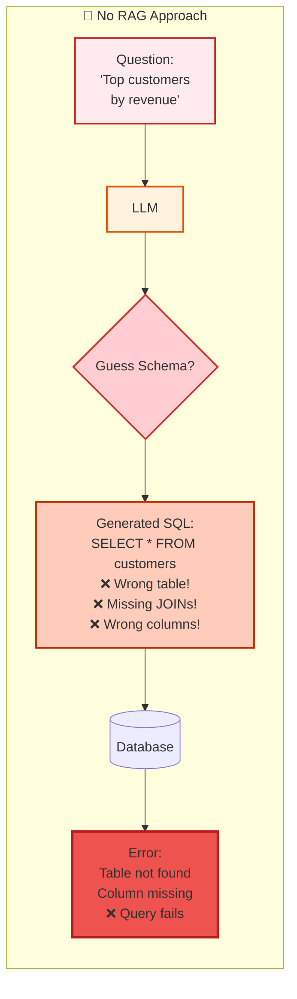
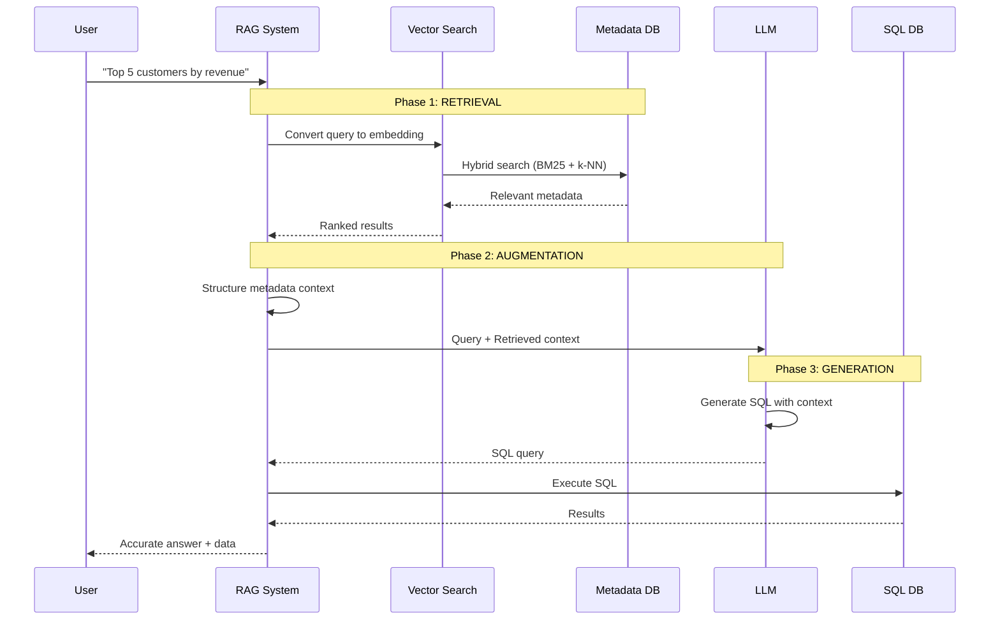
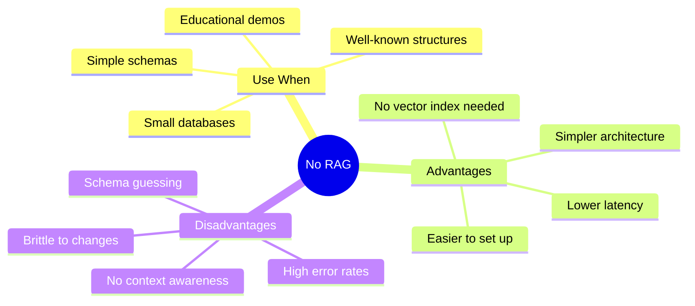
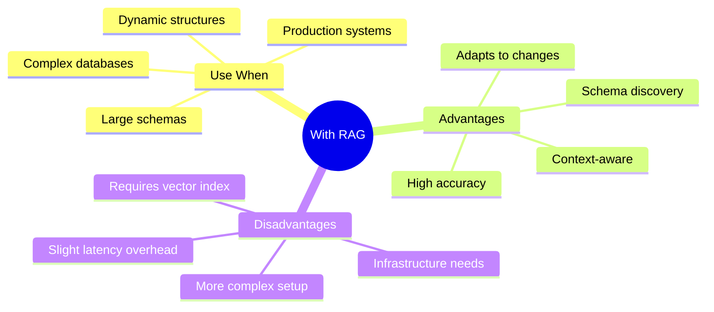
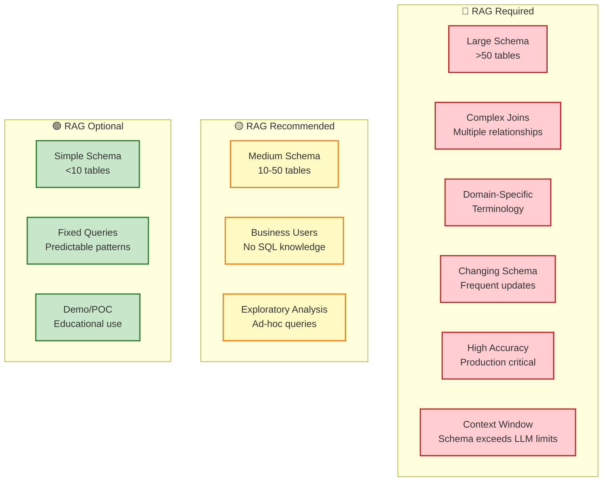

# Understanding RAG (Retrieval-Augmented Generation)

## 🎯 The Problem RAG Solves

### Without RAG: The Hallucination Problem



**Key Issues:**
- ❌ **Hallucinations**: LLM invents plausible-sounding but false information
- ⚠️ **Outdated Knowledge**: Training data is frozen in time
- 🚫 **No Domain Data**: Can't access your private database
- 💸 **Costly Fine-tuning**: Retraining models is expensive and slow
- 📏 **Context Window Limits**: Can't fit entire database schemas (1000s of tables/columns exceed token limits)

---

### With RAG: Grounded in Real Data



**Key Benefits:**
- ✅ **Grounded in Facts**: Uses real data from your sources
- 🎯 **Up-to-date**: Retrieves current information
- 🔒 **Private Data Access**: Works with your proprietary databases
- 💰 **Cost-effective**: No retraining needed
- 📏 **Context Window Efficient**: Retrieves only relevant subset (10-20 tables vs 1000s), stays within token limits

---

## 📏 The Context Window Problem

### Why RAG is Essential for Large Schemas

```mermaid
graph TB
    subgraph "❌ Without RAG: Context Overflow"
        DB1[(Enterprise DB<br/>500 tables<br/>5,000 columns)]
        DB1 --> DUMP[Dump All Schema<br/>into Prompt]
        DUMP --> TOKENS[Token Count:<br/>~150,000 tokens<br/>Schema only!]
        TOKENS --> LIMIT{LLM Context<br/>Window<br/>32K-128K tokens}
        LIMIT --> FAIL1[❌ Exceeds Limit<br/>Truncation errors]
        LIMIT --> FAIL2[❌ Too Expensive<br/>$$$$ per query]
        LIMIT --> FAIL3[❌ Slow Response<br/>Processing overhead]
    end
    
    subgraph "✅ With RAG: Smart Retrieval"
        DB2[(Same Enterprise DB<br/>500 tables<br/>5,000 columns)]
        DB2 --> INDEX[Vector Index<br/>Searchable metadata]
        INDEX --> QUERY[User Question:<br/>'Customer revenue']
        QUERY --> SEARCH[Retrieve Top 10<br/>Relevant tables]
        SEARCH --> FOCUSED[Focused Context:<br/>~2,000 tokens<br/>Only relevant schema]
        FOCUSED --> SUCCESS[✅ Fits Easily<br/>✅ Cost-effective<br/>✅ Fast response]
    end
    
    style DB1 fill:#ffebee,stroke:#c62828,stroke-width:2px
    style TOKENS fill:#ffcdd2,stroke:#b71c1c,stroke-width:2px
    style FAIL1 fill:#ef5350,stroke:#b71c1c,stroke-width:2px
    style FAIL2 fill:#ef5350,stroke:#b71c1c,stroke-width:2px
    style FAIL3 fill:#ef5350,stroke:#b71c1c,stroke-width:2px
    
    style DB2 fill:#e8f5e9,stroke:#2e7d32,stroke-width:2px
    style INDEX fill:#e3f2fd,stroke:#0277bd,stroke-width:2px
    style SEARCH fill:#fff9c4,stroke:#f57f17,stroke-width:3px
    style FOCUSED fill:#f3e5f5,stroke:#6a1b9a,stroke-width:2px
    style SUCCESS fill:#c8e6c9,stroke:#1b5e20,stroke-width:3px
```



**Context Window Math:**

| Database Size | Full Schema Tokens | With RAG (Top 10) | Savings |
|---------------|-------------------|-------------------|---------|
| Small (10 tables) | ~1,500 | ~1,500 | 0% (no benefit) |
| Medium (50 tables) | ~7,500 | ~1,500 | 80% reduction |
| Large (200 tables) | ~30,000 | ~1,500 | 95% reduction |
| Enterprise (1000 tables) | ~150,000 | ~1,500 | **99% reduction** |

**Real-World Impact:**
- 🎯 **Adventure Works DB**: 70+ tables → Only 5-10 relevant for any query
- 💰 **Cost**: $0.15 per query (full schema) → $0.01 per query (RAG)
- ⚡ **Speed**: 15 seconds (full schema) → 2 seconds (RAG)
- 📏 **Token Efficiency**: RAG retrieves exactly what's needed, nothing more

---

##  RAG in Text-to-SQL-BI Agent

### Scenario 1: WITHOUT RAG ❌



**Problems:**
- ❌ LLM doesn't know your schema
- ❌ Guesses table/column names (often wrong)
- ❌ Misses relationships and JOINs
- ❌ High failure rate

---

### Scenario 2: WITH RAG ✅

```mermaid
graph TB
    subgraph "✅ RAG-Powered Approach"
        U2[Question:<br/>'Top customers<br/>by revenue']
        
        U2 --> RAG2[RAG: Retrieve Metadata]
        RAG2 --> SEARCH2[Hybrid Search<br/>BM25 + k-NN]
        
        SEARCH2 --> META[(Metadata Index<br/>Tables, Columns,<br/>Descriptions)]
        
        META --> FOUND[Found Relevant:<br/>✓ Sales.Customer<br/>✓ CustomerID<br/>✓ TotalPurchaseYTD<br/>✓ Sales.SalesOrderHeader]
        
        FOUND --> CTX[Context Package:<br/>Table: Sales.Customer<br/>Column: CustomerID int<br/>Column: TotalPurchaseYTD money<br/>Description: Purchase totals]
        
        CTX --> LLM2[LLM + Context]
        
        LLM2 --> SQL2[Generated SQL:<br/>SELECT CustomerID,<br/>TotalPurchaseYTD<br/>FROM Sales.Customer<br/>ORDER BY<br/>TotalPurchaseYTD DESC<br/>✅ Correct!]
        
        SQL2 --> DB2[(Database)]
        DB2 --> SUCCESS[✅ Success!<br/>Returns accurate data]
    end
    
    style U2 fill:#e8f5e9,stroke:#2e7d32,stroke-width:2px
    style RAG2 fill:#fff9c4,stroke:#f57f17,stroke-width:3px
    style META fill:#e3f2fd,stroke:#0277bd,stroke-width:2px
    style FOUND fill:#f3e5f5,stroke:#6a1b9a,stroke-width:2px
    style CTX fill:#ffe0b2,stroke:#ef6c00,stroke-width:2px
    style LLM2 fill:#ffccbc,stroke:#bf360c,stroke-width:2px
    style SQL2 fill:#c8e6c9,stroke:#2e7d32,stroke-width:2px
    style SUCCESS fill:#81c784,stroke:#1b5e20,stroke-width:3px
```



**Advantages:**
- ✅ Retrieves exact schema information
- ✅ Uses real table/column names
- ✅ Includes data types and descriptions
- ✅ High success rate

---

## 🔄 Detailed RAG Process Flow



---

## ⚖️ Comparison: When to Use Each Approach

### Without RAG (Non-RAG Text-to-SQL)



**Best For:**
- 📚 **Educational Demos**: Teaching SQL basics
- 🔢 **Simple Schemas**: <10 tables, well-known structure
- 🎯 **Controlled Environments**: Fixed, documented schemas
- ⚡ **Low Latency**: When speed > accuracy

---

### With RAG (RAG-Powered Text-to-SQL)



**Best For:**
- 🏢 **Enterprise Systems**: Complex, evolving schemas (>50 tables)
- 🔍 **Discovery Use Cases**: Users don't know schema
- 🎯 **High Accuracy Needs**: Production-critical queries
- 🔄 **Dynamic Schemas**: Frequently changing databases
- 🔒 **Private Data**: Proprietary business databases

---

## 📊 Side-by-Side Comparison

| Aspect | Without RAG | With RAG |
|--------|-------------|----------|
| **Accuracy** | ❌ 40-60% | ✅ 85-95% |
| **Setup Complexity** | ⭐ Simple | ⭐⭐⭐ Complex |
| **Schema Knowledge** | ❌ Must guess | ✅ Retrieved |
| **Context Window** | ❌ Entire schema (overflow) | ✅ Only relevant (efficient) |
| **Token Usage** | 📏 10K-150K tokens | 📏 1.5K-3K tokens |
| **Latency** | ⚡ 200-500ms | ⚡ 500-1500ms |
| **Database Size** | 📊 Small (<10 tables) | 📊 Any size (scales) |
| **Hallucinations** | ❌ High risk | ✅ Minimal |
| **Maintenance** | ⚠️ Breaks on schema changes | ✅ Adapts automatically |
| **Infrastructure** | 🔧 LLM only | 🔧 LLM + Vector DB |
| **Cost per Query** | 💰 Low (small) / $$$ (large) | 💰💰 Consistent |
| **Use Case** | Demos, simple apps | Enterprise, production |

---

## 🎯 Real-World Example

### Question: "Show me top 10 products with declining sales"

#### Without RAG:
```sql
-- LLM Guesses (often wrong):
SELECT TOP 10 product_name, sales
FROM products
WHERE sales < previous_sales  -- ❌ Column doesn't exist!
ORDER BY sales ASC
```
**Result:** ❌ Query fails or returns wrong data

#### With RAG:
**Step 1:** Retrieve metadata
- Found: `Sales.SalesOrderDetail` table
- Found: `ProductID`, `LineTotal` columns
- Found: `OrderDate` for time-based analysis

**Step 2:** Generate accurate SQL
```sql
-- LLM with Context (correct):
SELECT TOP 10 
    ProductID,
    SUM(CASE WHEN OrderDate >= DATEADD(month, -1, GETDATE()) 
        THEN LineTotal ELSE 0 END) AS CurrentMonth,
    SUM(CASE WHEN OrderDate BETWEEN DATEADD(month, -2, GETDATE()) 
        AND DATEADD(month, -1, GETDATE()) 
        THEN LineTotal ELSE 0 END) AS PreviousMonth
FROM Sales.SalesOrderDetail d
JOIN Sales.SalesOrderHeader h ON d.SalesOrderID = h.SalesOrderID
GROUP BY ProductID
HAVING SUM(CASE WHEN OrderDate >= DATEADD(month, -1, GETDATE()) 
    THEN LineTotal ELSE 0 END) < 
   SUM(CASE WHEN OrderDate BETWEEN DATEADD(month, -2, GETDATE()) 
    AND DATEADD(month, -1, GETDATE()) THEN LineTotal ELSE 0 END)
ORDER BY (CurrentMonth - PreviousMonth) ASC
```
**Result:** ✅ Accurate results with proper JOINs and time logic

---

## 🚀 When RAG is Essential

### Critical Scenarios for RAG:



---

## 🎓 Summary

**RAG solves the fundamental problem of LLM hallucinations and outdated knowledge** by retrieving real, current data before generation.

**In Text-to-SQL contexts:**
- **Without RAG**: LLM guesses schema → high failure rate
- **With RAG**: LLM gets exact schema → high success rate

**The Context Window Advantage:**
- 📏 Enterprise databases with 500+ tables → 150K+ tokens (exceeds most LLM limits)
- 🎯 RAG retrieves only 10-20 relevant tables → 1.5K-3K tokens (99% reduction)
- 💰 Dramatically reduces cost and latency while staying within context limits

**Choose RAG when:**
- ✅ Accuracy matters (production systems)
- ✅ Schema is complex or changing
- ✅ Users don't know database structure
- ✅ Domain-specific terminology
- ✅ Database size exceeds context window (>50 tables)

**Skip RAG when:**
- 📚 Building simple demos
- 🎯 Schema is tiny and fixed
- ⚡ Ultra-low latency required
- 💰 Minimal infrastructure desired

**The bottom line:** For enterprise Text-to-SQL-BI agents with real databases, **RAG is essential** for production-quality results.

---

*Last Updated: October 2025*
