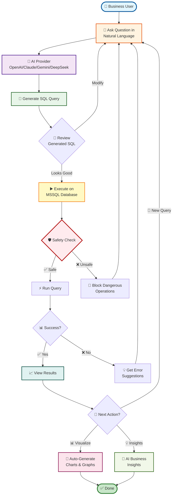
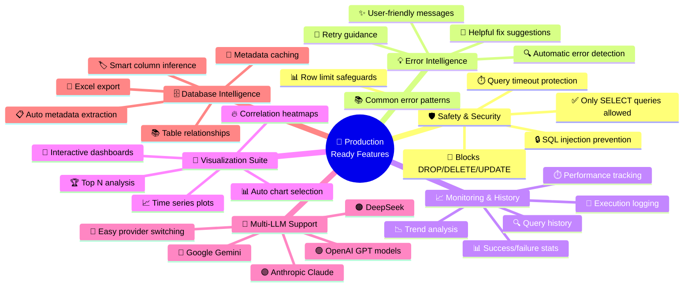
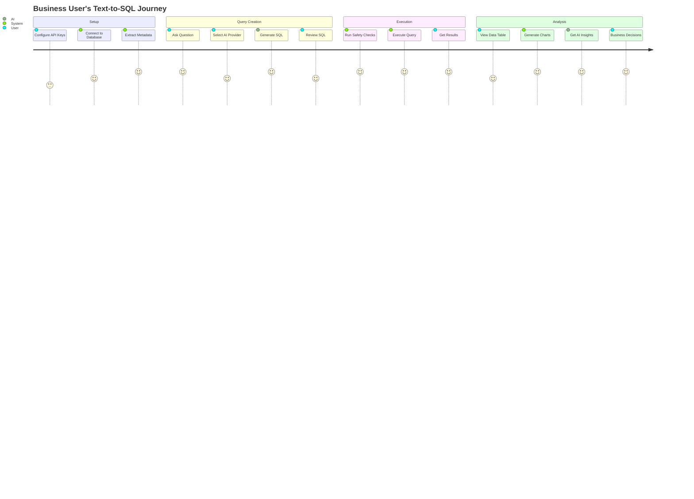
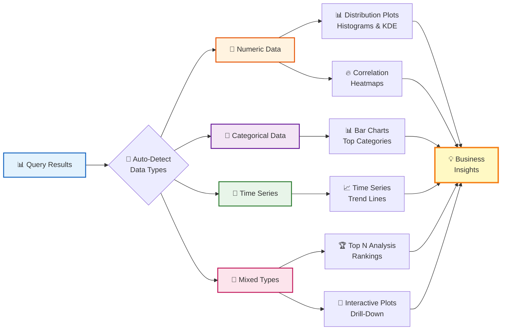
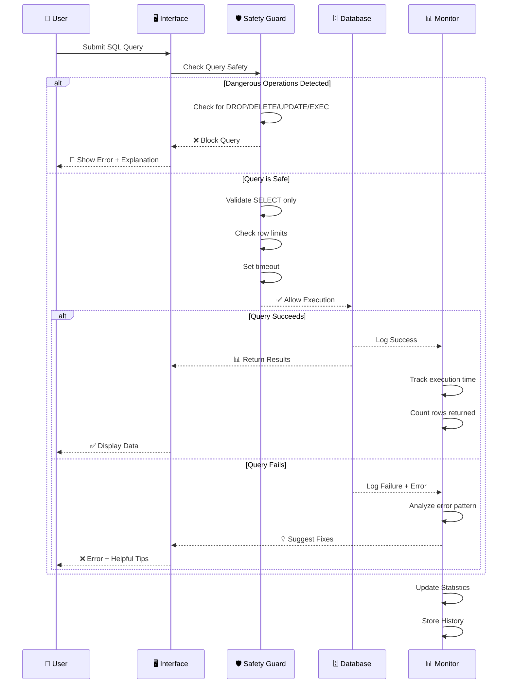
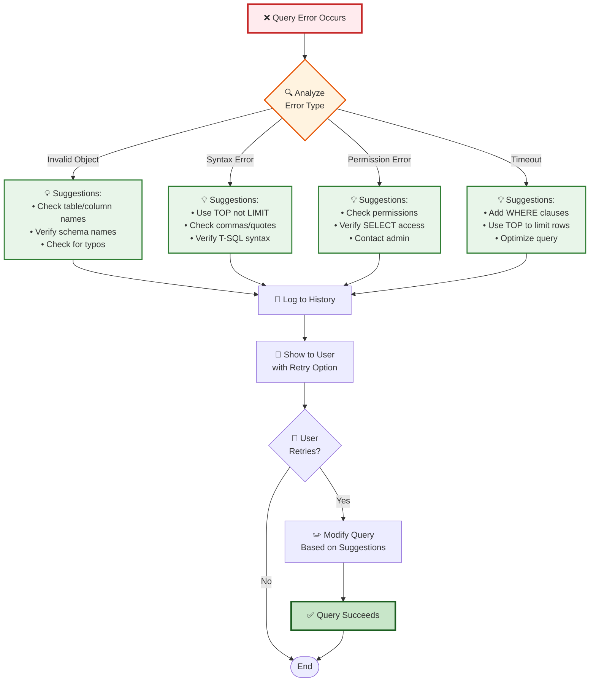
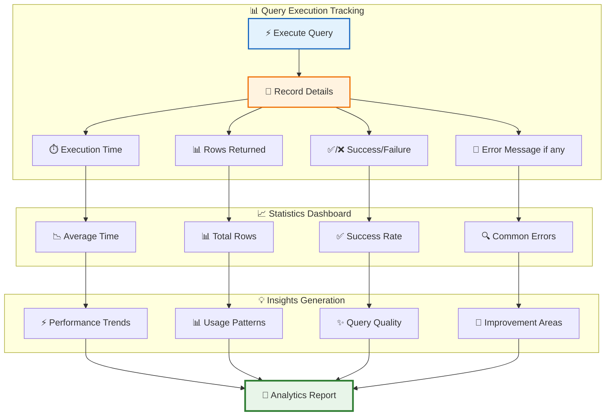
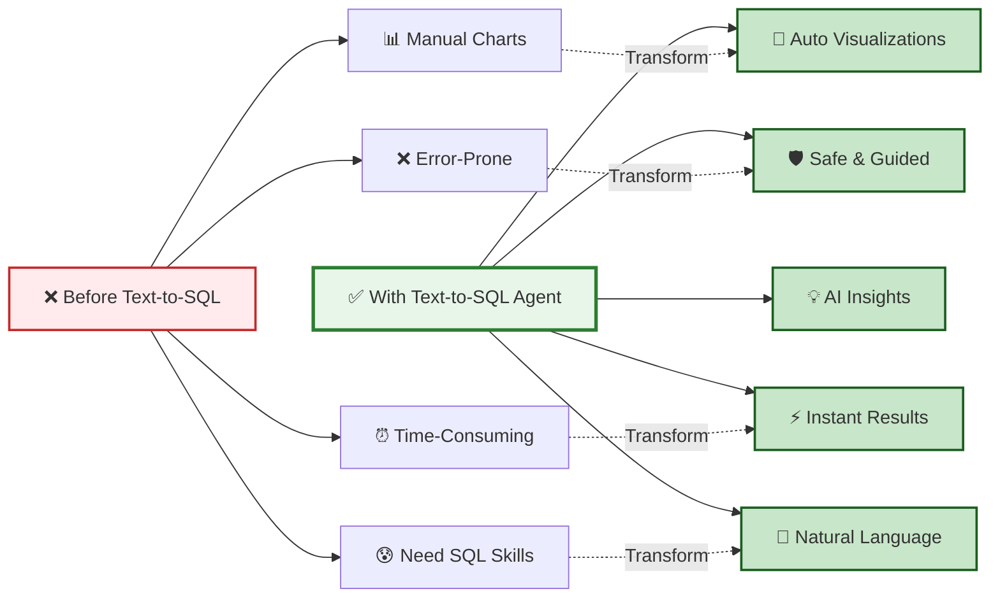

# 🚀 Text-to-SQL Agent - Business User Architecture

## Complete Workflow Overview

---

## 🎯 Key Features That Make This Production-Ready

---

## 📊 User Journey - From Question to Insight

---

## 🎨 Visualization Capabilities

---

## 🛡️ Safety & Guardrails System

---

## 💡 Intelligent Error Handling

---

## 📈 Execution History & Analytics

---

## 🌟 Value Proposition

---

## 🎯 Use Cases

### 📊 Executive Dashboard
- Quick KPI queries without SQL knowledge
- Automated chart generation
- AI-powered insights for decision making

### 📈 Business Analyst
- Ad-hoc data exploration
- Trend analysis with visualizations
- Performance monitoring

### 💼 Sales/Marketing
- Customer segmentation
- Revenue analysis
- Campaign performance tracking

### 🏭 Operations
- Inventory monitoring
- Process efficiency metrics
- Resource utilization analysis
